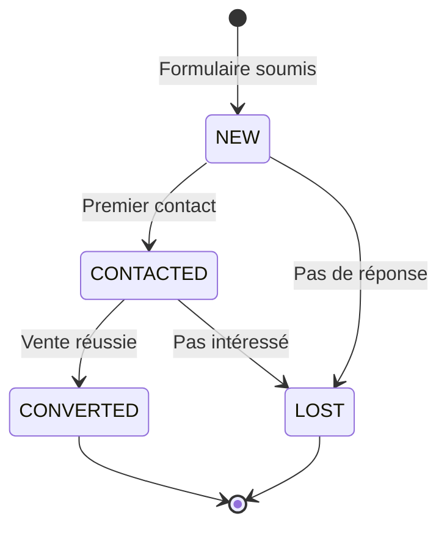
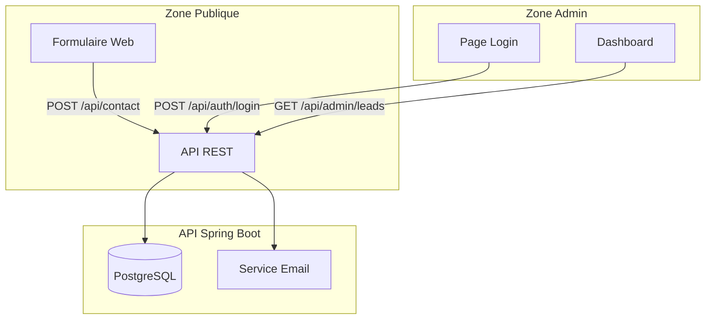
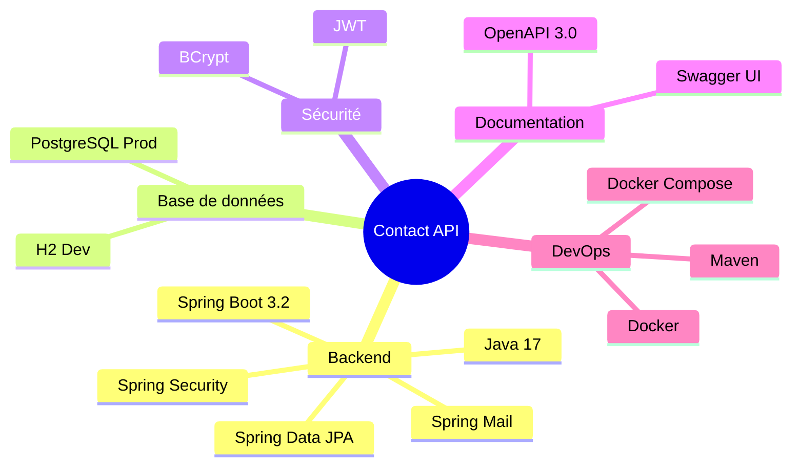
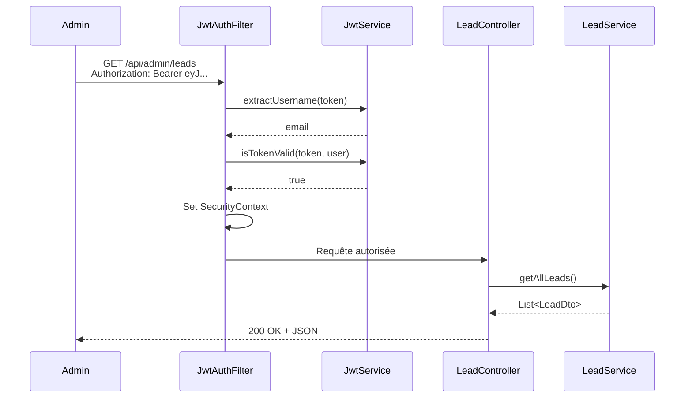

# Chapitre 1.1 - Présentation du projet

## Objectifs du chapitre

- Comprendre le contexte et les besoins du projet
- Identifier les fonctionnalités principales
- Visualiser l'architecture globale
- Connaître les technologies utilisées

---

## 1. Contexte et problématique

### Le besoin métier

Dans le monde numérique actuel, toute entreprise a besoin d'un moyen efficace pour collecter et gérer les demandes de ses clients potentiels. Un **formulaire de contact** est souvent le premier point d'interaction entre un visiteur et une entreprise.

### Problématique

Une entreprise souhaite collecter les demandes de contact de ses visiteurs via un formulaire web. Elle a besoin de :

1. **Un formulaire accessible publiquement** - Les visiteurs doivent pouvoir soumettre leurs demandes sans créer de compte
2. **Une notification par email** - L'équipe commerciale doit être alertée immédiatement
3. **Un espace d'administration sécurisé** - Pour gérer et suivre les leads
4. **Des statistiques** - Pour mesurer l'efficacité du formulaire

### Qu'est-ce qu'un Lead ?

Un **lead** (ou prospect) est une personne qui a manifesté un intérêt pour les produits ou services d'une entreprise. Dans notre contexte, chaque soumission de formulaire crée un nouveau lead.

### Le cycle de vie d'un lead



---

## 2. La solution : une API REST

### Qu'est-ce qu'une API ?

Une **API (Application Programming Interface)** est une interface qui permet à deux applications de communiquer entre elles. Dans notre cas :

- Le **frontend** (site web) communique avec
- Le **backend** (notre API Spring Boot)

### Qu'est-ce que REST ?

**REST (REpresentational State Transfer)** est un style d'architecture pour concevoir des APIs web. Ses principes :

1. **Client-Serveur** : Séparation des responsabilités
2. **Stateless** : Chaque requête est indépendante
3. **Interface uniforme** : Utilisation cohérente des méthodes HTTP
4. **Ressources** : Tout est une ressource identifiée par une URL

### Notre solution

Développer une **API REST** avec **Spring Boot** qui :

- Expose un endpoint public pour soumettre le formulaire
- Envoie des emails automatiquement
- Sécurise l'accès admin avec JWT
- Stocke les données dans une base PostgreSQL

---

## 3. Fonctionnalités détaillées

### Vue d'ensemble



### Partie publique

| Fonctionnalité | Endpoint | Méthode | Description |
|----------------|----------|---------|-------------|
| Soumettre formulaire | /api/contact | POST | Crée un nouveau lead et envoie les notifications |

### Partie administration (sécurisée)

| Fonctionnalité | Endpoint | Méthode | Description |
|----------------|----------|---------|-------------|
| Connexion | /api/auth/login | POST | Authentification, retourne un token JWT |
| Liste des leads | /api/admin/leads | GET | Retourne les leads avec pagination |
| Détail d'un lead | /api/admin/leads/{id} | GET | Retourne un lead spécifique |
| Modifier statut | /api/admin/leads/{id}/status | PUT | Change le statut du lead |
| Supprimer | /api/admin/leads/{id} | DELETE | Supprime un lead |
| Statistiques | /api/admin/leads/stats | GET | Compteurs par statut |

---

## 4. Architecture globale

### Architecture en couches

L'application suit une **architecture en couches** (layered architecture), un pattern classique qui sépare les responsabilités :


### Description des couches

| Couche | Responsabilité | Exemple de classe |
|--------|---------------|-------------------|
| **Controller** | Recevoir les requêtes HTTP, valider les entrées | ContactController |
| **Service** | Logique métier, orchestration | LeadService |
| **Repository** | Accès aux données, requêtes SQL | LeadRepository |
| **Model** | Représentation des données | Lead, User |

### Pourquoi cette séparation ?

1. **Maintenabilité** : Chaque couche peut évoluer indépendamment
2. **Testabilité** : Facile de tester chaque couche isolément
3. **Réutilisabilité** : Un service peut être utilisé par plusieurs controllers
4. **Clarté** : Le code est organisé de manière prévisible

---

## 5. Technologies utilisées

### Stack technique



### Détail des technologies

| Catégorie | Technologie | Rôle | Version |
|-----------|-------------|------|---------|
| **Langage** | Java | Langage de programmation | 17 LTS |
| **Framework** | Spring Boot | Framework principal | 3.2.0 |
| **Sécurité** | Spring Security | Authentification/Autorisation | - |
| **Persistance** | Spring Data JPA | Accès aux données | - |
| **Email** | Spring Mail | Envoi d'emails | - |
| **BDD Prod** | PostgreSQL | Base de données production | 15 |
| **BDD Dev** | H2 | Base de données développement | Embedded |
| **Auth** | JWT (jjwt) | Tokens d'authentification | 0.12.3 |
| **Doc** | springdoc-openapi | Documentation API | 2.3.0 |
| **Build** | Maven | Gestion des dépendances | 3.x |
| **Container** | Docker | Conteneurisation | - |

---

## 6. Structure du projet

### Organisation des fichiers

```
projet-e-contact-backend/
|
|-- src/main/java/com/example/contact/
|   |-- ContactApplication.java      # Point d'entrée de l'application
|   |
|   |-- config/                      # Configuration Spring
|   |   |-- SecurityConfig.java      # Configuration sécurité
|   |   |-- OpenApiConfig.java       # Configuration Swagger
|   |
|   |-- controller/                  # Endpoints REST
|   |   |-- ContactController.java   # Endpoint public
|   |   |-- AuthController.java      # Authentification
|   |   |-- LeadController.java      # Gestion des leads
|   |
|   |-- dto/                         # Objets de transfert
|   |   |-- request/                 # Données entrantes
|   |   |-- response/                # Données sortantes
|   |
|   |-- exception/                   # Gestion des erreurs
|   |
|   |-- model/                       # Entités JPA
|   |   |-- Lead.java
|   |   |-- User.java
|   |
|   |-- repository/                  # Accès données
|   |
|   |-- security/                    # JWT
|   |
|   |-- service/                     # Logique métier
|
|-- src/main/resources/
|   |-- application.yml              # Configuration
|
|-- docker-compose.yml               # Orchestration Docker
|-- Dockerfile                       # Image Docker
|-- pom.xml                          # Dépendances Maven
```

---

## 7. Flux de données

### Soumission d'un formulaire de contact


### Authentification administrateur


### Accès aux endpoints protégés



---

## 8. Concepts clés

### API Stateless

Une API **stateless** (sans état) signifie que :

- Le serveur ne conserve aucune information de session
- Chaque requête contient toutes les informations nécessaires
- L'authentification se fait via un token (JWT) envoyé à chaque requête

**Avantages :**
- Scalabilité horizontale (plusieurs serveurs)
- Pas de problème de session expirée
- Simplicité de déploiement

### JWT (JSON Web Token)

Un **JWT** est un token qui contient des informations encodées :

```
eyJhbGciOiJIUzI1NiJ9.eyJzdWIiOiJhZG1pbkBleGFtcGxlLmNvbSIsImlhdCI6MTcwNTMxMjAwMH0.signature
|_____Header_____|._____________Payload_______________|.__Signature__|
```

- **Header** : Algorithme de signature
- **Payload** : Données (email, rôles, expiration)
- **Signature** : Garantit l'intégrité

### Séparation dev/prod

L'application utilise des **profils Spring** pour adapter la configuration :

| Aspect | Développement (dev) | Production (prod) |
|--------|---------------------|-------------------|
| Base de données | H2 (mémoire) | PostgreSQL |
| Emails | MailHog (fake) | Gmail SMTP |
| Logs | DEBUG | INFO |
| Schéma BDD | create-drop | validate |

---

## 9. Points clés à retenir

1. **Architecture en couches** : Controller → Service → Repository → Model
2. **API Stateless** : Pas de session, authentification par JWT
3. **Sécurité** : Endpoints admin protégés, mots de passe hachés avec BCrypt
4. **Séparation des environnements** : Profils dev et prod
5. **Documentation automatique** : Swagger génère la doc depuis le code
6. **Conteneurisation** : Docker pour un déploiement reproductible

---

## QUIZ 1.1 - Présentation du projet

**1. Quel est le rôle principal de cette API ?**
- a) Gérer un site e-commerce
- b) Collecter et gérer des demandes de contact
- c) Envoyer des newsletters
- d) Gérer un blog

<details>
<summary>Voir la réponse</summary>

**Réponse : b) Collecter et gérer des demandes de contact**

L'API permet aux visiteurs de soumettre des formulaires de contact et aux administrateurs de gérer ces leads.

</details>

---

**2. Quel endpoint permet de soumettre un formulaire de contact ?**
- a) GET /api/contact
- b) POST /api/leads
- c) POST /api/contact
- d) PUT /api/contact

<details>
<summary>Voir la réponse</summary>

**Réponse : c) POST /api/contact**

La méthode POST est utilisée pour créer une nouvelle ressource. L'endpoint /api/contact est public.

</details>

---

**3. Quelle technologie est utilisée pour l'authentification ?**
- a) Sessions
- b) Cookies
- c) JWT
- d) OAuth2

<details>
<summary>Voir la réponse</summary>

**Réponse : c) JWT (JSON Web Token)**

JWT permet une authentification stateless. Le token contient les informations de l'utilisateur et est envoyé dans chaque requête.

</details>

---

**4. VRAI ou FAUX : Les endpoints admin sont accessibles sans authentification.**

<details>
<summary>Voir la réponse</summary>

**Réponse : FAUX**

Les endpoints /api/admin/** sont protégés par Spring Security et nécessitent un token JWT valide avec le rôle ADMIN.

</details>

---

**5. Quelle base de données est utilisée en production ?**
- a) H2
- b) MySQL
- c) PostgreSQL
- d) MongoDB

<details>
<summary>Voir la réponse</summary>

**Réponse : c) PostgreSQL**

PostgreSQL est utilisé en production pour sa robustesse. H2 est utilisé en développement car elle fonctionne en mémoire.

</details>

---

**6. Combien de couches principales composent l'architecture ?**
- a) 2
- b) 3
- c) 4
- d) 5

<details>
<summary>Voir la réponse</summary>

**Réponse : c) 4**

Les 4 couches sont :
1. Controller (réception des requêtes)
2. Service (logique métier)
3. Repository (accès aux données)
4. Model (entités JPA)

</details>

---

**7. Que se passe-t-il après la soumission d'un formulaire ?**
- a) Le lead est sauvegardé en base
- b) Un email est envoyé à l'admin
- c) Un email de confirmation est envoyé au visiteur
- d) Toutes les réponses ci-dessus

<details>
<summary>Voir la réponse</summary>

**Réponse : d) Toutes les réponses ci-dessus**

Le flux complet :
1. Sauvegarde du lead en base de données
2. Envoi d'un email de notification à l'administrateur
3. Envoi d'un email de confirmation au visiteur

</details>

---

**8. Complétez : L'API est _______ car elle n'utilise pas de sessions serveur.**

<details>
<summary>Voir la réponse</summary>

**Réponse : stateless**

Une API stateless ne conserve pas d'état entre les requêtes. Chaque requête contient toutes les informations nécessaires (notamment le token JWT).

</details>

---

**9. Quel outil permet de documenter automatiquement l'API ?**
- a) Javadoc
- b) Swagger/OpenAPI
- c) Postman
- d) JUnit

<details>
<summary>Voir la réponse</summary>

**Réponse : b) Swagger/OpenAPI**

springdoc-openapi génère automatiquement la documentation à partir des annotations du code. Swagger UI permet de visualiser et tester l'API.

</details>

---

**10. Dans quel fichier sont définies les dépendances Maven ?**
- a) build.gradle
- b) package.json
- c) pom.xml
- d) dependencies.yml

<details>
<summary>Voir la réponse</summary>

**Réponse : c) pom.xml**

Le fichier pom.xml (Project Object Model) est le fichier de configuration Maven. Il contient les dépendances, les plugins et les informations du projet.

</details>
