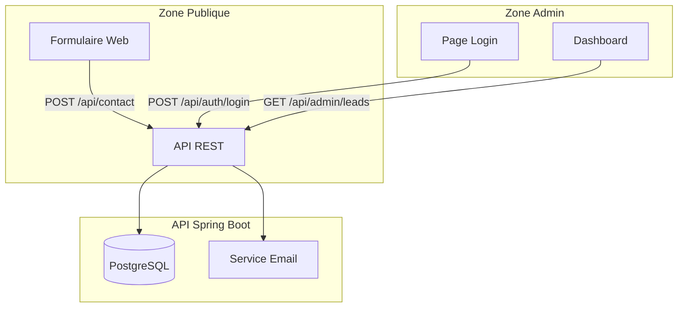
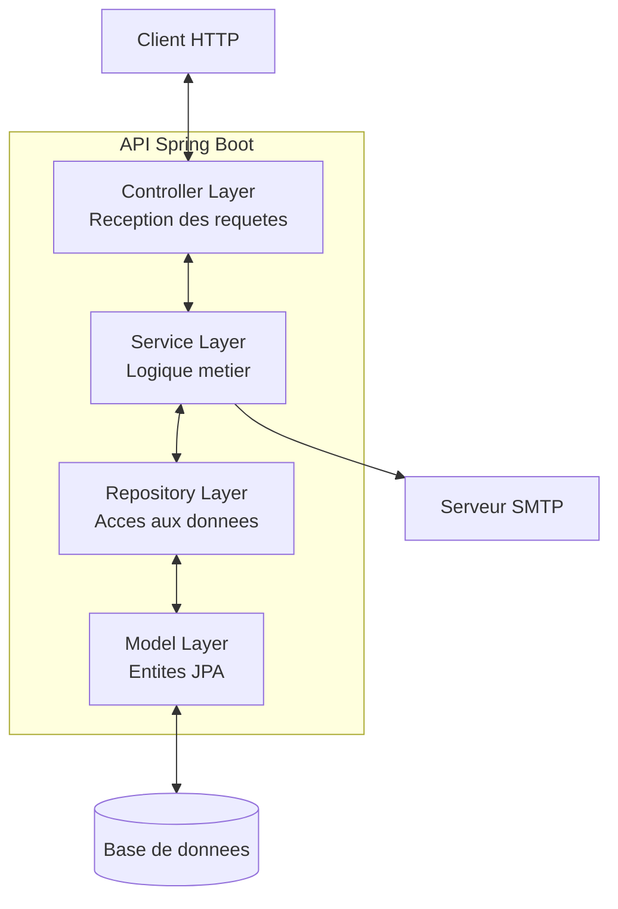
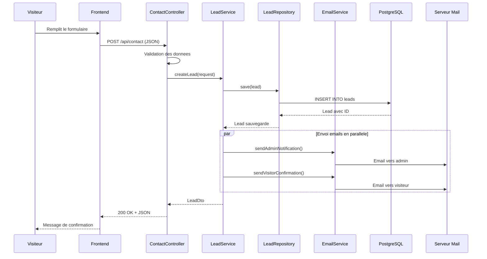
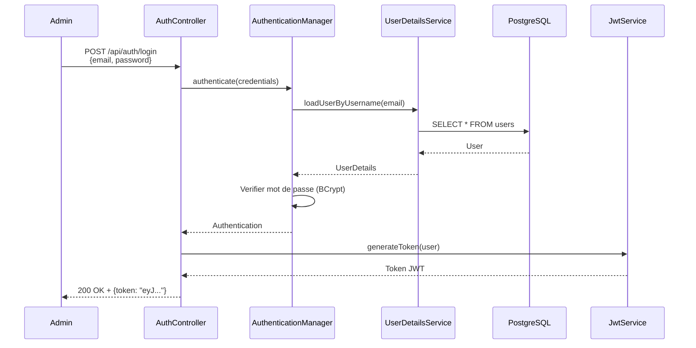

# Chapitre 1.1 - Presentation du projet

## Objectifs du chapitre

- Comprendre le contexte et les besoins du projet
- Identifier les fonctionnalites principales
- Visualiser l'architecture globale
- Connaitre les technologies utilisees

---

## 1. Contexte et problematique

### Le besoin metier

Dans le monde numerique actuel, toute entreprise a besoin d'un moyen efficace pour collecter et gerer les demandes de ses clients potentiels. Un **formulaire de contact** est souvent le premier point d'interaction entre un visiteur et une entreprise.

### Problematique

Une entreprise souhaite collecter les demandes de contact de ses visiteurs via un formulaire web. Elle a besoin de:

1. **Un formulaire accessible publiquement** - Les visiteurs doivent pouvoir soumettre leurs demandes sans creer de compte
2. **Une notification par email** - L'equipe commerciale doit etre alertee immediatement
3. **Un espace d'administration securise** - Pour gerer et suivre les leads
4. **Des statistiques** - Pour mesurer l'efficacite du formulaire

### Qu'est-ce qu'un Lead?

Un **lead** (ou prospect) est une personne qui a manifeste un interet pour les produits ou services d'une entreprise. Dans notre contexte, chaque soumission de formulaire cree un nouveau lead.

### Le cycle de vie d'un lead


---

## 2. La solution: une API REST

### Qu'est-ce qu'une API?

Une **API (Application Programming Interface)** est une interface qui permet a deux applications de communiquer entre elles. Dans notre cas:

- Le **frontend** (site web) communique avec
- Le **backend** (notre API Spring Boot)

### Qu'est-ce que REST?

**REST (REpresentational State Transfer)** est un style d'architecture pour concevoir des APIs web. Ses principes:

1. **Client-Serveur**: Separation des responsabilites
2. **Stateless**: Chaque requete est independante
3. **Interface uniforme**: Utilisation coherente des methodes HTTP
4. **Ressources**: Tout est une ressource identifiee par une URL

### Notre solution

Developper une **API REST** avec **Spring Boot** qui:

- Expose un endpoint public pour soumettre le formulaire
- Envoie des emails automatiquement
- Securise l'acces admin avec JWT
- Stocke les donnees dans une base PostgreSQL

---

## 3. Fonctionnalites detaillees

### Vue d'ensemble



### Partie publique

| Fonctionnalite | Endpoint | Methode | Description |
|----------------|----------|---------|-------------|
| Soumettre formulaire | /api/contact | POST | Cree un nouveau lead et envoie les notifications |

### Partie administration (securisee)

| Fonctionnalite | Endpoint | Methode | Description |
|----------------|----------|---------|-------------|
| Connexion | /api/auth/login | POST | Authentification, retourne un token JWT |
| Liste des leads | /api/admin/leads | GET | Retourne les leads avec pagination |
| Detail d'un lead | /api/admin/leads/{id} | GET | Retourne un lead specifique |
| Modifier statut | /api/admin/leads/{id}/status | PUT | Change le statut du lead |
| Supprimer | /api/admin/leads/{id} | DELETE | Supprime un lead |
| Statistiques | /api/admin/leads/stats | GET | Compteurs par statut |

---

## 4. Architecture globale

### Architecture en couches

L'application suit une **architecture en couches** (layered architecture), un pattern classique qui separe les responsabilites:



### Description des couches

| Couche | Responsabilite | Exemple de classe |
|--------|---------------|-------------------|
| **Controller** | Recevoir les requetes HTTP, valider les entrees | ContactController |
| **Service** | Logique metier, orchestration | LeadService |
| **Repository** | Acces aux donnees, requetes SQL | LeadRepository |
| **Model** | Representation des donnees | Lead, User |

### Pourquoi cette separation?

1. **Maintenabilite**: Chaque couche peut evoluer independamment
2. **Testabilite**: Facile de tester chaque couche isolement
3. **Reutilisabilite**: Un service peut etre utilise par plusieurs controllers
4. **Clarte**: Le code est organise de maniere previsible

---

## 5. Technologies utilisees

### Stack technique


### Detail des technologies

| Categorie | Technologie | Role | Version |
|-----------|-------------|------|---------|
| **Langage** | Java | Langage de programmation | 17 LTS |
| **Framework** | Spring Boot | Framework principal | 3.2.0 |
| **Securite** | Spring Security | Authentification/Autorisation | - |
| **Persistance** | Spring Data JPA | Acces aux donnees | - |
| **Email** | Spring Mail | Envoi d'emails | - |
| **BDD Prod** | PostgreSQL | Base de donnees production | 15 |
| **BDD Dev** | H2 | Base de donnees developpement | Embedded |
| **Auth** | JWT (jjwt) | Tokens d'authentification | 0.12.3 |
| **Doc** | springdoc-openapi | Documentation API | 2.3.0 |
| **Build** | Maven | Gestion des dependances | 3.x |
| **Container** | Docker | Conteneurisation | - |

---

## 6. Structure du projet

### Organisation des fichiers

```
projet-e-contact-backend/
|
|-- src/main/java/com/example/contact/
|   |-- ContactApplication.java      # Point d'entree de l'application
|   |
|   |-- config/                      # Configuration Spring
|   |   |-- SecurityConfig.java      # Configuration securite
|   |   |-- OpenApiConfig.java       # Configuration Swagger
|   |
|   |-- controller/                  # Endpoints REST
|   |   |-- ContactController.java   # Endpoint public
|   |   |-- AuthController.java      # Authentification
|   |   |-- LeadController.java      # Gestion des leads
|   |
|   |-- dto/                         # Objets de transfert
|   |   |-- request/                 # Donnees entrantes
|   |   |-- response/                # Donnees sortantes
|   |
|   |-- exception/                   # Gestion des erreurs
|   |
|   |-- model/                       # Entites JPA
|   |   |-- Lead.java
|   |   |-- User.java
|   |
|   |-- repository/                  # Acces donnees
|   |
|   |-- security/                    # JWT
|   |
|   |-- service/                     # Logique metier
|
|-- src/main/resources/
|   |-- application.yml              # Configuration
|
|-- docker-compose.yml               # Orchestration Docker
|-- Dockerfile                       # Image Docker
|-- pom.xml                          # Dependances Maven
```

---

## 7. Flux de donnees

### Soumission d'un formulaire de contact



### Authentification administrateur



### Acces aux endpoints proteges


---

## 8. Concepts cles

### API Stateless

Une API **stateless** (sans etat) signifie que:

- Le serveur ne conserve aucune information de session
- Chaque requete contient toutes les informations necessaires
- L'authentification se fait via un token (JWT) envoye a chaque requete

**Avantages:**
- Scalabilite horizontale (plusieurs serveurs)
- Pas de probleme de session expiree
- Simplicite de deploiement

### JWT (JSON Web Token)

Un **JWT** est un token qui contient des informations encodees:

```
eyJhbGciOiJIUzI1NiJ9.eyJzdWIiOiJhZG1pbkBleGFtcGxlLmNvbSIsImlhdCI6MTcwNTMxMjAwMH0.signature
|_____Header_____|._____________Payload_______________|.__Signature__|
```

- **Header**: Algorithme de signature
- **Payload**: Donnees (email, roles, expiration)
- **Signature**: Garantit l'integrite

### Separation dev/prod

L'application utilise des **profils Spring** pour adapter la configuration:

| Aspect | Developpement (dev) | Production (prod) |
|--------|---------------------|-------------------|
| Base de donnees | H2 (memoire) | PostgreSQL |
| Emails | MailHog (fake) | Gmail SMTP |
| Logs | DEBUG | INFO |
| Schema BDD | create-drop | validate |

---

## 9. Points cles a retenir

1. **Architecture en couches**: Controller → Service → Repository → Model
2. **API Stateless**: Pas de session, authentification par JWT
3. **Securite**: Endpoints admin proteges, mots de passe hashes avec BCrypt
4. **Separation des environnements**: Profils dev et prod
5. **Documentation automatique**: Swagger genere la doc depuis le code
6. **Conteneurisation**: Docker pour un deploiement reproductible

---

## QUIZ 1.1 - Presentation du projet

**1. Quel est le role principal de cette API?**
- a) Gerer un site e-commerce
- b) Collecter et gerer des demandes de contact
- c) Envoyer des newsletters
- d) Gerer un blog

<details>
<summary>Voir la reponse</summary>

**Reponse: b) Collecter et gerer des demandes de contact**

L'API permet aux visiteurs de soumettre des formulaires de contact et aux administrateurs de gerer ces leads.

</details>

---

**2. Quel endpoint permet de soumettre un formulaire de contact?**
- a) GET /api/contact
- b) POST /api/leads
- c) POST /api/contact
- d) PUT /api/contact

<details>
<summary>Voir la reponse</summary>

**Reponse: c) POST /api/contact**

La methode POST est utilisee pour creer une nouvelle ressource. L'endpoint /api/contact est public.

</details>

---

**3. Quelle technologie est utilisee pour l'authentification?**
- a) Sessions
- b) Cookies
- c) JWT
- d) OAuth2

<details>
<summary>Voir la reponse</summary>

**Reponse: c) JWT (JSON Web Token)**

JWT permet une authentification stateless. Le token contient les informations de l'utilisateur et est envoye dans chaque requete.

</details>

---

**4. VRAI ou FAUX: Les endpoints admin sont accessibles sans authentification.**

<details>
<summary>Voir la reponse</summary>

**Reponse: FAUX**

Les endpoints /api/admin/** sont proteges par Spring Security et necessitent un token JWT valide avec le role ADMIN.

</details>

---

**5. Quelle base de donnees est utilisee en production?**
- a) H2
- b) MySQL
- c) PostgreSQL
- d) MongoDB

<details>
<summary>Voir la reponse</summary>

**Reponse: c) PostgreSQL**

PostgreSQL est utilise en production pour sa robustesse. H2 est utilise en developpement car elle fonctionne en memoire.

</details>

---

**6. Combien de couches principales composent l'architecture?**
- a) 2
- b) 3
- c) 4
- d) 5

<details>
<summary>Voir la reponse</summary>

**Reponse: c) 4**

Les 4 couches sont:
1. Controller (reception des requetes)
2. Service (logique metier)
3. Repository (acces aux donnees)
4. Model (entites JPA)

</details>

---

**7. Que se passe-t-il apres la soumission d'un formulaire?**
- a) Le lead est sauvegarde en base
- b) Un email est envoye a l'admin
- c) Un email de confirmation est envoye au visiteur
- d) Toutes les reponses ci-dessus

<details>
<summary>Voir la reponse</summary>

**Reponse: d) Toutes les reponses ci-dessus**

Le flux complet:
1. Sauvegarde du lead en base de donnees
2. Envoi d'un email de notification a l'administrateur
3. Envoi d'un email de confirmation au visiteur

</details>

---

**8. Completez: L'API est _______ car elle n'utilise pas de sessions serveur.**

<details>
<summary>Voir la reponse</summary>

**Reponse: stateless**

Une API stateless ne conserve pas d'etat entre les requetes. Chaque requete contient toutes les informations necessaires (notamment le token JWT).

</details>

---

**9. Quel outil permet de documenter automatiquement l'API?**
- a) Javadoc
- b) Swagger/OpenAPI
- c) Postman
- d) JUnit

<details>
<summary>Voir la reponse</summary>

**Reponse: b) Swagger/OpenAPI**

springdoc-openapi genere automatiquement la documentation a partir des annotations du code. Swagger UI permet de visualiser et tester l'API.

</details>

---

**10. Dans quel fichier sont definies les dependances Maven?**
- a) build.gradle
- b) package.json
- c) pom.xml
- d) dependencies.yml

<details>
<summary>Voir la reponse</summary>

**Reponse: c) pom.xml**

Le fichier pom.xml (Project Object Model) est le fichier de configuration Maven. Il contient les dependances, les plugins et les informations du projet.

</details>
