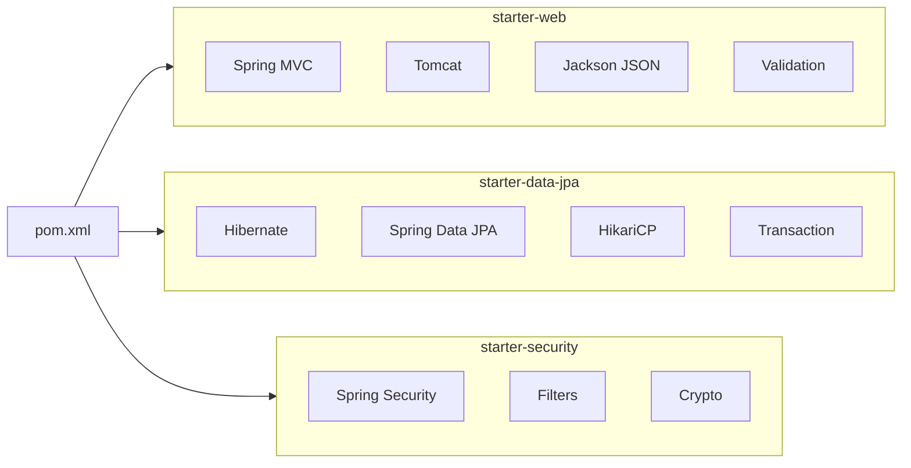
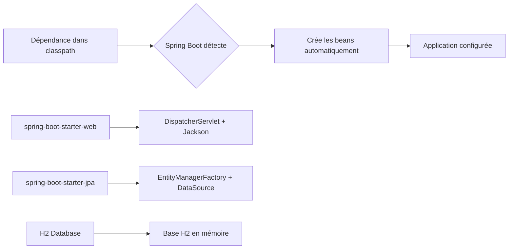
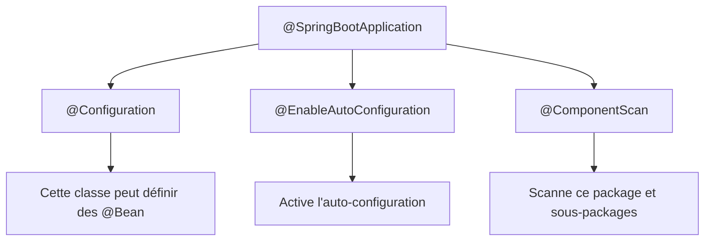
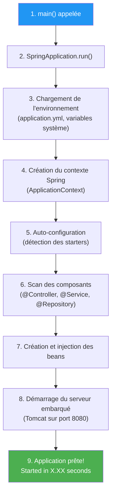
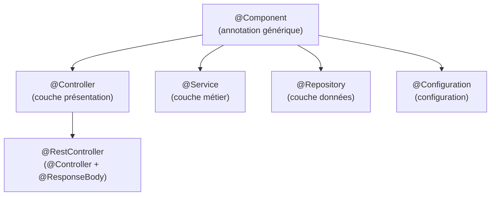
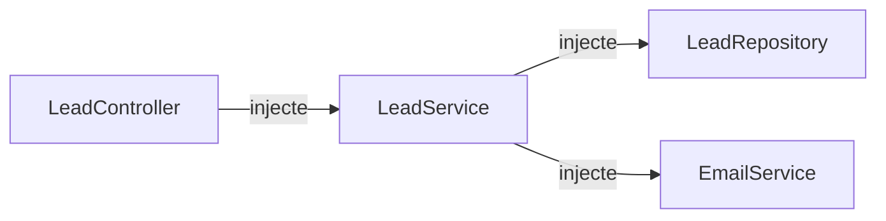
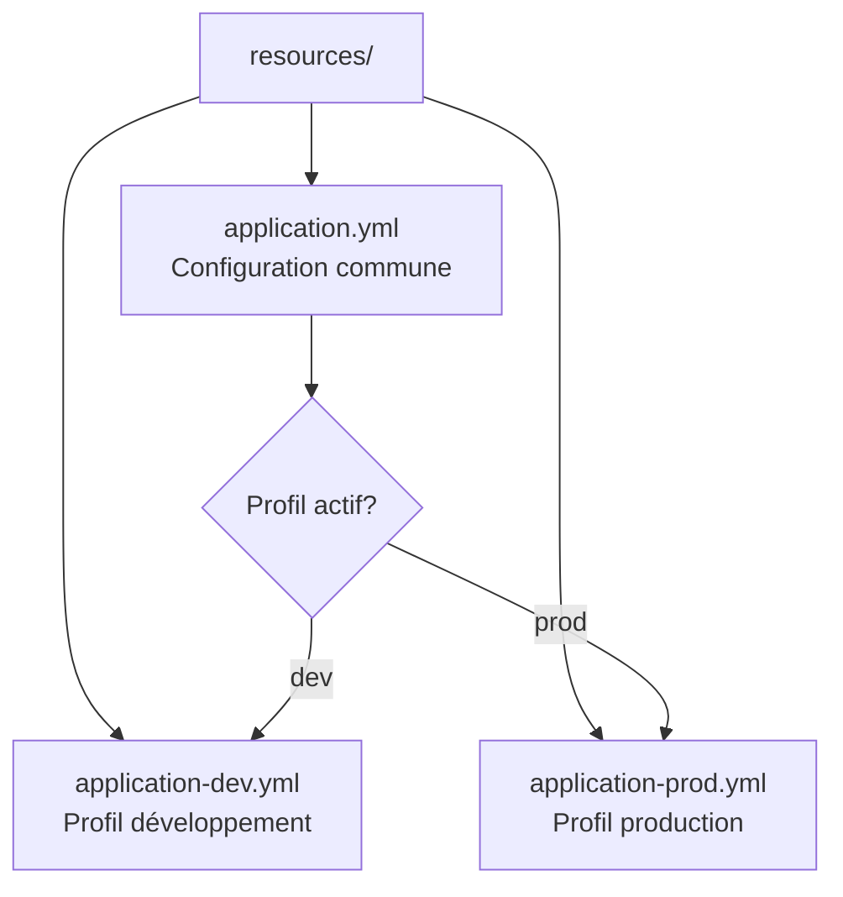

# Chapitre 1.2 - Spring Boot: Introduction

## Objectifs du chapitre

- Comprendre ce qu'est Spring Boot et son écosystème
- Connaître les avantages par rapport à Spring classique
- Identifier les composants principaux et leur rôle
- Maîtriser le cycle de vie d'une application Spring Boot

---

## 1. Qu'est-ce que Spring Boot?

### Définition

**Spring Boot** est un framework Java construit au-dessus de Spring Framework. Il a été créé en 2014 par Pivotal (maintenant VMware) pour résoudre un problème majeur : la complexité de configuration de Spring.

> **Analogie** : Si Spring est une boîte à outils complète avec des centaines d'outils, Spring Boot est un kit préassemblé où les outils les plus courants sont déjà sortis et prêts à l'emploi.

Spring Boot fournit :

- **Configuration automatique** : Détecte les dépendances et configure automatiquement
- **Serveurs embarqués** : Tomcat, Jetty ou Undertow intégrés
- **Starters** : Ensembles de dépendances cohérentes
- **Approche opiniâtre** : Choix par défaut sensibles ("convention over configuration")

### Pourquoi Spring Boot existe-t-il?

Avant Spring Boot, créer une application Spring nécessitait :
1. Configurer manuellement des dizaines de beans XML
2. Gérer les conflits de versions entre dépendances
3. Déployer sur un serveur externe (Tomcat, JBoss, etc.)
4. Écrire beaucoup de code "boilerplate"

Spring Boot élimine cette complexité en adoptant le principe **"convention over configuration"**.

### Diagramme : Spring vs Spring Boot

```mermaid
graph TB
    subgraph "Spring Classique"
        A1[Application] --> B1[Configuration XML/Java]
        B1 --> C1[Gestion manuelle des dépendances]
        C1 --> D1[Déploiement WAR]
        D1 --> E1[Serveur externe Tomcat]
    end
    
    subgraph "Spring Boot"
        A2[Application] --> B2[Auto-configuration]
        B2 --> C2[Starters Maven]
        C2 --> D2[JAR exécutable]
        D2 --> E2[Tomcat embarqué]
    end
    
    style A2 fill:#4CAF50,color:#fff
    style B2 fill:#4CAF50,color:#fff
    style C2 fill:#4CAF50,color:#fff
    style D2 fill:#4CAF50,color:#fff
    style E2 fill:#4CAF50,color:#fff
```



### Tableau comparatif : Spring vs Spring Boot

| Aspect | Spring (classique) | Spring Boot |
|--------|-------------------|-------------|
| Configuration | XML ou Java verbose | Auto-configuration |
| Serveur | Externe (WAR) | Embarqué (JAR) |
| Démarrage | Long et complexe | Rapide et simple |
| Dépendances | Manuelles | Starters |
| Temps de setup | Heures | Minutes |
| Courbe d'apprentissage | Élevée | Modérée |

---

## 2. Principes fondamentaux

### 2.1 Convention over Configuration

Ce principe signifie que le framework fait des choix par défaut sensibles. Vous ne configurez que ce qui diffère des conventions.

**Valeurs par défaut de Spring Boot :**

| Paramètre | Valeur par défaut |
|-----------|-------------------|
| Port HTTP | 8080 |
| Contexte racine | / |
| Niveau de logging | INFO |
| Base de données H2 | En mémoire |
| Format JSON | Jackson |

> **Concept clé** : Vous n'écrivez de la configuration que pour surcharger les valeurs par défaut. Si les conventions vous conviennent, vous n'écrivez rien!

**Exemple pratique :**
```yaml
# Sans configuration = port 8080
# Avec configuration = port personnalisé
server:
  port: 9000
```

### 2.2 Les Starters

Les **starters** sont des dépendances Maven "tout-en-un" qui regroupent :
- Les bibliothèques nécessaires
- Les versions compatibles entre elles
- L'auto-configuration associée



**Exemple : Un seul starter au lieu de 10+ dépendances**

```xml
<!-- AVANT (Spring classique) : gérer chaque dépendance -->
<dependency>
    <groupId>org.springframework</groupId>
    <artifactId>spring-webmvc</artifactId>
    <version>5.3.23</version>
</dependency>
<dependency>
    <groupId>com.fasterxml.jackson.core</groupId>
    <artifactId>jackson-databind</artifactId>
    <version>2.14.0</version>
</dependency>
<!-- + 8 autres dépendances... -->

<!-- APRÈS (Spring Boot) : un seul starter -->
<dependency>
    <groupId>org.springframework.boot</groupId>
    <artifactId>spring-boot-starter-web</artifactId>
</dependency>
```

**Starters utilisés dans notre projet e-Contact :**

| Starter | Ce qu'il fournit |
|---------|------------------|
| `spring-boot-starter-web` | Spring MVC, Tomcat, JSON, validation |
| `spring-boot-starter-data-jpa` | JPA, Hibernate, Spring Data |
| `spring-boot-starter-security` | Authentification, autorisation |
| `spring-boot-starter-mail` | JavaMail pour l'envoi d'emails |
| `spring-boot-starter-validation` | Bean Validation (JSR-380) |

### 2.3 Auto-configuration

L'**auto-configuration** est le mécanisme qui détecte les dépendances présentes et configure automatiquement les beans nécessaires.



**Comment ça fonctionne :**

1. Spring Boot scanne le classpath au démarrage
2. Il trouve les classes de configuration conditionnelles (`@ConditionalOnClass`)
3. Si les conditions sont remplies, il crée les beans

```
Dépendance détectée          Configuration automatique créée
-------------------          -------------------------------
spring-boot-starter-web  --> DispatcherServlet, Jackson, ErrorController
spring-boot-starter-jpa  --> EntityManagerFactory, DataSource, TransactionManager
H2 dans le classpath     --> Base H2 en mémoire avec console web
PostgreSQL driver        --> DataSource PostgreSQL
```

> **Important** : L'auto-configuration ne remplace PAS votre configuration personnalisée. Si vous définissez un bean manuellement, Spring Boot n'en créera pas un automatiquement.

---

## 3. Structure d'une application Spring Boot

### 3.1 Classe principale

Toute application Spring Boot a une classe principale avec une méthode `main()` :

```java
package com.example.contact;

import org.springframework.boot.SpringApplication;
import org.springframework.boot.autoconfigure.SpringBootApplication;

@SpringBootApplication
public class ContactApplication {
    public static void main(String[] args) {
        SpringApplication.run(ContactApplication.class, args);
    }
}
```

### 3.2 L'annotation @SpringBootApplication

Cette annotation est en réalité une **méta-annotation** qui combine trois annotations :



```java
@SpringBootApplication
// Est équivalent à :
@Configuration           // Cette classe est une source de configuration
@EnableAutoConfiguration // Active l'auto-configuration de Spring Boot
@ComponentScan          // Scanne les composants dans ce package et sous-packages
```

> **Point important** : Le package de la classe principale détermine la portée du scan. Placez-la toujours à la racine de vos packages (ex: `com.example.contact`).

### 3.3 La méthode main()

```java
public static void main(String[] args) {
    SpringApplication.run(ContactApplication.class, args);
}
```

Cette simple ligne déclenche une cascade d'opérations :
1. Crée le contexte Spring (ApplicationContext)
2. Effectue l'auto-configuration
3. Scanne et instancie les composants (@Controller, @Service, etc.)
4. Démarre le serveur embarqué (Tomcat par défaut)

---

## 4. Cycle de vie de l'application

### Diagramme du démarrage



### Logs de démarrage typiques

```
  .   ____          _            __ _ _
 /\\ / ___'_ __ _ _(_)_ __  __ _ \ \ \ \
( ( )\___ | '_ | '_| | '_ \/ _` | \ \ \ \
 \\/  ___)| |_)| | | | | || (_| |  ) ) ) )
  '  |____| .__|_| |_|_| |_\__, | / / / /
 =========|_|==============|___/=/_/_/_/
 :: Spring Boot ::                (v3.2.0)

INFO  ContactApplication : Starting ContactApplication v1.0.0
INFO  ContactApplication : The following 1 profile is active: "dev"
INFO  TomcatWebServer    : Tomcat initialized with port 8080 (http)
INFO  ContactApplication : Started ContactApplication in 3.245 seconds
```

---

## 5. Les annotations de composants

### Hiérarchie des stéréotypes



| Annotation | Rôle | Couche |
|------------|------|--------|
| `@Component` | Composant générique | Toutes |
| `@Controller` | Contrôleur web (retourne des vues) | Présentation |
| `@RestController` | Contrôleur REST (retourne du JSON) | Présentation |
| `@Service` | Logique métier | Service |
| `@Repository` | Accès aux données | Persistance |
| `@Configuration` | Classe de configuration | Transverse |

### Injection de dépendances

L'**injection de dépendances** (DI) est le mécanisme par lequel Spring fournit automatiquement les objets dont un composant a besoin.



**Méthode recommandée : injection par constructeur**

```java
// Injection par constructeur (recommandée)
@Service
public class LeadService {
    private final LeadRepository repository;
    private final EmailService emailService;
    
    // Spring injecte automatiquement les dépendances
    public LeadService(LeadRepository repository, EmailService emailService) {
        this.repository = repository;
        this.emailService = emailService;
    }
}

// Avec Lombok (simplifié)
@Service
@RequiredArgsConstructor  // Génère le constructeur automatiquement
public class LeadService {
    private final LeadRepository repository;
    private final EmailService emailService;
}
```

> **Pourquoi l'injection par constructeur?**
> - Garantit que les dépendances ne sont jamais null
> - Permet de déclarer les champs `final` (immutabilité)
> - Facilite les tests unitaires
> - Détecte les dépendances circulaires au démarrage

---

## 6. Fichier de configuration

### application.yml vs application.properties

Spring Boot supporte deux formats de configuration :

**Format YAML (recommandé pour les structures complexes) :**
```yaml
# application.yml
server:
  port: 8080

spring:
  datasource:
    url: jdbc:h2:mem:testdb
    username: sa
    password: 
  jpa:
    hibernate:
      ddl-auto: create-drop
```

**Format Properties (plus simple) :**
```properties
# application.properties
server.port=8080
spring.datasource.url=jdbc:h2:mem:testdb
spring.datasource.username=sa
spring.datasource.password=
spring.jpa.hibernate.ddl-auto=create-drop
```

Les deux formats sont équivalents fonctionnellement. YAML est plus lisible pour les configurations hiérarchiques.

### Structure des fichiers de configuration



---

## 7. Démarrer l'application

### En ligne de commande

```bash
# Avec Maven Wrapper (recommandé)
./mvnw spring-boot:run

# Avec Maven installé
mvn spring-boot:run

# Avec le JAR compilé
java -jar target/contact-1.0.0.jar

# Avec un profil spécifique
java -jar app.jar --spring.profiles.active=prod

# Avec des propriétés personnalisées
java -jar app.jar --server.port=9000
```

### Dans un IDE

Exécuter la méthode `main()` de la classe principale (`ContactApplication`).

### Avec Docker

```bash
docker compose up -d
```

---

## 8. Points clés à retenir

```mermaid
mindmap
  root((Spring Boot))
    Simplification
      Auto-configuration
      Starters
      Serveur embarqué
    Annotations
      @SpringBootApplication
      @Component
      @Service
      @Repository
      @RestController
    Configuration
      application.yml
      Profils
      Variables d'environnement
    Démarrage
      main()
      SpringApplication.run()
```

1. **Spring Boot simplifie Spring** avec l'auto-configuration et les conventions
2. **Les starters** regroupent les dépendances cohérentes et compatibles
3. **@SpringBootApplication** est le point d'entrée de toute application
4. **Le serveur est embarqué** : pas besoin de déploiement WAR externe
5. **Configuration par fichiers** application.yml ou .properties avec profils

---

## QUIZ 1.2 - Spring Boot Introduction

**1. Qu'est-ce que Spring Boot?**
- a) Un nouveau langage de programmation
- b) Un framework qui simplifie Spring
- c) Un serveur d'applications
- d) Une base de données

<details>
<summary>Voir la réponse</summary>

**Réponse : b) Un framework qui simplifie Spring**

Spring Boot est un framework construit au-dessus de Spring Framework. Il simplifie la création d'applications Spring en fournissant l'auto-configuration, les starters et un serveur embarqué.
</details>

---

**2. Quelle annotation marque la classe principale d'une application Spring Boot?**
- a) @SpringApplication
- b) @MainClass
- c) @SpringBootApplication
- d) @Application

<details>
<summary>Voir la réponse</summary>

**Réponse : c) @SpringBootApplication**

Cette annotation combine @Configuration, @EnableAutoConfiguration et @ComponentScan. Elle marque la classe principale et définit le package racine pour le scan des composants.
</details>

---

**3. Quel est le port HTTP par défaut de Spring Boot?**
- a) 80
- b) 443
- c) 3000
- d) 8080

<details>
<summary>Voir la réponse</summary>

**Réponse : d) 8080**

Par convention, Spring Boot démarre sur le port 8080. Ce port peut être changé via `server.port` dans application.yml.
</details>

---

**4. Qu'est-ce qu'un starter Spring Boot?**
- a) Un type de base de données
- b) Un ensemble de dépendances pré-configurées
- c) Un outil de test
- d) Un serveur web

<details>
<summary>Voir la réponse</summary>

**Réponse : b) Un ensemble de dépendances pré-configurées**

Un starter regroupe plusieurs dépendances Maven cohérentes avec leurs versions compatibles. Par exemple, `spring-boot-starter-web` inclut Spring MVC, Tomcat, Jackson, etc.
</details>

---

**5. VRAI ou FAUX : Spring Boot nécessite un serveur externe comme Tomcat.**

<details>
<summary>Voir la réponse</summary>

**Réponse : FAUX**

Spring Boot embarque un serveur (Tomcat par défaut). L'application est packagée en JAR exécutable qui contient tout le nécessaire pour fonctionner. Plus besoin de déployer un WAR sur un serveur externe.
</details>

---

**6. Quelle annotation est utilisée pour marquer une classe de logique métier?**
- a) @Component
- b) @Controller
- c) @Service
- d) @Bean

<details>
<summary>Voir la réponse</summary>

**Réponse : c) @Service**

@Service est le stéréotype utilisé pour la couche métier. C'est une spécialisation de @Component qui indique que la classe contient la logique business.
</details>

---

**7. @SpringBootApplication combine quelles annotations?**
- a) @Configuration, @EnableAutoConfiguration, @ComponentScan
- b) @Controller, @Service, @Repository
- c) @Bean, @Autowired, @Component
- d) @RestController, @RequestMapping, @GetMapping

<details>
<summary>Voir la réponse</summary>

**Réponse : a) @Configuration, @EnableAutoConfiguration, @ComponentScan**

- @Configuration : permet de définir des beans
- @EnableAutoConfiguration : active l'auto-configuration
- @ComponentScan : scanne les composants dans le package et sous-packages
</details>

---

**8. Complétez : L'approche de Spring Boot est "_______ over Configuration".**

<details>
<summary>Voir la réponse</summary>

**Réponse : Convention**

"Convention over Configuration" signifie que le framework fait des choix par défaut sensibles. Vous ne configurez que ce qui diffère des conventions.
</details>

---

**9. Quel format de configuration est plus lisible pour les structures hiérarchiques?**
- a) .properties
- b) .xml
- c) .yml
- d) .json

<details>
<summary>Voir la réponse</summary>

**Réponse : c) .yml**

Le format YAML utilise l'indentation pour représenter la hiérarchie, ce qui le rend plus lisible pour les configurations complexes. Les deux formats (.yml et .properties) sont fonctionnellement équivalents.
</details>

---

**10. Quelle commande Maven démarre l'application Spring Boot?**
- a) mvn run
- b) mvn start
- c) mvn spring-boot:run
- d) mvn boot:start

<details>
<summary>Voir la réponse</summary>

**Réponse : c) mvn spring-boot:run**

Cette commande compile l'application et la démarre directement. Le plugin spring-boot-maven-plugin fournit cette fonctionnalité.
</details>

---

## Navigation

| Précédent | Suivant |
|-----------|---------|
| [01 - Présentation du projet](01-presentation-projet.md) | [03 - Maven et dépendances](03-maven-dependances.md) |
