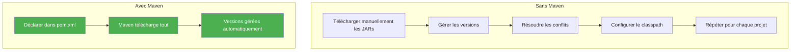
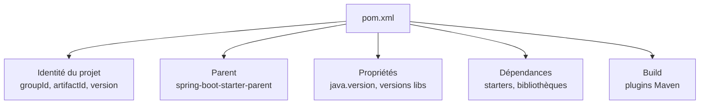
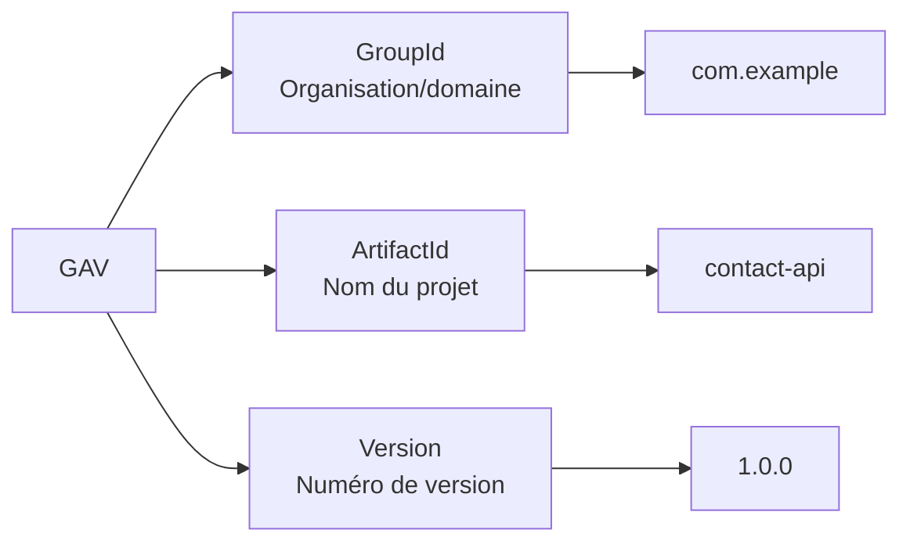
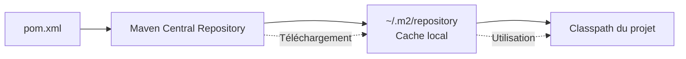
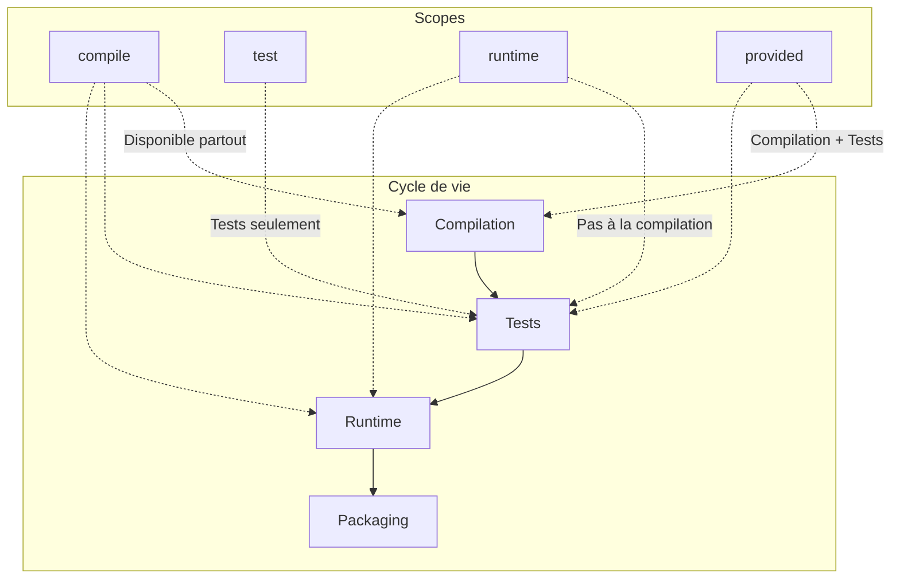
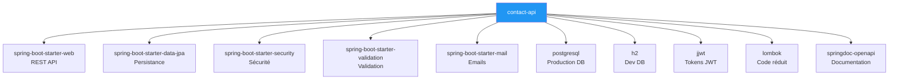
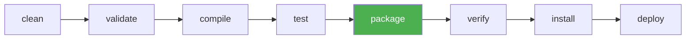
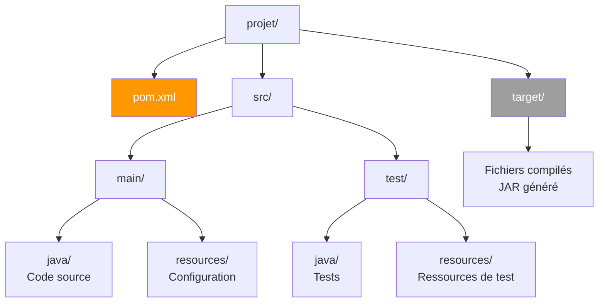
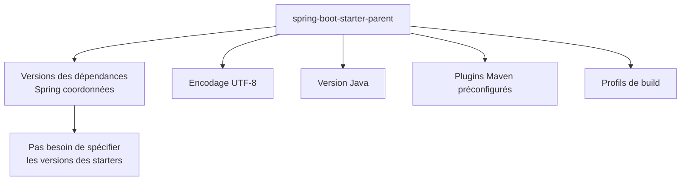
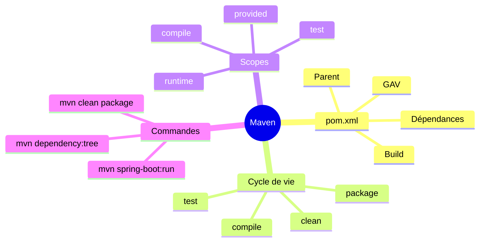

# Chapitre 1.3 - Maven et gestion des dépendances

## Objectifs du chapitre

- Comprendre le rôle de Maven dans l'écosystème Java
- Savoir lire et modifier un fichier pom.xml
- Connaître les commandes Maven essentielles
- Maîtriser les concepts de dépendances et de scopes

---

## 1. Qu'est-ce que Maven?

### Définition

**Maven** est un outil de gestion de projet Java créé par Apache en 2004. Il standardise et automatise le cycle de vie complet d'un projet :

- **Gestion des dépendances** : Télécharge et organise les bibliothèques externes
- **Standardisation** : Structure de projet uniforme pour tous les projets
- **Automatisation du build** : Compilation, tests, packaging
- **Gestion du cycle de vie** : De la compilation au déploiement

> **Analogie** : Maven est comme un chef de chantier qui sait où trouver les matériaux (dépendances), comment les assembler (build), et dans quel ordre effectuer les travaux (cycle de vie).

### Comment Maven résout le problème des dépendances



### Alternatives à Maven

| Outil | Langage | Fichier config | Syntaxe |
|-------|---------|----------------|---------|
| **Maven** | Java | pom.xml | XML |
| **Gradle** | Java/Kotlin | build.gradle | Groovy/Kotlin |
| **npm** | JavaScript | package.json | JSON |
| **pip** | Python | requirements.txt | Texte |
| **Cargo** | Rust | Cargo.toml | TOML |

---

## 2. Le fichier pom.xml

### Qu'est-ce que le POM?

**POM** signifie *Project Object Model*. C'est le fichier central qui décrit tout le projet Maven.

### Structure de base



```xml
<?xml version="1.0" encoding="UTF-8"?>
<project xmlns="http://maven.apache.org/POM/4.0.0">
    <modelVersion>4.0.0</modelVersion>
    
    <!-- 1. Identité du projet -->
    <groupId>com.example</groupId>
    <artifactId>contact-api</artifactId>
    <version>1.0.0</version>
    
    <!-- 2. Héritage Spring Boot -->
    <parent>
        <groupId>org.springframework.boot</groupId>
        <artifactId>spring-boot-starter-parent</artifactId>
        <version>3.2.0</version>
    </parent>
    
    <!-- 3. Propriétés -->
    <properties>
        <java.version>17</java.version>
    </properties>
    
    <!-- 4. Dépendances -->
    <dependencies>
        <!-- ... -->
    </dependencies>
    
    <!-- 5. Configuration du build -->
    <build>
        <!-- ... -->
    </build>
</project>
```

### Coordonnées Maven (GAV)

Chaque artefact Maven est identifié de manière unique par trois éléments, appelés **coordonnées GAV** :



| Élément | Description | Convention | Exemple |
|---------|-------------|------------|---------|
| **G**roupId | Organisation ou domaine | Nom de domaine inversé | `com.example` |
| **A**rtifactId | Nom du projet | Minuscules, tirets | `contact-api` |
| **V**ersion | Version du projet | SemVer recommandé | `1.0.0` |

> **SemVer** (Semantic Versioning) : MAJOR.MINOR.PATCH
> - MAJOR : Changements incompatibles
> - MINOR : Nouvelles fonctionnalités compatibles
> - PATCH : Corrections de bugs

---

## 3. Les dépendances

### Syntaxe d'une dépendance

```xml
<dependency>
    <groupId>org.springframework.boot</groupId>
    <artifactId>spring-boot-starter-web</artifactId>
    <!-- version héritée du parent -->
</dependency>
```

### Diagramme : Résolution des dépendances



### Scopes (portées)

Les **scopes** définissent quand et où une dépendance est disponible :



| Scope | Compilation | Test | Runtime | Exemple |
|-------|:-----------:|:----:|:-------:|---------|
| **compile** (défaut) | ✅ | ✅ | ✅ | spring-boot-starter-web |
| **test** | ❌ | ✅ | ❌ | spring-boot-starter-test |
| **runtime** | ❌ | ✅ | ✅ | postgresql |
| **provided** | ✅ | ✅ | ❌ | lombok |

```xml
<!-- Exemple avec scope -->
<dependency>
    <groupId>org.postgresql</groupId>
    <artifactId>postgresql</artifactId>
    <scope>runtime</scope>
</dependency>
```

> **Pourquoi PostgreSQL est "runtime"?**  
> Le code Java utilise JDBC (interfaces standard), pas directement les classes PostgreSQL. Le driver n'est nécessaire qu'à l'exécution.

---

## 4. Dépendances de notre projet e-Contact

### Architecture des dépendances



### Liste complète des dépendances

```xml
<!-- ===== SPRING BOOT STARTERS ===== -->

<!-- Spring Web (REST API) -->
<dependency>
    <groupId>org.springframework.boot</groupId>
    <artifactId>spring-boot-starter-web</artifactId>
</dependency>

<!-- Spring Data JPA (persistance) -->
<dependency>
    <groupId>org.springframework.boot</groupId>
    <artifactId>spring-boot-starter-data-jpa</artifactId>
</dependency>

<!-- Spring Security (authentification) -->
<dependency>
    <groupId>org.springframework.boot</groupId>
    <artifactId>spring-boot-starter-security</artifactId>
</dependency>

<!-- Validation (contraintes sur les données) -->
<dependency>
    <groupId>org.springframework.boot</groupId>
    <artifactId>spring-boot-starter-validation</artifactId>
</dependency>

<!-- Spring Mail (envoi emails) -->
<dependency>
    <groupId>org.springframework.boot</groupId>
    <artifactId>spring-boot-starter-mail</artifactId>
</dependency>

<!-- ===== BASES DE DONNÉES ===== -->

<!-- PostgreSQL (production) -->
<dependency>
    <groupId>org.postgresql</groupId>
    <artifactId>postgresql</artifactId>
    <scope>runtime</scope>
</dependency>

<!-- H2 (développement) -->
<dependency>
    <groupId>com.h2database</groupId>
    <artifactId>h2</artifactId>
    <scope>runtime</scope>
</dependency>

<!-- ===== BIBLIOTHÈQUES TIERCES ===== -->

<!-- JWT -->
<dependency>
    <groupId>io.jsonwebtoken</groupId>
    <artifactId>jjwt-api</artifactId>
    <version>0.12.3</version>
</dependency>

<!-- Lombok -->
<dependency>
    <groupId>org.projectlombok</groupId>
    <artifactId>lombok</artifactId>
    <optional>true</optional>
</dependency>

<!-- Swagger/OpenAPI -->
<dependency>
    <groupId>org.springdoc</groupId>
    <artifactId>springdoc-openapi-starter-webmvc-ui</artifactId>
    <version>2.3.0</version>
</dependency>
```

---

## 5. Cycle de vie Maven

### Les phases principales



| Phase | Description | Commande |
|-------|-------------|----------|
| **clean** | Supprime le dossier target/ | `mvn clean` |
| **compile** | Compile le code source | `mvn compile` |
| **test** | Exécute les tests unitaires | `mvn test` |
| **package** | Crée le JAR/WAR | `mvn package` |
| **install** | Installe dans le repo local | `mvn install` |
| **deploy** | Déploie sur un serveur distant | `mvn deploy` |

### Commandes essentielles

```bash
# Nettoyer le projet (supprime target/)
mvn clean

# Compiler le code source
mvn compile

# Exécuter les tests
mvn test

# Créer le package (JAR/WAR)
mvn package

# Nettoyer + Package sans tests (courant en dev)
mvn clean package -DskipTests
```

### Commandes Spring Boot

```bash
# Démarrer l'application
mvn spring-boot:run

# Démarrer avec un profil spécifique
mvn spring-boot:run -Dspring-boot.run.profiles=prod

# Créer le JAR exécutable
mvn clean package -DskipTests
```

### Commandes de diagnostic

```bash
# Afficher l'arbre des dépendances
mvn dependency:tree

# Afficher les dépendances avec versions
mvn dependency:list

# Télécharger les sources des dépendances (pour IDE)
mvn dependency:sources

# Vérifier les mises à jour disponibles
mvn versions:display-dependency-updates
```

---

## 6. Structure standard Maven



```
projet/
├── pom.xml                    # Configuration Maven
├── src/
│   ├── main/
│   │   ├── java/              # Code source Java
│   │   └── resources/         # Fichiers de configuration
│   └── test/
│       ├── java/              # Tests unitaires
│       └── resources/         # Ressources de test
└── target/                    # Fichiers compilés (généré)
```

Cette structure est une **convention**. Maven sait où trouver les fichiers sans configuration supplémentaire.

---

## 7. Le parent Spring Boot

### Pourquoi un parent?

```xml
<parent>
    <groupId>org.springframework.boot</groupId>
    <artifactId>spring-boot-starter-parent</artifactId>
    <version>3.2.0</version>
</parent>
```

Le parent Spring Boot fournit :



- **Gestion des versions** : Toutes les dépendances Spring sont coordonnées
- **Configuration des plugins** : Compilation, packaging, etc.
- **Encodage UTF-8** par défaut
- **Profils de build** prédéfinis

> **Avantage** : Grâce au parent, on n'a pas besoin de spécifier les versions des starters Spring Boot.

---

## 8. Properties (propriétés)

### Centraliser les versions

```xml
<properties>
    <java.version>17</java.version>
    <jjwt.version>0.12.3</jjwt.version>
    <springdoc.version>2.3.0</springdoc.version>
</properties>
```

Les propriétés permettent de :
- **Centraliser** les versions en un seul endroit
- **Éviter la répétition** (DRY - Don't Repeat Yourself)
- **Faciliter les mises à jour** : Un seul endroit à modifier

### Usage des propriétés

```xml
<dependency>
    <groupId>io.jsonwebtoken</groupId>
    <artifactId>jjwt-api</artifactId>
    <version>${jjwt.version}</version>  <!-- Référence à la propriété -->
</dependency>
```

---

## 9. Points clés à retenir



1. **pom.xml** est le cœur du projet Maven
2. Les dépendances sont identifiées par **groupId:artifactId:version** (GAV)
3. Les **scopes** contrôlent la disponibilité des dépendances
4. Le **parent Spring Boot** simplifie la gestion des versions
5. **mvn spring-boot:run** démarre l'application

---

## QUIZ 1.3 - Maven et dépendances

**1. Quel fichier contient les dépendances Maven?**
- a) build.gradle
- b) pom.xml
- c) package.json
- d) dependencies.xml

<details>
<summary>Voir la réponse</summary>

**Réponse : b) pom.xml**

POM signifie Project Object Model. C'est le fichier XML central qui décrit le projet Maven, incluant les dépendances, les plugins et la configuration de build.
</details>

---

**2. Que signifie GAV dans Maven?**
- a) Group, Application, Version
- b) GroupId, ArtifactId, Version
- c) General, Artifact, Value
- d) Global, App, Variant

<details>
<summary>Voir la réponse</summary>

**Réponse : b) GroupId, ArtifactId, Version**

Ces trois éléments identifient de manière unique chaque artefact Maven. GroupId est généralement le nom de domaine inversé de l'organisation, ArtifactId est le nom du projet, et Version indique la version.
</details>

---

**3. Quel scope est utilisé pour les tests uniquement?**
- a) compile
- b) runtime
- c) test
- d) provided

<details>
<summary>Voir la réponse</summary>

**Réponse : c) test**

Le scope "test" rend la dépendance disponible uniquement pendant la phase de test. Exemple typique : JUnit, Mockito.
</details>

---

**4. Quelle commande compile le projet?**
- a) mvn build
- b) mvn compile
- c) mvn make
- d) mvn run

<details>
<summary>Voir la réponse</summary>

**Réponse : b) mvn compile**

Cette commande compile les fichiers sources Java situés dans src/main/java et place les fichiers .class dans target/classes.
</details>

---

**5. VRAI ou FAUX : Le dossier target/ doit être commit dans Git.**

<details>
<summary>Voir la réponse</summary>

**Réponse : FAUX**

Le dossier target/ contient les fichiers générés (classes compilées, JAR). Il est recréé à chaque build et doit être dans le .gitignore. Seuls les fichiers sources sont versionnés.
</details>

---

**6. Quelle commande démarre une application Spring Boot?**
- a) mvn start
- b) mvn run
- c) mvn spring-boot:run
- d) mvn boot:start

<details>
<summary>Voir la réponse</summary>

**Réponse : c) mvn spring-boot:run**

Cette commande est fournie par le plugin spring-boot-maven-plugin. Elle compile l'application et la démarre directement sans créer de JAR.
</details>

---

**7. Où se trouvent les fichiers de configuration (application.yml)?**
- a) src/main/java
- b) src/main/resources
- c) src/config
- d) config/

<details>
<summary>Voir la réponse</summary>

**Réponse : b) src/main/resources**

C'est le répertoire standard Maven pour les ressources. Tout fichier placé ici sera inclus dans le classpath et dans le JAR final.
</details>

---

**8. Complétez : Le parent Spring Boot fournit les _______ par défaut des dépendances.**

<details>
<summary>Voir la réponse</summary>

**Réponse : versions**

Grâce à spring-boot-starter-parent, on n'a pas besoin de spécifier les versions des starters Spring Boot. Le parent coordonne toutes les versions pour garantir la compatibilité.
</details>

---

**9. Quel scope indique qu'une dépendance n'est pas nécessaire au runtime?**
- a) compile
- b) runtime
- c) provided
- d) test

<details>
<summary>Voir la réponse</summary>

**Réponse : c) provided**

Le scope "provided" signifie que la dépendance est fournie par l'environnement d'exécution. Exemple : Lombok est traité à la compilation mais n'est pas nécessaire à l'exécution.
</details>

---

**10. Quelle commande affiche l'arbre des dépendances?**
- a) mvn dependencies
- b) mvn dependency:tree
- c) mvn list-deps
- d) mvn show:dependencies

<details>
<summary>Voir la réponse</summary>

**Réponse : b) mvn dependency:tree**

Cette commande affiche l'arbre complet des dépendances, y compris les dépendances transitives (les dépendances de vos dépendances). Très utile pour diagnostiquer les conflits de versions.
</details>

---

## Navigation

| Précédent | Suivant |
|-----------|---------|
| [02 - Spring Boot Introduction](02-spring-boot-introduction.md) | [04 - Structure du projet](04-structure-projet.md) |
