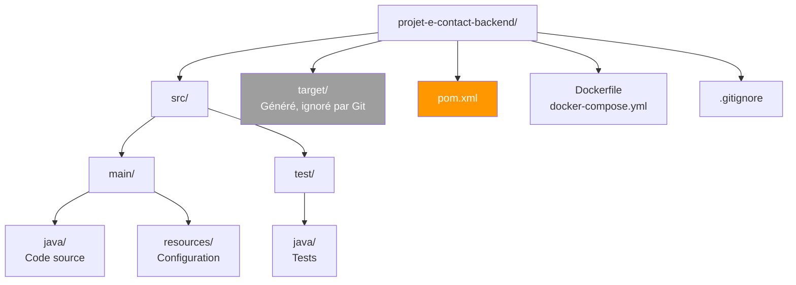
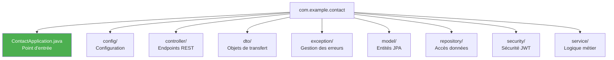
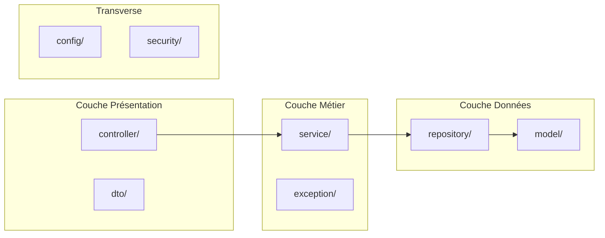
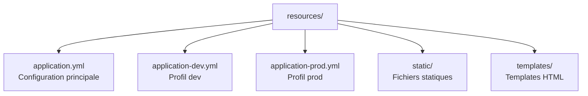
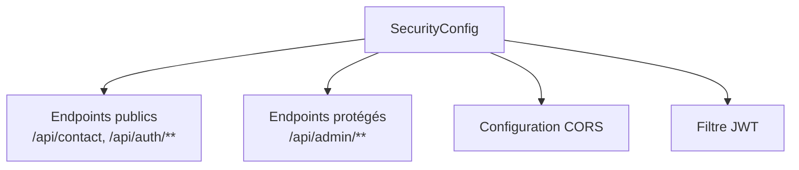
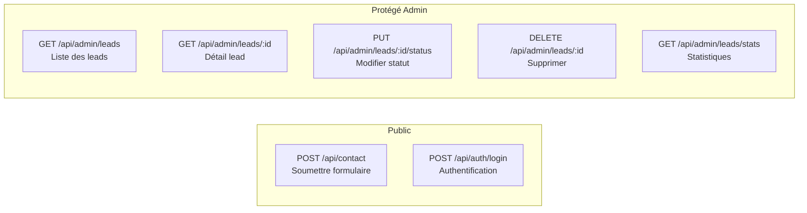
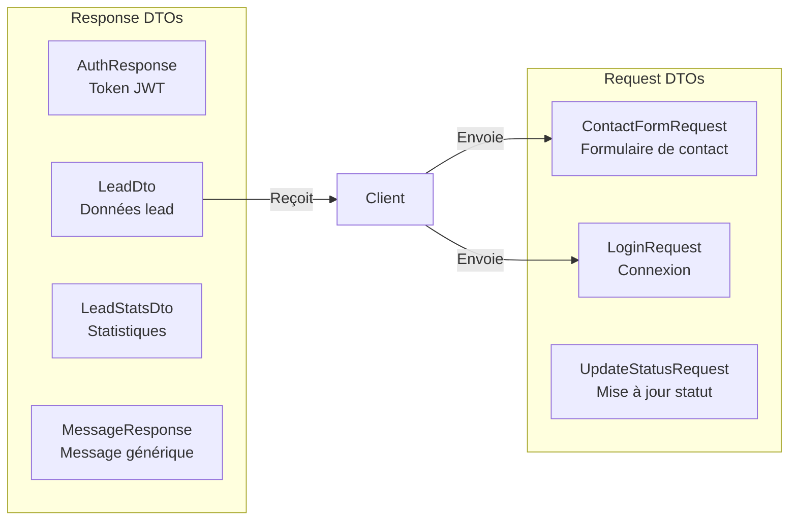
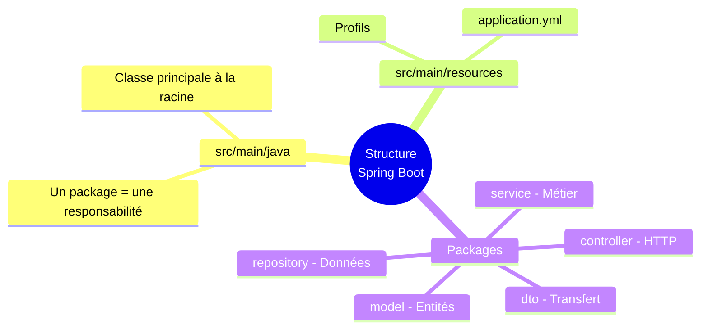

# Chapitre 1.4 - Structure d'un projet Spring Boot

## Objectifs du chapitre

- Connaître l'organisation standard d'un projet Spring Boot
- Comprendre le rôle de chaque dossier et fichier
- Naviguer efficacement dans le code source

---

## 1. Vue d'ensemble

### Diagramme de la structure



### Structure complète

```
projet-e-contact-backend/
│
├── src/
│   ├── main/
│   │   ├── java/                    # Code source Java
│   │   └── resources/               # Configuration et ressources
│   └── test/
│       └── java/                    # Tests
│
├── target/                          # Build (généré, ignoré par Git)
│
├── pom.xml                          # Dépendances Maven
├── Dockerfile                       # Image Docker
├── docker-compose.yml               # Orchestration Docker
├── README.md                        # Documentation
└── .gitignore                       # Fichiers ignorés par Git
```

---

## 2. Le code source (src/main/java)

### Organisation par packages



### Structure détaillée par packages

```
com.example.contact/
│
├── ContactApplication.java          # Point d'entrée
│
├── config/                          # Configuration
│   ├── DataInitializer.java
│   ├── OpenApiConfig.java
│   ├── SecurityConfig.java
│   └── UserDetailsConfig.java
│
├── controller/                      # Endpoints REST
│   ├── AuthController.java
│   ├── ContactController.java
│   └── LeadController.java
│
├── dto/                             # Data Transfer Objects
│   ├── request/
│   │   ├── ContactFormRequest.java
│   │   ├── LoginRequest.java
│   │   └── UpdateStatusRequest.java
│   └── response/
│       ├── AuthResponse.java
│       ├── LeadDto.java
│       ├── LeadStatsDto.java
│       └── MessageResponse.java
│
├── exception/                       # Gestion des erreurs
│   ├── GlobalExceptionHandler.java
│   └── ResourceNotFoundException.java
│
├── model/                           # Entités JPA
│   ├── Lead.java
│   └── User.java
│
├── repository/                      # Accès données
│   ├── LeadRepository.java
│   └── UserRepository.java
│
├── security/                        # Sécurité JWT
│   ├── JwtAuthFilter.java
│   └── JwtService.java
│
└── service/                         # Logique métier
    ├── EmailService.java
    └── LeadService.java
```

### Rôle de chaque package



| Package | Responsabilité | Annotations typiques |
|---------|---------------|---------------------|
| **config** | Configuration Spring | @Configuration |
| **controller** | Endpoints HTTP | @RestController |
| **dto** | Objets de transfert | @Data (Lombok) |
| **exception** | Gestion des erreurs | @ControllerAdvice |
| **model** | Entités base de données | @Entity |
| **repository** | Accès aux données | @Repository |
| **security** | Authentification JWT | @Component |
| **service** | Logique métier | @Service |

---

## 3. Les ressources (src/main/resources)

### Structure



```
resources/
│
├── application.yml                  # Configuration principale
├── application-dev.yml              # Config profil dev (optionnel)
├── application-prod.yml             # Config profil prod (optionnel)
│
├── static/                          # Fichiers statiques (CSS, JS, images)
└── templates/                       # Templates (Thymeleaf, si utilisé)
```

### Exemple de application.yml

```yaml
spring:
  application:
    name: contact-api
  
  datasource:
    url: jdbc:h2:mem:testdb
    
  jpa:
    hibernate:
      ddl-auto: create-drop
      
  mail:
    host: localhost
    port: 1025

server:
  port: 8080

app:
  jwt:
    secret: ma-cle-secrete
    expiration: 86400000
```

---

## 4. Classe principale

### ContactApplication.java

```java
package com.example.contact;

import org.springframework.boot.SpringApplication;
import org.springframework.boot.autoconfigure.SpringBootApplication;
import org.springframework.scheduling.annotation.EnableAsync;
import org.springframework.scheduling.annotation.EnableScheduling;

@SpringBootApplication
@EnableAsync           // Active les méthodes asynchrones
@EnableScheduling      // Active les tâches planifiées
public class ContactApplication {
    public static void main(String[] args) {
        SpringApplication.run(ContactApplication.class, args);
    }
}
```

### Diagramme : Rôle des annotations

```mermaid
graph TB
    APP[@SpringBootApplication] --> CONF[@Configuration<br/>Classe de configuration]
    APP --> AUTO[@EnableAutoConfiguration<br/>Auto-configuration]
    APP --> SCAN[@ComponentScan<br/>Scan des composants]
    
    ASYNC[@EnableAsync] --> ASYNC1[Permet @Async<br/>Exécution en arrière-plan]
    SCHED[@EnableScheduling] --> SCHED1[Permet @Scheduled<br/>Tâches planifiées]
```

### Points importants

1. **@SpringBootApplication** : Combine @Configuration, @EnableAutoConfiguration, @ComponentScan
2. **Package racine** : Tous les composants doivent être dans ce package ou un sous-package
3. **@EnableAsync** : Permet l'envoi d'emails en arrière-plan

---

## 5. Configuration (package config)

### SecurityConfig.java

Configure Spring Security :
- Endpoints publics vs protégés
- CORS
- Authentification JWT



### OpenApiConfig.java

Configure Swagger/OpenAPI :
- Titre et description de l'API
- Informations de contact
- Configuration de l'authentification

### DataInitializer.java

Initialise les données au démarrage :
- Crée un utilisateur admin par défaut
- S'exécute une seule fois

### UserDetailsConfig.java

Configure le service de chargement des utilisateurs pour Spring Security.

---

## 6. Controllers (package controller)

### Vue d'ensemble des endpoints



### ContactController.java

```java
@RestController
@RequestMapping("/api/contact")
public class ContactController {
    
    @PostMapping
    public ResponseEntity<?> submitContact(@RequestBody @Valid ContactFormRequest request) {
        // ...
    }
}
```

Endpoint public pour soumettre le formulaire.

### AuthController.java

```java
@RestController
@RequestMapping("/api/auth")
public class AuthController {
    
    @PostMapping("/login")
    public ResponseEntity<?> login(@RequestBody @Valid LoginRequest request) {
        // ...
    }
}
```

Endpoint pour l'authentification.

### LeadController.java

```java
@RestController
@RequestMapping("/api/admin/leads")
@PreAuthorize("hasRole('ADMIN')")
public class LeadController {
    
    @GetMapping
    public Page<LeadDto> getAllLeads(Pageable pageable) {
        // ...
    }
}
```

Endpoints protégés pour la gestion des leads.

---

## 7. DTOs (package dto)

### Séparation Request / Response



### Request DTOs

Objets reçus du client :

```java
// ContactFormRequest.java
@Data
public class ContactFormRequest {
    @NotBlank
    private String fullName;
    
    @Email
    private String email;
    
    private String company;
    private String phone;
    
    @NotNull
    private RequestType requestType;
    
    @NotBlank
    private String message;
}
```

### Response DTOs

Objets envoyés au client :

```java
// LeadDto.java
@Data
public class LeadDto {
    private Long id;
    private String fullName;
    private String email;
    private String company;
    private String phone;
    private RequestType requestType;
    private String message;
    private LeadStatus status;
    private LocalDateTime createdAt;
}
```

---

## 8. Model (package model)

### Diagramme des entités

```mermaid
erDiagram
    LEAD {
        Long id PK
        String fullName
        String email
        String company
        String phone
        RequestType requestType
        String message
        LeadStatus status
        LocalDateTime createdAt
    }
    
    USER {
        Long id PK
        String email UK
        String password
        Role role
    }
    
    LEAD_STATUS {
        NEW
        CONTACTED
        CONVERTED
        LOST
    }
    
    REQUEST_TYPE {
        INFO
        DEMO
        SUPPORT
        PARTNERSHIP
        OTHER
    }
```

### Lead.java

```java
@Entity
@Table(name = "leads")
@Data
public class Lead {
    @Id
    @GeneratedValue(strategy = GenerationType.IDENTITY)
    private Long id;
    
    @Column(nullable = false)
    private String fullName;
    
    @Column(nullable = false)
    private String email;
    
    // ...
}
```

### User.java

```java
@Entity
@Table(name = "users")
@Data
public class User implements UserDetails {
    @Id
    @GeneratedValue(strategy = GenerationType.IDENTITY)
    private Long id;
    
    @Column(unique = true, nullable = false)
    private String email;
    
    @Column(nullable = false)
    private String password;
    
    // ...
}
```

---

## 9. Repository (package repository)

```java
// LeadRepository.java
@Repository
public interface LeadRepository extends JpaRepository<Lead, Long> {
    long countByStatus(LeadStatus status);
}

// UserRepository.java
@Repository
public interface UserRepository extends JpaRepository<User, Long> {
    Optional<User> findByEmail(String email);
}
```

---

## 10. Service (package service)

```java
// LeadService.java
@Service
@RequiredArgsConstructor
public class LeadService {
    private final LeadRepository leadRepository;
    private final EmailService emailService;
    
    public LeadDto createLead(ContactFormRequest request) {
        // Logique métier
    }
}
```

---

## 11. Points clés à retenir



1. **Un package = une responsabilité**
2. **La classe principale** doit être à la racine des packages
3. **application.yml** centralise la configuration
4. **Les DTOs** séparent l'API des entités internes
5. **Les conventions** permettent l'auto-configuration

---

## QUIZ 1.4 - Structure du projet

**1. Où se trouve le code source Java?**
- a) src/java
- b) src/main/java
- c) java/src
- d) main/java

<details>
<summary>Voir la réponse</summary>

**Réponse : b) src/main/java**

C'est la convention Maven standard. Le code source principal est dans src/main/java, les tests dans src/test/java.
</details>

---

**2. Quel package contient les entités JPA?**
- a) entity
- b) domain
- c) model
- d) persistence

<details>
<summary>Voir la réponse</summary>

**Réponse : c) model**

Dans notre projet, les entités JPA (Lead, User) sont dans le package `model`. D'autres conventions utilisent `entity` ou `domain`, mais `model` est courant.
</details>

---

**3. Où est le fichier application.yml?**
- a) src/main/java
- b) src/main/resources
- c) config/
- d) À la racine du projet

<details>
<summary>Voir la réponse</summary>

**Réponse : b) src/main/resources**

Les fichiers de configuration et ressources sont dans src/main/resources. Ce dossier est inclus dans le classpath de l'application.
</details>

---

**4. Quel package contient la logique métier?**
- a) controller
- b) repository
- c) service
- d) business

<details>
<summary>Voir la réponse</summary>

**Réponse : c) service**

Le package `service` contient les classes avec l'annotation @Service qui implémentent la logique métier de l'application.
</details>

---

**5. VRAI ou FAUX : Les DTOs doivent avoir les mêmes champs que les entités.**

<details>
<summary>Voir la réponse</summary>

**Réponse : FAUX**

Les DTOs peuvent avoir des champs différents. Par exemple, un Response DTO n'inclura jamais le mot de passe, et un Request DTO n'aura pas l'id ni createdAt qui sont générés automatiquement.
</details>

---

**6. Quelle annotation marque une classe de configuration?**
- a) @Config
- b) @Settings
- c) @Configuration
- d) @Setup

<details>
<summary>Voir la réponse</summary>

**Réponse : c) @Configuration**

Cette annotation indique à Spring que la classe contient des définitions de beans et de la configuration.
</details>

---

**7. Quel dossier est généré par Maven et ignoré par Git?**
- a) src/
- b) build/
- c) target/
- d) out/

<details>
<summary>Voir la réponse</summary>

**Réponse : c) target/**

Le dossier target/ contient les fichiers compilés et le JAR. Il est recréé à chaque build et doit figurer dans .gitignore.
</details>

---

**8. Complétez : Un _______ définit l'interface pour accéder aux données.**

<details>
<summary>Voir la réponse</summary>

**Réponse : Repository**

Les Repository sont des interfaces qui étendent JpaRepository et définissent les méthodes d'accès aux données. Spring génère automatiquement l'implémentation.
</details>

---

**9. Pourquoi séparer request et response dans les DTOs?**
- a) Pour la sécurité
- b) Pour éviter d'exposer des champs sensibles
- c) Pour permettre des validations différentes
- d) Toutes les réponses ci-dessus

<details>
<summary>Voir la réponse</summary>

**Réponse : d) Toutes les réponses ci-dessus**

La séparation permet de :
- Ne pas exposer les champs sensibles (password)
- Valider uniquement les données entrantes
- Avoir des structures différentes (l'id n'est pas dans la request)
</details>

---

**10. Quelle classe doit être à la racine du package principal?**
- a) MainController
- b) Application (classe avec @SpringBootApplication)
- c) Config
- d) Bootstrap

<details>
<summary>Voir la réponse</summary>

**Réponse : b) Application (classe avec @SpringBootApplication)**

La classe principale avec @SpringBootApplication doit être à la racine du package pour que le @ComponentScan trouve tous les composants dans les sous-packages.
</details>

---

## Navigation

| Précédent | Suivant |
|-----------|---------|
| [03 - Maven et dépendances](03-maven-dependances.md) | [05 - Architecture en couches](05-architecture-couches.md) |
