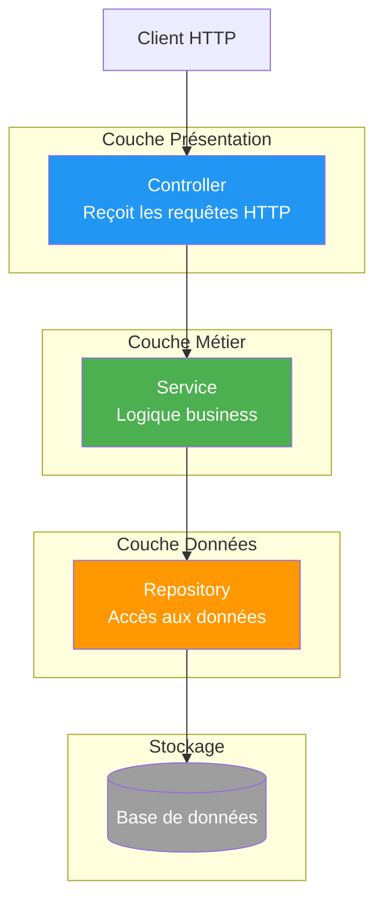
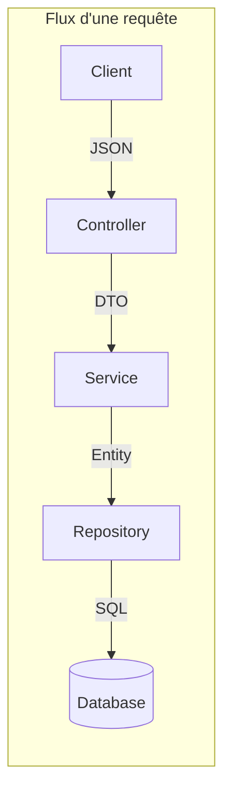
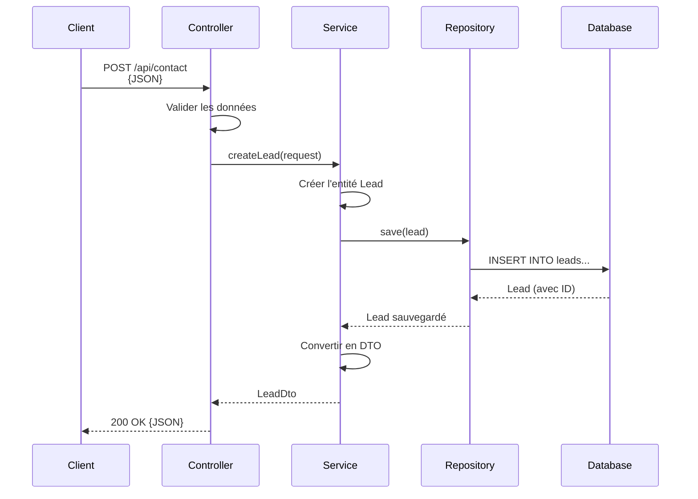
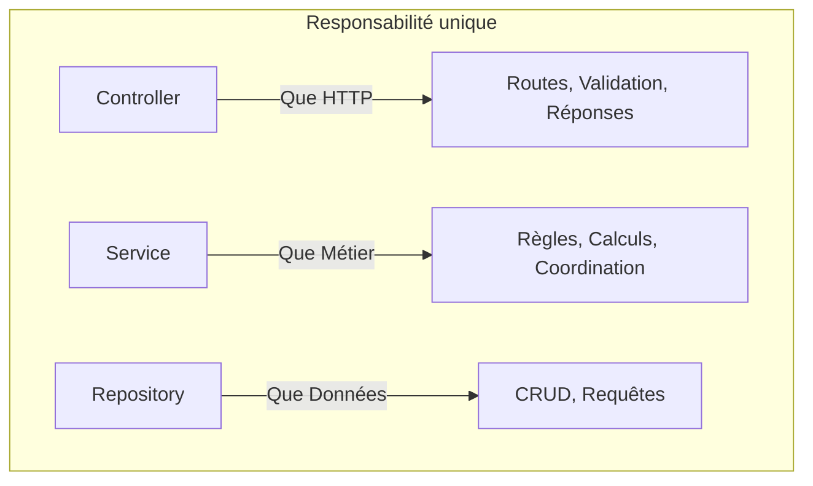
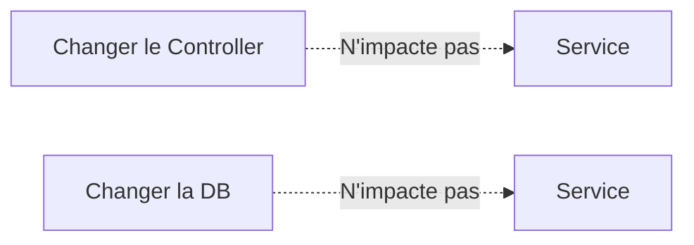
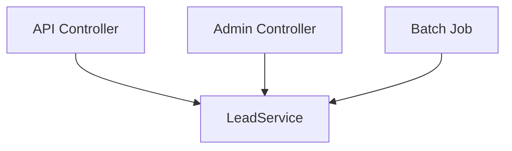
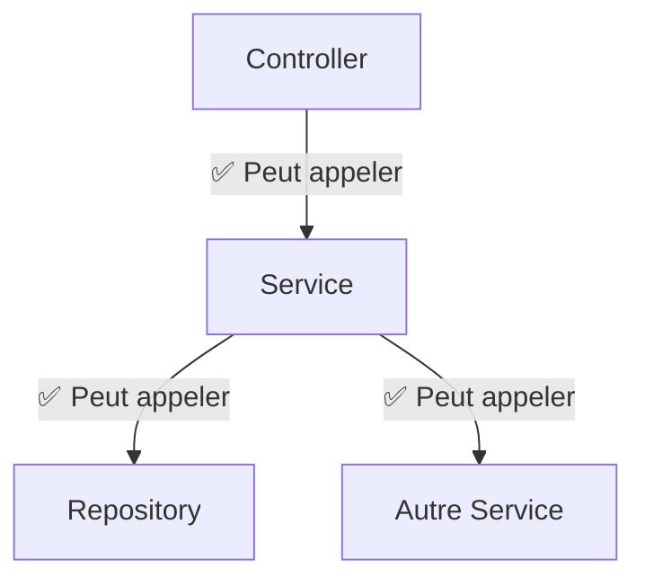
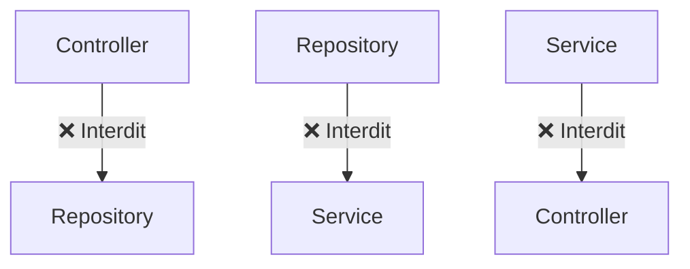
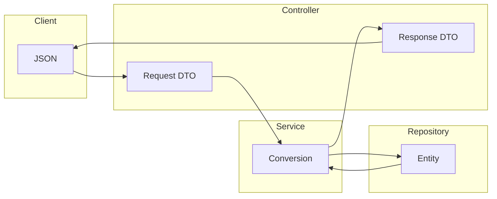
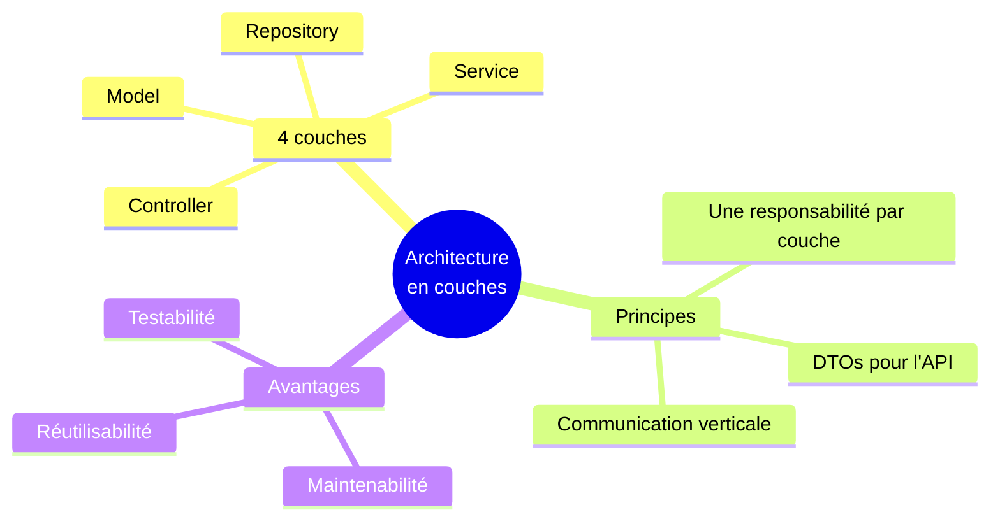

# Chapitre 2.1 - Architecture n-tiers (Layered Architecture)

## Objectifs du chapitre

- Comprendre l'architecture en couches
- Connaître les responsabilités de chaque couche
- Savoir pourquoi cette séparation est importante

---

## 1. Qu'est-ce que l'architecture en couches?

### Définition

L'architecture en couches (ou **n-tiers**) organise le code en **niveaux distincts**, chacun ayant une responsabilité spécifique. Cette approche est un pilier fondamental du développement logiciel moderne.

> **Principe fondamental** : Chaque couche ne communique qu'avec la couche adjacente.

### Diagramme de l'architecture



### Pourquoi cette architecture?

L'architecture en couches permet de :

1. **Séparer les préoccupations** : Chaque couche a un rôle précis
2. **Faciliter la maintenance** : Modifier une couche sans impacter les autres
3. **Améliorer la testabilité** : Tester chaque couche indépendamment
4. **Favoriser la réutilisation** : Un service peut être utilisé par plusieurs controllers

---

## 2. Les 4 couches principales

### Vue d'ensemble



### 2.1 Couche Présentation (Controller)

**Rôle** : Recevoir les requêtes HTTP et renvoyer les réponses.

```java
@RestController
@RequestMapping("/api/contact")
public class ContactController {
    
    private final LeadService leadService;
    
    @PostMapping
    public ResponseEntity<LeadDto> submit(@RequestBody @Valid ContactFormRequest request) {
        LeadDto lead = leadService.createLead(request);
        return ResponseEntity.ok(lead);
    }
}
```

**Responsabilités** :
- ✅ Valider les données d'entrée
- ✅ Appeler le service approprié
- ✅ Formater la réponse HTTP
- ✅ Gérer les codes de statut

**Ne fait PAS** :
- ❌ Logique métier
- ❌ Accès direct à la base de données

---

### 2.2 Couche Métier (Service)

**Rôle** : Contenir la logique métier de l'application.

```java
@Service
@RequiredArgsConstructor
public class LeadService {
    
    private final LeadRepository leadRepository;
    private final EmailService emailService;
    
    public LeadDto createLead(ContactFormRequest request) {
        // 1. Créer l'entité
        Lead lead = new Lead();
        lead.setFullName(request.getFullName());
        lead.setEmail(request.getEmail());
        // ...
        
        // 2. Sauvegarder
        Lead saved = leadRepository.save(lead);
        
        // 3. Envoyer les notifications
        emailService.sendAdminNotification(saved);
        emailService.sendConfirmation(saved);
        
        // 4. Convertir en DTO
        return mapToDto(saved);
    }
}
```

**Responsabilités** :
- ✅ Implémenter les règles métier
- ✅ Coordonner les opérations
- ✅ Appeler les repositories
- ✅ Gérer les transactions

**Ne fait PAS** :
- ❌ Gérer les requêtes HTTP
- ❌ Connaître les détails de la base de données

---

### 2.3 Couche Données (Repository)

**Rôle** : Abstraire l'accès à la base de données.

```java
@Repository
public interface LeadRepository extends JpaRepository<Lead, Long> {
    
    // Méthodes héritées: save(), findById(), findAll(), delete()...
    
    // Méthodes personnalisées
    List<Lead> findByStatus(LeadStatus status);
    long countByStatus(LeadStatus status);
}
```

**Responsabilités** :
- ✅ Opérations CRUD
- ✅ Requêtes personnalisées
- ✅ Abstraction du stockage

**Ne fait PAS** :
- ❌ Logique métier
- ❌ Gestion des requêtes HTTP

---

### 2.4 Couche Model (Entités)

**Rôle** : Représenter les données de l'application.

```java
@Entity
@Table(name = "leads")
@Data
public class Lead {
    
    @Id
    @GeneratedValue(strategy = GenerationType.IDENTITY)
    private Long id;
    
    @Column(nullable = false)
    private String fullName;
    
    @Column(nullable = false)
    private String email;
    
    @Enumerated(EnumType.STRING)
    private LeadStatus status = LeadStatus.NEW;
    
    private LocalDateTime createdAt = LocalDateTime.now();
}
```

**Responsabilités** :
- ✅ Mapper les tables de la base
- ✅ Définir les contraintes
- ✅ Représenter le domaine

---

## 3. Flux d'une requête

### Diagramme de séquence



### Exemple concret : Soumission d'un formulaire

```
1. Client envoie POST /api/contact avec JSON
2. ContactController reçoit la requête
   - Valide les données (@Valid)
   - Appelle leadService.createLead()
3. LeadService traite la demande
   - Crée l'entité Lead
   - Sauvegarde via repository
   - Envoie les emails
   - Convertit en DTO
4. Controller renvoie 200 OK avec le DTO
```

---

## 4. Avantages de cette architecture

### 4.1 Séparation des préoccupations



Chaque couche a une responsabilité unique et bien définie.

### 4.2 Testabilité

```java
// On peut tester le service en mockant le repository
@Test
void createLead_shouldSaveAndReturnDto() {
    // Arrange
    when(leadRepository.save(any())).thenReturn(mockLead);
    
    // Act
    LeadDto result = leadService.createLead(request);
    
    // Assert
    assertNotNull(result);
    verify(leadRepository).save(any());
}
```

### 4.3 Maintenabilité

Modifier une couche n'impacte pas les autres (si l'interface est préservée).



### 4.4 Réutilisabilité

Un service peut être utilisé par plusieurs controllers.



### 4.5 Scalabilité

Les couches peuvent être déployées séparément si nécessaire (microservices).

---

## 5. Règles à respecter

### Ce qui est permis



| Couche | Peut appeler |
|--------|--------------|
| Controller | Service |
| Service | Repository, autres Services |
| Repository | (Rien, utilise JPA) |

### Ce qui est interdit



| Couche | Ne doit PAS appeler |
|--------|---------------------|
| Controller | Repository (directement) |
| Service | Controller |
| Repository | Service |

### Mauvaise pratique

```java
// ❌ MAUVAIS: Controller appelle directement le Repository
@RestController
public class BadController {
    
    @Autowired
    private LeadRepository repository; // NON!
    
    @GetMapping("/leads")
    public List<Lead> getLeads() {
        return repository.findAll(); // Pas de logique métier!
    }
}
```

### Bonne pratique

```java
// ✅ BON: Controller passe par le Service
@RestController
public class GoodController {
    
    private final LeadService service;
    
    @GetMapping("/leads")
    public List<LeadDto> getLeads() {
        return service.getAllLeads(); // Le service gère la logique
    }
}
```

---

## 6. DTOs et séparation des couches

### Flux des objets



### Pourquoi utiliser des DTOs?

1. **Sécurité** : Ne pas exposer les champs sensibles (password)
2. **Flexibilité** : L'API peut évoluer indépendamment de la base
3. **Performance** : Ne transférer que les champs nécessaires

### Exemple

```java
// ❌ Entité (interne) - NE PAS EXPOSER
@Entity
public class User {
    private Long id;
    private String email;
    private String password;    // Sensible!
    private String role;
}

// ✅ DTO (externe) - SÉCURISÉ
public class UserDto {
    private Long id;
    private String email;
    private String role;
    // Pas de password!
}
```

---

## 7. Points clés à retenir



1. **4 couches** : Controller, Service, Repository, Model
2. **Communication verticale** : Chaque couche n'appelle que la suivante
3. **Séparation des responsabilités** : Une couche = un rôle
4. **DTOs** : Séparent l'API des entités internes
5. **Testabilité** : Les couches peuvent être testées indépendamment

---

## QUIZ 2.1 - Architecture en couches

**1. Combien de couches principales dans une architecture Spring Boot typique?**
- a) 2
- b) 3
- c) 4
- d) 5

<details>
<summary>Voir la réponse</summary>

**Réponse : c) 4**

Les 4 couches sont : Controller (présentation), Service (métier), Repository (données), Model (entités).
</details>

---

**2. Quelle couche contient la logique métier?**
- a) Controller
- b) Repository
- c) Service
- d) Model

<details>
<summary>Voir la réponse</summary>

**Réponse : c) Service**

La couche Service contient toute la logique métier : règles business, calculs, coordination des opérations, gestion des transactions.
</details>

---

**3. Quelle couche reçoit les requêtes HTTP?**
- a) Service
- b) Controller
- c) Repository
- d) Model

<details>
<summary>Voir la réponse</summary>

**Réponse : b) Controller**

Le Controller (couche présentation) reçoit les requêtes HTTP, valide les données d'entrée, et délègue au Service.
</details>

---

**4. VRAI ou FAUX : Un Controller peut appeler directement un Repository.**

<details>
<summary>Voir la réponse</summary>

**Réponse : VRAI (mais c'est une mauvaise pratique)**

Techniquement possible, mais cela viole le principe de séparation des couches. Le Controller devrait toujours passer par le Service pour bénéficier de la logique métier, des transactions, etc.
</details>

---

**5. Quelle couche communique avec la base de données?**
- a) Controller
- b) Service
- c) Repository
- d) Model

<details>
<summary>Voir la réponse</summary>

**Réponse : c) Repository**

Le Repository abstrait l'accès aux données. Il traduit les appels Java en requêtes SQL via JPA/Hibernate.
</details>

---

**6. Pourquoi utiliser des DTOs?**
- a) Pour cacher les champs sensibles
- b) Pour permettre l'évolution indépendante de l'API
- c) Pour améliorer les performances
- d) Toutes les réponses ci-dessus

<details>
<summary>Voir la réponse</summary>

**Réponse : d) Toutes les réponses ci-dessus**

Les DTOs permettent de :
- Masquer les champs sensibles (password)
- Faire évoluer l'API sans modifier les entités
- Transférer uniquement les champs nécessaires
</details>

---

**7. Dans quel ordre les couches sont-elles traversées lors d'une requête?**
- a) Controller -> Service -> Repository
- b) Repository -> Service -> Controller
- c) Service -> Controller -> Repository
- d) Model -> Repository -> Service

<details>
<summary>Voir la réponse</summary>

**Réponse : a) Controller -> Service -> Repository**

Le flux va du client vers la base : Controller reçoit la requête, Service traite la logique, Repository accède aux données.
</details>

---

**8. Complétez : Chaque couche n'appelle que la couche _______.**

<details>
<summary>Voir la réponse</summary>

**Réponse : adjacente (ou suivante)**

C'est le principe de communication verticale : Controller → Service → Repository. Pas de saut de couche!
</details>

---

**9. Quel est l'avantage principal de cette architecture pour les tests?**
- a) Plus rapide
- b) On peut mocker les dépendances
- c) Moins de code
- d) Pas besoin de tests

<details>
<summary>Voir la réponse</summary>

**Réponse : b) On peut mocker les dépendances**

Grâce à la séparation, on peut tester le Service en mockant le Repository, tester le Controller en mockant le Service, etc.
</details>

---

**10. Quelle annotation marque un service?**
- a) @Controller
- b) @Repository
- c) @Service
- d) @Component

<details>
<summary>Voir la réponse</summary>

**Réponse : c) @Service**

@Service est le stéréotype Spring pour la couche métier. Les autres sont : @Controller/@RestController pour la présentation, @Repository pour les données.
</details>

---

## Navigation

| Précédent | Suivant |
|-----------|---------|
| [04 - Structure du projet](04-structure-projet.md) | [06 - Couche Model](06-couche-model.md) |
