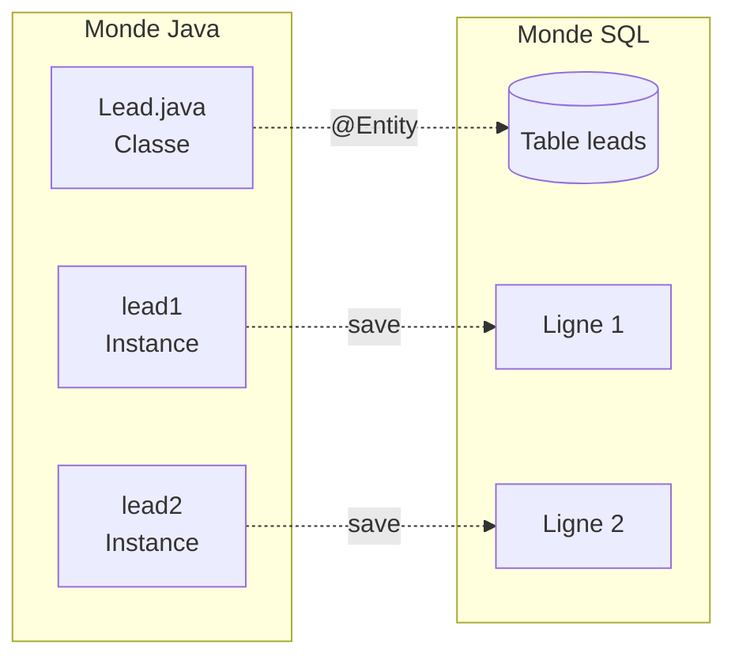
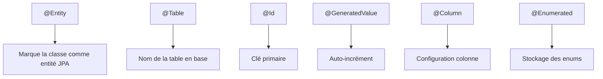
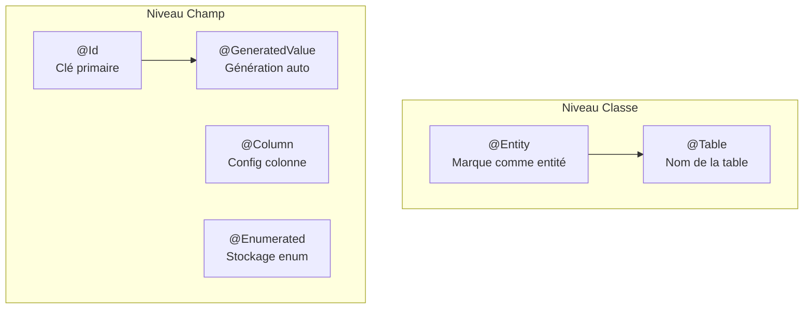
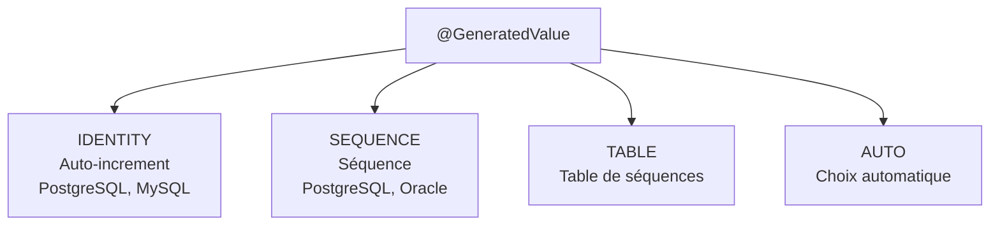
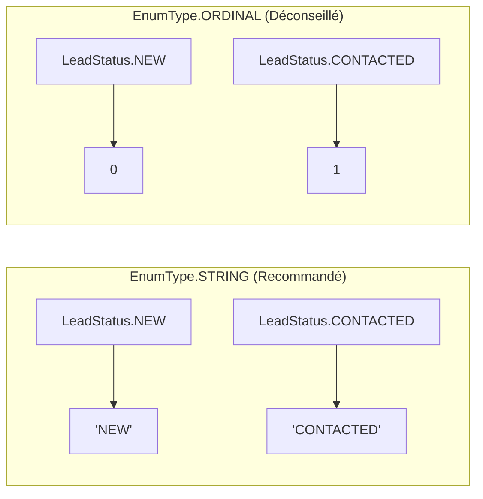
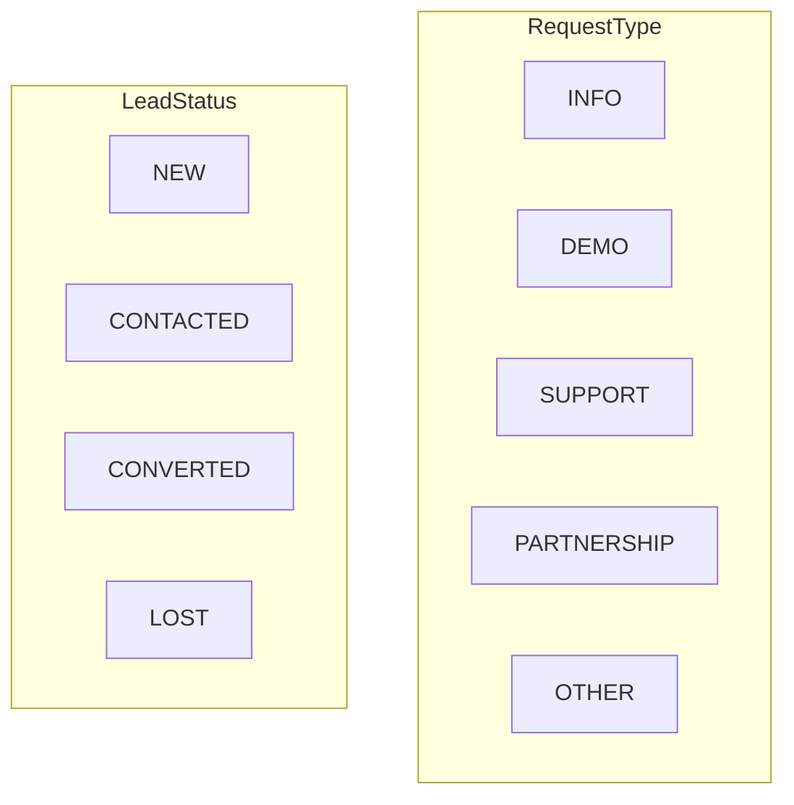
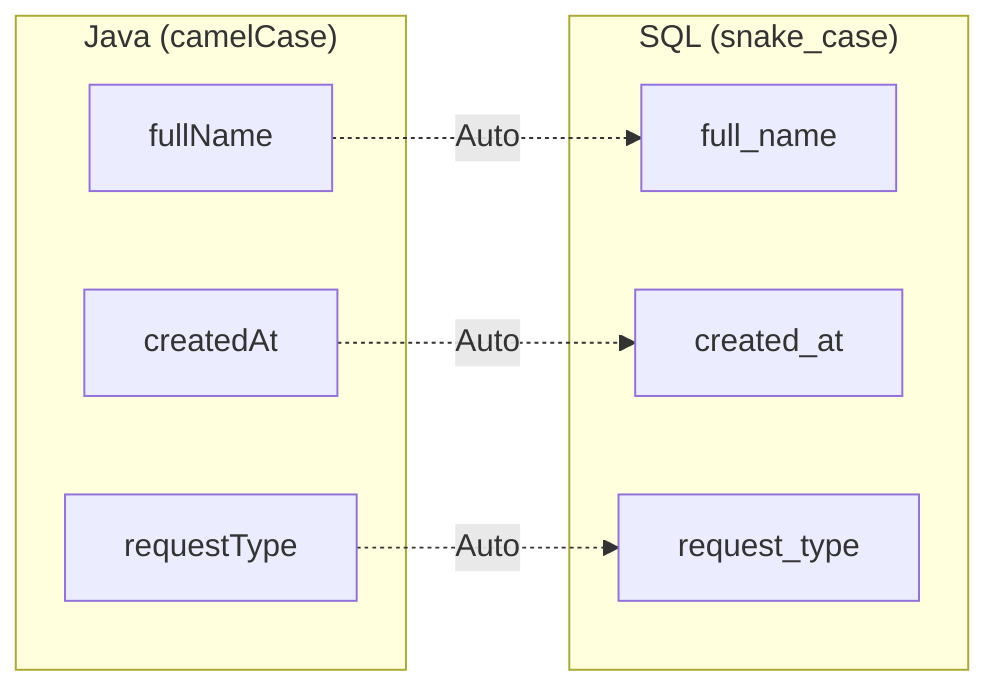
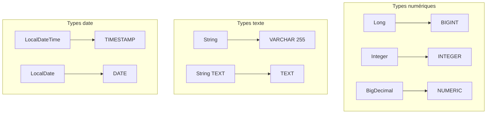
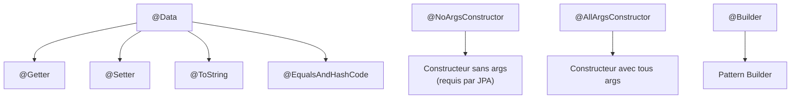
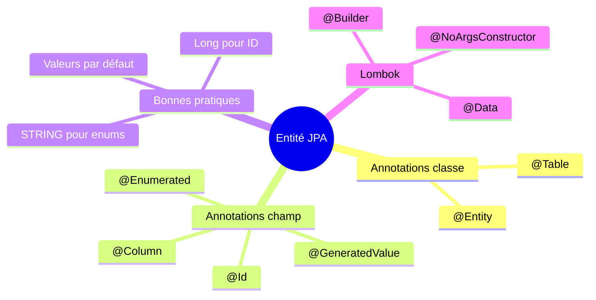

# Chapitre 2.2 - Couche Model (Entités JPA)

## Objectifs du chapitre

- Créer des entités JPA
- Utiliser les annotations de mapping
- Comprendre les relations entre entités

---

## 1. Qu'est-ce qu'une entité?

### Définition

Une **entité** est une classe Java qui représente une table de la base de données. Chaque instance de la classe correspond à une ligne de la table.

> **Analogie** : Une entité est le "plan" d'une table. Chaque objet créé à partir de ce plan devient une ligne dans la table.

### Mapping Objet-Relationnel (ORM)



```
Classe Java (Entité)     <---->     Table SQL
--------------------------------   --------------------------------
Lead.java                          leads
  - Long id                          - id BIGINT PRIMARY KEY
  - String fullName                  - full_name VARCHAR(255)
  - String email                     - email VARCHAR(255)
```

---

## 2. Anatomie d'une entité

### Structure générale



### Exemple complet : Lead.java

```java
package com.example.contact.model;

import jakarta.persistence.*;
import lombok.Data;
import lombok.NoArgsConstructor;
import lombok.AllArgsConstructor;
import java.time.LocalDateTime;

@Entity                              // 1. Marque la classe comme entité
@Table(name = "leads")               // 2. Nom de la table
@Data                                // 3. Lombok: getters, setters, etc.
@NoArgsConstructor
@AllArgsConstructor
public class Lead {

    @Id                              // 4. Clé primaire
    @GeneratedValue(strategy = GenerationType.IDENTITY)  // 5. Auto-increment
    private Long id;

    @Column(nullable = false)        // 6. Colonne NOT NULL
    private String fullName;

    @Column(nullable = false)
    private String email;

    private String company;          // 7. Colonne nullable par défaut

    private String phone;

    @Enumerated(EnumType.STRING)     // 8. Enum stocké comme texte
    @Column(nullable = false)
    private RequestType requestType;

    @Column(columnDefinition = "TEXT")  // 9. Type TEXT pour longs textes
    private String message;

    @Enumerated(EnumType.STRING)
    private LeadStatus status = LeadStatus.NEW;  // 10. Valeur par défaut

    private LocalDateTime createdAt = LocalDateTime.now();
    
    private LocalDateTime updatedAt;
}
```

---

## 3. Annotations essentielles

### Diagramme des annotations



### 3.1 @Entity

Indique que la classe est une entité JPA.

```java
@Entity
public class Lead {
    // ...
}
```

### 3.2 @Table

Spécifie le nom de la table (optionnel si nom = classe).

```java
@Table(name = "leads")
// ou avec schéma
@Table(name = "leads", schema = "public")
```

### 3.3 @Id

Marque le champ comme clé primaire.

```java
@Id
private Long id;
```

### 3.4 @GeneratedValue

Définit la stratégie de génération de l'ID.



| Stratégie | Description | Base de données |
|-----------|-------------|-----------------|
| IDENTITY | Auto-increment | PostgreSQL, MySQL |
| SEQUENCE | Séquence | PostgreSQL, Oracle |
| TABLE | Table de séquences | Toutes |
| AUTO | Choix automatique | Toutes |

```java
@Id
@GeneratedValue(strategy = GenerationType.IDENTITY)
private Long id;
```

### 3.5 @Column

Configure une colonne.

```java
@Column(
    name = "full_name",       // Nom de la colonne
    nullable = false,         // NOT NULL
    unique = true,            // UNIQUE
    length = 100,             // VARCHAR(100)
    columnDefinition = "TEXT" // Type exact
)
private String fullName;
```

### 3.6 @Enumerated

Stocke un enum dans la base.



```java
// ✅ Stocke "NEW", "CONTACTED", etc. (recommandé)
@Enumerated(EnumType.STRING)
private LeadStatus status;

// ❌ Stocke 0, 1, 2... (déconseillé)
@Enumerated(EnumType.ORDINAL)
private LeadStatus status;
```

> **Pourquoi STRING?** Si vous ajoutez un nouvel enum au milieu de la liste, ORDINAL casse les données existantes!

---

## 4. Les enums du projet

### Diagramme des enums



### RequestType.java

```java
public enum RequestType {
    INFO,        // Demande d'information
    DEMO,        // Demande de démo
    SUPPORT,     // Support technique
    PARTNERSHIP, // Partenariat
    OTHER        // Autre
}
```

### LeadStatus.java

```java
public enum LeadStatus {
    NEW,        // Nouveau lead
    CONTACTED,  // Contacté
    CONVERTED,  // Converti en client
    LOST        // Perdu
}
```

---

## 5. Entité User

### User.java

```java
@Entity
@Table(name = "users")
@Data
@NoArgsConstructor
@AllArgsConstructor
@Builder
public class User implements UserDetails {

    @Id
    @GeneratedValue(strategy = GenerationType.IDENTITY)
    private Long id;

    @Column(unique = true, nullable = false)
    private String email;

    @Column(nullable = false)
    private String password;

    @Enumerated(EnumType.STRING)
    private Role role = Role.ADMIN;

    // Implémentation de UserDetails pour Spring Security
    @Override
    public Collection<? extends GrantedAuthority> getAuthorities() {
        return List.of(new SimpleGrantedAuthority("ROLE_" + role.name()));
    }

    @Override
    public String getUsername() {
        return email;
    }

    @Override
    public boolean isAccountNonExpired() { return true; }
    
    @Override
    public boolean isAccountNonLocked() { return true; }
    
    @Override
    public boolean isCredentialsNonExpired() { return true; }
    
    @Override
    public boolean isEnabled() { return true; }
}
```

### Role.java

```java
public enum Role {
    ADMIN,
    USER
}
```

---

## 6. Conventions de nommage

### Java vs SQL



| Java (camelCase) | SQL (snake_case) |
|------------------|------------------|
| fullName | full_name |
| createdAt | created_at |
| requestType | request_type |

Spring Boot convertit automatiquement camelCase en snake_case.

### Configuration explicite

```java
// Si vous voulez un nom différent
@Column(name = "customer_full_name")
private String fullName;
```

---

## 7. Types de données

### Correspondance Java-SQL



| Java | SQL (PostgreSQL) |
|------|------------------|
| Long | BIGINT |
| Integer | INTEGER |
| String | VARCHAR(255) |
| String (TEXT) | TEXT |
| Boolean | BOOLEAN |
| LocalDateTime | TIMESTAMP |
| LocalDate | DATE |
| BigDecimal | NUMERIC |
| byte[] | BYTEA |

### Exemple avec types

```java
@Entity
public class Product {
    
    @Id
    @GeneratedValue(strategy = GenerationType.IDENTITY)
    private Long id;                    // BIGINT
    
    private String name;                // VARCHAR(255)
    
    @Column(columnDefinition = "TEXT")
    private String description;         // TEXT
    
    private BigDecimal price;           // NUMERIC
    
    private Integer quantity;           // INTEGER
    
    private Boolean active;             // BOOLEAN
    
    private LocalDate releaseDate;      // DATE
    
    private LocalDateTime createdAt;    // TIMESTAMP
}
```

---

## 8. Lombok et les entités

### Annotations Lombok utiles



```java
@Data           // @Getter + @Setter + @ToString + @EqualsAndHashCode
@NoArgsConstructor  // Constructeur sans arguments (requis par JPA)
@AllArgsConstructor // Constructeur avec tous les arguments
@Builder        // Pattern Builder pour créer des instances
```

### Utilisation du Builder

```java
Lead lead = Lead.builder()
    .fullName("Jean Dupont")
    .email("jean@example.com")
    .requestType(RequestType.INFO)
    .message("Je voudrais des informations")
    .build();
```

---

## 9. Bonnes pratiques

### 9.1 Toujours utiliser un wrapper pour l'ID

```java
// ✅ BON
private Long id;

// ❌ MAUVAIS
private long id;  // Ne peut pas être null
```

### 9.2 Initialiser les valeurs par défaut

```java
private LeadStatus status = LeadStatus.NEW;
private LocalDateTime createdAt = LocalDateTime.now();
```

### 9.3 Utiliser @Enumerated(EnumType.STRING)

```java
// ✅ BON: lisible en base, résistant aux changements
@Enumerated(EnumType.STRING)
private LeadStatus status;  // Stocke "NEW"

// ❌ MAUVAIS: fragile si l'ordre change
@Enumerated(EnumType.ORDINAL)
private LeadStatus status;  // Stocke 0
```

### 9.4 Constructeur sans argument

JPA nécessite un constructeur sans argument (Lombok @NoArgsConstructor le génère).

---

## 10. Points clés à retenir



1. **@Entity** marque une classe comme entité JPA
2. **@Id** + **@GeneratedValue** pour la clé primaire auto-incrémentée
3. **@Column** configure les propriétés de la colonne
4. **@Enumerated(EnumType.STRING)** pour stocker les enums en texte
5. **Lombok** réduit le code boilerplate

---

## QUIZ 2.2 - Couche Model

**1. Quelle annotation marque une classe comme entité JPA?**
- a) @Table
- b) @Entity
- c) @Model
- d) @Persistent

<details>
<summary>Voir la réponse</summary>

**Réponse : b) @Entity**

@Entity indique à JPA que cette classe doit être mappée vers une table de base de données. Sans cette annotation, la classe est une simple classe Java.
</details>

---

**2. Quelle annotation définit la clé primaire?**
- a) @PrimaryKey
- b) @Key
- c) @Id
- d) @Primary

<details>
<summary>Voir la réponse</summary>

**Réponse : c) @Id**

@Id marque le champ comme clé primaire de l'entité. Chaque entité doit avoir exactement un champ @Id.
</details>

---

**3. Quelle stratégie de génération utilise l'auto-increment?**
- a) AUTO
- b) SEQUENCE
- c) IDENTITY
- d) TABLE

<details>
<summary>Voir la réponse</summary>

**Réponse : c) IDENTITY**

IDENTITY utilise le mécanisme d'auto-increment natif de la base (SERIAL en PostgreSQL, AUTO_INCREMENT en MySQL).
</details>

---

**4. Comment stocker un enum de manière lisible en base?**
- a) @Enumerated(EnumType.ORDINAL)
- b) @Enumerated(EnumType.STRING)
- c) @Enum
- d) Sans annotation

<details>
<summary>Voir la réponse</summary>

**Réponse : b) @Enumerated(EnumType.STRING)**

STRING stocke le nom de l'enum ("NEW", "CONTACTED"), ce qui est lisible et résistant aux changements d'ordre dans l'enum. ORDINAL stocke l'index (0, 1, 2), ce qui est fragile.
</details>

---

**5. VRAI ou FAUX : Une entité doit avoir un constructeur sans argument.**

<details>
<summary>Voir la réponse</summary>

**Réponse : VRAI**

JPA/Hibernate a besoin d'un constructeur sans argument pour créer des instances via réflexion. Lombok @NoArgsConstructor le génère automatiquement.
</details>

---

**6. Quel type Java correspond à BIGINT en SQL?**
- a) int
- b) Integer
- c) Long
- d) BigInteger

<details>
<summary>Voir la réponse</summary>

**Réponse : c) Long**

Long (ou long) correspond à BIGINT. C'est le type recommandé pour les IDs car il offre une plage très large.
</details>

---

**7. Comment spécifier une colonne NOT NULL?**
- a) @NotNull
- b) @Column(nullable = false)
- c) @Required
- d) @Mandatory

<details>
<summary>Voir la réponse</summary>

**Réponse : b) @Column(nullable = false)**

nullable = false génère une contrainte NOT NULL dans la base. @NotNull est une annotation de validation, pas de mapping JPA.
</details>

---

**8. Complétez : Spring Boot convertit automatiquement _______ en snake_case.**

<details>
<summary>Voir la réponse</summary>

**Réponse : camelCase**

La stratégie de nommage par défaut de Spring Boot (ImplicitNamingStrategyJpaCompliantImpl) convertit automatiquement fullName en full_name.
</details>

---

**9. Quelle annotation Lombok génère getters, setters et toString?**
- a) @Getter
- b) @Setter
- c) @Data
- d) @AllArgsConstructor

<details>
<summary>Voir la réponse</summary>

**Réponse : c) @Data**

@Data est une méta-annotation qui combine @Getter, @Setter, @ToString, @EqualsAndHashCode, et @RequiredArgsConstructor.
</details>

---

**10. Pourquoi utiliser Long au lieu de long pour l'ID?**
- a) Plus performant
- b) Peut être null (avant sauvegarde)
- c) Requis par JPA
- d) b et c

<details>
<summary>Voir la réponse</summary>

**Réponse : d) b et c**

Long (wrapper) peut être null, ce qui est nécessaire avant la sauvegarde (l'ID est généré par la base). JPA requiert un type objet pour les IDs.
</details>

---

## Navigation

| Précédent | Suivant |
|-----------|---------|
| [05 - Architecture en couches](05-architecture-couches.md) | [07 - Couche Repository](07-couche-repository.md) |
