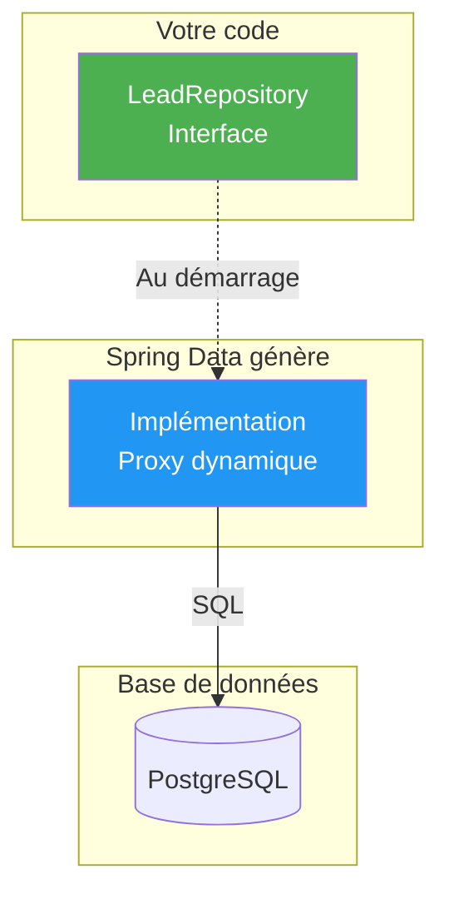
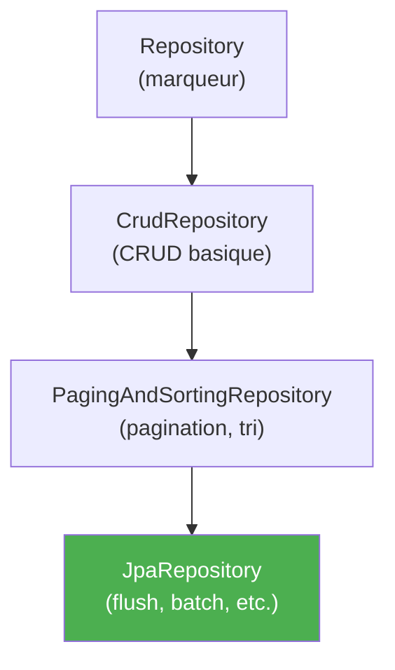
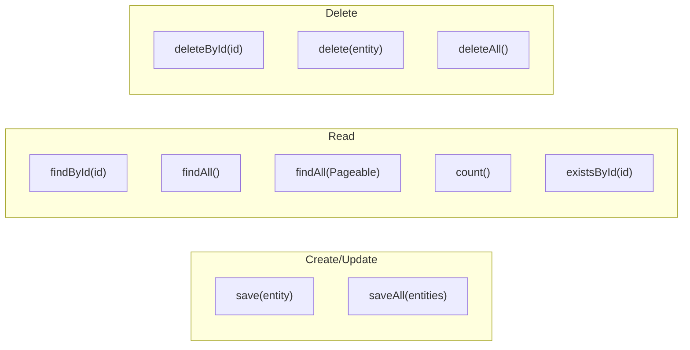
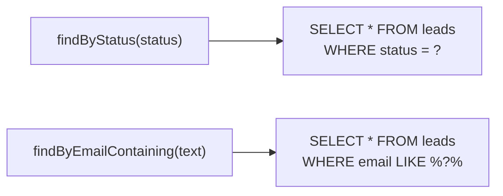
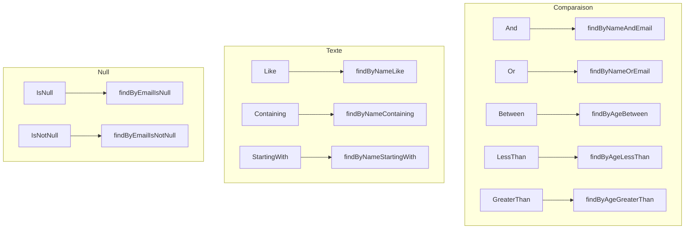
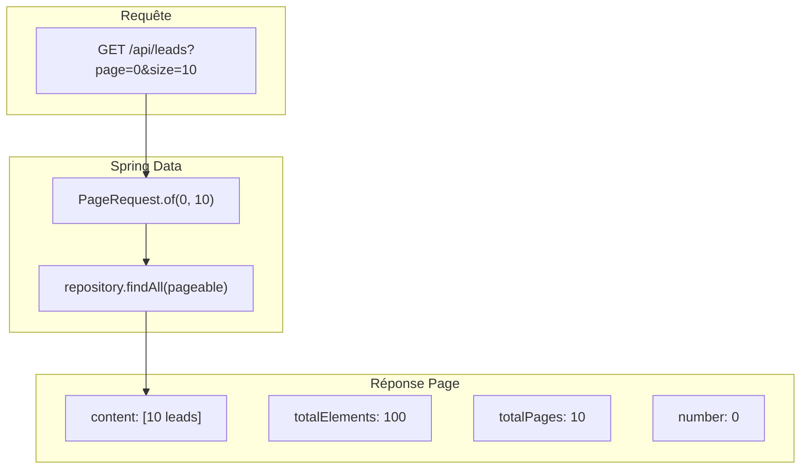
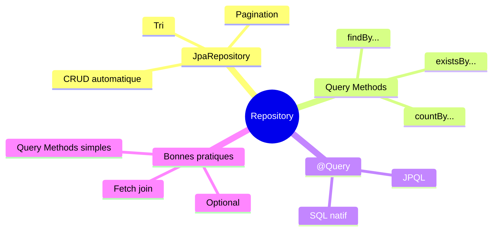

# Chapitre 2.3 - Couche Repository (Spring Data JPA)

## Objectifs du chapitre

- Créer des repositories avec Spring Data JPA
- Utiliser les méthodes CRUD automatiques
- Écrire des requêtes personnalisées

---

## 1. Qu'est-ce qu'un Repository?

### Définition

Un **Repository** est une interface qui abstrait l'accès aux données. Avec Spring Data JPA, il suffit de définir l'interface; Spring génère l'implémentation automatiquement.

> **Magie de Spring Data** : Vous écrivez une interface, Spring génère tout le code SQL!

### Diagramme conceptuel



### Avantages

1. **Pas de code SQL** pour les opérations basiques
2. **Méthodes générées** à partir du nom
3. **Typage fort** avec les generics

---

## 2. JpaRepository

### Hiérarchie des interfaces



### Déclaration

```java
@Repository
public interface LeadRepository extends JpaRepository<Lead, Long> {
    // Lead = type de l'entité
    // Long = type de la clé primaire
}
```

---

## 3. Méthodes héritées

### JpaRepository fournit automatiquement



| Méthode | Description | Retour |
|---------|-------------|--------|
| save(entity) | Crée ou met à jour | Entity |
| saveAll(entities) | Sauvegarde multiple | List |
| findById(id) | Trouve par ID | Optional |
| existsById(id) | Vérifie l'existence | boolean |
| findAll() | Liste tout | List |
| findAll(Pageable) | Liste avec pagination | Page |
| findAll(Sort) | Liste avec tri | List |
| count() | Compte les entités | long |
| deleteById(id) | Supprime par ID | void |
| delete(entity) | Supprime une entité | void |
| deleteAll() | Supprime tout | void |

### Exemples d'utilisation

```java
@Service
public class LeadService {
    
    private final LeadRepository repository;
    
    // Sauvegarder un lead
    public Lead create(Lead lead) {
        return repository.save(lead);
    }
    
    // Trouver par ID
    public Lead findById(Long id) {
        return repository.findById(id)
            .orElseThrow(() -> new ResourceNotFoundException("Lead not found"));
    }
    
    // Lister tous les leads
    public List<Lead> findAll() {
        return repository.findAll();
    }
    
    // Compter les leads
    public long count() {
        return repository.count();
    }
    
    // Supprimer un lead
    public void delete(Long id) {
        repository.deleteById(id);
    }
}
```

---

## 4. Query Methods (méthodes de requête)

### Principe

Spring Data génère les requêtes SQL à partir du nom de la méthode.



### Syntaxe

```
findBy + NomDuChamp + Condition
```

### Exemples

```java
public interface LeadRepository extends JpaRepository<Lead, Long> {
    
    // SELECT * FROM leads WHERE status = ?
    List<Lead> findByStatus(LeadStatus status);
    
    // SELECT * FROM leads WHERE email = ?
    Optional<Lead> findByEmail(String email);
    
    // SELECT * FROM leads WHERE full_name LIKE %?%
    List<Lead> findByFullNameContaining(String name);
    
    // SELECT * FROM leads WHERE status = ? AND request_type = ?
    List<Lead> findByStatusAndRequestType(LeadStatus status, RequestType type);
    
    // SELECT * FROM leads WHERE status = ? OR status = ?
    List<Lead> findByStatusOrStatus(LeadStatus status1, LeadStatus status2);
    
    // SELECT * FROM leads WHERE created_at > ?
    List<Lead> findByCreatedAtAfter(LocalDateTime date);
    
    // SELECT * FROM leads ORDER BY created_at DESC
    List<Lead> findAllByOrderByCreatedAtDesc();
    
    // SELECT COUNT(*) FROM leads WHERE status = ?
    long countByStatus(LeadStatus status);
    
    // SELECT EXISTS(SELECT 1 FROM leads WHERE email = ?)
    boolean existsByEmail(String email);
}
```

### Mots-clés disponibles



| Mot-clé | Exemple | SQL |
|---------|---------|-----|
| And | findByNameAndEmail | WHERE name = ? AND email = ? |
| Or | findByNameOrEmail | WHERE name = ? OR email = ? |
| Between | findByAgeBetween | WHERE age BETWEEN ? AND ? |
| LessThan | findByAgeLessThan | WHERE age < ? |
| GreaterThan | findByAgeGreaterThan | WHERE age > ? |
| Like | findByNameLike | WHERE name LIKE ? |
| Containing | findByNameContaining | WHERE name LIKE %?% |
| StartingWith | findByNameStartingWith | WHERE name LIKE ?% |
| EndingWith | findByNameEndingWith | WHERE name LIKE %? |
| IsNull | findByEmailIsNull | WHERE email IS NULL |
| IsNotNull | findByEmailIsNotNull | WHERE email IS NOT NULL |
| OrderBy | findByStatusOrderByCreatedAtDesc | ORDER BY created_at DESC |
| Not | findByStatusNot | WHERE status <> ? |
| In | findByStatusIn | WHERE status IN (?, ?, ?) |

---

## 5. Pagination et tri

### Diagramme de pagination



### Pagination

```java
// Dans le Repository (déjà disponible via JpaRepository)
Page<Lead> findAll(Pageable pageable);

// Dans le Service
public Page<Lead> getLeads(int page, int size) {
    Pageable pageable = PageRequest.of(page, size);
    return repository.findAll(pageable);
}

// Dans le Controller
@GetMapping
public Page<LeadDto> getLeads(
    @RequestParam(defaultValue = "0") int page,
    @RequestParam(defaultValue = "10") int size
) {
    return service.getLeads(page, size);
}
```

### Tri

```java
// Tri simple (dans le nom de la méthode)
List<Lead> findAllByOrderByCreatedAtDesc();

// Tri avec Sort
public List<Lead> getAllSorted() {
    Sort sort = Sort.by(Sort.Direction.DESC, "createdAt");
    return repository.findAll(sort);
}

// Pagination + Tri
public Page<Lead> getLeadsPaged(int page, int size) {
    Pageable pageable = PageRequest.of(page, size, Sort.by("createdAt").descending());
    return repository.findAll(pageable);
}
```

### Objet Page

```java
Page<Lead> page = repository.findAll(pageable);

page.getContent();        // Liste des éléments
page.getTotalElements();  // Nombre total d'éléments
page.getTotalPages();     // Nombre total de pages
page.getNumber();         // Numéro de la page actuelle
page.getSize();           // Taille de la page
page.hasNext();           // Y a-t-il une page suivante?
page.hasPrevious();       // Y a-t-il une page précédente?
```

---

## 6. Requêtes personnalisées (@Query)

### JPQL (Java Persistence Query Language)

```java
public interface LeadRepository extends JpaRepository<Lead, Long> {
    
    @Query("SELECT l FROM Lead l WHERE l.status = :status")
    List<Lead> findLeadsByStatus(@Param("status") LeadStatus status);
    
    @Query("SELECT l FROM Lead l WHERE l.email LIKE %:domain")
    List<Lead> findByEmailDomain(@Param("domain") String domain);
    
    @Query("SELECT COUNT(l) FROM Lead l WHERE l.status = :status")
    long countLeadsByStatus(@Param("status") LeadStatus status);
}
```

### SQL natif

```java
@Query(value = "SELECT * FROM leads WHERE status = ?1", nativeQuery = true)
List<Lead> findByStatusNative(String status);

@Query(value = "SELECT COUNT(*) FROM leads WHERE created_at > NOW() - INTERVAL '7 days'", 
       nativeQuery = true)
long countRecentLeads();
```

---

## 7. Repositories du projet

### LeadRepository.java

```java
@Repository
public interface LeadRepository extends JpaRepository<Lead, Long> {
    
    long countByStatus(LeadStatus status);
    
    // Optionnel: méthodes supplémentaires
    List<Lead> findByStatusOrderByCreatedAtDesc(LeadStatus status);
    
    Optional<Lead> findByEmail(String email);
}
```

### UserRepository.java

```java
@Repository
public interface UserRepository extends JpaRepository<User, Long> {
    
    Optional<User> findByEmail(String email);
    
    boolean existsByEmail(String email);
}
```

---

## 8. Bonnes pratiques

### 8.1 Utiliser Optional pour les recherches uniques

```java
// ✅ BON
Optional<Lead> findByEmail(String email);

// ❌ MAUVAIS (peut lever une exception si null)
Lead findByEmail(String email);
```

### 8.2 Préférer les Query Methods aux @Query simples

```java
// ✅ BON: lisible et simple
List<Lead> findByStatus(LeadStatus status);

// ❌ MOINS BON: verbose pour une requête simple
@Query("SELECT l FROM Lead l WHERE l.status = :status")
List<Lead> findLeadsByStatus(@Param("status") LeadStatus status);
```

### 8.3 Utiliser @Query pour les requêtes complexes

```java
// Requête complexe avec jointures
@Query("SELECT l FROM Lead l JOIN l.assignedTo u WHERE u.department = :dept")
List<Lead> findByAssignedDepartment(@Param("dept") String department);
```

### 8.4 Éviter les requêtes N+1

```java
// Avec fetch join pour éviter les requêtes multiples
@Query("SELECT l FROM Lead l LEFT JOIN FETCH l.comments")
List<Lead> findAllWithComments();
```

---

## 9. Points clés à retenir



1. **JpaRepository** fournit les méthodes CRUD automatiquement
2. **Query Methods** génèrent les requêtes à partir du nom
3. **Pageable** pour la pagination
4. **Sort** pour le tri
5. **@Query** pour les requêtes personnalisées

---

## QUIZ 2.3 - Couche Repository

**1. Quelle interface étendre pour un repository JPA?**
- a) CrudRepository
- b) JpaRepository
- c) Repository
- d) DataRepository

<details>
<summary>Voir la réponse</summary>

**Réponse : b) JpaRepository**

JpaRepository étend CrudRepository et PagingAndSortingRepository. Il fournit toutes les fonctionnalités dont vous avez besoin : CRUD, pagination, tri, flush, etc.
</details>

---

**2. Quelle méthode trouve une entité par ID?**
- a) getById()
- b) find()
- c) findById()
- d) get()

<details>
<summary>Voir la réponse</summary>

**Réponse : c) findById()**

findById() retourne un Optional, ce qui est la meilleure pratique pour gérer les cas où l'entité n'existe pas.
</details>

---

**3. Que retourne findById()?**
- a) L'entité ou null
- b) L'entité ou exception
- c) Optional
- d) Liste

<details>
<summary>Voir la réponse</summary>

**Réponse : c) Optional**

Optional<T> permet de gérer proprement le cas où l'entité n'existe pas, en forçant le développeur à gérer ce cas explicitement.
</details>

---

**4. Quelle méthode génère "WHERE status = ?"?**
- a) getByStatus()
- b) findByStatus()
- c) selectByStatus()
- d) whereStatus()

<details>
<summary>Voir la réponse</summary>

**Réponse : b) findByStatus()**

Spring Data parse le nom de la méthode et génère automatiquement la requête SQL correspondante.
</details>

---

**5. VRAI ou FAUX : Spring génère automatiquement l'implémentation du repository.**

<details>
<summary>Voir la réponse</summary>

**Réponse : VRAI**

Vous n'écrivez que l'interface. Au démarrage, Spring Data JPA génère une implémentation (proxy dynamique) qui contient tout le code SQL.
</details>

---

**6. Quel mot-clé génère "LIKE %?%"?**
- a) Like
- b) Containing
- c) Matching
- d) Has

<details>
<summary>Voir la réponse</summary>

**Réponse : b) Containing**

findByNameContaining("dupont") génère WHERE name LIKE '%dupont%'. Like nécessite que vous fournissiez vous-même les %.
</details>

---

**7. Quelle classe utiliser pour la pagination?**
- a) Page
- b) Pagination
- c) Pageable
- d) PageRequest

<details>
<summary>Voir la réponse</summary>

**Réponse : c) Pageable**

Pageable est l'interface pour les paramètres de pagination. PageRequest est une implémentation utilisée pour créer une instance Pageable.
</details>

---

**8. Complétez : @Query avec nativeQuery = true exécute du _______ brut.**

<details>
<summary>Voir la réponse</summary>

**Réponse : SQL**

Avec nativeQuery = true, vous écrivez du SQL natif au lieu de JPQL. Utile pour les requêtes spécifiques à une base de données.
</details>

---

**9. Comment trier par createdAt descendant?**
- a) findAllSortByCreatedAt()
- b) findAllOrderByCreatedAtDesc()
- c) findAllByOrderByCreatedAtDesc()
- d) findAllSorted()

<details>
<summary>Voir la réponse</summary>

**Réponse : c) findAllByOrderByCreatedAtDesc()**

La syntaxe est findAll**By**OrderBy[Champ][Direction]. "By" est nécessaire même sans critère de filtrage.
</details>

---

**10. Quelle annotation marque un repository?**
- a) @Repository
- b) @Repo
- c) @DataAccess
- d) @Dao

<details>
<summary>Voir la réponse</summary>

**Réponse : a) @Repository**

@Repository est le stéréotype Spring pour la couche d'accès aux données. Il active aussi la traduction des exceptions.
</details>

---

## Navigation

| Précédent | Suivant |
|-----------|---------|
| [06 - Couche Model](06-couche-model.md) | [08 - Couche Service](08-couche-service.md) |
