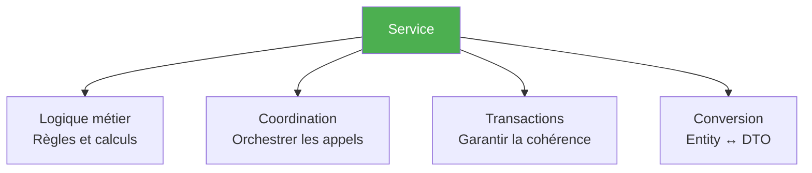
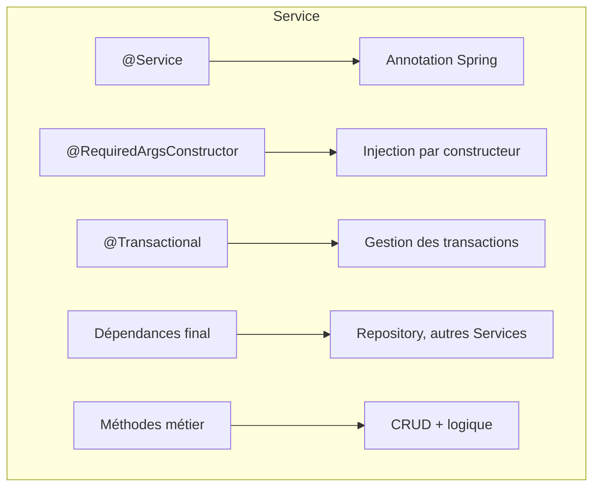
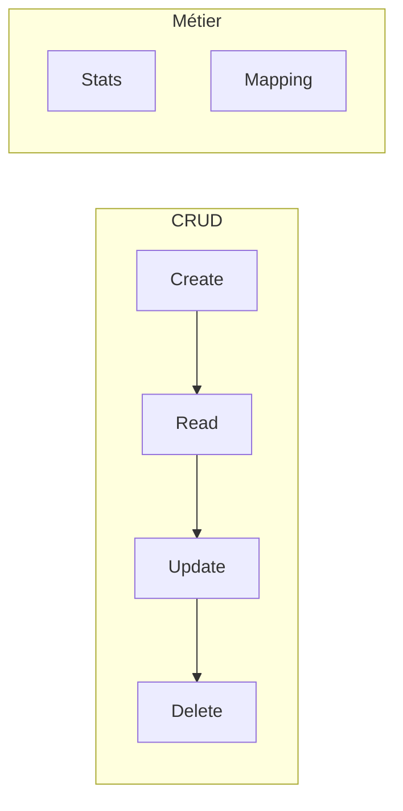
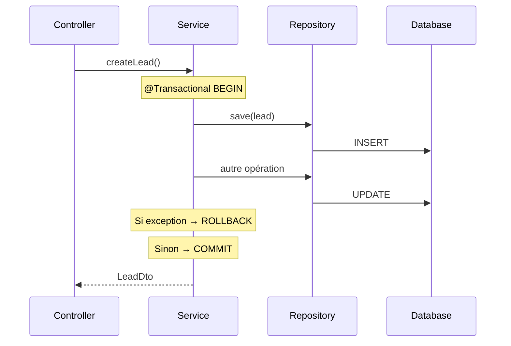
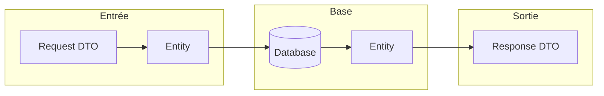
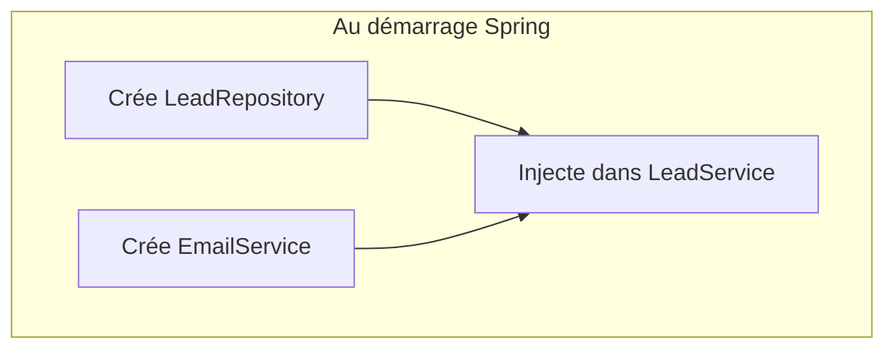
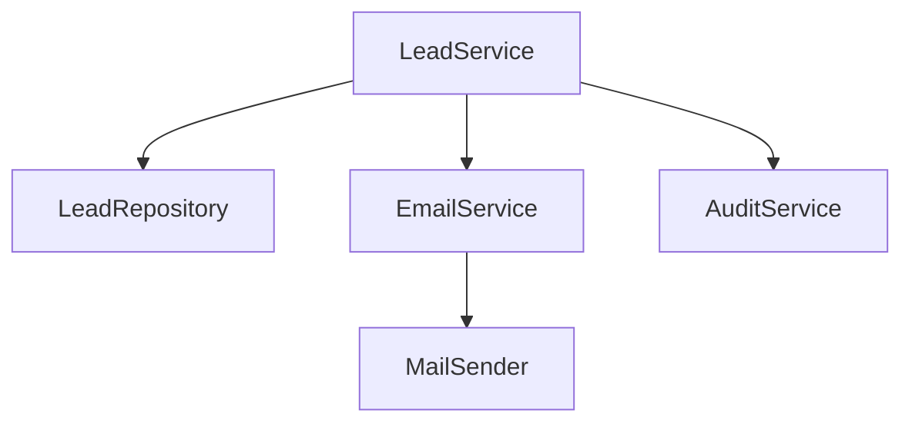
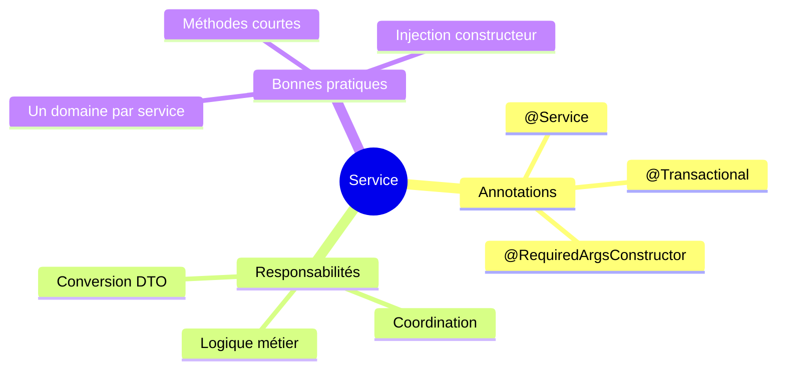

# Chapitre 2.4 - Couche Service (Logique métier)

## Objectifs du chapitre

- Comprendre le rôle de la couche Service
- Implémenter la logique métier
- Gérer les transactions

---

## 1. Rôle de la couche Service

### Responsabilités



1. **Logique métier** : Règles et calculs spécifiques au domaine
2. **Coordination** : Orchestrer les appels aux repositories
3. **Transactions** : Garantir la cohérence des données
4. **Conversion** : Transformer entités en DTOs

### Ce que le Service NE fait PAS

- ❌ Gérer les requêtes HTTP (rôle du Controller)
- ❌ Accéder directement à la base (rôle du Repository)
- ❌ Connaître le format des réponses HTTP

---

## 2. Structure d'un Service

### Anatomie



```java
@Service                              // 1. Annotation Spring
@RequiredArgsConstructor              // 2. Injection par constructeur
@Transactional                        // 3. Gestion des transactions (optionnel)
public class LeadService {

    private final LeadRepository leadRepository;  // 4. Dépendances
    private final EmailService emailService;

    public LeadDto createLead(ContactFormRequest request) {  // 5. Méthodes métier
        // ...
    }
}
```

---

## 3. LeadService - Implémentation complète

### Diagramme des opérations



```java
package com.example.contact.service;

import com.example.contact.dto.request.ContactFormRequest;
import com.example.contact.dto.request.UpdateStatusRequest;
import com.example.contact.dto.response.LeadDto;
import com.example.contact.dto.response.LeadStatsDto;
import com.example.contact.exception.ResourceNotFoundException;
import com.example.contact.model.Lead;
import com.example.contact.model.LeadStatus;
import com.example.contact.repository.LeadRepository;
import lombok.RequiredArgsConstructor;
import org.springframework.data.domain.Page;
import org.springframework.data.domain.Pageable;
import org.springframework.stereotype.Service;
import org.springframework.transaction.annotation.Transactional;

@Service
@RequiredArgsConstructor
public class LeadService {

    private final LeadRepository leadRepository;
    private final EmailService emailService;

    // ==================== CREATE ====================
    
    @Transactional
    public LeadDto createLead(ContactFormRequest request) {
        // 1. Créer l'entité à partir du DTO
        Lead lead = new Lead();
        lead.setFullName(request.getFullName());
        lead.setEmail(request.getEmail());
        lead.setCompany(request.getCompany());
        lead.setPhone(request.getPhone());
        lead.setRequestType(request.getRequestType());
        lead.setMessage(request.getMessage());
        lead.setStatus(LeadStatus.NEW);
        
        // 2. Sauvegarder en base
        Lead savedLead = leadRepository.save(lead);
        
        // 3. Envoyer les emails (asynchrone)
        emailService.sendAdminNotification(savedLead);
        emailService.sendVisitorConfirmation(savedLead);
        
        // 4. Retourner le DTO
        return mapToDto(savedLead);
    }

    // ==================== READ ====================
    
    public Page<LeadDto> getAllLeads(Pageable pageable) {
        return leadRepository.findAll(pageable)
                .map(this::mapToDto);
    }
    
    public LeadDto getLeadById(Long id) {
        Lead lead = leadRepository.findById(id)
                .orElseThrow(() -> new ResourceNotFoundException("Lead non trouvé: " + id));
        return mapToDto(lead);
    }

    // ==================== UPDATE ====================
    
    @Transactional
    public LeadDto updateStatus(Long id, UpdateStatusRequest request) {
        Lead lead = leadRepository.findById(id)
                .orElseThrow(() -> new ResourceNotFoundException("Lead non trouvé: " + id));
        
        lead.setStatus(request.getStatus());
        Lead updated = leadRepository.save(lead);
        
        return mapToDto(updated);
    }

    // ==================== DELETE ====================
    
    @Transactional
    public void deleteLead(Long id) {
        if (!leadRepository.existsById(id)) {
            throw new ResourceNotFoundException("Lead non trouvé: " + id);
        }
        leadRepository.deleteById(id);
    }

    // ==================== STATS ====================
    
    public LeadStatsDto getStats() {
        return LeadStatsDto.builder()
                .total(leadRepository.count())
                .newCount(leadRepository.countByStatus(LeadStatus.NEW))
                .contactedCount(leadRepository.countByStatus(LeadStatus.CONTACTED))
                .convertedCount(leadRepository.countByStatus(LeadStatus.CONVERTED))
                .lostCount(leadRepository.countByStatus(LeadStatus.LOST))
                .build();
    }

    // ==================== MAPPING ====================
    
    private LeadDto mapToDto(Lead lead) {
        return LeadDto.builder()
                .id(lead.getId())
                .fullName(lead.getFullName())
                .email(lead.getEmail())
                .company(lead.getCompany())
                .phone(lead.getPhone())
                .requestType(lead.getRequestType())
                .message(lead.getMessage())
                .status(lead.getStatus())
                .createdAt(lead.getCreatedAt())
                .build();
    }
}
```

---

## 4. Gestion des transactions

### @Transactional



```java
@Transactional
public LeadDto createLead(ContactFormRequest request) {
    // Si une exception est levée, tout est annulé (rollback)
    Lead saved = leadRepository.save(lead);
    emailService.sendNotification(saved);
    return mapToDto(saved);
}
```

### Comportement par défaut

- **Rollback** : Sur RuntimeException et Error
- **Pas de rollback** : Sur Exception vérifiée (checked)

### Configuration avancée

```java
// Rollback sur toutes les exceptions
@Transactional(rollbackFor = Exception.class)

// Lecture seule (optimisation)
@Transactional(readOnly = true)

// Timeout en secondes
@Transactional(timeout = 30)
```

---

## 5. Conversion Entité ↔ DTO

### Flux de conversion



### Pourquoi convertir?

1. **Sécurité** : Ne pas exposer les champs sensibles
2. **Flexibilité** : L'API peut évoluer sans modifier l'entité
3. **Performance** : Ne transférer que les champs nécessaires

### Méthode manuelle

```java
private LeadDto mapToDto(Lead lead) {
    return LeadDto.builder()
            .id(lead.getId())
            .fullName(lead.getFullName())
            .email(lead.getEmail())
            // ...
            .build();
}

private Lead mapToEntity(ContactFormRequest request) {
    Lead lead = new Lead();
    lead.setFullName(request.getFullName());
    lead.setEmail(request.getEmail());
    // ...
    return lead;
}
```

### Alternative : ModelMapper ou MapStruct

```java
// Avec ModelMapper (configuration globale)
@Configuration
public class MapperConfig {
    @Bean
    public ModelMapper modelMapper() {
        return new ModelMapper();
    }
}

// Utilisation
private LeadDto mapToDto(Lead lead) {
    return modelMapper.map(lead, LeadDto.class);
}
```

---

## 6. Gestion des erreurs

### Lancer des exceptions

```java
public LeadDto getLeadById(Long id) {
    return leadRepository.findById(id)
            .map(this::mapToDto)
            .orElseThrow(() -> new ResourceNotFoundException("Lead non trouvé: " + id));
}
```

### Exception personnalisée

```java
public class ResourceNotFoundException extends RuntimeException {
    public ResourceNotFoundException(String message) {
        super(message);
    }
}
```

L'exception sera interceptée par le GlobalExceptionHandler (voir Module 8).

---

## 7. Injection de dépendances

### Injection par constructeur (recommandée)



```java
@Service
@RequiredArgsConstructor  // Lombok génère le constructeur
public class LeadService {
    
    private final LeadRepository leadRepository;
    private final EmailService emailService;
    
    // Lombok génère:
    // public LeadService(LeadRepository leadRepository, EmailService emailService) {
    //     this.leadRepository = leadRepository;
    //     this.emailService = emailService;
    // }
}
```

### Avantages

1. **Immutabilité** : Les dépendances sont final
2. **Testabilité** : Facile à mocker
3. **Visibilité** : On voit toutes les dépendances

### Injection par @Autowired (déconseillé)

```java
@Service
public class LeadService {
    
    @Autowired
    private LeadRepository leadRepository;  // Moins testable
}
```

---

## 8. Services multiples

### Appeler un autre service



```java
@Service
@RequiredArgsConstructor
public class LeadService {
    
    private final LeadRepository leadRepository;
    private final EmailService emailService;      // Autre service
    private final AuditService auditService;      // Autre service
    
    @Transactional
    public LeadDto createLead(ContactFormRequest request) {
        Lead saved = leadRepository.save(lead);
        
        // Appeler d'autres services
        emailService.sendNotification(saved);
        auditService.logCreation("Lead", saved.getId());
        
        return mapToDto(saved);
    }
}
```

---

## 9. Bonnes pratiques

### 9.1 Un service = un domaine

```java
// ✅ BON: Service dédié aux leads
@Service
public class LeadService { }

// ✅ BON: Service dédié aux emails
@Service
public class EmailService { }

// ❌ MAUVAIS: Service fourre-tout
@Service
public class ApplicationService { }
```

### 9.2 Méthodes courtes et focalisées

```java
// ✅ BON: Méthodes spécifiques
public LeadDto createLead(...) { }
public LeadDto updateStatus(...) { }
public void deleteLead(...) { }

// ❌ MAUVAIS: Méthode qui fait tout
public void processLead(String action, ...) { }
```

### 9.3 Validation dans le service si nécessaire

```java
public LeadDto createLead(ContactFormRequest request) {
    // Validation métier supplémentaire
    if (leadRepository.existsByEmail(request.getEmail())) {
        throw new BusinessException("Un lead avec cet email existe déjà");
    }
    // ...
}
```

### 9.4 Logs pour le debugging

```java
@Slf4j
@Service
public class LeadService {
    
    public LeadDto createLead(ContactFormRequest request) {
        log.info("Création d'un nouveau lead: {}", request.getEmail());
        // ...
        log.debug("Lead créé avec ID: {}", saved.getId());
        return mapToDto(saved);
    }
}
```

---

## 10. Points clés à retenir



1. **@Service** marque la couche métier
2. **@Transactional** garantit la cohérence des données
3. **Les DTOs** séparent l'API des entités
4. **Injection par constructeur** avec @RequiredArgsConstructor
5. **Un service = un domaine** métier

---

## QUIZ 2.4 - Couche Service

**1. Quelle annotation marque un service Spring?**
- a) @Component
- b) @Service
- c) @Business
- d) @Logic

<details>
<summary>Voir la réponse</summary>

**Réponse : b) @Service**

@Service est le stéréotype Spring pour la couche métier. C'est une spécialisation de @Component avec une sémantique plus précise.
</details>

---

**2. Que fait @Transactional?**
- a) Optimise les performances
- b) Garantit la cohérence des données (rollback si erreur)
- c) Sécurise la méthode
- d) Met en cache les résultats

<details>
<summary>Voir la réponse</summary>

**Réponse : b) Garantit la cohérence des données (rollback si erreur)**

@Transactional démarre une transaction. Si une RuntimeException est levée, toutes les modifications sont annulées (rollback).
</details>

---

**3. Pourquoi convertir les entités en DTOs?**
- a) Sécurité (ne pas exposer les champs sensibles)
- b) Flexibilité (API indépendante de la base)
- c) Performance
- d) Toutes les réponses ci-dessus

<details>
<summary>Voir la réponse</summary>

**Réponse : d) Toutes les réponses ci-dessus**

Les DTOs permettent de contrôler ce qui est exposé, de faire évoluer l'API indépendamment, et de transférer uniquement les données nécessaires.
</details>

---

**4. Quelle est la meilleure méthode d'injection?**
- a) @Autowired sur le champ
- b) Setter injection
- c) Injection par constructeur
- d) Peu importe

<details>
<summary>Voir la réponse</summary>

**Réponse : c) Injection par constructeur**

L'injection par constructeur permet l'immutabilité (champs final), facilite les tests (mocking), et rend les dépendances visibles.
</details>

---

**5. VRAI ou FAUX : Un service peut appeler un autre service.**

<details>
<summary>Voir la réponse</summary>

**Réponse : VRAI**

Un service peut injecter et appeler d'autres services. C'est courant pour la coordination (ex: LeadService appelle EmailService).
</details>

---

**6. Sur quel type d'exception @Transactional fait un rollback par défaut?**
- a) Toutes les exceptions
- b) RuntimeException seulement
- c) Exception seulement
- d) Aucune

<details>
<summary>Voir la réponse</summary>

**Réponse : b) RuntimeException seulement**

Par défaut, le rollback se fait sur RuntimeException et Error. Pour les checked exceptions, il faut configurer rollbackFor.
</details>

---

**7. Quelle annotation Lombok génère le constructeur avec les champs final?**
- a) @AllArgsConstructor
- b) @NoArgsConstructor
- c) @RequiredArgsConstructor
- d) @Constructor

<details>
<summary>Voir la réponse</summary>

**Réponse : c) @RequiredArgsConstructor**

@RequiredArgsConstructor génère un constructeur pour tous les champs final et @NonNull. Idéal pour l'injection de dépendances.
</details>

---

**8. Complétez : Le service coordonne les appels aux _______ et applique la logique métier.**

<details>
<summary>Voir la réponse</summary>

**Réponse : repositories**

Le service est l'intermédiaire entre le controller et les repositories. Il applique la logique métier et coordonne les opérations.
</details>

---

**9. Que retourne orElseThrow() si l'Optional est vide?**
- a) null
- b) Une exception
- c) Une valeur par défaut
- d) Un Optional vide

<details>
<summary>Voir la réponse</summary>

**Réponse : b) Une exception**

orElseThrow() lance l'exception fournie si l'Optional est vide. C'est la façon propre de gérer les "non trouvé".
</details>

---

**10. Où placer la logique de calcul des statistiques?**
- a) Controller
- b) Service
- c) Repository
- d) Model

<details>
<summary>Voir la réponse</summary>

**Réponse : b) Service**

Toute logique métier (calculs, agrégations, règles business) appartient au Service. Le Controller ne fait que déléguer.
</details>

---

## Navigation

| Précédent | Suivant |
|-----------|---------|
| [07 - Couche Repository](07-couche-repository.md) | [09 - Couche Controller](09-couche-controller.md) |
