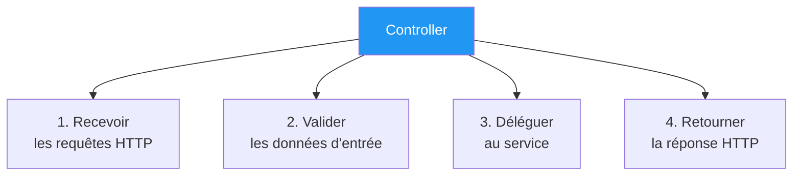
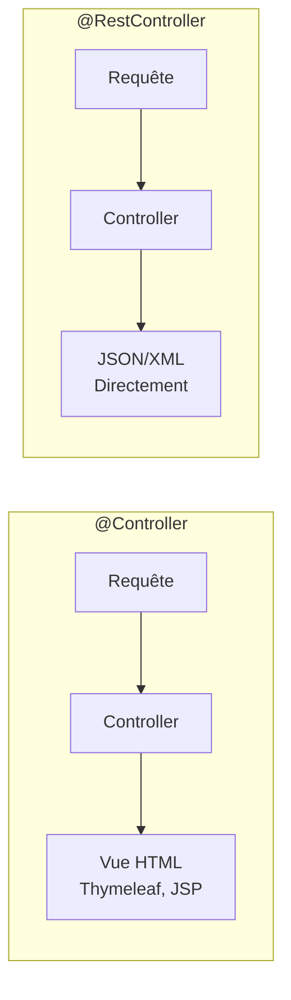
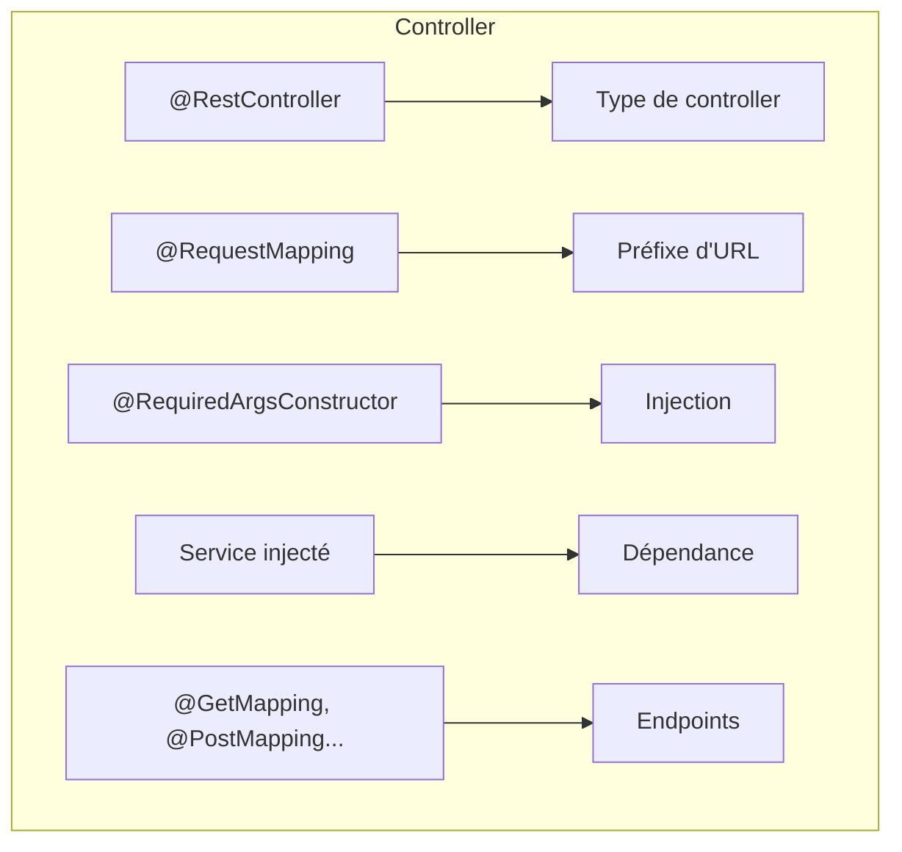
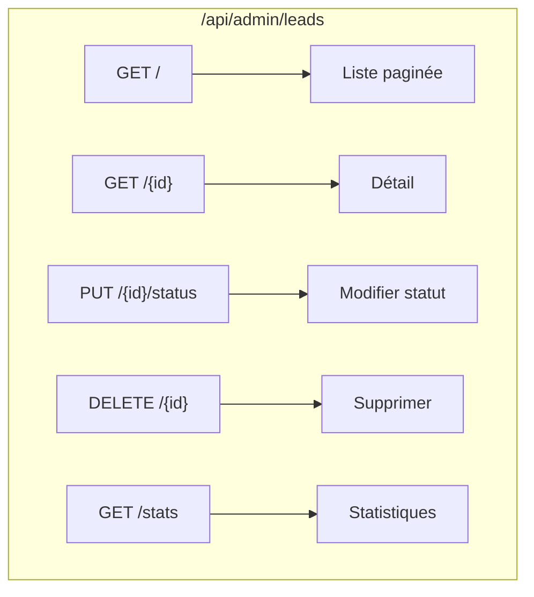
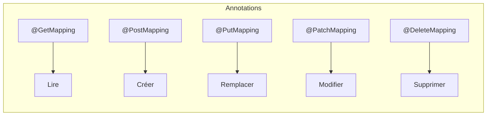
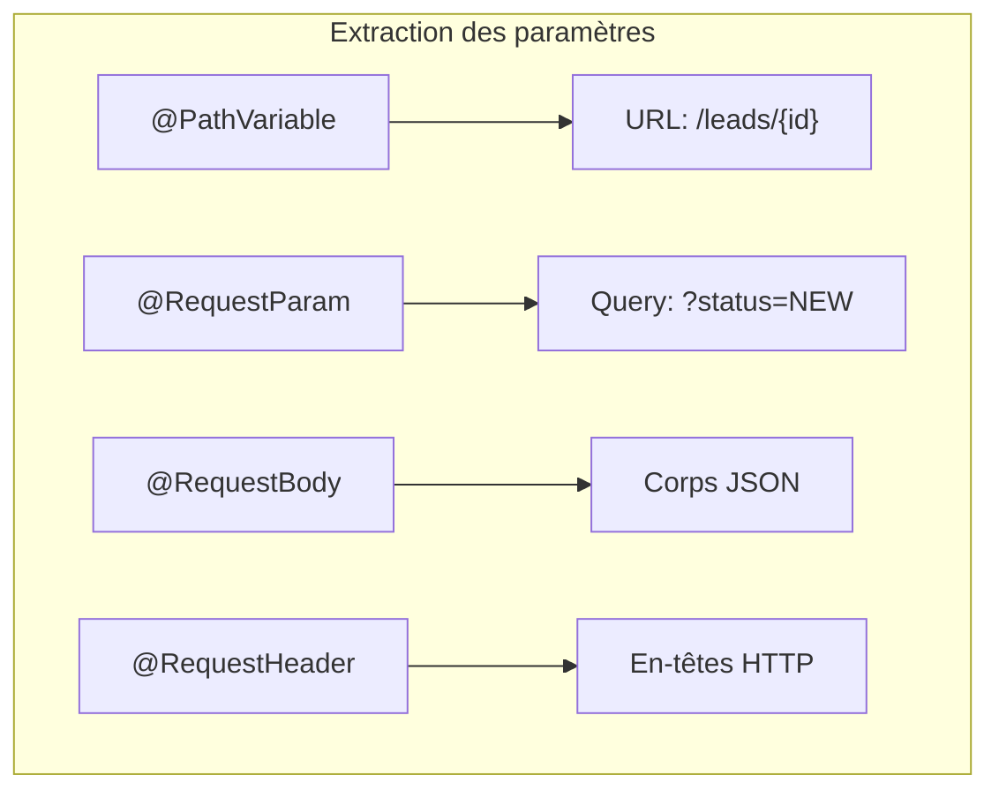
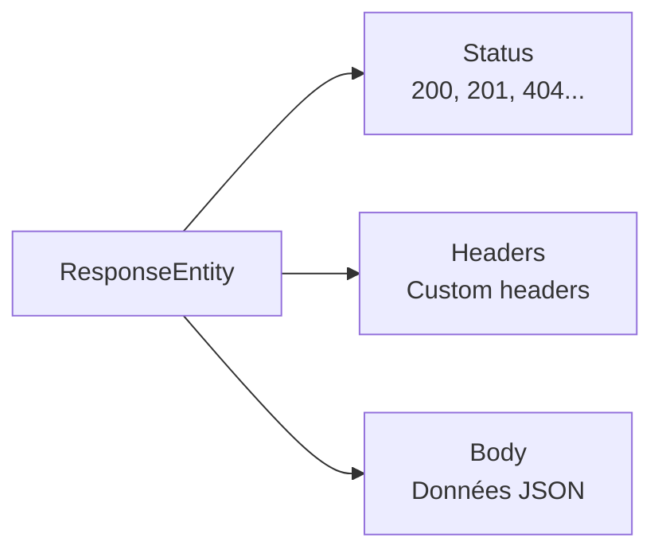
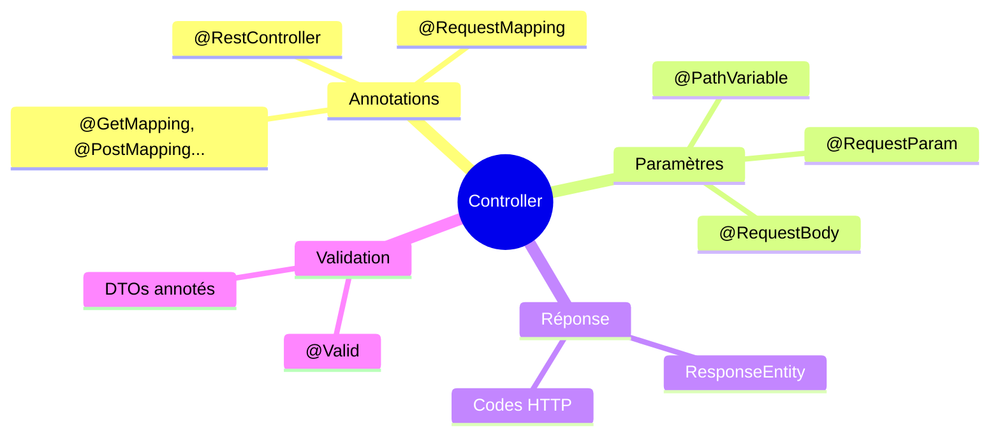

# Chapitre 2.5 - Couche Controller (API REST)

## Objectifs du chapitre

- Créer des controllers REST
- Gérer les requêtes et réponses HTTP
- Utiliser les annotations Spring MVC

---

## 1. Rôle du Controller

### Responsabilités



1. **Recevoir** les requêtes HTTP
2. **Valider** les données d'entrée
3. **Déléguer** au service
4. **Retourner** la réponse HTTP appropriée

### Ce que le Controller NE fait PAS

- ❌ Logique métier (rôle du Service)
- ❌ Accès direct à la base de données

---

## 2. @RestController vs @Controller

### Diagramme comparatif



### @Controller

Renvoie des vues (HTML avec Thymeleaf, JSP...).

```java
@Controller
public class WebController {
    @GetMapping("/home")
    public String home(Model model) {
        model.addAttribute("message", "Bonjour");
        return "home";  // Retourne le nom de la vue
    }
}
```

### @RestController

Renvoie directement des données (JSON, XML...).

```java
@RestController  // = @Controller + @ResponseBody
public class ApiController {
    @GetMapping("/api/data")
    public DataDto getData() {
        return new DataDto();  // Converti automatiquement en JSON
    }
}
```

---

## 3. Structure d'un Controller

### Anatomie



```java
@RestController                          // 1. Type de controller
@RequestMapping("/api/contact")          // 2. Préfixe d'URL
@RequiredArgsConstructor                 // 3. Injection
public class ContactController {

    private final LeadService leadService;  // 4. Dépendance

    @PostMapping                         // 5. Méthode HTTP + chemin
    public ResponseEntity<LeadDto> submit(
            @RequestBody @Valid ContactFormRequest request) {  // 6. Corps de requête
        
        LeadDto lead = leadService.createLead(request);
        return ResponseEntity.ok(lead);  // 7. Réponse
    }
}
```

---

## 4. ContactController

```java
package com.example.contact.controller;

import com.example.contact.dto.request.ContactFormRequest;
import com.example.contact.dto.response.LeadDto;
import com.example.contact.dto.response.MessageResponse;
import com.example.contact.service.LeadService;
import jakarta.validation.Valid;
import lombok.RequiredArgsConstructor;
import org.springframework.http.ResponseEntity;
import org.springframework.web.bind.annotation.*;

@RestController
@RequestMapping("/api/contact")
@RequiredArgsConstructor
public class ContactController {

    private final LeadService leadService;

    @PostMapping
    public ResponseEntity<MessageResponse> submitContact(
            @RequestBody @Valid ContactFormRequest request) {
        
        LeadDto lead = leadService.createLead(request);
        
        return ResponseEntity.ok(
            new MessageResponse("Votre demande a été envoyée avec succès!")
        );
    }
}
```

---

## 5. LeadController (Admin)

### Diagramme des endpoints



```java
package com.example.contact.controller;

import com.example.contact.dto.request.UpdateStatusRequest;
import com.example.contact.dto.response.LeadDto;
import com.example.contact.dto.response.LeadStatsDto;
import com.example.contact.dto.response.MessageResponse;
import com.example.contact.service.LeadService;
import jakarta.validation.Valid;
import lombok.RequiredArgsConstructor;
import org.springframework.data.domain.Page;
import org.springframework.data.domain.Pageable;
import org.springframework.http.ResponseEntity;
import org.springframework.security.access.prepost.PreAuthorize;
import org.springframework.web.bind.annotation.*;

@RestController
@RequestMapping("/api/admin/leads")
@RequiredArgsConstructor
@PreAuthorize("hasRole('ADMIN')")  // Sécurité
public class LeadController {

    private final LeadService leadService;

    // GET /api/admin/leads?page=0&size=10
    @GetMapping
    public Page<LeadDto> getAllLeads(Pageable pageable) {
        return leadService.getAllLeads(pageable);
    }

    // GET /api/admin/leads/123
    @GetMapping("/{id}")
    public ResponseEntity<LeadDto> getLeadById(@PathVariable Long id) {
        LeadDto lead = leadService.getLeadById(id);
        return ResponseEntity.ok(lead);
    }

    // PUT /api/admin/leads/123/status
    @PutMapping("/{id}/status")
    public ResponseEntity<LeadDto> updateStatus(
            @PathVariable Long id,
            @RequestBody @Valid UpdateStatusRequest request) {
        
        LeadDto updated = leadService.updateStatus(id, request);
        return ResponseEntity.ok(updated);
    }

    // DELETE /api/admin/leads/123
    @DeleteMapping("/{id}")
    public ResponseEntity<MessageResponse> deleteLead(@PathVariable Long id) {
        leadService.deleteLead(id);
        return ResponseEntity.ok(new MessageResponse("Lead supprimé"));
    }

    // GET /api/admin/leads/stats
    @GetMapping("/stats")
    public ResponseEntity<LeadStatsDto> getStats() {
        return ResponseEntity.ok(leadService.getStats());
    }
}
```

---

## 6. AuthController

```java
package com.example.contact.controller;

import com.example.contact.dto.request.LoginRequest;
import com.example.contact.dto.response.AuthResponse;
import com.example.contact.security.JwtService;
import jakarta.validation.Valid;
import lombok.RequiredArgsConstructor;
import org.springframework.http.ResponseEntity;
import org.springframework.security.authentication.AuthenticationManager;
import org.springframework.security.authentication.UsernamePasswordAuthenticationToken;
import org.springframework.security.core.Authentication;
import org.springframework.security.core.userdetails.UserDetails;
import org.springframework.web.bind.annotation.*;

@RestController
@RequestMapping("/api/auth")
@RequiredArgsConstructor
public class AuthController {

    private final AuthenticationManager authenticationManager;
    private final JwtService jwtService;

    @PostMapping("/login")
    public ResponseEntity<AuthResponse> login(
            @RequestBody @Valid LoginRequest request) {
        
        // 1. Authentifier l'utilisateur
        Authentication authentication = authenticationManager.authenticate(
            new UsernamePasswordAuthenticationToken(
                request.getEmail(),
                request.getPassword()
            )
        );
        
        // 2. Générer le token JWT
        UserDetails user = (UserDetails) authentication.getPrincipal();
        String token = jwtService.generateToken(user);
        
        // 3. Retourner la réponse
        return ResponseEntity.ok(new AuthResponse(token));
    }
}
```

---

## 7. Annotations de mapping

### Méthodes HTTP



| Annotation | Méthode HTTP | Usage |
|------------|--------------|-------|
| @GetMapping | GET | Lire des données |
| @PostMapping | POST | Créer une ressource |
| @PutMapping | PUT | Mettre à jour (complet) |
| @PatchMapping | PATCH | Mettre à jour (partiel) |
| @DeleteMapping | DELETE | Supprimer |

### Chemins

```java
@RequestMapping("/api/leads")  // Préfixe pour toute la classe
public class LeadController {

    @GetMapping                  // GET /api/leads
    @GetMapping("/{id}")         // GET /api/leads/123
    @GetMapping("/stats")        // GET /api/leads/stats
    @PostMapping                 // POST /api/leads
    @PutMapping("/{id}")         // PUT /api/leads/123
    @DeleteMapping("/{id}")      // DELETE /api/leads/123
}
```

---

## 8. Paramètres de requête

### Diagramme des annotations



### @PathVariable - Variable dans l'URL

```java
// GET /api/leads/123
@GetMapping("/{id}")
public Lead getLead(@PathVariable Long id) {
    return service.findById(id);
}

// Avec nom explicite
@GetMapping("/{leadId}")
public Lead getLead(@PathVariable("leadId") Long id) {
    return service.findById(id);
}
```

### @RequestParam - Paramètre de query string

```java
// GET /api/leads?status=NEW
@GetMapping
public List<Lead> getLeads(@RequestParam LeadStatus status) {
    return service.findByStatus(status);
}

// Paramètre optionnel avec valeur par défaut
// GET /api/leads?page=0&size=10
@GetMapping
public Page<Lead> getLeads(
        @RequestParam(defaultValue = "0") int page,
        @RequestParam(defaultValue = "10") int size) {
    return service.findAll(PageRequest.of(page, size));
}
```

### @RequestBody - Corps de la requête

```java
// POST /api/leads avec JSON dans le body
@PostMapping
public Lead create(@RequestBody @Valid ContactFormRequest request) {
    return service.create(request);
}
```

### @RequestHeader - En-tête HTTP

```java
@GetMapping
public String getData(@RequestHeader("Authorization") String token) {
    // ...
}
```

---

## 9. ResponseEntity

### Contrôler la réponse HTTP



```java
// 200 OK avec corps
return ResponseEntity.ok(data);

// 201 Created avec location
return ResponseEntity
    .created(URI.create("/api/leads/" + lead.getId()))
    .body(lead);

// 204 No Content
return ResponseEntity.noContent().build();

// 400 Bad Request
return ResponseEntity.badRequest().body(error);

// 404 Not Found
return ResponseEntity.notFound().build();

// Status personnalisé
return ResponseEntity.status(HttpStatus.CREATED).body(data);
```

### Structure complète

```java
ResponseEntity<T>
    .status(HttpStatus)    // Code de statut
    .header("X-Custom", "value")  // En-têtes
    .body(data)            // Corps de la réponse
```

---

## 10. Validation

### Activer la validation

```java
@PostMapping
public ResponseEntity<?> create(
        @RequestBody @Valid ContactFormRequest request) {  // @Valid active la validation
    // ...
}
```

### Dans le DTO

```java
public class ContactFormRequest {
    
    @NotBlank(message = "Le nom est obligatoire")
    private String fullName;
    
    @Email(message = "Email invalide")
    @NotBlank(message = "L'email est obligatoire")
    private String email;
    
    @NotNull(message = "Le type de demande est obligatoire")
    private RequestType requestType;
    
    @NotBlank(message = "Le message est obligatoire")
    @Size(min = 10, message = "Le message doit faire au moins 10 caractères")
    private String message;
}
```

---

## 11. Bonnes pratiques

### 11.1 Controllers minces

```java
// ✅ BON: Délègue au service
@PostMapping
public ResponseEntity<?> create(@RequestBody @Valid Request request) {
    return ResponseEntity.ok(service.create(request));
}

// ❌ MAUVAIS: Logique dans le controller
@PostMapping
public ResponseEntity<?> create(@RequestBody Request request) {
    // Validation, calculs, accès base... NON!
}
```

### 11.2 Nommage RESTful

```java
// ✅ BON
GET    /api/leads          // Liste
GET    /api/leads/123      // Détail
POST   /api/leads          // Créer
PUT    /api/leads/123      // Modifier
DELETE /api/leads/123      // Supprimer

// ❌ MAUVAIS
GET    /api/getLeads
POST   /api/createLead
POST   /api/deleteLead/123
```

### 11.3 Codes de statut appropriés

| Action | Code | Signification |
|--------|------|---------------|
| GET réussi | 200 | OK |
| POST réussi | 201 | Created |
| PUT/PATCH réussi | 200 | OK |
| DELETE réussi | 204 | No Content |
| Validation échouée | 400 | Bad Request |
| Non authentifié | 401 | Unauthorized |
| Non autorisé | 403 | Forbidden |
| Non trouvé | 404 | Not Found |

---

## 12. Points clés à retenir



1. **@RestController** pour les APIs REST (JSON)
2. **@RequestMapping** définit le préfixe d'URL
3. **@GetMapping, @PostMapping...** pour les méthodes HTTP
4. **@PathVariable, @RequestParam, @RequestBody** pour les paramètres
5. **ResponseEntity** pour contrôler la réponse HTTP

---

## QUIZ 2.5 - Couche Controller

**1. Quelle annotation pour un controller REST?**
- a) @Controller
- b) @RestController
- c) @ApiController
- d) @WebController

<details>
<summary>Voir la réponse</summary>

**Réponse : b) @RestController**

@RestController combine @Controller et @ResponseBody. Les méthodes retournent directement des données JSON au lieu de noms de vues.
</details>

---

**2. Que fait @RequestBody?**
- a) Lit les paramètres d'URL
- b) Lit le corps JSON de la requête
- c) Lit les en-têtes
- d) Lit les cookies

<details>
<summary>Voir la réponse</summary>

**Réponse : b) Lit le corps JSON de la requête**

@RequestBody désérialise automatiquement le JSON du corps de la requête en objet Java (DTO).
</details>

---

**3. Comment récupérer l'ID dans GET /api/leads/123?**
- a) @RequestParam Long id
- b) @PathVariable Long id
- c) @RequestBody Long id
- d) @QueryParam Long id

<details>
<summary>Voir la réponse</summary>

**Réponse : b) @PathVariable Long id**

@PathVariable extrait la valeur depuis le chemin de l'URL. @RequestParam est pour les query strings (?id=123).
</details>

---

**4. Quel code HTTP pour une création réussie?**
- a) 200 OK
- b) 201 Created
- c) 204 No Content
- d) 202 Accepted

<details>
<summary>Voir la réponse</summary>

**Réponse : b) 201 Created**

201 Created indique qu'une nouvelle ressource a été créée. L'en-tête Location devrait contenir l'URL de la nouvelle ressource.
</details>

---

**5. VRAI ou FAUX : Un controller peut appeler directement un repository.**

<details>
<summary>Voir la réponse</summary>

**Réponse : VRAI (mais c'est une mauvaise pratique)**

Techniquement possible, mais cela viole la séparation des couches. Le controller devrait toujours passer par le service.
</details>

---

**6. Quelle annotation active la validation des DTOs?**
- a) @Validate
- b) @Valid
- c) @Validated
- d) @Check

<details>
<summary>Voir la réponse</summary>

**Réponse : b) @Valid**

@Valid active Bean Validation sur le paramètre. Si la validation échoue, une MethodArgumentNotValidException est levée.
</details>

---

**7. Comment retourner un 404 avec ResponseEntity?**
- a) ResponseEntity.notFound().build()
- b) ResponseEntity.error(404)
- c) ResponseEntity.status(404)
- d) throw new NotFoundException()

<details>
<summary>Voir la réponse</summary>

**Réponse : a) ResponseEntity.notFound().build()**

notFound() retourne un builder avec le status 404. build() finalise la construction sans corps.
</details>

---

**8. Complétez : @RequestParam lit les paramètres de la _______ string.**

<details>
<summary>Voir la réponse</summary>

**Réponse : query**

La query string est la partie après "?" dans l'URL : /api/leads?status=NEW&page=0
</details>

---

**9. Quelle méthode HTTP pour modifier une ressource?**
- a) POST
- b) GET
- c) PUT
- d) PATCH
- e) c et d

<details>
<summary>Voir la réponse</summary>

**Réponse : e) c et d**

PUT remplace la ressource entière, PATCH modifie partiellement. Les deux sont utilisés pour les mises à jour.
</details>

---

**10. Quel code HTTP si la validation échoue?**
- a) 401
- b) 403
- c) 400
- d) 500

<details>
<summary>Voir la réponse</summary>

**Réponse : c) 400**

400 Bad Request indique que le serveur ne peut pas traiter la requête car les données sont invalides (erreur du client).
</details>

---

## Navigation

| Précédent | Suivant |
|-----------|---------|
| [08 - Couche Service](08-couche-service.md) | [10 - Pattern DTO](10-pattern-dto.md) |
