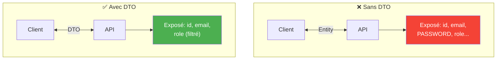
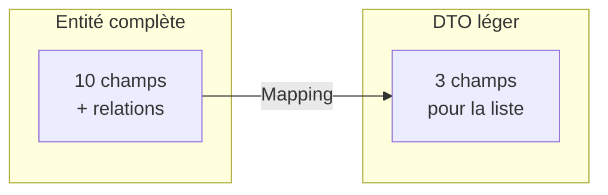
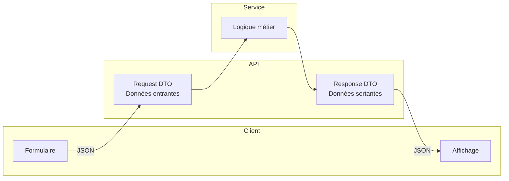
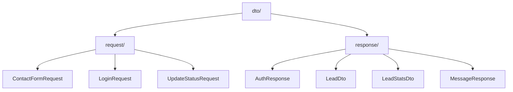
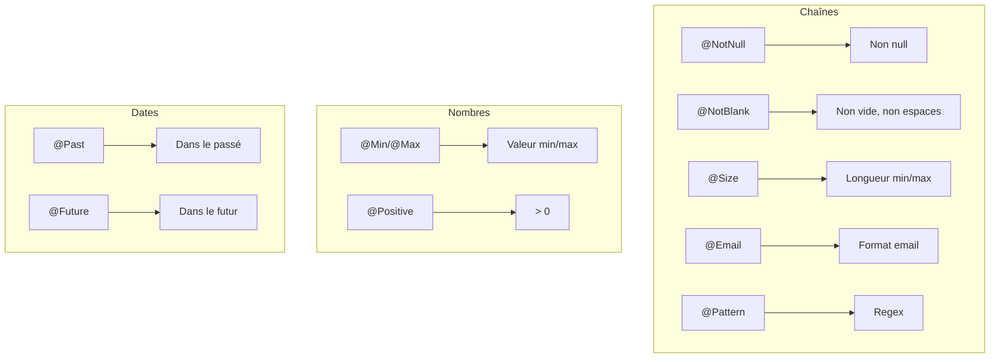
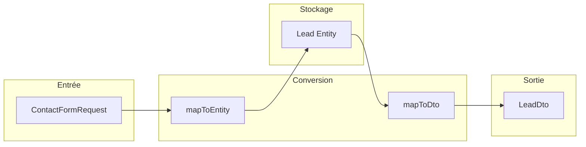
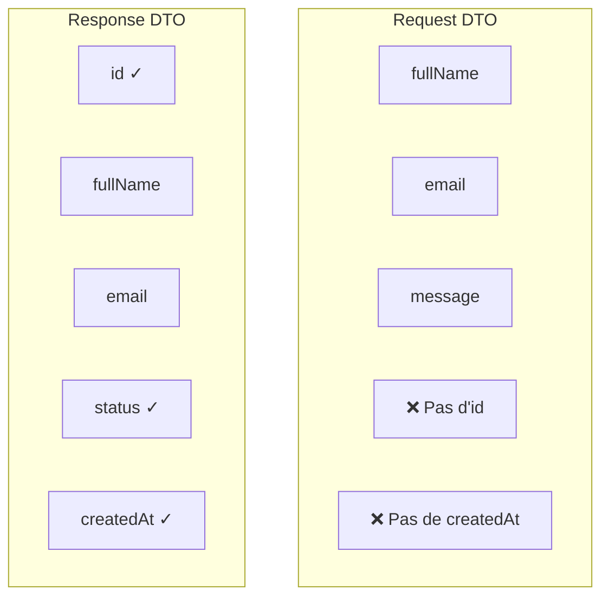
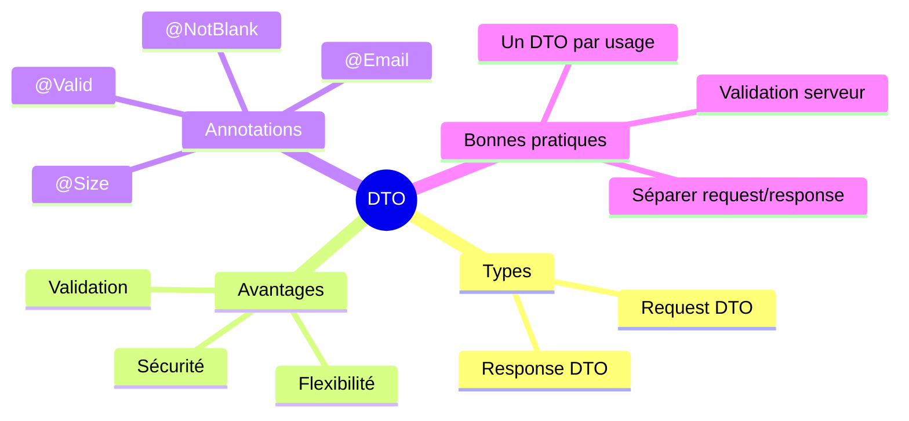

# Chapitre 2.6 - Pattern DTO (Data Transfer Object)

## Objectifs du chapitre

- Comprendre le pattern DTO
- Séparer les DTOs de requête et de réponse
- Implémenter les DTOs du projet

---

## 1. Qu'est-ce qu'un DTO?

### Définition

Un **DTO (Data Transfer Object)** est un objet qui transporte des données entre les couches de l'application, notamment entre le client et le serveur.

> **Analogie** : Le DTO est comme un formulaire. Le visiteur remplit le formulaire (Request DTO), l'administration retourne une confirmation (Response DTO).

### Pourquoi utiliser des DTOs?



---

## 2. Avantages des DTOs

### 2.1 Sécurité

```java
// ❌ Entité (avec champs sensibles)
@Entity
public class User {
    private Long id;
    private String email;
    private String password;  // ⚠️ SENSIBLE!
    private String role;
}

// ✅ DTO (sans champs sensibles)
public class UserDto {
    private Long id;
    private String email;
    private String role;
    // Pas de password!
}
```

### 2.2 Flexibilité

L'API peut évoluer indépendamment de la base de données.

```java
// L'entité a un champ "fullName"
@Entity
public class Lead {
    private String fullName;
}

// Le DTO peut le séparer
public class LeadDto {
    private String firstName;  // Calculé à partir de fullName
    private String lastName;   // Calculé à partir de fullName
}
```

### 2.3 Performance

Ne transférer que les champs nécessaires.



```java
// DTO léger pour la liste
public class LeadSummaryDto {
    private Long id;
    private String fullName;
    private LeadStatus status;
    // Seulement les champs pour l'affichage en liste
}
```

### 2.4 Validation

Les contraintes de validation sont sur les DTOs, pas sur les entités.

```java
public class ContactFormRequest {
    @NotBlank(message = "Le nom est obligatoire")
    private String fullName;
    
    @Email(message = "Email invalide")
    private String email;
}
```

---

## 3. Types de DTOs

### Diagramme du flux



### 3.1 Request DTOs (entrants)

Données reçues du client.

```
Client --> [Request DTO] --> Controller --> Service
```

### 3.2 Response DTOs (sortants)

Données envoyées au client.

```
Service --> Controller --> [Response DTO] --> Client
```

---

## 4. DTOs du projet

### Structure



```
dto/
├── request/
│   ├── ContactFormRequest.java
│   ├── LoginRequest.java
│   └── UpdateStatusRequest.java
│
└── response/
    ├── AuthResponse.java
    ├── LeadDto.java
    ├── LeadStatsDto.java
    └── MessageResponse.java
```

---

## 5. Request DTOs

### ContactFormRequest.java

```java
package com.example.contact.dto.request;

import com.example.contact.model.RequestType;
import jakarta.validation.constraints.*;
import lombok.Data;

@Data
public class ContactFormRequest {
    
    @NotBlank(message = "Le nom complet est obligatoire")
    @Size(min = 2, max = 100, message = "Le nom doit faire entre 2 et 100 caractères")
    private String fullName;
    
    @NotBlank(message = "L'email est obligatoire")
    @Email(message = "Format d'email invalide")
    private String email;
    
    @Size(max = 100, message = "Le nom de l'entreprise ne peut pas dépasser 100 caractères")
    private String company;
    
    @Pattern(regexp = "^[+]?[0-9\\s-]{0,20}$", message = "Format de téléphone invalide")
    private String phone;
    
    @NotNull(message = "Le type de demande est obligatoire")
    private RequestType requestType;
    
    @NotBlank(message = "Le message est obligatoire")
    @Size(min = 10, max = 5000, message = "Le message doit faire entre 10 et 5000 caractères")
    private String message;
}
```

### LoginRequest.java

```java
package com.example.contact.dto.request;

import jakarta.validation.constraints.Email;
import jakarta.validation.constraints.NotBlank;
import lombok.Data;

@Data
public class LoginRequest {
    
    @NotBlank(message = "L'email est obligatoire")
    @Email(message = "Format d'email invalide")
    private String email;
    
    @NotBlank(message = "Le mot de passe est obligatoire")
    private String password;
}
```

### UpdateStatusRequest.java

```java
package com.example.contact.dto.request;

import com.example.contact.model.LeadStatus;
import jakarta.validation.constraints.NotNull;
import lombok.Data;

@Data
public class UpdateStatusRequest {
    
    @NotNull(message = "Le statut est obligatoire")
    private LeadStatus status;
}
```

---

## 6. Response DTOs

### LeadDto.java

```java
package com.example.contact.dto.response;

import com.example.contact.model.LeadStatus;
import com.example.contact.model.RequestType;
import lombok.AllArgsConstructor;
import lombok.Builder;
import lombok.Data;
import lombok.NoArgsConstructor;

import java.time.LocalDateTime;

@Data
@Builder
@NoArgsConstructor
@AllArgsConstructor
public class LeadDto {
    
    private Long id;
    private String fullName;
    private String email;
    private String company;
    private String phone;
    private RequestType requestType;
    private String message;
    private LeadStatus status;
    private LocalDateTime createdAt;
}
```

### LeadStatsDto.java

```java
package com.example.contact.dto.response;

import lombok.AllArgsConstructor;
import lombok.Builder;
import lombok.Data;
import lombok.NoArgsConstructor;

@Data
@Builder
@NoArgsConstructor
@AllArgsConstructor
public class LeadStatsDto {
    
    private long total;
    private long newCount;
    private long contactedCount;
    private long convertedCount;
    private long lostCount;
}
```

### AuthResponse.java

```java
package com.example.contact.dto.response;

import lombok.AllArgsConstructor;
import lombok.Data;

@Data
@AllArgsConstructor
public class AuthResponse {
    
    private String token;
}
```

### MessageResponse.java

```java
package com.example.contact.dto.response;

import lombok.AllArgsConstructor;
import lombok.Data;

@Data
@AllArgsConstructor
public class MessageResponse {
    
    private String message;
}
```

---

## 7. Annotations de validation

### Diagramme des annotations



### Annotations courantes

| Annotation | Description | Exemple |
|------------|-------------|---------|
| @NotNull | Ne doit pas être null | @NotNull private Status status; |
| @NotBlank | Non null, non vide, non espaces | @NotBlank private String name; |
| @NotEmpty | Non null et non vide | @NotEmpty private List<String> items; |
| @Size | Taille min/max | @Size(min=2, max=100) |
| @Min / @Max | Valeur min/max | @Min(0) @Max(100) |
| @Email | Format email valide | @Email private String email; |
| @Pattern | Expression régulière | @Pattern(regexp="[0-9]+") |
| @Past / @Future | Date dans le passé/futur | @Past private LocalDate birthDate; |
| @Positive | Nombre positif | @Positive private BigDecimal price; |

### Messages personnalisés

```java
@NotBlank(message = "Le nom est obligatoire")
@Size(min = 2, max = 100, message = "Le nom doit faire entre {min} et {max} caractères")
private String fullName;
```

---

## 8. Conversion Entity ↔ DTO

### Diagramme de conversion



### Méthode manuelle

```java
@Service
public class LeadService {
    
    // Entity -> DTO
    private LeadDto mapToDto(Lead lead) {
        return LeadDto.builder()
                .id(lead.getId())
                .fullName(lead.getFullName())
                .email(lead.getEmail())
                .company(lead.getCompany())
                .phone(lead.getPhone())
                .requestType(lead.getRequestType())
                .message(lead.getMessage())
                .status(lead.getStatus())
                .createdAt(lead.getCreatedAt())
                .build();
    }
    
    // Request DTO -> Entity
    private Lead mapToEntity(ContactFormRequest request) {
        Lead lead = new Lead();
        lead.setFullName(request.getFullName());
        lead.setEmail(request.getEmail());
        lead.setCompany(request.getCompany());
        lead.setPhone(request.getPhone());
        lead.setRequestType(request.getRequestType());
        lead.setMessage(request.getMessage());
        return lead;
    }
}
```

### Avec Stream pour les listes

```java
public List<LeadDto> getAllLeads() {
    return leadRepository.findAll()
            .stream()
            .map(this::mapToDto)
            .collect(Collectors.toList());
}

// Ou avec Page
public Page<LeadDto> getAllLeads(Pageable pageable) {
    return leadRepository.findAll(pageable)
            .map(this::mapToDto);
}
```

---

## 9. Bonnes pratiques

### 9.1 Séparer Request et Response



```java
// Request: ce qu'on reçoit
public class CreateLeadRequest {
    private String fullName;
    private String email;
    // Pas d'id, pas de status, pas de createdAt
}

// Response: ce qu'on renvoie
public class LeadDto {
    private Long id;           // Généré par la base
    private String fullName;
    private String email;
    private LeadStatus status; // Défini par le système
    private LocalDateTime createdAt;  // Généré automatiquement
}
```

### 9.2 Un DTO par cas d'usage

```java
// Pour la liste (léger)
public class LeadSummaryDto {
    private Long id;
    private String fullName;
    private LeadStatus status;
}

// Pour le détail (complet)
public class LeadDetailDto {
    private Long id;
    private String fullName;
    private String email;
    private String company;
    private String phone;
    private String message;
    private LeadStatus status;
    private LocalDateTime createdAt;
    private List<CommentDto> comments;
}
```

### 9.3 Immutabilité (optionnel mais recommandé)

```java
// Avec Lombok
@Value  // Rend tous les champs final et private
public class LeadDto {
    Long id;
    String fullName;
    String email;
}
```

### 9.4 Validation côté serveur obligatoire

Même si le frontend valide, toujours valider côté serveur!

---

## 10. Points clés à retenir



1. **DTO** = objet pour transporter des données entre couches
2. **Request DTO** = données entrantes (avec validation)
3. **Response DTO** = données sortantes (sans champs sensibles)
4. **Validation** avec @NotBlank, @Email, @Size, etc.
5. **Conversion** manuelle ou avec mapper (MapStruct, ModelMapper)

---

## QUIZ 2.6 - Pattern DTO

**1. Que signifie DTO?**
- a) Data Transfer Object
- b) Data Transport Operator
- c) Direct Table Object
- d) Domain Transfer Object

<details>
<summary>Voir la réponse</summary>

**Réponse : a) Data Transfer Object**

Le DTO est un objet conçu pour transférer des données entre les couches d'une application ou entre systèmes.
</details>

---

**2. Pourquoi utiliser des DTOs?**
- a) Sécurité (ne pas exposer les champs sensibles)
- b) Flexibilité (API indépendante de la base)
- c) Validation des données
- d) Toutes les réponses ci-dessus

<details>
<summary>Voir la réponse</summary>

**Réponse : d) Toutes les réponses ci-dessus**

Les DTOs apportent de la sécurité (filtrage), de la flexibilité (découplage), et permettent la validation spécifique aux entrées.
</details>

---

**3. Quelle annotation valide qu'une chaîne n'est pas vide?**
- a) @NotNull
- b) @NotEmpty
- c) @NotBlank
- d) @Required

<details>
<summary>Voir la réponse</summary>

**Réponse : c) @NotBlank**

@NotBlank vérifie que la chaîne n'est pas null, pas vide, et ne contient pas que des espaces. @NotNull vérifie seulement null.
</details>

---

**4. Où placer les annotations de validation?**
- a) Sur l'entité
- b) Sur le Request DTO
- c) Sur le Response DTO
- d) Sur le Controller

<details>
<summary>Voir la réponse</summary>

**Réponse : b) Sur le Request DTO**

Les Request DTOs reçoivent les données externes et doivent être validés. Les entités peuvent avoir leurs propres contraintes JPA.
</details>

---

**5. VRAI ou FAUX : Un Response DTO peut contenir le mot de passe de l'utilisateur.**

<details>
<summary>Voir la réponse</summary>

**Réponse : FAUX (JAMAIS!)**

Le mot de passe ne doit JAMAIS être exposé dans une réponse API. C'est une des raisons principales d'utiliser des DTOs.
</details>

---

**6. Quelle annotation valide un format email?**
- a) @Mail
- b) @Email
- c) @ValidEmail
- d) @EmailFormat

<details>
<summary>Voir la réponse</summary>

**Réponse : b) @Email**

@Email est l'annotation Bean Validation standard pour valider le format d'une adresse email.
</details>

---

**7. Quelle annotation Lombok génère un builder?**
- a) @Data
- b) @Builder
- c) @AllArgsConstructor
- d) @Value

<details>
<summary>Voir la réponse</summary>

**Réponse : b) @Builder**

@Builder génère le pattern Builder qui permet de construire des objets de manière fluide : LeadDto.builder().id(1).build();
</details>

---

**8. Complétez : La validation des DTOs est activée avec l'annotation _______ dans le controller.**

<details>
<summary>Voir la réponse</summary>

**Réponse : @Valid**

@Valid devant le paramètre @RequestBody active la validation Bean Validation sur le DTO.
</details>

---

**9. Quelle est la différence entre @NotNull et @NotBlank?**
- a) Aucune
- b) @NotBlank vérifie aussi que la chaîne n'est pas vide ou que des espaces
- c) @NotNull est pour les chaînes, @NotBlank pour les objets
- d) @NotBlank permet null

<details>
<summary>Voir la réponse</summary>

**Réponse : b) @NotBlank vérifie aussi que la chaîne n'est pas vide ou que des espaces**

@NotNull: ≠ null | @NotEmpty: ≠ null et length > 0 | @NotBlank: ≠ null, length > 0, et au moins un caractère non-espace.
</details>

---

**10. Pourquoi séparer Request et Response DTOs?**
- a) Les champs sont différents (id, createdAt)
- b) La validation ne s'applique qu'aux Request
- c) Meilleure évolution de l'API
- d) Toutes les réponses ci-dessus

<details>
<summary>Voir la réponse</summary>

**Réponse : d) Toutes les réponses ci-dessus**

Request et Response ont des besoins différents : champs différents, validation uniquement en entrée, évolution indépendante.
</details>

---

## Navigation

| Précédent | Suivant |
|-----------|---------|
| [09 - Couche Controller](09-couche-controller.md) | [11 - Principes REST](11-principes-rest.md) |
