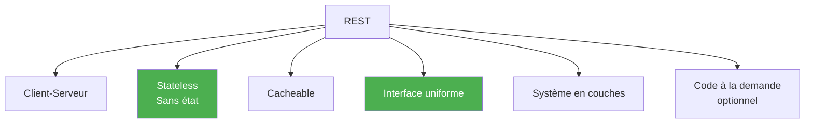
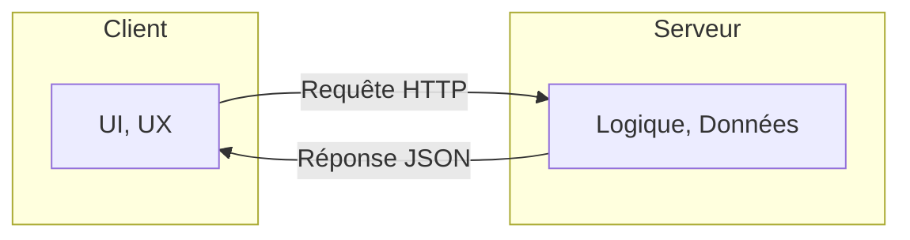
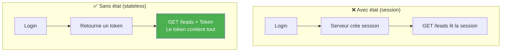
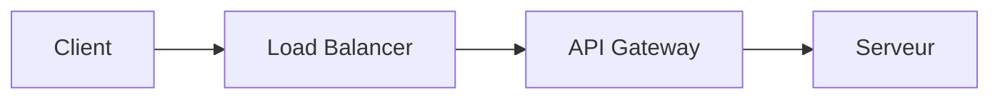
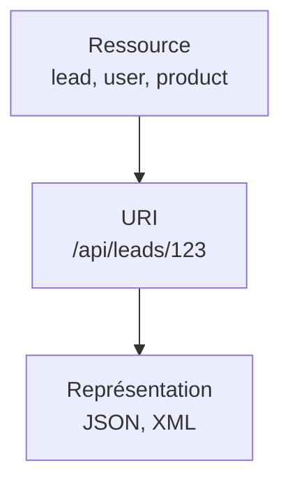
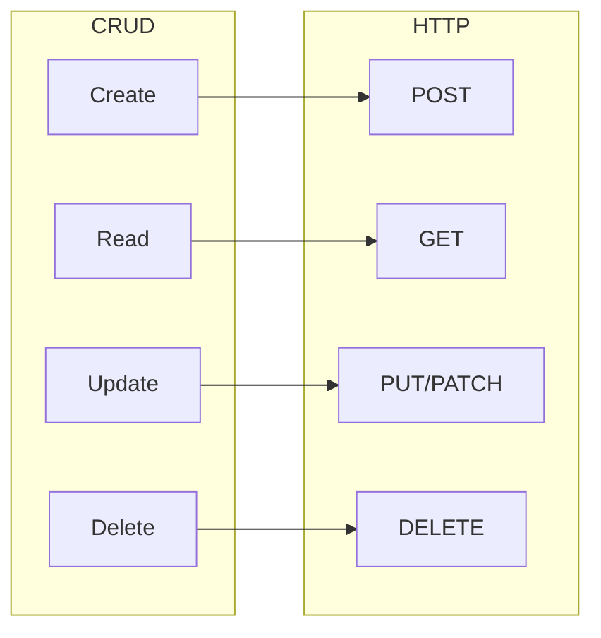
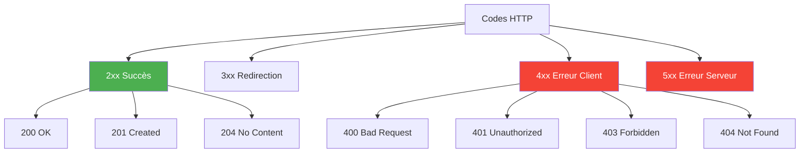
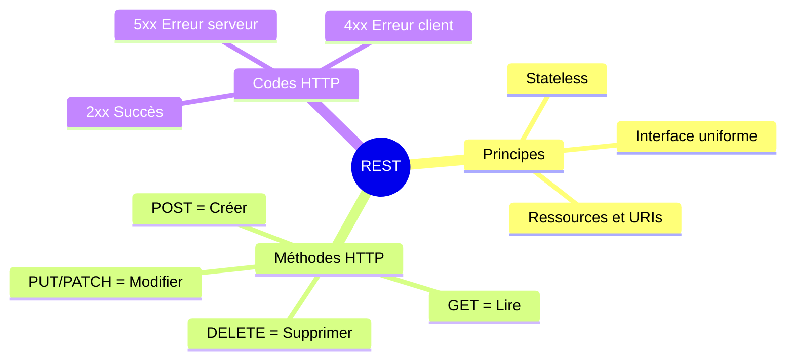

# Chapitre 3.1 - Principes REST

## Objectifs du chapitre

- Comprendre l'architecture REST
- Connaître les contraintes REST
- Appliquer les bonnes pratiques

---

## 1. Qu'est-ce que REST?

### Définition

**REST (REpresentational State Transfer)** est un style d'architecture pour concevoir des APIs web. Il a été défini par Roy Fielding en 2000.

> **Analogie** : REST est comme les règles de circulation routière. Tout le monde (client et serveur) suit les mêmes conventions pour communiquer efficacement.

### API RESTful

Une API est dite RESTful si elle respecte les contraintes REST.

---

## 2. Les 6 contraintes REST

### Diagramme des contraintes



### 2.1 Client-Serveur

Séparation des responsabilités.



### 2.2 Sans état (Stateless)

Chaque requête contient toutes les informations nécessaires. Le serveur ne garde pas de session.



### 2.3 Cacheable

Les réponses peuvent être mises en cache.

```
GET /api/leads/123
Cache-Control: max-age=3600
```

### 2.4 Interface uniforme

Utilisation cohérente des méthodes HTTP et des URLs.

| Méthode | Action | Exemple |
|---------|--------|---------|
| GET | Lire | GET /api/leads |
| POST | Créer | POST /api/leads |
| PUT | Remplacer | PUT /api/leads/123 |
| PATCH | Modifier | PATCH /api/leads/123 |
| DELETE | Supprimer | DELETE /api/leads/123 |

### 2.5 Système en couches

Le client ne sait pas s'il communique directement avec le serveur ou via des intermédiaires.



### 2.6 Code à la demande (optionnel)

Le serveur peut envoyer du code exécutable au client.

---

## 3. Ressources et URIs

### Concepts clés



- **Ressource** : Une entité (lead, user, product)
- **URI** : Identifiant de la ressource (/api/leads/123)
- **Représentation** : Format des données (JSON, XML)

### Bonnes pratiques pour les URIs

```
✅ BON: Noms au pluriel
GET /api/leads
GET /api/users

❌ MAUVAIS: Verbes dans l'URL
GET /api/getLeads
GET /api/fetchUsers

✅ BON: Hiérarchie claire
GET /api/users/123/leads         # Leads de l'utilisateur 123

✅ BON: Paramètres de query pour filtrer
GET /api/leads?status=NEW&page=0&size=10

❌ MAUVAIS: Action dans l'URL
POST /api/leads/123/activate     # Préférer PATCH /api/leads/123
```

---

## 4. Méthodes HTTP

### Diagramme CRUD ↔ HTTP



### GET - Lire

```
GET /api/leads              # Liste tous les leads
GET /api/leads/123          # Récupère le lead 123

Réponse: 200 OK
{
  "id": 123,
  "fullName": "Jean Dupont"
}
```

### POST - Créer

```
POST /api/leads
Content-Type: application/json

{
  "fullName": "Jean Dupont",
  "email": "jean@example.com"
}

Réponse: 201 Created
Location: /api/leads/124
{
  "id": 124,
  "fullName": "Jean Dupont"
}
```

### PUT - Remplacer complètement

```
PUT /api/leads/123
Content-Type: application/json

{
  "fullName": "Jean Dupont",
  "email": "nouveau@example.com",
  "company": "ACME",
  "phone": "0123456789",
  "requestType": "INFO",
  "message": "Nouveau message"
}

Réponse: 200 OK
```

### PATCH - Modifier partiellement

```
PATCH /api/leads/123
Content-Type: application/json

{
  "status": "CONTACTED"
}

Réponse: 200 OK
```

### DELETE - Supprimer

```
DELETE /api/leads/123

Réponse: 204 No Content
```

---

## 5. Codes de statut HTTP

### Diagramme des catégories



### Succès (2xx)

| Code | Nom | Usage |
|------|-----|-------|
| 200 | OK | Requête réussie |
| 201 | Created | Ressource créée |
| 204 | No Content | Succès sans corps |

### Erreurs client (4xx)

| Code | Nom | Usage |
|------|-----|-------|
| 400 | Bad Request | Requête invalide |
| 401 | Unauthorized | Non authentifié |
| 403 | Forbidden | Non autorisé |
| 404 | Not Found | Ressource inexistante |
| 409 | Conflict | Conflit (doublon) |
| 422 | Unprocessable Entity | Validation échouée |

### Erreurs serveur (5xx)

| Code | Nom | Usage |
|------|-----|-------|
| 500 | Internal Server Error | Erreur interne |
| 502 | Bad Gateway | Proxy/gateway invalide |
| 503 | Service Unavailable | Service indisponible |

---

## 6. Format des données

### JSON (standard)

```json
{
  "id": 123,
  "fullName": "Jean Dupont",
  "email": "jean@example.com",
  "status": "NEW",
  "createdAt": "2024-01-15T10:30:00"
}
```

### Headers

```
Content-Type: application/json    # Format du corps
Accept: application/json          # Format attendu en réponse
```

---

## 7. Pagination

### Requête

```
GET /api/leads?page=0&size=10&sort=createdAt,desc
```

### Réponse paginée

```mermaid
graph TB
    subgraph "Page Response"
        C[content: Lead[]]
        P[pageable: infos page]
        T[totalElements]
        TP[totalPages]
        F[first/last]
    end
```

```json
{
  "content": [
    { "id": 1, "fullName": "Lead 1" },
    { "id": 2, "fullName": "Lead 2" }
  ],
  "pageable": {
    "pageNumber": 0,
    "pageSize": 10
  },
  "totalElements": 100,
  "totalPages": 10,
  "first": true,
  "last": false
}
```

---

## 8. Filtrage et recherche

### Filtres simples

```
GET /api/leads?status=NEW
GET /api/leads?status=NEW&requestType=INFO
```

### Recherche

```
GET /api/leads?search=dupont
GET /api/leads?q=dupont
```

### Tri

```
GET /api/leads?sort=createdAt,desc
GET /api/leads?sort=fullName,asc&sort=createdAt,desc
```

---

## 9. HATEOAS (optionnel)

### Hypermedia As The Engine Of Application State

Les réponses contiennent des liens vers les actions possibles.

```json
{
  "id": 123,
  "fullName": "Jean Dupont",
  "status": "NEW",
  "_links": {
    "self": { "href": "/api/leads/123" },
    "update": { "href": "/api/leads/123", "method": "PUT" },
    "delete": { "href": "/api/leads/123", "method": "DELETE" },
    "updateStatus": { "href": "/api/leads/123/status", "method": "PATCH" }
  }
}
```

---

## 10. Points clés à retenir



1. **REST** = style d'architecture pour APIs web
2. **Stateless** = pas de session serveur
3. **Ressources** identifiées par des URIs
4. **Méthodes HTTP** correspondent aux actions CRUD
5. **Codes de statut** informent du résultat

---

## QUIZ 3.1 - Principes REST

**1. Que signifie REST?**
- a) Remote Execution Service Transfer
- b) REpresentational State Transfer
- c) Resource Exchange Standard Technology
- d) Request-Response State Transfer

<details>
<summary>Voir la réponse</summary>

**Réponse : b) REpresentational State Transfer**

REST a été défini par Roy Fielding dans sa thèse de doctorat en 2000.
</details>

---

**2. Quelle est la caractéristique "stateless"?**
- a) Le serveur garde une session
- b) Chaque requête contient toutes les infos nécessaires
- c) Le client garde l'état
- d) Les données sont en cache

<details>
<summary>Voir la réponse</summary>

**Réponse : b) Chaque requête contient toutes les infos nécessaires**

Le serveur ne maintient pas de session entre les requêtes. Chaque requête est indépendante.
</details>

---

**3. Quelle méthode HTTP pour créer une ressource?**
- a) GET
- b) PUT
- c) POST
- d) CREATE

<details>
<summary>Voir la réponse</summary>

**Réponse : c) POST**

POST est la méthode HTTP standard pour créer une nouvelle ressource. CREATE n'existe pas comme méthode HTTP.
</details>

---

**4. Quel code HTTP indique une création réussie?**
- a) 200 OK
- b) 201 Created
- c) 204 No Content
- d) 202 Accepted

<details>
<summary>Voir la réponse</summary>

**Réponse : b) 201 Created**

201 Created indique qu'une ressource a été créée avec succès. L'en-tête Location devrait contenir l'URL de la nouvelle ressource.
</details>

---

**5. VRAI ou FAUX : Les URLs REST doivent contenir des verbes.**

<details>
<summary>Voir la réponse</summary>

**Réponse : FAUX**

Les URLs REST utilisent des noms de ressources au pluriel (/leads, /users), pas des verbes. L'action est déterminée par la méthode HTTP.
</details>

---

**6. Quelle est la différence entre PUT et PATCH?**
- a) Aucune
- b) PUT remplace, PATCH modifie partiellement
- c) PATCH remplace, PUT modifie partiellement
- d) PUT est pour création, PATCH pour mise à jour

<details>
<summary>Voir la réponse</summary>

**Réponse : b) PUT remplace, PATCH modifie partiellement**

PUT remplace la ressource entière (tous les champs). PATCH modifie seulement les champs fournis.
</details>

---

**7. Quel code HTTP pour "non authentifié"?**
- a) 400
- b) 401
- c) 403
- d) 404

<details>
<summary>Voir la réponse</summary>

**Réponse : b) 401**

401 Unauthorized = non authentifié (identité non prouvée). 403 Forbidden = authentifié mais non autorisé.
</details>

---

**8. Complétez : Une API REST utilise des _______ pour identifier les ressources.**

<details>
<summary>Voir la réponse</summary>

**Réponse : URIs**

URI (Uniform Resource Identifier) identifie de manière unique chaque ressource, ex: /api/leads/123
</details>

---

**9. Quel format de données est standard pour les APIs REST?**
- a) XML
- b) CSV
- c) JSON
- d) HTML

<details>
<summary>Voir la réponse</summary>

**Réponse : c) JSON**

JSON (JavaScript Object Notation) est le format standard pour les APIs REST modernes. XML était plus utilisé avec SOAP.
</details>

---

**10. Quel code HTTP pour "ressource non trouvée"?**
- a) 400
- b) 401
- c) 403
- d) 404

<details>
<summary>Voir la réponse</summary>

**Réponse : d) 404**

404 Not Found indique que la ressource demandée n'existe pas.
</details>

---

## Navigation

| Précédent | Suivant |
|-----------|---------|
| [10 - Pattern DTO](10-pattern-dto.md) | [12 - Annotations Spring MVC](12-annotations-spring-mvc.md) |
