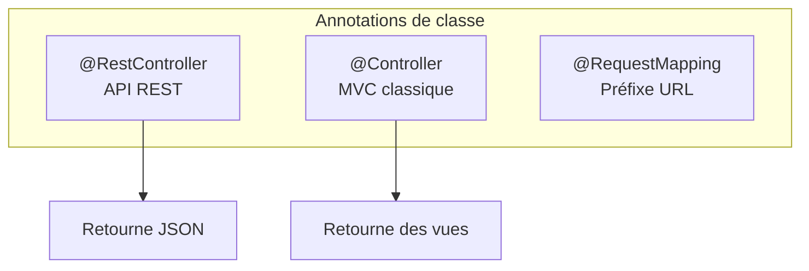
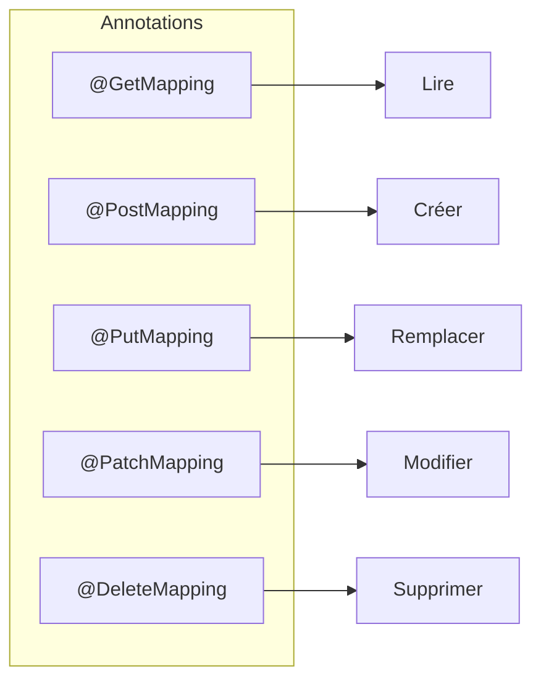
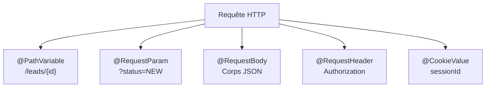
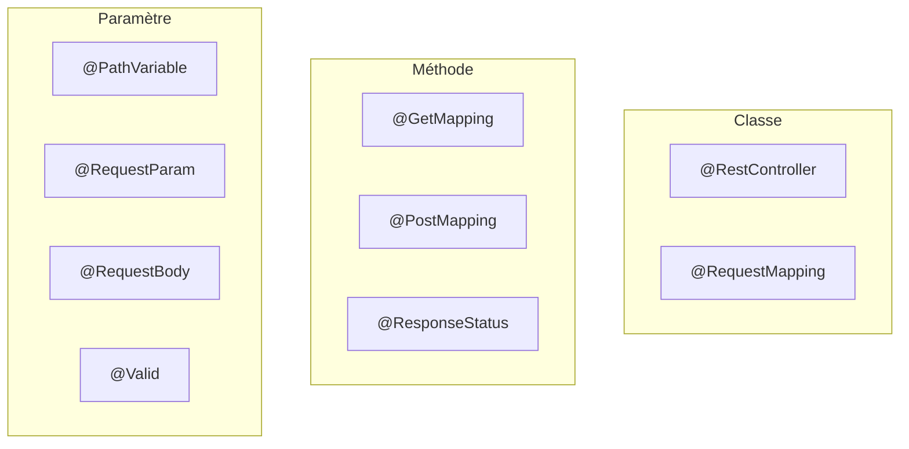
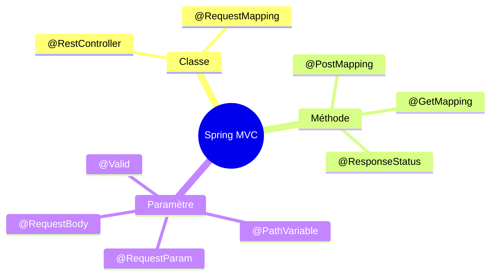

# Chapitre 3.2 - Annotations Spring MVC

## Objectifs du chapitre

- Maîtriser les annotations de mapping
- Comprendre les annotations de paramètres
- Utiliser les annotations de réponse

---

## 1. Annotations de classe

### Diagramme d'ensemble



### @Controller

Pour les controllers MVC classiques (renvoie des vues).

```java
@Controller
public class WebController {
    @GetMapping("/home")
    public String home(Model model) {
        return "home";  // Nom de la vue
    }
}
```

### @RestController

Pour les APIs REST (renvoie du JSON).

```java
@RestController  // = @Controller + @ResponseBody
public class ApiController {
    @GetMapping("/api/data")
    public DataDto getData() {
        return new DataDto();  // Converti en JSON
    }
}
```

### @RequestMapping (niveau classe)

Définit le préfixe d'URL pour tous les endpoints.

```java
@RestController
@RequestMapping("/api/leads")
public class LeadController {
    
    @GetMapping           // GET /api/leads
    @GetMapping("/{id}")  // GET /api/leads/123
    @PostMapping          // POST /api/leads
}
```

---

## 2. Annotations de méthode

### Diagramme des méthodes HTTP



### @GetMapping

```java
@GetMapping                    // GET /api/leads
@GetMapping("/{id}")           // GET /api/leads/123
@GetMapping("/stats")          // GET /api/leads/stats
@GetMapping(produces = "application/json")  // Spécifie le type de réponse
```

### @PostMapping

```java
@PostMapping                   // POST /api/leads
@PostMapping(consumes = "application/json")  // Spécifie le type de requête
```

### @PutMapping

```java
@PutMapping("/{id}")           // PUT /api/leads/123
```

### @PatchMapping

```java
@PatchMapping("/{id}")         // PATCH /api/leads/123
```

### @DeleteMapping

```java
@DeleteMapping("/{id}")        // DELETE /api/leads/123
```

### @RequestMapping (niveau méthode)

Version générique (peut spécifier la méthode HTTP).

```java
@RequestMapping(value = "/{id}", method = RequestMethod.GET)
// Équivalent à @GetMapping("/{id}")
```

---

## 3. Annotations de paramètres

### Diagramme des sources de paramètres



### @PathVariable

Extrait une variable de l'URL.

```java
// GET /api/leads/123
@GetMapping("/{id}")
public Lead getLead(@PathVariable Long id) {
    return service.findById(id);
}

// Nom explicite
@GetMapping("/{leadId}")
public Lead getLead(@PathVariable("leadId") Long id) {
    return service.findById(id);
}

// Plusieurs variables
@GetMapping("/{userId}/leads/{leadId}")
public Lead getLead(
        @PathVariable Long userId,
        @PathVariable Long leadId) {
    return service.findByUserAndLead(userId, leadId);
}
```

### @RequestParam

Extrait un paramètre de query string.

```java
// GET /api/leads?status=NEW
@GetMapping
public List<Lead> getLeads(@RequestParam LeadStatus status) {
    return service.findByStatus(status);
}

// Paramètre optionnel
@GetMapping
public List<Lead> getLeads(
        @RequestParam(required = false) LeadStatus status) {
    return status != null ? service.findByStatus(status) : service.findAll();
}

// Valeur par défaut
@GetMapping
public Page<Lead> getLeads(
        @RequestParam(defaultValue = "0") int page,
        @RequestParam(defaultValue = "10") int size) {
    return service.findAll(PageRequest.of(page, size));
}

// Nom explicite
@GetMapping
public List<Lead> search(@RequestParam("q") String query) {
    return service.search(query);
}
```

### @RequestBody

Extrait le corps JSON de la requête.

```java
@PostMapping
public Lead create(@RequestBody ContactFormRequest request) {
    return service.create(request);
}

// Avec validation
@PostMapping
public Lead create(@RequestBody @Valid ContactFormRequest request) {
    return service.create(request);
}
```

### @RequestHeader

Extrait un en-tête HTTP.

```java
@GetMapping
public String getData(
        @RequestHeader("Authorization") String token,
        @RequestHeader(value = "X-Custom", required = false) String custom) {
    // ...
}
```

### @CookieValue

Extrait un cookie.

```java
@GetMapping
public String getData(@CookieValue("sessionId") String sessionId) {
    // ...
}
```

---

## 4. Annotations de validation

### @Valid

Active la validation du DTO.

```java
@PostMapping
public Lead create(@RequestBody @Valid ContactFormRequest request) {
    // Si validation échoue, exception MethodArgumentNotValidException
    return service.create(request);
}
```

### @Validated

Version Spring avec support des groupes.

```java
@PostMapping
public Lead create(@RequestBody @Validated(OnCreate.class) Request request) {
    return service.create(request);
}
```

---

## 5. Annotations de réponse

### @ResponseStatus

Définit le code HTTP de la réponse.

```java
@PostMapping
@ResponseStatus(HttpStatus.CREATED)  // 201 au lieu de 200
public Lead create(@RequestBody @Valid Request request) {
    return service.create(request);
}

@DeleteMapping("/{id}")
@ResponseStatus(HttpStatus.NO_CONTENT)  // 204
public void delete(@PathVariable Long id) {
    service.delete(id);
}
```

### @ResponseBody

Indique que la valeur de retour est le corps de la réponse (inclus dans @RestController).

```java
@Controller
public class MixedController {
    
    @GetMapping("/page")
    public String page() {
        return "page";  // Retourne une vue
    }
    
    @GetMapping("/api/data")
    @ResponseBody  // Retourne du JSON
    public DataDto data() {
        return new DataDto();
    }
}
```

---

## 6. Annotations de sécurité

### @PreAuthorize

Vérifie les permissions avant l'exécution.

```java
@GetMapping
@PreAuthorize("hasRole('ADMIN')")
public List<Lead> getLeads() {
    return service.findAll();
}

@DeleteMapping("/{id}")
@PreAuthorize("hasRole('ADMIN') and #id != principal.id")
public void delete(@PathVariable Long id) {
    service.delete(id);
}
```

### @Secured

Version simplifiée.

```java
@GetMapping
@Secured("ROLE_ADMIN")
public List<Lead> getLeads() {
    return service.findAll();
}
```

---

## 7. Autres annotations utiles

### @CrossOrigin

Configure CORS pour un controller ou une méthode.

```java
@RestController
@CrossOrigin(origins = "http://localhost:3000")
public class ApiController {
    // ...
}

// Ou par méthode
@GetMapping
@CrossOrigin(origins = "*", maxAge = 3600)
public List<Lead> getLeads() {
    return service.findAll();
}
```

### @ExceptionHandler

Gère les exceptions dans un controller.

```java
@RestController
public class LeadController {
    
    @GetMapping("/{id}")
    public Lead getLead(@PathVariable Long id) {
        return service.findById(id);  // Peut lever ResourceNotFoundException
    }
    
    @ExceptionHandler(ResourceNotFoundException.class)
    @ResponseStatus(HttpStatus.NOT_FOUND)
    public ErrorResponse handleNotFound(ResourceNotFoundException ex) {
        return new ErrorResponse(ex.getMessage());
    }
}
```

---

## 8. Résumé des annotations

### Tableau récapitulatif



| Annotation | Niveau | Usage |
|------------|--------|-------|
| @RestController | Classe | Controller REST |
| @RequestMapping | Classe/Méthode | Préfixe URL |
| @GetMapping | Méthode | GET |
| @PostMapping | Méthode | POST |
| @PutMapping | Méthode | PUT |
| @PatchMapping | Méthode | PATCH |
| @DeleteMapping | Méthode | DELETE |
| @PathVariable | Paramètre | Variable URL |
| @RequestParam | Paramètre | Query string |
| @RequestBody | Paramètre | Corps JSON |
| @RequestHeader | Paramètre | En-tête HTTP |
| @Valid | Paramètre | Validation |
| @ResponseStatus | Méthode | Code HTTP |
| @PreAuthorize | Méthode | Sécurité |
| @CrossOrigin | Classe/Méthode | CORS |

---

## 9. Points clés à retenir



1. **@RestController** = @Controller + @ResponseBody
2. **@RequestMapping** définit le préfixe d'URL
3. **@PathVariable** pour les variables dans l'URL
4. **@RequestParam** pour les paramètres de query
5. **@RequestBody** pour le corps JSON
6. **@Valid** active la validation

---

## QUIZ 3.2 - Annotations Spring MVC

**1. Quelle annotation combine @Controller et @ResponseBody?**
- a) @ApiController
- b) @RestController
- c) @WebController
- d) @JsonController

<details>
<summary>Voir la réponse</summary>

**Réponse : b) @RestController**

@RestController est une méta-annotation qui combine @Controller et @ResponseBody, permettant aux méthodes de retourner directement des données JSON.
</details>

---

**2. Quelle annotation extrait une variable de l'URL /api/leads/123?**
- a) @RequestParam
- b) @PathVariable
- c) @RequestBody
- d) @UrlVariable

<details>
<summary>Voir la réponse</summary>

**Réponse : b) @PathVariable**

@PathVariable extrait des valeurs depuis le chemin de l'URL. Pour /api/leads/{id}, @PathVariable Long id extrait 123.
</details>

---

**3. Quelle annotation extrait le corps JSON?**
- a) @RequestParam
- b) @PathVariable
- c) @RequestBody
- d) @JsonBody

<details>
<summary>Voir la réponse</summary>

**Réponse : c) @RequestBody**

@RequestBody désérialise automatiquement le JSON du corps de la requête en objet Java.
</details>

---

**4. Comment rendre un paramètre optionnel avec @RequestParam?**
- a) @RequestParam(optional = true)
- b) @RequestParam(required = false)
- c) @RequestParam(nullable = true)
- d) @Optional @RequestParam

<details>
<summary>Voir la réponse</summary>

**Réponse : b) @RequestParam(required = false)**

Par défaut, required = true. Avec required = false, le paramètre est optionnel et vaut null s'il n'est pas fourni.
</details>

---

**5. VRAI ou FAUX : @GetMapping est équivalent à @RequestMapping(method = GET).**

<details>
<summary>Voir la réponse</summary>

**Réponse : VRAI**

@GetMapping est un raccourci pour @RequestMapping(method = RequestMethod.GET). De même pour @PostMapping, @PutMapping, etc.
</details>

---

**6. Quelle annotation active la validation du DTO?**
- a) @Validate
- b) @Valid
- c) @Check
- d) @Verified

<details>
<summary>Voir la réponse</summary>

**Réponse : b) @Valid**

@Valid active la validation Bean Validation (JSR 380) sur le paramètre annoté.
</details>

---

**7. Comment spécifier un code 201 pour une création?**
- a) @ResponseCode(201)
- b) @ResponseStatus(HttpStatus.CREATED)
- c) @HttpStatus(201)
- d) @Status(CREATED)

<details>
<summary>Voir la réponse</summary>

**Réponse : b) @ResponseStatus(HttpStatus.CREATED)**

@ResponseStatus définit le code HTTP de la réponse. HttpStatus.CREATED correspond au code 201.
</details>

---

**8. Complétez : @RequestParam extrait les paramètres de la _______ string.**

<details>
<summary>Voir la réponse</summary>

**Réponse : query**

La query string est la partie après "?" dans l'URL : /api/leads?status=NEW
</details>

---

**9. Quelle annotation pour sécuriser une méthode?**
- a) @Secure
- b) @PreAuthorize
- c) @Protected
- d) @Auth

<details>
<summary>Voir la réponse</summary>

**Réponse : b) @PreAuthorize**

@PreAuthorize permet de vérifier les permissions avant l'exécution de la méthode avec des expressions SpEL.
</details>

---

**10. Comment donner une valeur par défaut à un @RequestParam?**
- a) @RequestParam = "default"
- b) @RequestParam(default = "value")
- c) @RequestParam(defaultValue = "value")
- d) @DefaultValue("value") @RequestParam

<details>
<summary>Voir la réponse</summary>

**Réponse : c) @RequestParam(defaultValue = "value")**

defaultValue spécifie la valeur à utiliser si le paramètre n'est pas fourni dans la requête.
</details>

---

## Navigation

| Précédent | Suivant |
|-----------|---------|
| [11 - Principes REST](11-principes-rest.md) | [13 - Méthodes HTTP](13-methodes-http.md) |
