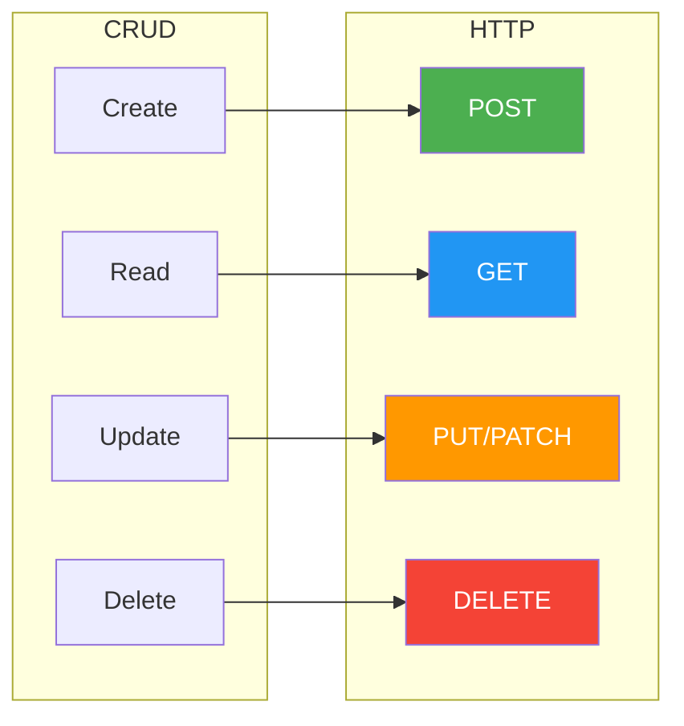
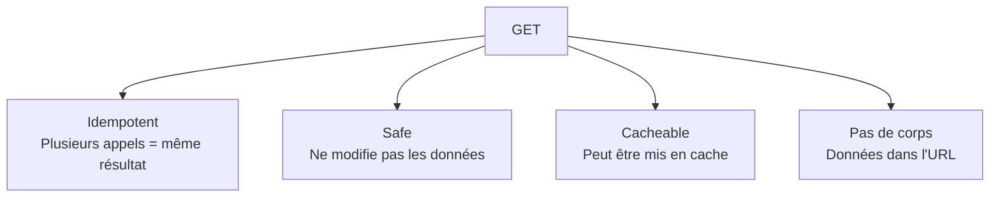
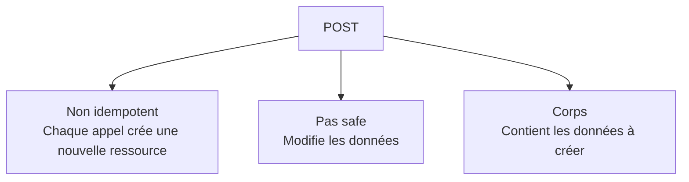
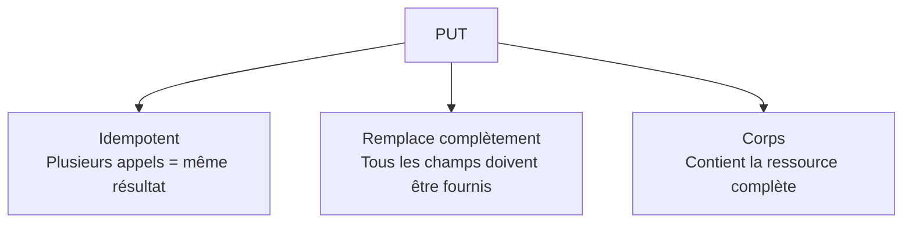
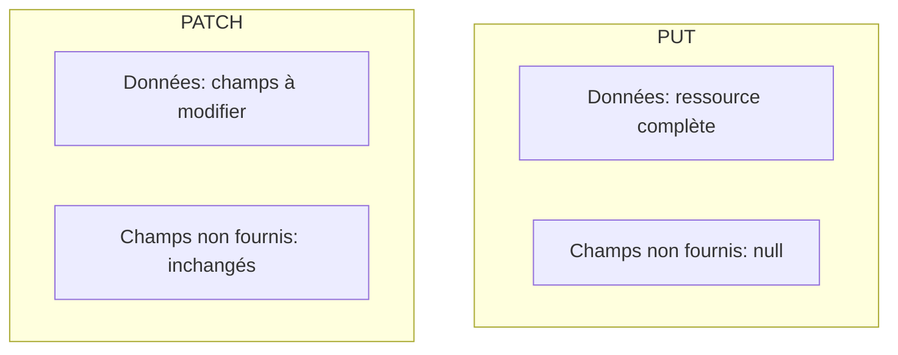
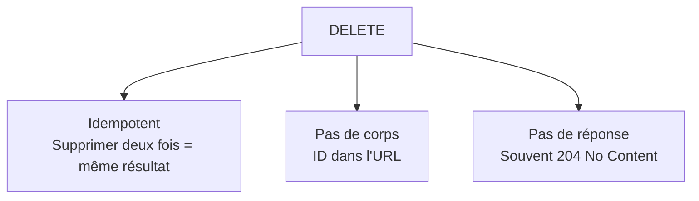
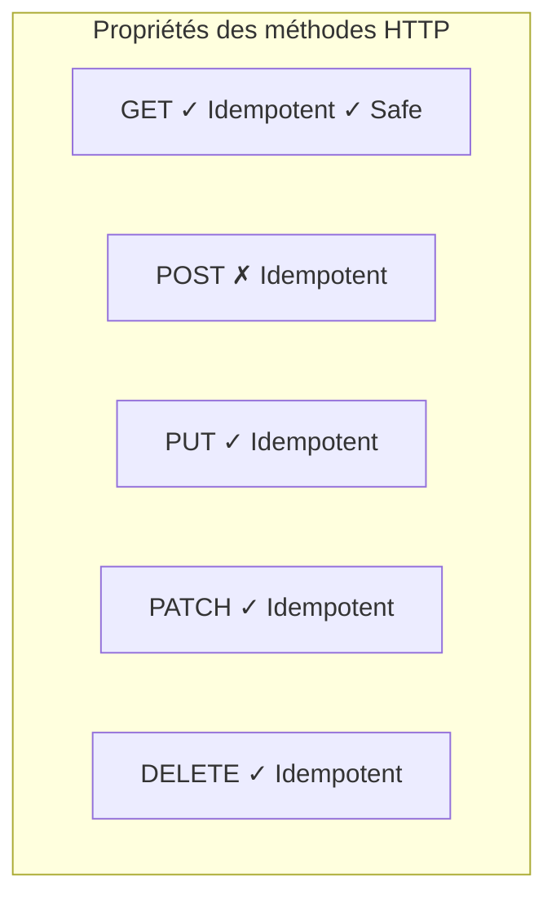
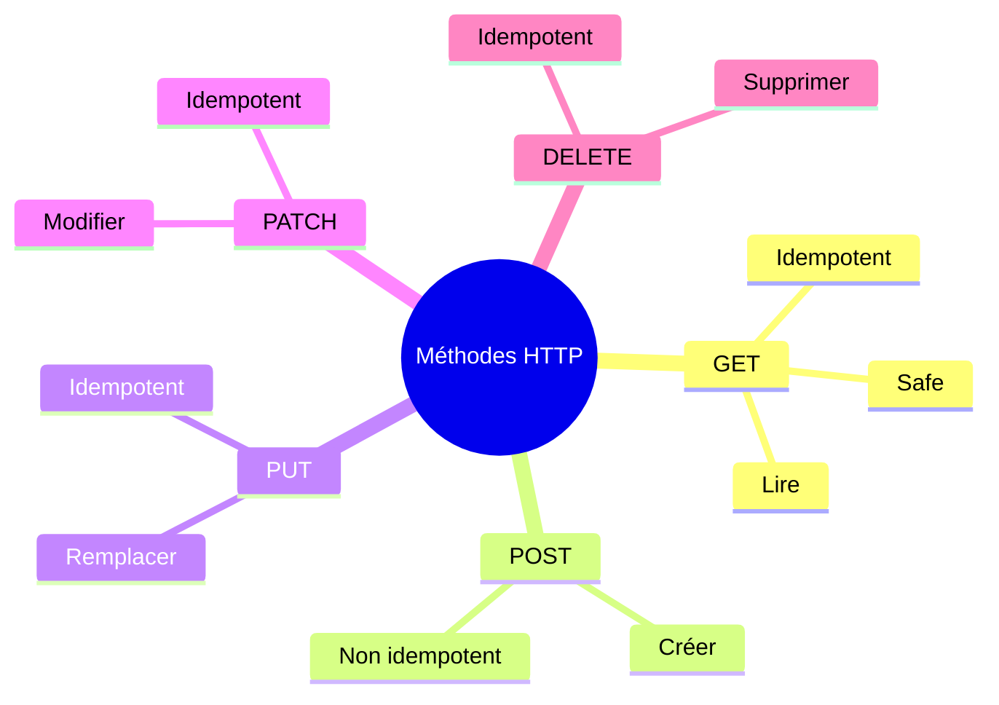

# Chapitre 3.3 - Méthodes HTTP (GET, POST, PUT, DELETE)

## Objectifs du chapitre

- Maîtriser les méthodes HTTP
- Savoir quand utiliser chaque méthode
- Implémenter les opérations CRUD

---

## 1. Vue d'ensemble

### Correspondance CRUD - HTTP



| CRUD | HTTP | Description |
|------|------|-------------|
| Create | POST | Créer une ressource |
| Read | GET | Lire une ressource |
| Update | PUT/PATCH | Modifier une ressource |
| Delete | DELETE | Supprimer une ressource |

---

## 2. GET - Lire

### Caractéristiques



- **Idempotent** : Plusieurs appels donnent le même résultat
- **Safe** : Ne modifie pas les données
- **Cacheable** : Peut être mis en cache
- **Pas de corps** : Les données sont dans l'URL

### Exemples

```java
// Liste tous les leads
// GET /api/leads
@GetMapping
public List<LeadDto> getAllLeads() {
    return service.findAll();
}

// Liste avec pagination
// GET /api/leads?page=0&size=10
@GetMapping
public Page<LeadDto> getAllLeads(Pageable pageable) {
    return service.findAll(pageable);
}

// Récupère un lead par ID
// GET /api/leads/123
@GetMapping("/{id}")
public ResponseEntity<LeadDto> getLeadById(@PathVariable Long id) {
    return ResponseEntity.ok(service.findById(id));
}

// Filtre par statut
// GET /api/leads?status=NEW
@GetMapping
public List<LeadDto> getLeadsByStatus(@RequestParam LeadStatus status) {
    return service.findByStatus(status);
}

// Recherche
// GET /api/leads/search?q=dupont
@GetMapping("/search")
public List<LeadDto> search(@RequestParam("q") String query) {
    return service.search(query);
}
```

### Réponses typiques

```
200 OK              - Succès
404 Not Found       - Ressource inexistante
```

---

## 3. POST - Créer

### Caractéristiques



- **Non idempotent** : Chaque appel crée une nouvelle ressource
- **Pas safe** : Modifie les données
- **Corps** : Contient les données à créer

### Exemples

```java
// Crée un nouveau lead
// POST /api/leads
@PostMapping
@ResponseStatus(HttpStatus.CREATED)
public LeadDto createLead(@RequestBody @Valid ContactFormRequest request) {
    return service.create(request);
}

// Avec ResponseEntity pour plus de contrôle
@PostMapping
public ResponseEntity<LeadDto> createLead(@RequestBody @Valid ContactFormRequest request) {
    LeadDto created = service.create(request);
    URI location = URI.create("/api/leads/" + created.getId());
    return ResponseEntity.created(location).body(created);
}
```

### Requête HTTP

```
POST /api/leads HTTP/1.1
Content-Type: application/json

{
  "fullName": "Jean Dupont",
  "email": "jean@example.com",
  "requestType": "INFO",
  "message": "Je voudrais des informations"
}
```

### Réponses typiques

```
201 Created         - Ressource créée
400 Bad Request     - Données invalides
409 Conflict        - Doublon (email existe déjà)
```

---

## 4. PUT - Remplacer

### Caractéristiques



- **Idempotent** : Plusieurs appels donnent le même résultat
- **Remplace complètement** : Tous les champs doivent être fournis
- **Corps** : Contient la ressource complète

### Exemples

```java
// Remplace complètement un lead
// PUT /api/leads/123
@PutMapping("/{id}")
public ResponseEntity<LeadDto> updateLead(
        @PathVariable Long id,
        @RequestBody @Valid LeadUpdateRequest request) {
    LeadDto updated = service.replace(id, request);
    return ResponseEntity.ok(updated);
}
```

### Requête HTTP

```
PUT /api/leads/123 HTTP/1.1
Content-Type: application/json

{
  "fullName": "Jean Dupont",
  "email": "nouveau@example.com",
  "company": "ACME Corp",
  "phone": "0123456789",
  "requestType": "DEMO",
  "message": "Mise à jour complète"
}
```

### PUT vs PATCH



| Aspect | PUT | PATCH |
|--------|-----|-------|
| Données | Ressource complète | Champs à modifier |
| Champs non fournis | Remis à null | Non modifiés |
| Idempotent | Oui | Oui |

---

## 5. PATCH - Modifier partiellement

### Caractéristiques

- **Idempotent** : Plusieurs appels donnent le même résultat
- **Modifie partiellement** : Seuls les champs fournis sont modifiés
- **Corps** : Contient seulement les champs à modifier

### Exemples

```java
// Modifie le statut d'un lead
// PATCH /api/leads/123
@PatchMapping("/{id}")
public ResponseEntity<LeadDto> updateStatus(
        @PathVariable Long id,
        @RequestBody UpdateStatusRequest request) {
    LeadDto updated = service.updateStatus(id, request);
    return ResponseEntity.ok(updated);
}

// Modification partielle générique
@PatchMapping("/{id}")
public ResponseEntity<LeadDto> partialUpdate(
        @PathVariable Long id,
        @RequestBody Map<String, Object> updates) {
    LeadDto updated = service.partialUpdate(id, updates);
    return ResponseEntity.ok(updated);
}
```

### Requête HTTP

```
PATCH /api/leads/123 HTTP/1.1
Content-Type: application/json

{
  "status": "CONTACTED"
}
```

---

## 6. DELETE - Supprimer

### Caractéristiques



- **Idempotent** : Supprimer deux fois = supprimer une fois
- **Pas de corps** : L'ID est dans l'URL
- **Pas de réponse** : Souvent 204 No Content

### Exemples

```java
// Supprime un lead
// DELETE /api/leads/123
@DeleteMapping("/{id}")
@ResponseStatus(HttpStatus.NO_CONTENT)
public void deleteLead(@PathVariable Long id) {
    service.delete(id);
}

// Avec vérification et réponse
@DeleteMapping("/{id}")
public ResponseEntity<Void> deleteLead(@PathVariable Long id) {
    if (!service.exists(id)) {
        return ResponseEntity.notFound().build();
    }
    service.delete(id);
    return ResponseEntity.noContent().build();
}

// Suppression logique (soft delete)
@DeleteMapping("/{id}")
public ResponseEntity<LeadDto> softDelete(@PathVariable Long id) {
    LeadDto deleted = service.softDelete(id);
    return ResponseEntity.ok(deleted);
}
```

### Réponses typiques

```
204 No Content      - Suppression réussie
404 Not Found       - Ressource inexistante
```

---

## 7. Exemple complet : LeadController

```java
@RestController
@RequestMapping("/api/leads")
@RequiredArgsConstructor
public class LeadController {

    private final LeadService service;

    // CREATE
    @PostMapping
    public ResponseEntity<LeadDto> create(@RequestBody @Valid ContactFormRequest request) {
        LeadDto created = service.create(request);
        return ResponseEntity
                .created(URI.create("/api/leads/" + created.getId()))
                .body(created);
    }

    // READ (list)
    @GetMapping
    public Page<LeadDto> getAll(Pageable pageable) {
        return service.findAll(pageable);
    }

    // READ (single)
    @GetMapping("/{id}")
    public ResponseEntity<LeadDto> getById(@PathVariable Long id) {
        return ResponseEntity.ok(service.findById(id));
    }

    // UPDATE (replace)
    @PutMapping("/{id}")
    public ResponseEntity<LeadDto> replace(
            @PathVariable Long id,
            @RequestBody @Valid LeadUpdateRequest request) {
        return ResponseEntity.ok(service.replace(id, request));
    }

    // UPDATE (partial)
    @PatchMapping("/{id}/status")
    public ResponseEntity<LeadDto> updateStatus(
            @PathVariable Long id,
            @RequestBody @Valid UpdateStatusRequest request) {
        return ResponseEntity.ok(service.updateStatus(id, request));
    }

    // DELETE
    @DeleteMapping("/{id}")
    public ResponseEntity<Void> delete(@PathVariable Long id) {
        service.delete(id);
        return ResponseEntity.noContent().build();
    }
}
```

---

## 8. Idempotence

### Définition

Une opération est **idempotente** si l'exécuter plusieurs fois produit le même résultat qu'une seule exécution.

### Tableau récapitulatif



| Méthode | Idempotent | Safe | Cacheable |
|---------|------------|------|-----------|
| GET | Oui | Oui | Oui |
| POST | Non | Non | Non |
| PUT | Oui | Non | Non |
| PATCH | Oui | Non | Non |
| DELETE | Oui | Non | Non |

### Exemples

```
// GET est idempotent et safe
GET /api/leads/123    # Renvoie le lead
GET /api/leads/123    # Renvoie le même lead

// POST n'est pas idempotent
POST /api/leads       # Crée lead ID 1
POST /api/leads       # Crée lead ID 2 (nouveau!)

// PUT est idempotent
PUT /api/leads/123    # Remplace le lead
PUT /api/leads/123    # Même résultat

// DELETE est idempotent
DELETE /api/leads/123 # Supprime le lead
DELETE /api/leads/123 # Déjà supprimé, même résultat
```

---

## 9. Points clés à retenir



1. **GET** = Lire (idempotent, safe)
2. **POST** = Créer (non idempotent)
3. **PUT** = Remplacer complètement (idempotent)
4. **PATCH** = Modifier partiellement (idempotent)
5. **DELETE** = Supprimer (idempotent)

---

## QUIZ 3.3 - Méthodes HTTP

**1. Quelle méthode HTTP pour créer une ressource?**
- a) GET
- b) POST
- c) PUT
- d) CREATE

<details>
<summary>Voir la réponse</summary>

**Réponse : b) POST**

POST est la méthode standard pour créer une nouvelle ressource. CREATE n'existe pas comme méthode HTTP.
</details>

---

**2. Quelle est la différence entre PUT et PATCH?**
- a) Aucune
- b) PUT remplace, PATCH modifie partiellement
- c) PATCH remplace, PUT modifie
- d) PUT est pour création

<details>
<summary>Voir la réponse</summary>

**Réponse : b) PUT remplace, PATCH modifie partiellement**

PUT envoie la ressource complète, PATCH envoie seulement les champs à modifier.
</details>

---

**3. Quelle méthode est idempotente?**
- a) POST seulement
- b) GET, PUT, PATCH, DELETE
- c) GET seulement
- d) Aucune

<details>
<summary>Voir la réponse</summary>

**Réponse : b) GET, PUT, PATCH, DELETE**

Toutes sauf POST sont idempotentes. Exécuter plusieurs fois donne le même résultat.
</details>

---

**4. Quel code HTTP retourner après DELETE?**
- a) 200 OK
- b) 201 Created
- c) 204 No Content
- d) 202 Accepted

<details>
<summary>Voir la réponse</summary>

**Réponse : c) 204 No Content**

204 indique que l'opération a réussi mais qu'il n'y a pas de contenu à retourner.
</details>

---

**5. VRAI ou FAUX : GET peut avoir un corps de requête.**

<details>
<summary>Voir la réponse</summary>

**Réponse : FAUX (techniquement possible mais déconseillé)**

Les spécifications HTTP ne l'interdisent pas, mais c'est une mauvaise pratique. Les données doivent être dans l'URL.
</details>

---

**6. Quelle méthode est "safe"?**
- a) POST
- b) PUT
- c) GET
- d) DELETE

<details>
<summary>Voir la réponse</summary>

**Réponse : c) GET**

Une méthode "safe" ne modifie pas les données. Seuls GET et HEAD sont safe.
</details>

---

**7. POST est-il idempotent?**
- a) Oui
- b) Non
- c) Parfois
- d) Ça dépend

<details>
<summary>Voir la réponse</summary>

**Réponse : b) Non**

Chaque POST crée une nouvelle ressource. Deux POST identiques créent deux ressources différentes.
</details>

---

**8. Complétez : PUT est _______ car plusieurs appels donnent le même résultat.**

<details>
<summary>Voir la réponse</summary>

**Réponse : idempotent**

Envoyer deux fois PUT /leads/123 avec les mêmes données produit le même état final.
</details>

---

**9. Quel code HTTP pour une création réussie avec POST?**
- a) 200 OK
- b) 201 Created
- c) 204 No Content
- d) 202 Accepted

<details>
<summary>Voir la réponse</summary>

**Réponse : b) 201 Created**

201 indique qu'une ressource a été créée. L'en-tête Location devrait contenir l'URL de la nouvelle ressource.
</details>

---

**10. Si un champ n'est pas fourni dans un PUT, que se passe-t-il?**
- a) Erreur
- b) Le champ est ignoré
- c) Le champ est mis à null
- d) Le champ garde sa valeur

<details>
<summary>Voir la réponse</summary>

**Réponse : c) Le champ est mis à null**

PUT remplace toute la ressource. Les champs absents sont considérés comme null. Pour modifier partiellement, utilisez PATCH.
</details>

---

## Navigation

| Précédent | Suivant |
|-----------|---------|
| [12 - Annotations Spring MVC](12-annotations-spring-mvc.md) | [14 - Codes de réponse HTTP](14-codes-reponse-http.md) |
