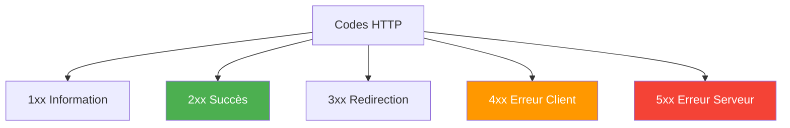
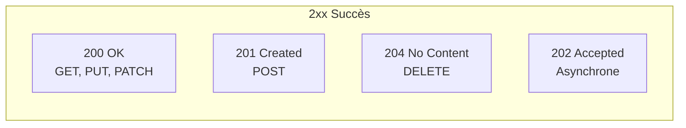
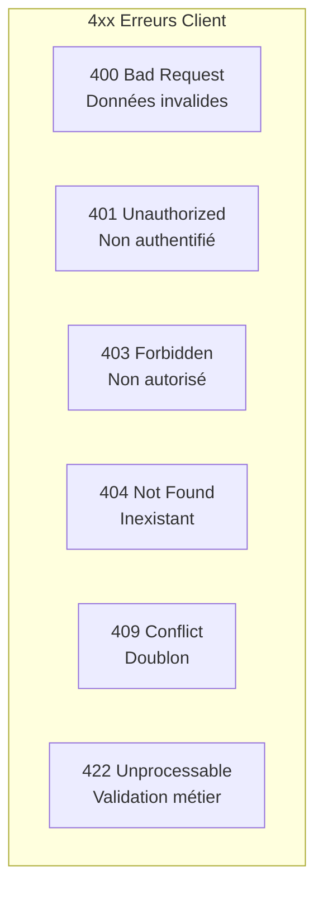
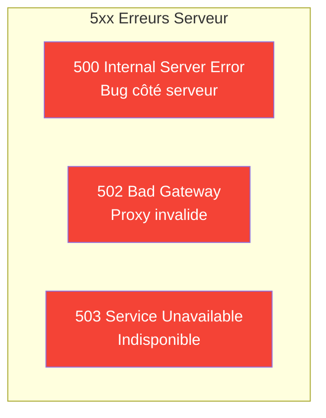
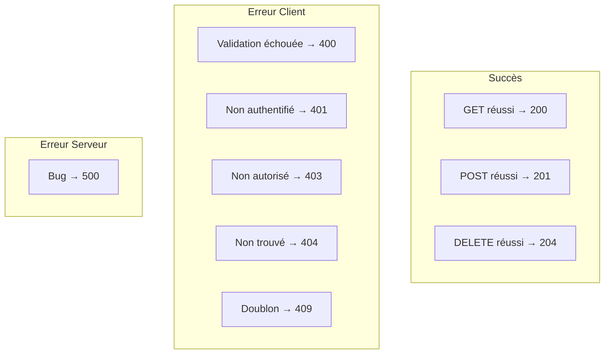
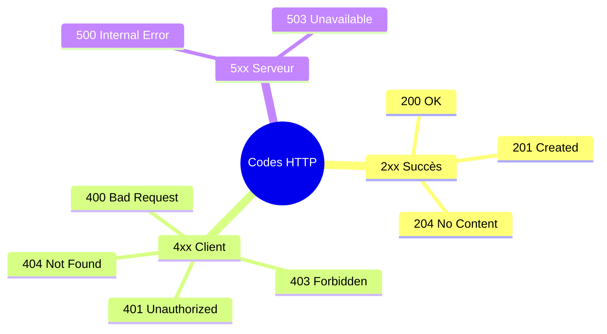

# Chapitre 3.4 - Codes de réponse HTTP

## Objectifs du chapitre

- Connaître les codes de statut HTTP
- Savoir quel code utiliser dans chaque situation
- Implémenter les réponses appropriées

---

## 1. Catégories de codes

### Diagramme des catégories



| Plage | Catégorie | Description |
|-------|-----------|-------------|
| 1xx | Information | Requête reçue, traitement en cours |
| 2xx | Succès | Requête réussie |
| 3xx | Redirection | Action supplémentaire requise |
| 4xx | Erreur client | Erreur dans la requête |
| 5xx | Erreur serveur | Erreur côté serveur |

---

## 2. Codes de succès (2xx)

### Diagramme des codes de succès



### 200 OK

La requête a réussi. Utilisé pour GET, PUT, PATCH.

```java
@GetMapping("/{id}")
public ResponseEntity<LeadDto> getLead(@PathVariable Long id) {
    LeadDto lead = service.findById(id);
    return ResponseEntity.ok(lead);  // 200
}
```

### 201 Created

Une ressource a été créée. Utilisé pour POST.

```java
@PostMapping
public ResponseEntity<LeadDto> create(@RequestBody @Valid Request request) {
    LeadDto created = service.create(request);
    URI location = URI.create("/api/leads/" + created.getId());
    return ResponseEntity.created(location).body(created);  // 201
}
```

### 204 No Content

Succès sans contenu à retourner. Utilisé pour DELETE.

```java
@DeleteMapping("/{id}")
public ResponseEntity<Void> delete(@PathVariable Long id) {
    service.delete(id);
    return ResponseEntity.noContent().build();  // 204
}
```

### 202 Accepted

Requête acceptée, traitement en cours (asynchrone).

```java
@PostMapping("/export")
public ResponseEntity<Void> exportLeads() {
    service.startExportAsync();  // Traitement en arrière-plan
    return ResponseEntity.accepted().build();  // 202
}
```

---

## 3. Codes d'erreur client (4xx)

### Diagramme des erreurs client



### 400 Bad Request

Requête mal formée ou données invalides.

```java
@ExceptionHandler(MethodArgumentNotValidException.class)
public ResponseEntity<ErrorResponse> handleValidation(MethodArgumentNotValidException ex) {
    return ResponseEntity.badRequest().body(
        new ErrorResponse("Données invalides")
    );  // 400
}
```

### 401 Unauthorized

Non authentifié (identité non prouvée).

```java
// Géré automatiquement par Spring Security
// Retourne 401 si pas de token ou token invalide
```

### 403 Forbidden

Authentifié mais non autorisé (permissions insuffisantes).

```java
@ExceptionHandler(AccessDeniedException.class)
public ResponseEntity<ErrorResponse> handleForbidden(AccessDeniedException ex) {
    return ResponseEntity.status(HttpStatus.FORBIDDEN).body(
        new ErrorResponse("Accès refusé")
    );  // 403
}
```

### 404 Not Found

Ressource inexistante.

```java
@ExceptionHandler(ResourceNotFoundException.class)
public ResponseEntity<ErrorResponse> handleNotFound(ResourceNotFoundException ex) {
    return ResponseEntity.notFound().build();  // 404
}

// Ou avec corps
return ResponseEntity.status(HttpStatus.NOT_FOUND).body(
    new ErrorResponse("Lead non trouvé")
);
```

### 405 Method Not Allowed

Méthode HTTP non supportée pour cette ressource.

```java
// Si GET /api/leads/123 existe mais POST /api/leads/123 non
// Spring retourne automatiquement 405
```

### 409 Conflict

Conflit avec l'état actuel (doublon, version obsolète).

```java
@ExceptionHandler(DuplicateEmailException.class)
public ResponseEntity<ErrorResponse> handleConflict(DuplicateEmailException ex) {
    return ResponseEntity.status(HttpStatus.CONFLICT).body(
        new ErrorResponse("Un lead avec cet email existe déjà")
    );  // 409
}
```

### 422 Unprocessable Entity

Données syntaxiquement correctes mais sémantiquement invalides.

```java
@ExceptionHandler(BusinessException.class)
public ResponseEntity<ErrorResponse> handleBusiness(BusinessException ex) {
    return ResponseEntity.unprocessableEntity().body(
        new ErrorResponse(ex.getMessage())
    );  // 422
}
```

---

## 4. Codes d'erreur serveur (5xx)

### Diagramme des erreurs serveur



### 500 Internal Server Error

Erreur interne du serveur.

```java
@ExceptionHandler(Exception.class)
public ResponseEntity<ErrorResponse> handleGeneric(Exception ex) {
    log.error("Erreur interne", ex);
    return ResponseEntity.internalServerError().body(
        new ErrorResponse("Erreur interne du serveur")
    );  // 500
}
```

### 502 Bad Gateway

Le serveur agit comme proxy et a reçu une réponse invalide.

### 503 Service Unavailable

Service temporairement indisponible.

```java
@ExceptionHandler(ServiceUnavailableException.class)
public ResponseEntity<ErrorResponse> handleUnavailable(ServiceUnavailableException ex) {
    return ResponseEntity.status(HttpStatus.SERVICE_UNAVAILABLE).body(
        new ErrorResponse("Service temporairement indisponible")
    );  // 503
}
```

---

## 5. Tableau récapitulatif

### Quand utiliser chaque code



| Code | Nom | Quand l'utiliser |
|------|-----|------------------|
| 200 | OK | GET, PUT, PATCH réussi |
| 201 | Created | POST réussi |
| 204 | No Content | DELETE réussi |
| 400 | Bad Request | Validation échouée |
| 401 | Unauthorized | Non authentifié |
| 403 | Forbidden | Pas les permissions |
| 404 | Not Found | Ressource inexistante |
| 409 | Conflict | Doublon |
| 422 | Unprocessable Entity | Erreur métier |
| 500 | Internal Server Error | Bug serveur |

---

## 6. ResponseEntity en détail

### Méthodes statiques

```java
// 200 OK avec corps
ResponseEntity.ok(body);
ResponseEntity.ok().body(body);

// 201 Created avec location
ResponseEntity.created(URI.create("/api/leads/1")).body(body);

// 204 No Content
ResponseEntity.noContent().build();

// 400 Bad Request
ResponseEntity.badRequest().body(error);

// 404 Not Found
ResponseEntity.notFound().build();

// 422 Unprocessable Entity
ResponseEntity.unprocessableEntity().body(error);

// 500 Internal Server Error
ResponseEntity.internalServerError().body(error);

// Code personnalisé
ResponseEntity.status(HttpStatus.CONFLICT).body(error);
```

### Builder complet

```java
ResponseEntity
    .status(HttpStatus.CREATED)
    .header("X-Custom-Header", "value")
    .contentType(MediaType.APPLICATION_JSON)
    .body(lead);
```

---

## 7. Réponse d'erreur standardisée

### ErrorResponse.java

```java
@Data
@AllArgsConstructor
public class ErrorResponse {
    private LocalDateTime timestamp;
    private int status;
    private String error;
    private String message;
    private String path;
    
    public ErrorResponse(int status, String message, String path) {
        this.timestamp = LocalDateTime.now();
        this.status = status;
        this.error = HttpStatus.valueOf(status).getReasonPhrase();
        this.message = message;
        this.path = path;
    }
}
```

### Réponse JSON

```json
{
  "timestamp": "2024-01-15T10:30:00",
  "status": 404,
  "error": "Not Found",
  "message": "Lead non trouvé avec l'ID 123",
  "path": "/api/leads/123"
}
```

---

## 8. GlobalExceptionHandler

```java
@RestControllerAdvice
public class GlobalExceptionHandler {

    @ExceptionHandler(ResourceNotFoundException.class)
    public ResponseEntity<ErrorResponse> handleNotFound(
            ResourceNotFoundException ex, HttpServletRequest request) {
        ErrorResponse error = new ErrorResponse(
            404, ex.getMessage(), request.getRequestURI()
        );
        return ResponseEntity.status(HttpStatus.NOT_FOUND).body(error);
    }

    @ExceptionHandler(MethodArgumentNotValidException.class)
    public ResponseEntity<ErrorResponse> handleValidation(
            MethodArgumentNotValidException ex, HttpServletRequest request) {
        String message = ex.getBindingResult().getFieldErrors().stream()
            .map(e -> e.getField() + ": " + e.getDefaultMessage())
            .collect(Collectors.joining(", "));
        ErrorResponse error = new ErrorResponse(
            400, message, request.getRequestURI()
        );
        return ResponseEntity.badRequest().body(error);
    }

    @ExceptionHandler(Exception.class)
    public ResponseEntity<ErrorResponse> handleGeneric(
            Exception ex, HttpServletRequest request) {
        ErrorResponse error = new ErrorResponse(
            500, "Erreur interne", request.getRequestURI()
        );
        return ResponseEntity.internalServerError().body(error);
    }
}
```

---

## 9. Points clés à retenir



1. **2xx** = Succès (200, 201, 204)
2. **4xx** = Erreur client (400, 401, 403, 404)
3. **5xx** = Erreur serveur (500, 503)
4. **ResponseEntity** pour contrôler le code et le corps
5. **Standardiser** les réponses d'erreur

---

## QUIZ 3.4 - Codes de réponse HTTP

**1. Quel code pour une création réussie?**
- a) 200 OK
- b) 201 Created
- c) 204 No Content
- d) 202 Accepted

<details>
<summary>Voir la réponse</summary>

**Réponse : b) 201 Created**

201 indique qu'une nouvelle ressource a été créée. L'en-tête Location devrait contenir l'URL de la ressource.
</details>

---

**2. Quelle est la différence entre 401 et 403?**
- a) Aucune
- b) 401 = non authentifié, 403 = non autorisé
- c) 401 = non autorisé, 403 = non authentifié
- d) 401 = client, 403 = serveur

<details>
<summary>Voir la réponse</summary>

**Réponse : b) 401 = non authentifié, 403 = non autorisé**

401: L'identité n'est pas prouvée (pas de token ou token invalide).
403: L'identité est connue mais n'a pas les permissions.
</details>

---

**3. Quel code pour une ressource inexistante?**
- a) 400
- b) 401
- c) 403
- d) 404

<details>
<summary>Voir la réponse</summary>

**Réponse : d) 404**

404 Not Found indique que la ressource demandée n'existe pas ou n'a pas été trouvée.
</details>

---

**4. Quel code après un DELETE réussi?**
- a) 200 OK
- b) 201 Created
- c) 204 No Content
- d) 202 Accepted

<details>
<summary>Voir la réponse</summary>

**Réponse : c) 204 No Content**

204 indique que l'opération a réussi mais qu'il n'y a pas de contenu à retourner.
</details>

---

**5. VRAI ou FAUX : 500 indique une erreur dans la requête client.**

<details>
<summary>Voir la réponse</summary>

**Réponse : FAUX**

500 est une erreur SERVEUR (bug dans le code). Les erreurs client sont 4xx.
</details>

---

**6. Quel code pour des données invalides?**
- a) 400 Bad Request
- b) 401 Unauthorized
- c) 404 Not Found
- d) 500 Internal Server Error

<details>
<summary>Voir la réponse</summary>

**Réponse : a) 400 Bad Request**

400 indique que la requête est mal formée ou que les données ne passent pas la validation.
</details>

---

**7. La plage 4xx indique quoi?**
- a) Succès
- b) Redirection
- c) Erreur client
- d) Erreur serveur

<details>
<summary>Voir la réponse</summary>

**Réponse : c) Erreur client**

4xx = Erreur client (requête invalide, non authentifié, non autorisé, ressource inexistante).
</details>

---

**8. Complétez : ResponseEntity.ok() retourne un code _______.**

<details>
<summary>Voir la réponse</summary>

**Réponse : 200**

ResponseEntity.ok() crée une réponse avec le code HTTP 200 OK.
</details>

---

**9. Quel code pour un doublon (email existe déjà)?**
- a) 400
- b) 404
- c) 409
- d) 422

<details>
<summary>Voir la réponse</summary>

**Réponse : c) 409**

409 Conflict indique un conflit avec l'état actuel de la ressource (doublon, version obsolète).
</details>

---

**10. Quel code si le service est temporairement indisponible?**
- a) 500
- b) 502
- c) 503
- d) 504

<details>
<summary>Voir la réponse</summary>

**Réponse : c) 503**

503 Service Unavailable indique que le service est temporairement indisponible (maintenance, surcharge).
</details>

---

## Navigation

| Précédent | Suivant |
|-----------|---------|
| [13 - Méthodes HTTP](13-methodes-http.md) | [15 - Validation des données](15-validation-donnees.md) |
