# Chapitre 3.5 - Validation des données

## Objectifs du chapitre

- Comprendre l'importance de la validation
- Utiliser Bean Validation
- Créer des validations personnalisées
- Gérer les erreurs de validation

---

## 1. Introduction à Bean Validation

### Qu'est-ce que Bean Validation?

**Bean Validation** (JSR 380) est une spécification Java standard pour valider les objets avec des annotations déclaratives. L'implémentation de référence est **Hibernate Validator**.

### Diagramme : Pourquoi valider?

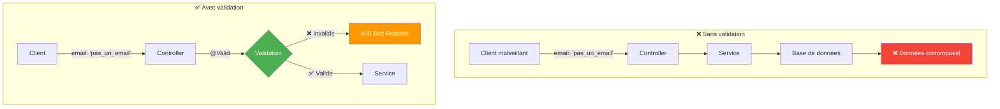

### Principes fondamentaux

1. **Ne jamais faire confiance aux données entrantes** : Même avec un frontend qui valide, toujours valider côté serveur
2. **Fail Fast** : Rejeter les données invalides le plus tôt possible
3. **Messages clairs** : Informer l'utilisateur de ce qui est incorrect

### Dépendance Maven

```xml
<dependency>
    <groupId>org.springframework.boot</groupId>
    <artifactId>spring-boot-starter-validation</artifactId>
</dependency>
```

> **Note** : Cette dépendance inclut Hibernate Validator, l'implémentation de référence de Bean Validation.

---

## 2. Annotations de validation

### Vue d'ensemble

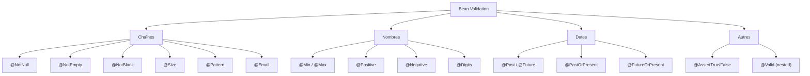

### Annotations pour les chaînes

| Annotation | Description | Exemple |
|------------|-------------|---------|
| @NotNull | Ne doit pas être null | Accepte "" |
| @NotEmpty | Non null ET non vide | Accepte "   " |
| @NotBlank | Non null, non vide, non espaces seuls | Le plus strict |
| @Size(min, max) | Taille entre min et max | Longueur de texte |
| @Pattern(regexp) | Doit correspondre à l'expression régulière | Format spécifique |
| @Email | Format email valide | Adresse email |

### Diagramme : Différence NotNull vs NotEmpty vs NotBlank

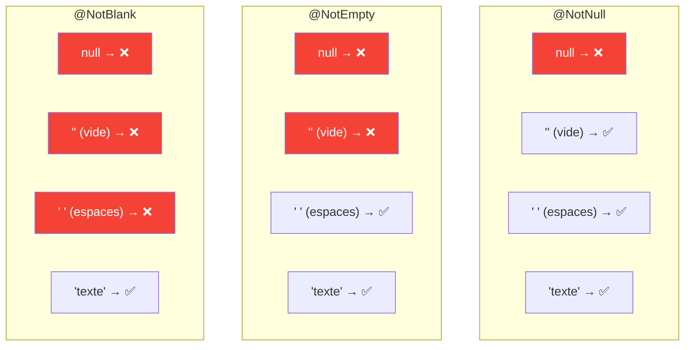

### Exemple avec chaînes

```java
public class ContactFormRequest {
    
    @NotBlank(message = "Le nom est obligatoire")
    @Size(min = 2, max = 100, message = "Le nom doit faire entre 2 et 100 caractères")
    private String fullName;
    
    @NotBlank(message = "L'email est obligatoire")
    @Email(message = "Format d'email invalide")
    private String email;
    
    @Pattern(regexp = "^[+]?[0-9\\s-]{0,20}$", message = "Format de téléphone invalide")
    private String phone;
}
```

### Annotations pour les nombres

| Annotation | Description | Valide pour |
|------------|-------------|-------------|
| @Min(value) | Valeur minimale | int, long, BigDecimal |
| @Max(value) | Valeur maximale | int, long, BigDecimal |
| @Positive | Doit être > 0 | Nombres |
| @PositiveOrZero | Doit être >= 0 | Nombres |
| @Negative | Doit être < 0 | Nombres |
| @NegativeOrZero | Doit être <= 0 | Nombres |
| @Digits(integer, fraction) | Nombre de chiffres | BigDecimal |

```java
public class ProductRequest {
    
    @Positive(message = "Le prix doit être positif")
    @Digits(integer = 10, fraction = 2, message = "Format de prix invalide")
    private BigDecimal price;
    
    @Min(value = 0, message = "La quantité ne peut pas être négative")
    @Max(value = 1000, message = "La quantité ne peut pas dépasser 1000")
    private Integer quantity;
}
```

### Annotations pour les dates

| Annotation | Description | Exemple d'usage |
|------------|-------------|-----------------|
| @Past | Doit être dans le passé | Date de naissance |
| @PastOrPresent | Passé ou présent | Date de création |
| @Future | Doit être dans le futur | Date d'événement |
| @FutureOrPresent | Futur ou présent | Date de début |

```java
public class EventRequest {
    
    @FutureOrPresent(message = "La date ne peut pas être dans le passé")
    private LocalDateTime eventDate;
    
    @Past(message = "La date de naissance doit être dans le passé")
    private LocalDate birthDate;
}
```

---

## 3. Activer la validation

### L'annotation @Valid

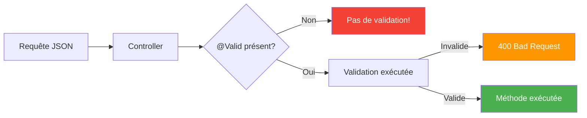

### Dans le Controller

```java
@PostMapping
public ResponseEntity<LeadDto> create(
        @RequestBody @Valid ContactFormRequest request) {  // @Valid active la validation
    return ResponseEntity.ok(service.create(request));
}
```

### Sans @Valid (erreur courante!)

```java
@PostMapping
public ResponseEntity<LeadDto> create(
        @RequestBody ContactFormRequest request) {  // ⚠️ Pas de @Valid = pas de validation!
    return ResponseEntity.ok(service.create(request));
}
```

> **Piège fréquent** : Oublier @Valid est une erreur très courante. Les annotations sur le DTO sont là, mais sans @Valid, elles ne sont jamais évaluées!

---

## 4. DTO avec validation complète

### Diagramme : Structure du DTO validé

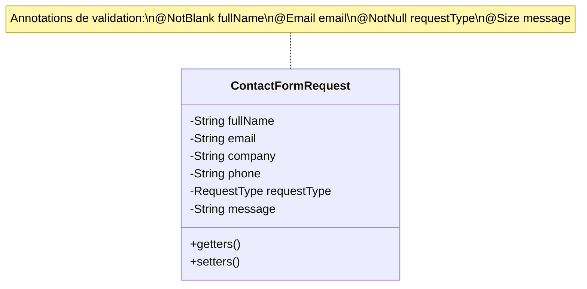

### ContactFormRequest.java

```java
package com.example.contact.dto.request;

import com.example.contact.model.RequestType;
import jakarta.validation.constraints.*;
import lombok.Data;

@Data
public class ContactFormRequest {
    
    @NotBlank(message = "Le nom complet est obligatoire")
    @Size(min = 2, max = 100, message = "Le nom doit faire entre {min} et {max} caractères")
    private String fullName;
    
    @NotBlank(message = "L'email est obligatoire")
    @Email(message = "Format d'email invalide")
    @Size(max = 255, message = "L'email ne peut pas dépasser {max} caractères")
    private String email;
    
    @Size(max = 100, message = "Le nom de l'entreprise ne peut pas dépasser {max} caractères")
    private String company;  // Optionnel
    
    @Pattern(
        regexp = "^$|^[+]?[0-9\\s()-]{6,20}$",
        message = "Format de téléphone invalide"
    )
    private String phone;  // Optionnel
    
    @NotNull(message = "Le type de demande est obligatoire")
    private RequestType requestType;
    
    @NotBlank(message = "Le message est obligatoire")
    @Size(min = 10, max = 5000, message = "Le message doit faire entre {min} et {max} caractères")
    private String message;
}
```

> **Astuce** : Utilisez {min} et {max} dans les messages pour éviter la duplication des valeurs.

---

## 5. Gestion des erreurs de validation

### Flux d'erreur

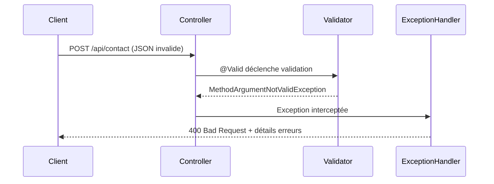

### Exception levée

Quand la validation échoue, Spring lève `MethodArgumentNotValidException`.

### GlobalExceptionHandler

```java
@RestControllerAdvice
public class GlobalExceptionHandler {

    @ExceptionHandler(MethodArgumentNotValidException.class)
    public ResponseEntity<ValidationErrorResponse> handleValidation(
            MethodArgumentNotValidException ex) {
        
        Map<String, String> errors = new HashMap<>();
        
        ex.getBindingResult().getFieldErrors().forEach(error -> {
            errors.put(error.getField(), error.getDefaultMessage());
        });
        
        ValidationErrorResponse response = new ValidationErrorResponse(
            HttpStatus.BAD_REQUEST.value(),
            "Erreur de validation",
            errors
        );
        
        return ResponseEntity.badRequest().body(response);
    }
}
```

### ValidationErrorResponse.java

```java
@Data
@AllArgsConstructor
public class ValidationErrorResponse {
    private int status;
    private String message;
    private Map<String, String> errors;
}
```

### Réponse JSON

```json
{
  "status": 400,
  "message": "Erreur de validation",
  "errors": {
    "fullName": "Le nom complet est obligatoire",
    "email": "Format d'email invalide",
    "message": "Le message doit faire entre 10 et 5000 caractères"
  }
}
```

---

## 6. Validation personnalisée

### Diagramme : Création d'une annotation personnalisée

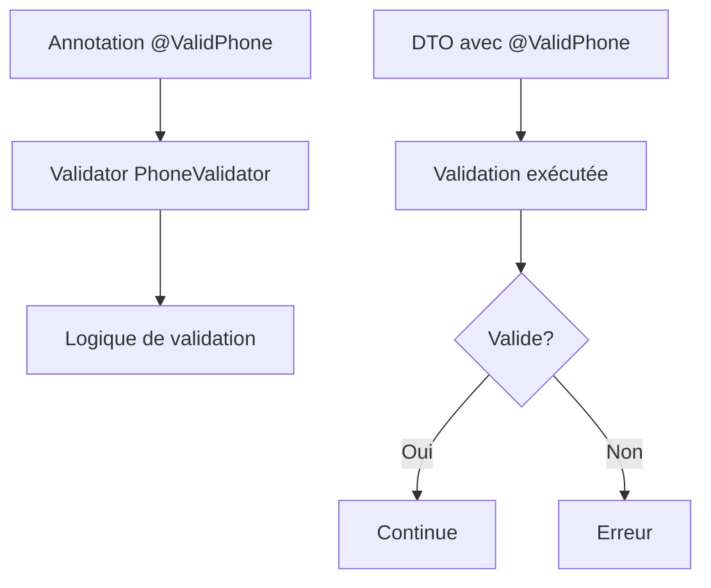

### Étape 1 : Créer l'annotation

```java
@Target({ElementType.FIELD})
@Retention(RetentionPolicy.RUNTIME)
@Constraint(validatedBy = PhoneValidator.class)
public @interface ValidPhone {
    String message() default "Format de téléphone invalide";
    Class<?>[] groups() default {};
    Class<? extends Payload>[] payload() default {};
}
```

### Étape 2 : Créer le validateur

```java
public class PhoneValidator implements ConstraintValidator<ValidPhone, String> {
    
    private static final Pattern PHONE_PATTERN = 
        Pattern.compile("^[+]?[0-9\\s()-]{6,20}$");
    
    @Override
    public boolean isValid(String value, ConstraintValidatorContext context) {
        if (value == null || value.isEmpty()) {
            return true;  // Utiliser @NotBlank si obligatoire
        }
        return PHONE_PATTERN.matcher(value).matches();
    }
}
```

### Étape 3 : Utilisation

```java
public class ContactFormRequest {
    
    @ValidPhone
    private String phone;
}
```

---

## 7. Validation de groupes

### Concept

Les groupes permettent d'appliquer différentes règles selon le contexte (création vs mise à jour).

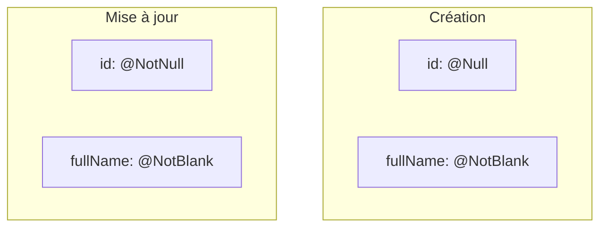

### Définir des groupes

```java
public interface OnCreate {}
public interface OnUpdate {}
```

### Appliquer les groupes

```java
public class LeadRequest {
    
    @Null(groups = OnCreate.class, message = "L'ID ne doit pas être fourni")
    @NotNull(groups = OnUpdate.class, message = "L'ID est obligatoire")
    private Long id;
    
    @NotBlank(groups = {OnCreate.class, OnUpdate.class})
    private String fullName;
}
```

### Utiliser @Validated

```java
@PostMapping
public ResponseEntity<?> create(
        @RequestBody @Validated(OnCreate.class) LeadRequest request) {
    // ID doit être null
}

@PutMapping("/{id}")
public ResponseEntity<?> update(
        @PathVariable Long id,
        @RequestBody @Validated(OnUpdate.class) LeadRequest request) {
    // ID doit être présent
}
```

---

## 8. Validation dans le Service

### Validation programmatique

Parfois, vous devez valider manuellement dans le service :

```java
@Service
public class LeadService {
    
    private final Validator validator;
    
    public LeadDto create(ContactFormRequest request) {
        // Validation manuelle
        Set<ConstraintViolation<ContactFormRequest>> violations = 
            validator.validate(request);
        
        if (!violations.isEmpty()) {
            throw new ValidationException(violations);
        }
        
        // Suite du traitement
    }
}
```

### Validation métier

Les règles métier ne vont PAS dans le DTO, mais dans le Service :

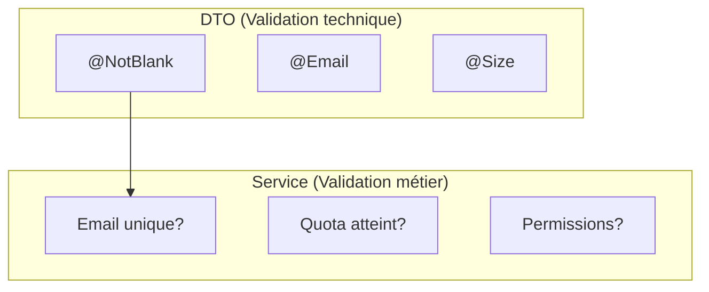

```java
public LeadDto create(ContactFormRequest request) {
    // Validation métier (pas dans le DTO)
    if (leadRepository.existsByEmail(request.getEmail())) {
        throw new DuplicateEmailException("Un lead avec cet email existe déjà");
    }
    
    // ...
}
```

---

## 9. Bonnes pratiques

### 9.1 Validation côté serveur obligatoire

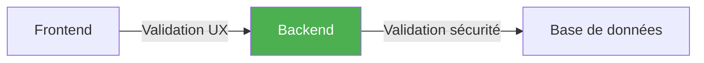

> **Important** : Même si le frontend valide, TOUJOURS valider côté serveur!

### 9.2 Messages clairs et localisés

```java
// ❌ MAUVAIS
@NotBlank
private String fullName;  // Message par défaut peu explicite

// ✅ BON
@NotBlank(message = "Le nom complet est obligatoire")
private String fullName;
```

### 9.3 Utiliser le bon type de validation

```java
// Pour une chaîne obligatoire
@NotBlank  // Vérifie null, vide, et espaces

// Pour un objet obligatoire (enum, autre DTO)
@NotNull

// Pour une liste non vide
@NotEmpty
```

### 9.4 Séparer validation technique et métier

| Type | Où | Exemples |
|------|-----|----------|
| Technique | DTO | @NotBlank, @Email, @Size |
| Métier | Service | Doublons, quotas, permissions |

---

## 10. Points clés à retenir

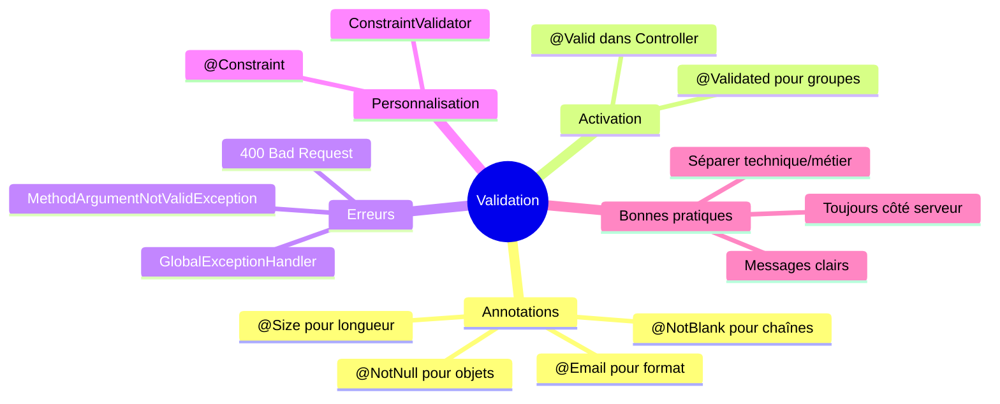

1. **@Valid** active la validation dans le controller
2. **@NotBlank** pour les chaînes obligatoires (le plus strict)
3. **@Email, @Pattern** pour les formats spécifiques
4. **MethodArgumentNotValidException** pour les erreurs de validation
5. **Validations personnalisées** avec @Constraint et ConstraintValidator

---

## QUIZ 3.5 - Validation des données

**1. Quelle annotation active la validation dans le controller?**
- a) @Validate
- b) @Valid
- c) @Check
- d) @Validated

<details>
<summary>Voir la réponse</summary>

**Réponse : b) @Valid**

@Valid (de jakarta.validation) active la validation des annotations sur le paramètre annoté. @Validated est utilisé pour les groupes de validation.
</details>

---

**2. Quelle annotation pour une chaîne non nulle et non vide?**
- a) @NotNull
- b) @NotEmpty
- c) @NotBlank
- d) @Required

<details>
<summary>Voir la réponse</summary>

**Réponse : c) @NotBlank**

@NotBlank est la plus stricte : elle rejette null, les chaînes vides "", et les chaînes avec uniquement des espaces "   ".
</details>

---

**3. Quelle exception est levée si la validation échoue?**
- a) ValidationException
- b) MethodArgumentNotValidException
- c) IllegalArgumentException
- d) BadRequestException

<details>
<summary>Voir la réponse</summary>

**Réponse : b) MethodArgumentNotValidException**

C'est l'exception levée par Spring quand @Valid détecte des violations de contraintes sur un @RequestBody.
</details>

---

**4. Quelle annotation valide un format email?**
- a) @Mail
- b) @Email
- c) @ValidEmail
- d) @EmailFormat

<details>
<summary>Voir la réponse</summary>

**Réponse : b) @Email**

@Email est l'annotation standard de Bean Validation pour valider le format d'une adresse email.
</details>

---

**5. VRAI ou FAUX : Si @Valid est absent, la validation est quand même exécutée.**

<details>
<summary>Voir la réponse</summary>

**Réponse : FAUX**

Sans @Valid sur le paramètre, les annotations de validation sur le DTO sont complètement ignorées. C'est une erreur très courante!
</details>

---

**6. Comment spécifier une taille minimale et maximale?**
- a) @Length(min, max)
- b) @Size(min, max)
- c) @Range(min, max)
- d) @Between(min, max)

<details>
<summary>Voir la réponse</summary>

**Réponse : b) @Size(min, max)**

@Size est l'annotation standard pour définir les bornes de taille d'une chaîne ou d'une collection.
</details>

---

**7. Quelle annotation pour un nombre positif?**
- a) @Min(1)
- b) @Positive
- c) @GreaterThanZero
- d) @Above(0)

<details>
<summary>Voir la réponse</summary>

**Réponse : b) @Positive**

@Positive vérifie que le nombre est strictement supérieur à 0. @Min(1) fonctionne aussi pour les entiers, mais @Positive est plus explicite et fonctionne avec les décimaux.
</details>

---

**8. Complétez : @Pattern valide avec une expression _______.**

<details>
<summary>Voir la réponse</summary>

**Réponse : régulière (ou regex)**

@Pattern(regexp = "...") utilise une expression régulière (regex) pour valider le format de la chaîne.
</details>

---

**9. Où placer la validation "email unique"?**
- a) Dans le DTO
- b) Dans le Controller
- c) Dans le Service
- d) Dans le Repository

<details>
<summary>Voir la réponse</summary>

**Réponse : c) Dans le Service**

La vérification d'unicité est une règle métier qui nécessite un accès à la base de données. Elle doit être dans le Service, pas dans le DTO (qui ne fait que de la validation technique de format).
</details>

---

**10. Quelle annotation pour une date dans le futur?**
- a) @After
- b) @FutureDate
- c) @Future
- d) @Later

<details>
<summary>Voir la réponse</summary>

**Réponse : c) @Future**

@Future vérifie que la date est strictement dans le futur. Utilisez @FutureOrPresent si le présent est accepté.
</details>

---

## Navigation

| Précédent | Suivant |
|-----------|---------|
| [14 - Codes réponse HTTP](14-codes-reponse-http.md) | [16 - JPA et Hibernate](16-jpa-hibernate.md) |
