# Chapitre 4.1 - JPA et Hibernate

## Objectifs du chapitre

- Comprendre la différence entre JPA et Hibernate
- Maîtriser le concept d'ORM
- Configurer JPA dans Spring Boot
- Gérer le cycle de vie des entités

---

## 1. Qu'est-ce que JPA?

### Définition

**JPA (Java Persistence API)** est une spécification Java standard pour le mapping objet-relationnel (ORM). Elle définit comment les objets Java sont persistés dans une base de données relationnelle.

### Diagramme : JPA comme spécification

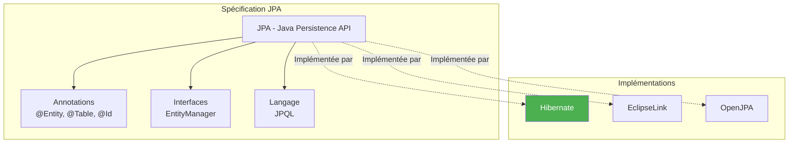

### Analogie

> JPA est comme une prise électrique standardisée. Différents fabricants (Hibernate, EclipseLink) peuvent créer des appareils compatibles avec cette norme.

### JPA n'est qu'une spécification

JPA définit les interfaces et annotations, mais **pas l'implémentation**. Il faut un "provider" (fournisseur) pour exécuter le code.

---

## 2. Qu'est-ce qu'Hibernate?

### Définition

**Hibernate** est l'implémentation JPA la plus populaire et mature. C'est le provider par défaut de Spring Boot.

### Historique

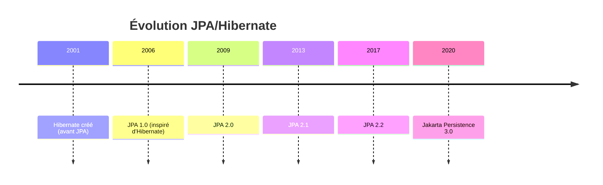

### JPA vs Hibernate

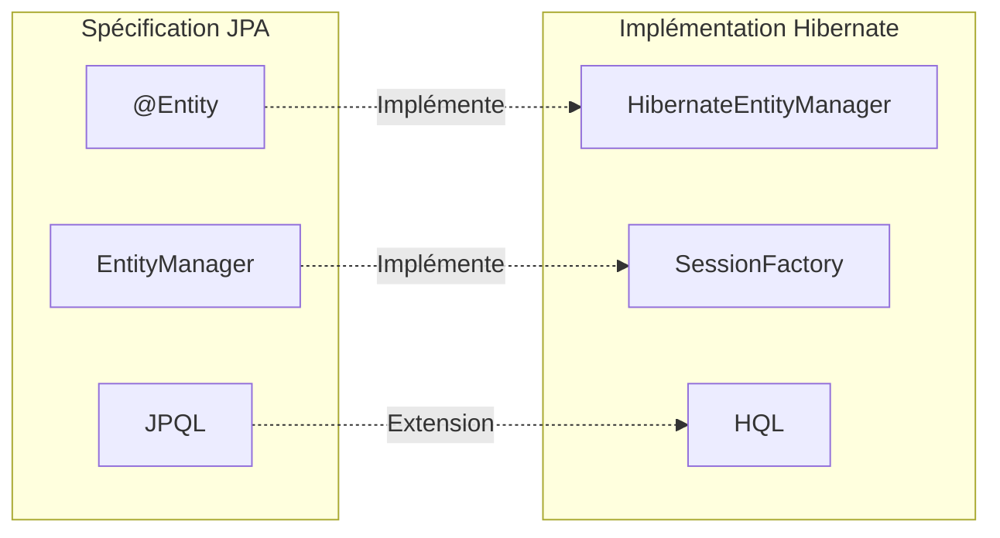

| JPA (Spécification) | Hibernate (Implémentation) |
|---------------------|---------------------------|
| @Entity | Même annotation |
| EntityManager | HibernateEntityManager |
| JPQL | HQL (superset) |
| Standard | Fonctionnalités avancées |

> **Bonne pratique** : Utilisez les annotations JPA standard (`jakarta.persistence.*`) pour rester portable.

---

## 3. ORM (Object-Relational Mapping)

### Le problème

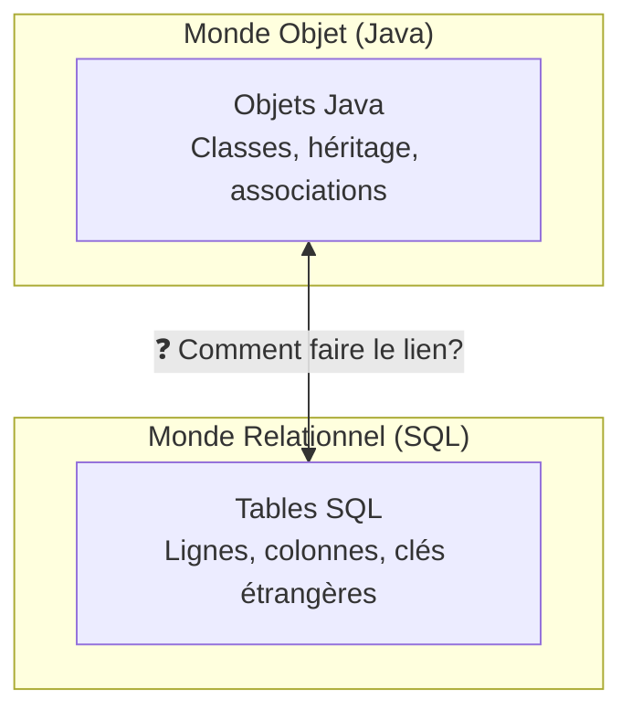

### La solution : ORM

L'ORM fait le pont entre le monde objet (Java) et le monde relationnel (SQL).

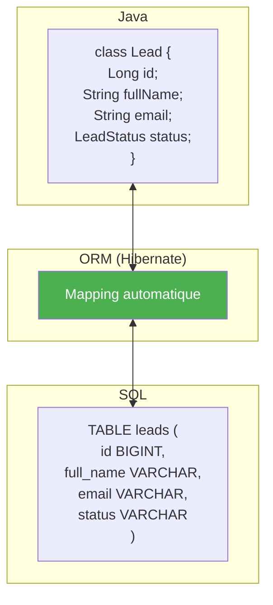

### Correspondances

| Java | SQL |
|------|-----|
| Classe | Table |
| Objet | Ligne |
| Attribut | Colonne |
| Association | Clé étrangère |

### Avantages de l'ORM

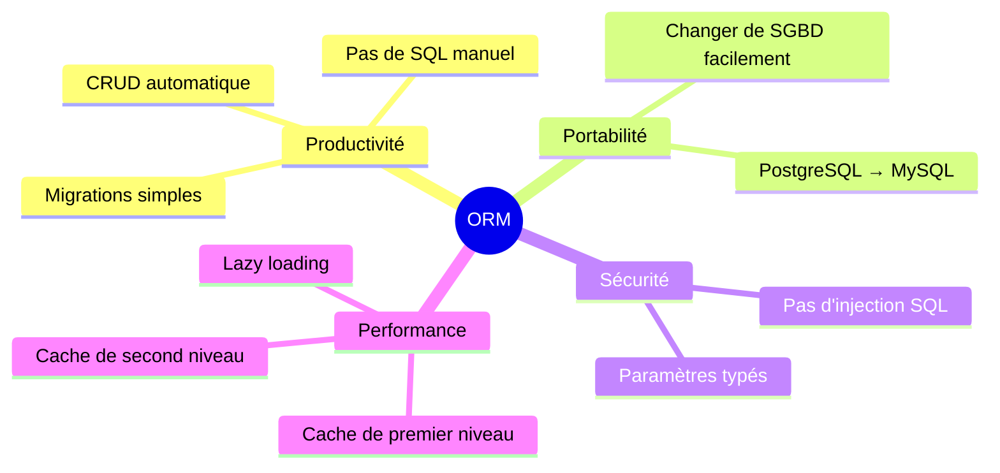

1. **Productivité** : Pas de SQL manuel pour les opérations basiques
2. **Portabilité** : Changer de base de données facilement
3. **Typage** : Erreurs détectées à la compilation
4. **Cache** : Optimisations automatiques

---

## 4. Configuration dans Spring Boot

### Dépendance Maven

```xml
<dependency>
    <groupId>org.springframework.boot</groupId>
    <artifactId>spring-boot-starter-data-jpa</artifactId>
</dependency>

<!-- Driver de base de données -->
<dependency>
    <groupId>org.postgresql</groupId>
    <artifactId>postgresql</artifactId>
    <scope>runtime</scope>
</dependency>
```

### application.yml

```yaml
spring:
  datasource:
    url: jdbc:postgresql://localhost:5432/contact_db
    username: ${DB_USERNAME:postgres}
    password: ${DB_PASSWORD:postgres}
    driver-class-name: org.postgresql.Driver
    
  jpa:
    hibernate:
      ddl-auto: update           # Stratégie de création de schéma
    show-sql: true               # Affiche les requêtes SQL
    properties:
      hibernate:
        format_sql: true         # Formate le SQL affiché
        dialect: org.hibernate.dialect.PostgreSQLDialect
```

### Diagramme : Configuration

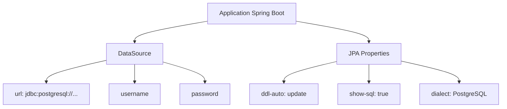

---

## 5. Stratégies ddl-auto

### Vue d'ensemble

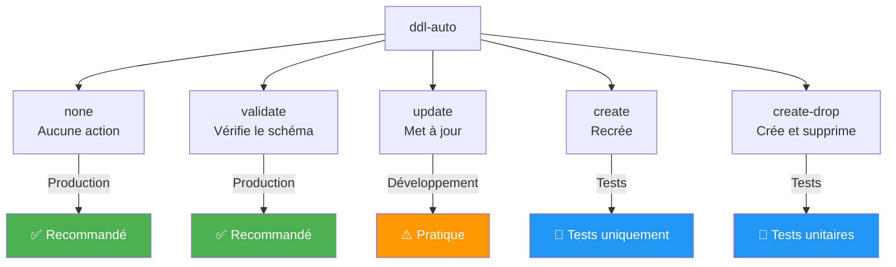

| Valeur | Description | Usage |
|--------|-------------|-------|
| none | Aucune action | Production |
| validate | Vérifie que le schéma correspond | Production |
| update | Met à jour le schéma sans supprimer | Développement |
| create | Crée le schéma (supprime les données) | Test |
| create-drop | Crée et supprime à l'arrêt | Test |

### Recommandations

```yaml
# Développement
spring.jpa.hibernate.ddl-auto: update

# Production (avec Flyway/Liquibase)
spring.jpa.hibernate.ddl-auto: validate
```

> **Important** : En production, utilisez **Flyway** ou **Liquibase** pour gérer les migrations de schéma de manière contrôlée et versionnée.

---

## 6. EntityManager

### Rôle

L'**EntityManager** est l'interface principale pour interagir avec le contexte de persistance. Il gère le cycle de vie des entités.

### Diagramme : EntityManager

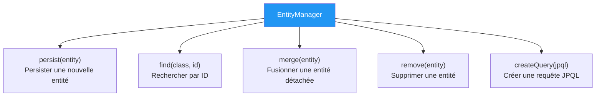

### Opérations de base

```java
@Repository
public class LeadRepositoryCustom {
    
    @PersistenceContext
    private EntityManager em;
    
    // Create
    public void save(Lead lead) {
        em.persist(lead);
    }
    
    // Read
    public Lead find(Long id) {
        return em.find(Lead.class, id);
    }
    
    // Update
    public Lead update(Lead lead) {
        return em.merge(lead);
    }
    
    // Delete
    public void delete(Lead lead) {
        em.remove(em.contains(lead) ? lead : em.merge(lead));
    }
    
    // Query
    public List<Lead> findByStatus(LeadStatus status) {
        return em.createQuery(
            "SELECT l FROM Lead l WHERE l.status = :status", Lead.class)
            .setParameter("status", status)
            .getResultList();
    }
}
```

### Avec Spring Data JPA

> **Note** : Spring Data JPA génère automatiquement ces opérations. L'EntityManager est rarement utilisé directement, sauf pour des requêtes complexes.

---

## 7. Cycle de vie d'une entité

### Les quatre états

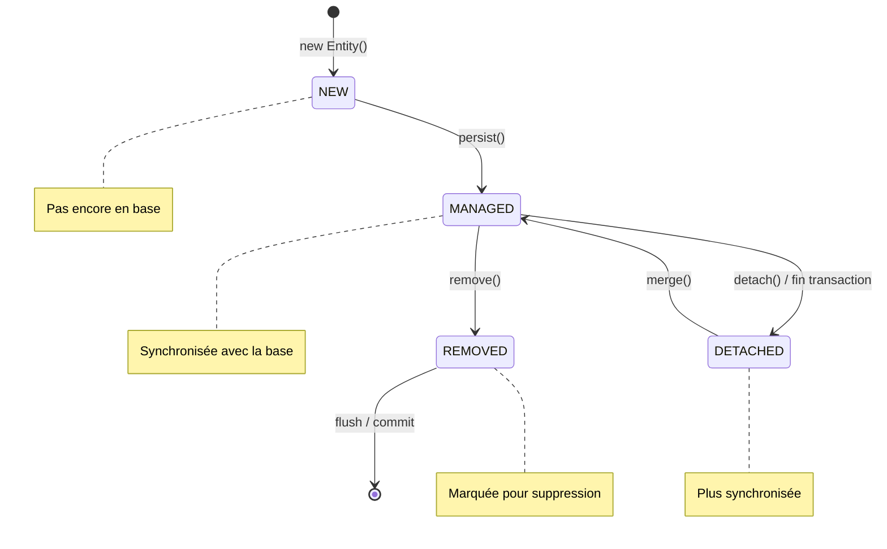

### Description des états

| État | Description | Synchronisé? |
|------|-------------|--------------|
| **NEW** | Objet créé avec `new`, pas encore persisté | Non |
| **MANAGED** | Géré par l'EntityManager, changements traqués | Oui |
| **DETACHED** | Plus géré, transaction terminée | Non |
| **REMOVED** | Marqué pour suppression | N/A |

### Exemple

```java
// 1. NEW - L'objet n'existe pas en base
Lead lead = new Lead();
lead.setFullName("Jean");

// 2. MANAGED - Après persist(), l'ID est généré
em.persist(lead);
System.out.println(lead.getId());  // ID généré!

// 3. MANAGED - Recherche retourne une entité gérée
Lead found = em.find(Lead.class, lead.getId());

// 4. DETACHED - L'entité n'est plus gérée
em.detach(found);

// 5. MANAGED - merge() rattache l'entité
found.setFullName("Pierre");
Lead merged = em.merge(found);

// 6. REMOVED - Marqué pour suppression
em.remove(merged);
```

---

## 8. JPQL (Java Persistence Query Language)

### Concept

**JPQL** est un langage de requête orienté objet. Contrairement à SQL qui utilise les noms de tables et colonnes, JPQL utilise les noms de **classes et propriétés Java**.

### Diagramme : SQL vs JPQL

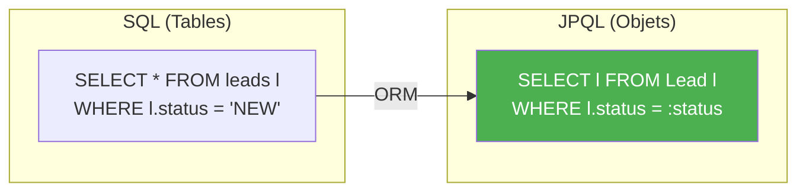

### Syntaxe

```java
// JPQL - utilise les noms de classes/propriétés Java
String jpql = "SELECT l FROM Lead l WHERE l.status = :status";

// SQL équivalent - utilise les noms de tables/colonnes
String sql = "SELECT * FROM leads l WHERE l.status = ?";
```

### Exemples

```java
// Tous les leads
List<Lead> leads = em.createQuery("SELECT l FROM Lead l", Lead.class)
    .getResultList();

// Avec filtre
List<Lead> newLeads = em.createQuery(
    "SELECT l FROM Lead l WHERE l.status = :status", Lead.class)
    .setParameter("status", LeadStatus.NEW)
    .getResultList();

// Compter
Long count = em.createQuery(
    "SELECT COUNT(l) FROM Lead l WHERE l.status = :status", Long.class)
    .setParameter("status", LeadStatus.NEW)
    .getSingleResult();

// Tri
List<Lead> sorted = em.createQuery(
    "SELECT l FROM Lead l ORDER BY l.createdAt DESC", Lead.class)
    .getResultList();

// Pagination
List<Lead> page = em.createQuery("SELECT l FROM Lead l", Lead.class)
    .setFirstResult(0)   // offset
    .setMaxResults(10)   // limit
    .getResultList();
```

---

## 9. Transactions

### Concept

Une **transaction** garantit que plusieurs opérations sont exécutées de manière atomique : soit toutes réussissent, soit aucune (rollback).

### Diagramme : Transaction

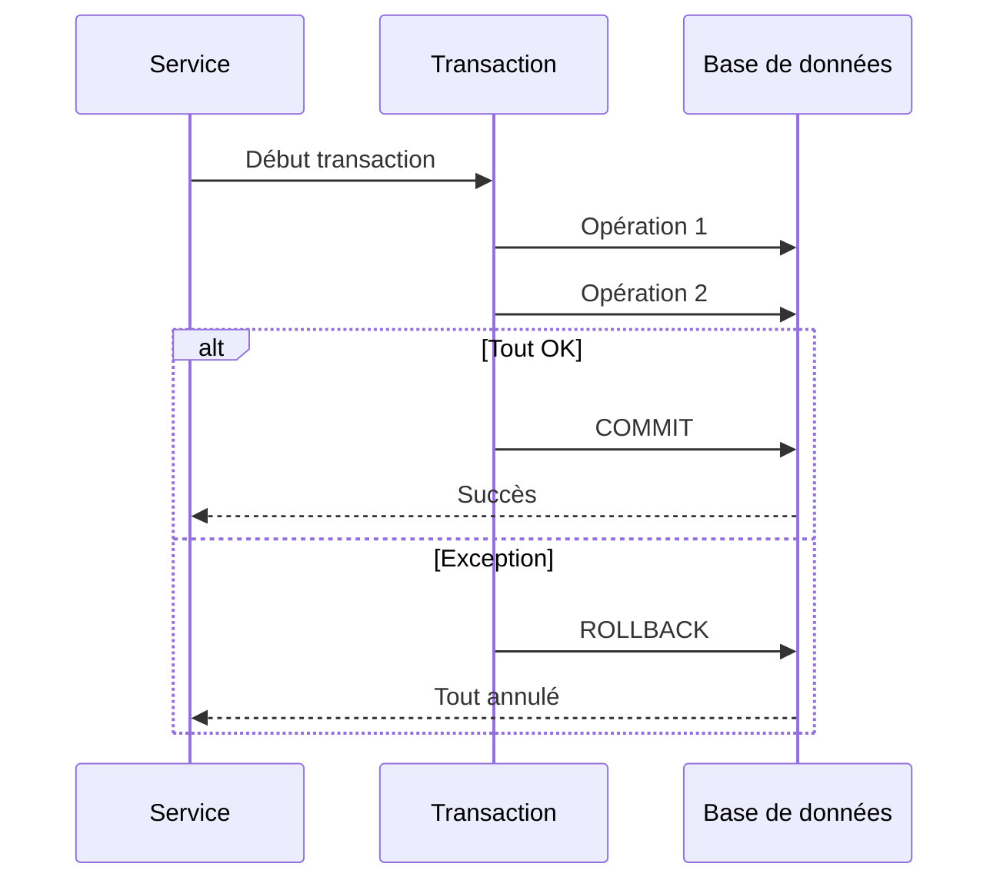

### @Transactional

```java
@Service
@Transactional  // Toutes les méthodes sont transactionnelles
public class LeadService {
    
    @Transactional  // Peut aussi être sur une méthode
    public void createLead(Lead lead) {
        // Si exception → rollback automatique
    }
    
    @Transactional(readOnly = true)  // Optimisation pour les lectures
    public List<Lead> getAllLeads() {
        return repository.findAll();
    }
}
```

### Exemple de rollback

```java
@Transactional
public void transferLeads() {
    Lead lead1 = repository.findById(1L).get();
    Lead lead2 = repository.findById(2L).get();
    
    lead1.setStatus(LeadStatus.CONVERTED);
    lead2.setStatus(LeadStatus.NEW);
    
    repository.save(lead1);
    // Si exception ici, lead1 n'est PAS sauvegardé non plus!
    repository.save(lead2);
}
```

---

## 10. Points clés à retenir

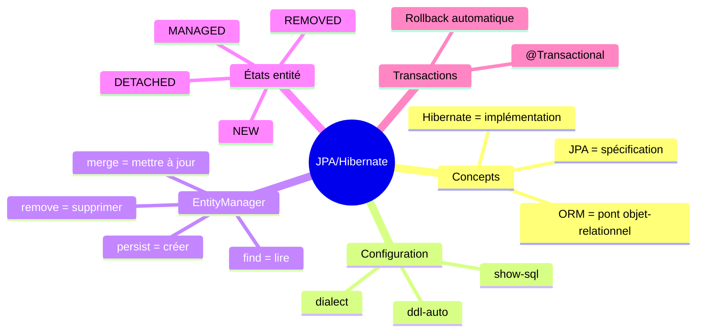

1. **JPA** = spécification, **Hibernate** = implémentation
2. **ORM** fait le pont entre Java et SQL
3. **ddl-auto** contrôle la création du schéma
4. **EntityManager** gère les entités
5. **@Transactional** garantit la cohérence

---

## QUIZ 4.1 - JPA et Hibernate

**1. Qu'est-ce que JPA?**
- a) Une base de données
- b) Une spécification ORM
- c) Un framework web
- d) Un langage de requête

<details>
<summary>Voir la réponse</summary>

**Réponse : b) Une spécification ORM**

JPA (Java Persistence API) est une spécification Java standard qui définit comment mapper des objets Java vers des bases de données relationnelles. Ce n'est pas une implémentation.
</details>

---

**2. Qu'est-ce qu'Hibernate?**
- a) La spécification JPA
- b) Une implémentation de JPA
- c) Un serveur d'applications
- d) Un outil de migration

<details>
<summary>Voir la réponse</summary>

**Réponse : b) Une implémentation de JPA**

Hibernate est l'implémentation JPA la plus populaire. C'est le provider par défaut de Spring Boot.
</details>

---

**3. Que fait ddl-auto: update?**
- a) Supprime et recrée le schéma
- b) Ne fait rien
- c) Met à jour le schéma sans supprimer les données
- d) Valide le schéma seulement

<details>
<summary>Voir la réponse</summary>

**Réponse : c) Met à jour le schéma sans supprimer les données**

`update` compare le schéma actuel avec les entités Java et ajoute les colonnes/tables manquantes. Les données existantes sont préservées.
</details>

---

**4. Quelle valeur de ddl-auto pour la production?**
- a) create
- b) update
- c) validate ou none
- d) create-drop

<details>
<summary>Voir la réponse</summary>

**Réponse : c) validate ou none**

En production, utilisez `validate` (vérifie que le schéma correspond) ou `none` (aucune action). Les migrations doivent être gérées par Flyway ou Liquibase.
</details>

---

**5. VRAI ou FAUX : JPQL utilise les noms de tables SQL.**

<details>
<summary>Voir la réponse</summary>

**Réponse : FAUX**

JPQL utilise les noms de **classes et propriétés Java**, pas les noms de tables et colonnes SQL. C'est un langage orienté objet.
</details>

---

**6. Quel est le rôle de l'EntityManager?**
- a) Gérer les connexions
- b) Gérer le cycle de vie des entités
- c) Gérer les transactions
- d) Gérer le cache

<details>
<summary>Voir la réponse</summary>

**Réponse : b) Gérer le cycle de vie des entités**

L'EntityManager est l'interface principale pour interagir avec le contexte de persistance. Il gère les opérations CRUD et le cycle de vie des entités (NEW, MANAGED, DETACHED, REMOVED).
</details>

---

**7. Quelle annotation rend une méthode transactionnelle?**
- a) @Transaction
- b) @Transactional
- c) @TX
- d) @Commit

<details>
<summary>Voir la réponse</summary>

**Réponse : b) @Transactional**

@Transactional (de Spring) marque une méthode ou une classe comme transactionnelle. En cas d'exception, un rollback est effectué automatiquement.
</details>

---

**8. Complétez : ORM signifie Object-_______ Mapping.**

<details>
<summary>Voir la réponse</summary>

**Réponse : Relational**

ORM = Object-Relational Mapping. C'est la technique qui fait le pont entre le monde objet (Java) et le monde relationnel (SQL).
</details>

---

**9. Quel état a une entité après persist()?**
- a) NEW
- b) MANAGED
- c) DETACHED
- d) REMOVED

<details>
<summary>Voir la réponse</summary>

**Réponse : b) MANAGED**

Après `persist()`, l'entité passe de l'état NEW à MANAGED. Elle est maintenant gérée par l'EntityManager et ses changements seront synchronisés avec la base.
</details>

---

**10. Quelle est la différence entre JPA et Hibernate?**
- a) Aucune
- b) JPA = spécification, Hibernate = implémentation
- c) Hibernate = spécification, JPA = implémentation
- d) Deux frameworks différents

<details>
<summary>Voir la réponse</summary>

**Réponse : b) JPA = spécification, Hibernate = implémentation**

JPA définit les standards (interfaces, annotations), Hibernate les implémente. D'autres implémentations existent (EclipseLink, OpenJPA).
</details>

---

## Navigation

| Précédent | Suivant |
|-----------|---------|
| [15 - Validation des données](15-validation-donnees.md) | [17 - Annotations JPA](17-annotations-jpa.md) |
