# Chapitre 5.1 - Introduction à Spring Security

## Objectifs du chapitre

- Comprendre les concepts de base de la sécurité
- Configurer Spring Security
- Distinguer authentification et autorisation

---

## 1. Qu'est-ce que Spring Security?

### Définition

**Spring Security** est le framework standard pour sécuriser les applications Spring. C'est un projet mature, activement maintenu, et utilisé par des millions d'applications en production.

La sécurité informatique repose sur trois piliers fondamentaux : la **confidentialité** (seules les personnes autorisées accèdent aux données), l'**intégrité** (les données ne sont pas modifiées sans autorisation), et la **disponibilité** (le système reste accessible). Spring Security implémente ces principes en fournissant des mécanismes d'authentification et d'autorisation robustes, ainsi que des protections contre les attaques web les plus courantes.

Il fournit :
- **Authentification** : Vérifier l'identité (qui êtes-vous?)
- **Autorisation** : Vérifier les permissions (que pouvez-vous faire?)
- **Protection** contre les attaques courantes (CSRF, XSS, session fixation, etc.)

### Diagramme : Vue d'ensemble

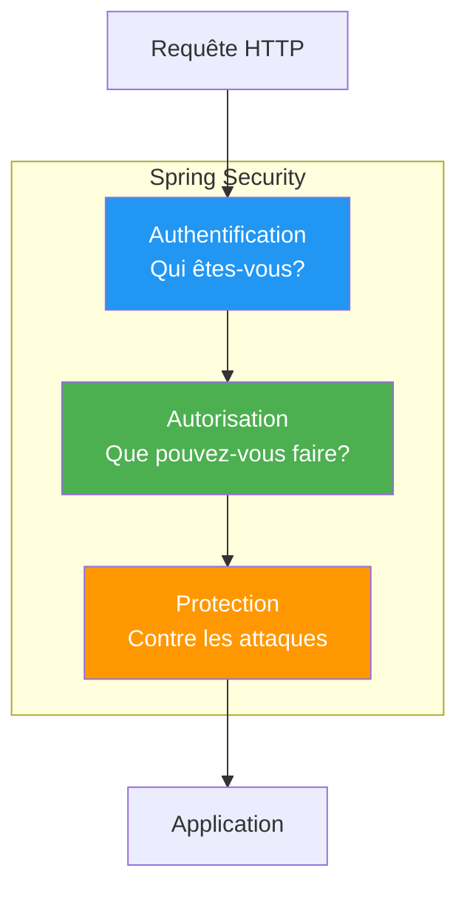

### Dépendance Maven

```xml
<dependency>
    <groupId>org.springframework.boot</groupId>
    <artifactId>spring-boot-starter-security</artifactId>
</dependency>
```

> **Note** : Dès que vous ajoutez cette dépendance, TOUTE votre application est protégée par défaut!

---

## 2. Comportement par défaut : Secure by Default

### Le principe "Secure by Default"

En sécurité informatique, le principe **"Secure by Default"** (sécurisé par défaut) stipule qu'un système doit être configuré de manière sécurisée dès son installation, sans intervention de l'utilisateur. C'est une approche défensive : il vaut mieux tout bloquer et ouvrir explicitement ce qui est nécessaire, plutôt que tout autoriser et essayer de bloquer les menaces. Spring Security applique ce principe en protégeant automatiquement tous les endpoints dès l'ajout de la dépendance. L'administrateur doit ensuite configurer explicitement les exceptions pour les ressources publiques.

### Sans configuration personnalisée

Quand vous ajoutez Spring Security, TOUT est protégé par défaut :

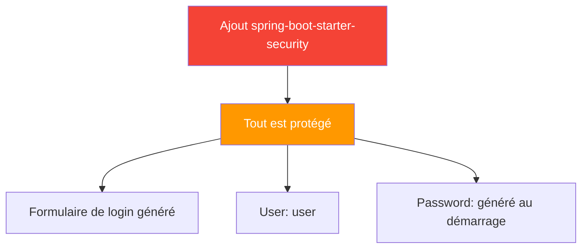

- Tous les endpoints nécessitent une authentification
- Un utilisateur "user" est créé avec un mot de passe généré
- Un formulaire de login est affiché automatiquement

```
Using generated security password: 8a7d-4b2c-9e1f-3a5b

http://localhost:8080/login
```

---

## 3. Authentification vs Autorisation

### Deux concepts fondamentaux distincts

L'**authentification** et l'**autorisation** sont deux concepts souvent confondus mais fondamentalement différents. L'authentification répond à la question "Qui êtes-vous?" - c'est le processus de vérification de l'identité d'un utilisateur, généralement via un login/mot de passe, un certificat, ou une empreinte biométrique. L'autorisation, quant à elle, répond à "Que pouvez-vous faire?" - elle détermine les actions qu'un utilisateur authentifié est autorisé à effectuer. En pratique, l'authentification précède toujours l'autorisation : on doit d'abord savoir QUI est l'utilisateur avant de décider CE QU'IL peut faire.

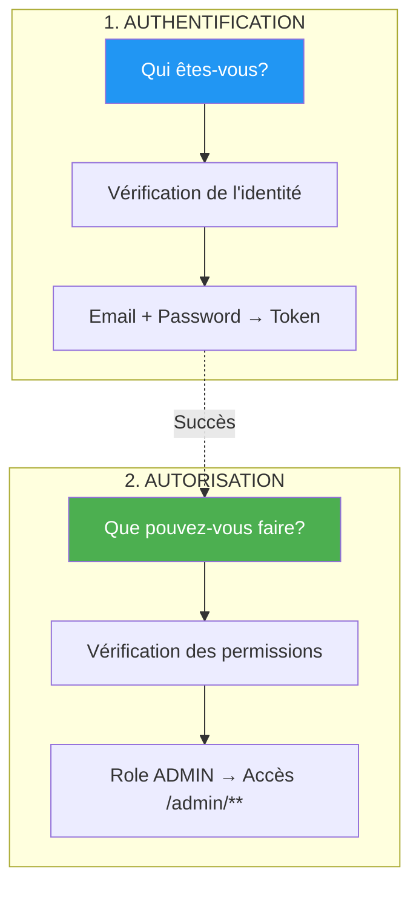

### Authentification

**"Qui êtes-vous?"** - Vérification de l'identité.

L'authentification est le processus par lequel un système vérifie qu'un utilisateur est bien celui qu'il prétend être. Dans le monde physique, c'est l'équivalent de montrer sa carte d'identité. Dans une application web, cela se fait généralement en vérifiant un couple identifiant/mot de passe contre une base de données. Une fois authentifié, l'utilisateur reçoit un "jeton" (token) qui prouve son identité pour les requêtes suivantes.

```
Utilisateur: admin@example.com
Password: secret123

→ Authentification réussie (identité confirmée)
→ Token JWT généré
```

### Autorisation

**"Que pouvez-vous faire?"** - Vérification des permissions.

L'autorisation intervient après l'authentification et détermine les ressources auxquelles un utilisateur peut accéder. Elle se base généralement sur des **rôles** (ADMIN, USER, MANAGER) ou des **permissions** spécifiques (READ, WRITE, DELETE). Un utilisateur avec le rôle ADMIN peut accéder à toutes les ressources, tandis qu'un USER standard n'accède qu'à ses propres données. Cette séparation permet d'appliquer le principe du **moindre privilège** : chaque utilisateur n'a que les droits strictement nécessaires.

```
Role: ADMIN
→ Peut accéder à /api/admin/**

Role: USER
→ Ne peut PAS accéder à /api/admin/**
```

### Flux de sécurité complet

Ce diagramme montre le flux complet d'une requête à travers Spring Security. Chaque requête passe d'abord par l'authentification (vérification de l'identité), puis par l'autorisation (vérification des permissions). Si l'une de ces étapes échoue, la requête est rejetée avec un code HTTP approprié : 401 (non authentifié) ou 403 (non autorisé).

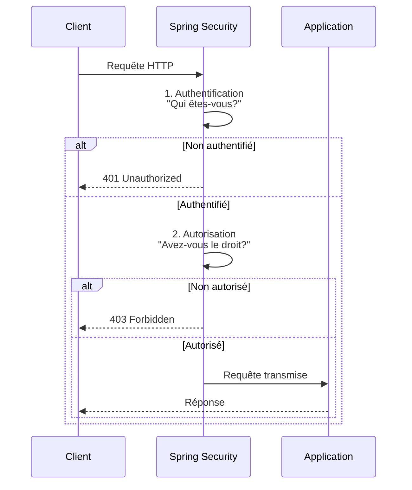

---

## 4. Configuration de base

### Architecture de SecurityConfig

La classe **SecurityConfig** est le cœur de la configuration de Spring Security. Elle définit comment l'application gère la sécurité à travers une chaîne de filtres (FilterChain). Chaque filtre a une responsabilité spécifique : un filtre pour CORS, un pour CSRF, un pour l'authentification JWT, etc. Les filtres sont exécutés dans l'ordre pour chaque requête entrante. Cette architecture modulaire permet de personnaliser finement le comportement de sécurité.

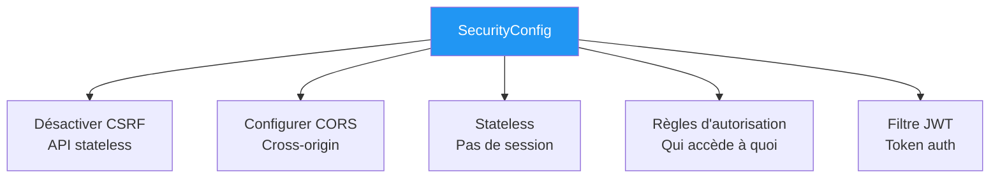

### SecurityConfig.java

```java
@Configuration
@EnableWebSecurity
@EnableMethodSecurity  // Active @PreAuthorize
public class SecurityConfig {

    @Bean
    public SecurityFilterChain securityFilterChain(HttpSecurity http) throws Exception {
        http
            // 1. Désactiver CSRF pour les APIs REST
            .csrf(csrf -> csrf.disable())
            
            // 2. Configurer CORS
            .cors(cors -> cors.configurationSource(corsConfigurationSource()))
            
            // 3. Pas de session (stateless)
            .sessionManagement(session -> 
                session.sessionCreationPolicy(SessionCreationPolicy.STATELESS))
            
            // 4. Règles d'autorisation
            .authorizeHttpRequests(auth -> auth
                // Endpoints publics
                .requestMatchers(HttpMethod.POST, "/api/contact").permitAll()
                .requestMatchers("/api/auth/**").permitAll()
                .requestMatchers("/swagger-ui/**", "/v3/api-docs/**").permitAll()
                
                // Endpoints admin
                .requestMatchers("/api/admin/**").hasRole("ADMIN")
                
                // Tout le reste nécessite authentification
                .anyRequest().authenticated()
            );
            
        return http.build();
    }
}
```

### CSRF (Cross-Site Request Forgery)

**CSRF** (Cross-Site Request Forgery, ou "falsification de requête intersites") est une attaque où un site malveillant fait exécuter des actions non désirées à un utilisateur authentifié sur un autre site. Par exemple, si vous êtes connecté à votre banque et visitez un site malveillant, ce dernier pourrait déclencher un virement sans votre consentement en exploitant votre session de connexion. CSRF exploite la confiance qu'un site a dans le navigateur de l'utilisateur, notamment via les cookies de session envoyés automatiquement.

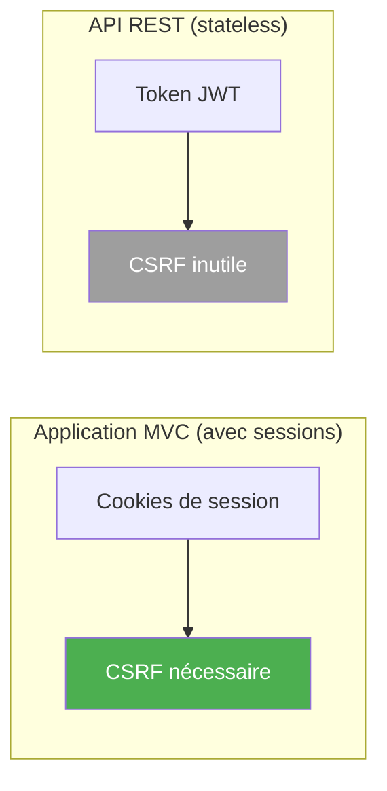

**Pourquoi désactiver CSRF pour une API REST?** CSRF exploite les cookies de session envoyés automatiquement par le navigateur. Dans une API REST stateless utilisant JWT, il n'y a pas de cookies de session - le token JWT est envoyé manuellement dans le header Authorization. Sans cookies automatiques, l'attaque CSRF devient impossible, rendant la protection CSRF inutile et même contre-productive (elle bloquerait les requêtes légitimes).

---

## 5. Règles d'autorisation

### Méthodes d'autorisation disponibles

Spring Security fournit plusieurs méthodes pour définir les règles d'accès aux endpoints. Ces méthodes permettent de créer des politiques de sécurité flexibles, du plus permissif (`permitAll()`) au plus restrictif (`denyAll()`). Le choix de la méthode dépend du niveau de protection requis : les endpoints publics utilisent `permitAll()`, les endpoints utilisateur utilisent `authenticated()`, et les endpoints d'administration utilisent `hasRole("ADMIN")`.

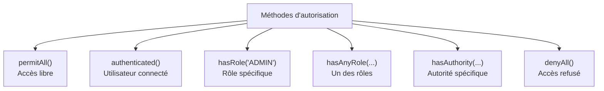

| Méthode | Description | Exemple |
|---------|-------------|---------|
| permitAll() | Accès libre | Endpoints publics |
| authenticated() | Utilisateur authentifié | Espace membre |
| hasRole("ADMIN") | Rôle spécifique | Administration |
| hasAnyRole("ADMIN", "USER") | Un des rôles | Plusieurs profils |
| hasAuthority("READ") | Autorité spécifique | Permissions fines |
| denyAll() | Accès refusé | Endpoints désactivés |

### Exemples de configuration

```java
.authorizeHttpRequests(auth -> auth
    // Tout le monde peut accéder
    .requestMatchers("/api/public/**").permitAll()
    
    // Utilisateurs authentifiés seulement
    .requestMatchers("/api/user/**").authenticated()
    
    // Role ADMIN seulement
    .requestMatchers("/api/admin/**").hasRole("ADMIN")
    
    // Role ADMIN ou MANAGER
    .requestMatchers("/api/manage/**").hasAnyRole("ADMIN", "MANAGER")
    
    // Méthode HTTP spécifique
    .requestMatchers(HttpMethod.DELETE, "/api/**").hasRole("ADMIN")
    
    // Tout le reste nécessite authentification
    .anyRequest().authenticated()
)
```

### Ordre d'évaluation des règles

L'ordre des règles dans la configuration est **crucial** car Spring Security les évalue de haut en bas et applique la première règle qui correspond. Si vous placez `anyRequest().authenticated()` en premier, toutes les requêtes nécessiteront une authentification, même celles qui devraient être publiques. C'est pourquoi les règles les plus spécifiques (comme `/api/public/**`) doivent toujours précéder les règles générales.

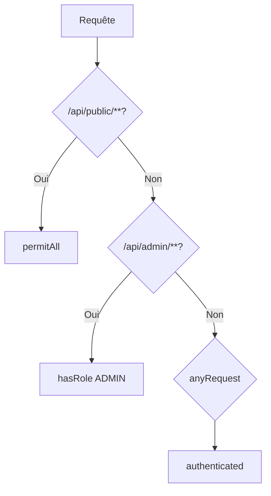

---

## 6. @PreAuthorize : Sécurité au niveau méthode

### Sécurité déclarative sur les méthodes

La sécurité au niveau URL (dans SecurityConfig) définit des règles globales par chemin. Mais parfois, on a besoin d'un contrôle plus fin au niveau de chaque méthode. L'annotation `@PreAuthorize` permet d'appliquer des règles de sécurité directement sur les méthodes de vos controllers ou services. Elle supporte le langage SpEL (Spring Expression Language) qui permet d'accéder aux paramètres de la méthode et au contexte de sécurité pour créer des règles complexes.

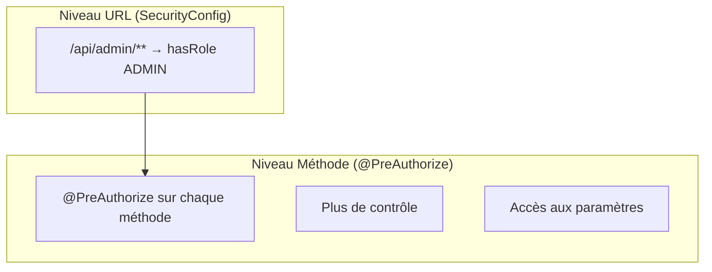

```java
@RestController
@RequestMapping("/api/admin/leads")
public class LeadController {

    @GetMapping
    @PreAuthorize("hasRole('ADMIN')")
    public List<Lead> getAllLeads() {
        return service.findAll();
    }
    
    @DeleteMapping("/{id}")
    @PreAuthorize("hasRole('ADMIN') and #id != 1")  // Ne peut pas supprimer ID 1
    public void delete(@PathVariable Long id) {
        service.delete(id);
    }
    
    @GetMapping("/my-leads")
    @PreAuthorize("#username == authentication.principal.username")
    public List<Lead> getMyLeads(@RequestParam String username) {
        return service.findByAssignedTo(username);
    }
}
```

### Activer @PreAuthorize

```java
@Configuration
@EnableWebSecurity
@EnableMethodSecurity  // ⚠️ Nécessaire pour activer @PreAuthorize!
public class SecurityConfig {
    // ...
}
```

---

## 7. PasswordEncoder et BCrypt

### Pourquoi hasher les mots de passe?

Le **hachage** (hashing) est une opération cryptographique à sens unique qui transforme une donnée en une empreinte de taille fixe. Contrairement au chiffrement, le hachage est **irréversible** : on ne peut pas retrouver le mot de passe original à partir du hash. C'est essentiel pour la sécurité : si un attaquant vole la base de données, il n'obtient que des hashs inutilisables. Pour vérifier un mot de passe, on hashe la tentative et on compare les hashs, sans jamais manipuler le mot de passe en clair.

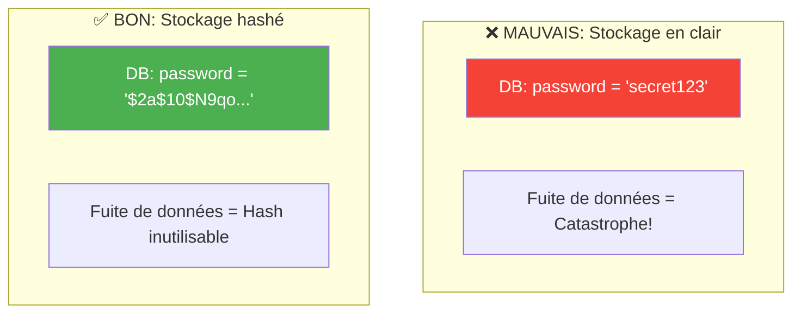

> **Règle d'or** : Les mots de passe ne doivent JAMAIS être stockés en clair!

### BCrypt : L'algorithme recommandé

**BCrypt** est un algorithme de hachage spécialement conçu pour les mots de passe. Contrairement à MD5 ou SHA-1 (rapides mais vulnérables aux attaques par force brute), BCrypt est intentionnellement **lent** : chaque hash nécessite des calculs intensifs, ce qui rend les attaques par dictionnaire impraticables. BCrypt intègre aussi un **sel** (salt) aléatoire unique pour chaque mot de passe, garantissant que deux utilisateurs avec le même mot de passe auront des hashs différents. Enfin, BCrypt est **adaptatif** : on peut augmenter le "cost factor" pour le rendre plus lent à mesure que les ordinateurs deviennent plus puissants.

```java
@Bean
public PasswordEncoder passwordEncoder() {
    return new BCryptPasswordEncoder();
}
```

### Utilisation

```java
@Service
public class UserService {
    
    private final PasswordEncoder passwordEncoder;
    
    public void createUser(String email, String rawPassword) {
        User user = new User();
        user.setEmail(email);
        user.setPassword(passwordEncoder.encode(rawPassword));  // Hash!
        repository.save(user);
    }
    
    public boolean verifyPassword(String raw, String encoded) {
        return passwordEncoder.matches(raw, encoded);
    }
}
```

### Anatomie d'un hash BCrypt

```
Password:    "secret123"
Hash BCrypt: "$2a$10$N9qo8uLOickgx2ZMRZoMyeIjZAgcfl7p92ldGxad68LJZdL17lhWy"
             │  │  │
             │  │  └── Hash + Salt (22 caractères de sel + 31 de hash)
             │  └──── Cost factor (10 = 2^10 = 1024 itérations)
             └─────── Algorithme (2a = BCrypt)
```

---

## 8. UserDetails et UserDetailsService

### Les interfaces de Spring Security

**UserDetails** et **UserDetailsService** sont les deux interfaces centrales de l'authentification dans Spring Security. `UserDetails` représente un utilisateur avec ses informations d'authentification (username, password, authorities) et son état (actif, verrouillé, expiré). `UserDetailsService` est le service qui charge les informations utilisateur depuis une source de données (base de données, LDAP, etc.). Spring Security utilise ces interfaces pour découpler la logique d'authentification de la source des données utilisateur.

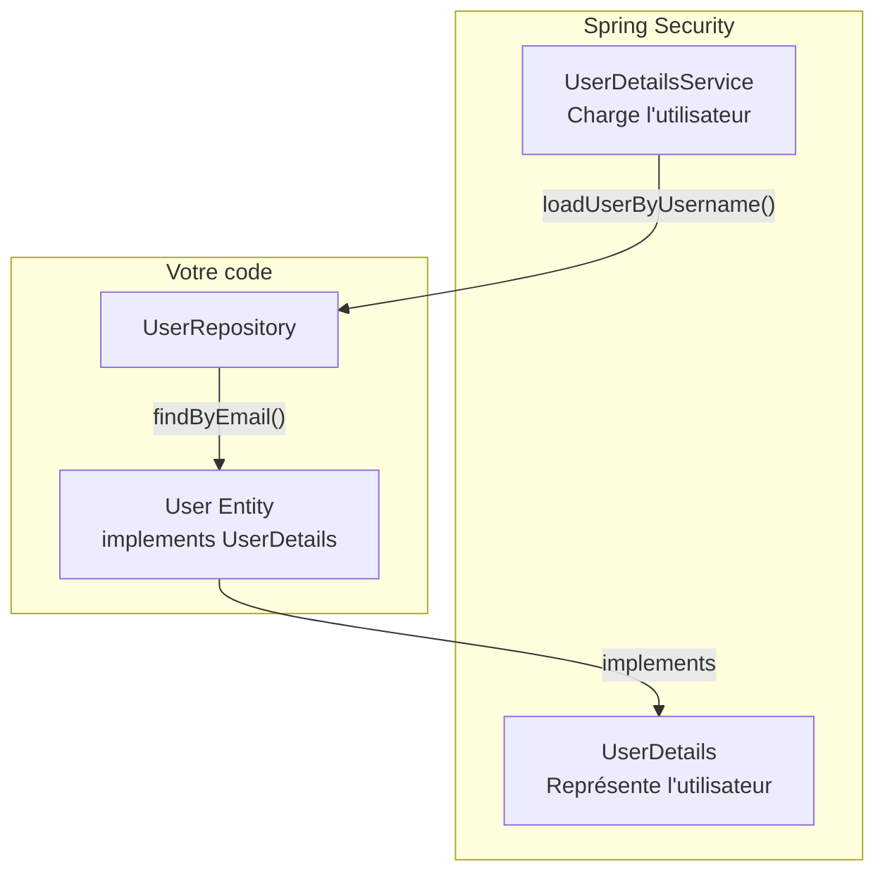

### UserDetails : Représentation de l'utilisateur

L'interface `UserDetails` définit le contrat que Spring Security attend d'un utilisateur. Elle expose les informations nécessaires à l'authentification et à l'autorisation : le nom d'utilisateur, le mot de passe hashé, les autorités (rôles/permissions), et plusieurs flags indiquant l'état du compte. En implémentant cette interface dans votre entité User, vous permettez à Spring Security de l'utiliser directement sans adaptateur.

```java
@Entity
public class User implements UserDetails {
    
    @Id
    private Long id;
    private String email;
    private String password;
    private Role role;
    
    @Override
    public Collection<? extends GrantedAuthority> getAuthorities() {
        return List.of(new SimpleGrantedAuthority("ROLE_" + role.name()));
    }
    
    @Override
    public String getUsername() {
        return email;  // On utilise l'email comme username
    }
    
    @Override
    public String getPassword() {
        return password;
    }
    
    @Override
    public boolean isAccountNonExpired() { return true; }
    
    @Override
    public boolean isAccountNonLocked() { return true; }
    
    @Override
    public boolean isCredentialsNonExpired() { return true; }
    
    @Override
    public boolean isEnabled() { return true; }
}
```

### UserDetailsService : Chargement de l'utilisateur

Le `UserDetailsService` est responsable de charger les données utilisateur depuis votre source de données. Spring Security appelle sa méthode `loadUserByUsername()` lors de chaque tentative d'authentification. Cette méthode doit retourner un `UserDetails` ou lever une `UsernameNotFoundException` si l'utilisateur n'existe pas. C'est le pont entre votre système de persistance et le mécanisme d'authentification de Spring Security.

```java
@Configuration
public class UserDetailsConfig {
    
    @Bean
    public UserDetailsService userDetailsService(UserRepository repository) {
        return username -> repository.findByEmail(username)
            .orElseThrow(() -> new UsernameNotFoundException("User not found: " + username));
    }
}
```

---

## 9. CORS (Cross-Origin Resource Sharing)

### Qu'est-ce que CORS?

**CORS** (Cross-Origin Resource Sharing) est un mécanisme de sécurité implémenté par les navigateurs web qui contrôle comment les pages web peuvent faire des requêtes vers des domaines différents de celui qui a servi la page. Par défaut, les navigateurs appliquent la politique de **Same-Origin** : une page ne peut faire des requêtes qu'à son propre domaine. Cette restriction protège les utilisateurs contre les attaques où un site malveillant tenterait d'accéder à vos données sur d'autres sites en exploitant vos cookies de session.

**Exemple concret** : Si votre frontend React tourne sur `http://localhost:3000` et votre API Spring Boot sur `http://localhost:8080`, le navigateur bloquera les requêtes du frontend vers l'API car ce sont des "origines" différentes (même machine, mais ports différents = origines différentes). CORS permet au serveur d'indiquer explicitement quelles origines sont autorisées à accéder à ses ressources.

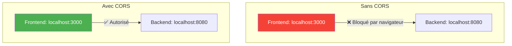

### Configuration CORS

La configuration CORS définit précisément quelles origines, méthodes HTTP et headers sont autorisés. C'est une liste blanche explicite : tout ce qui n'est pas listé est refusé. `allowCredentials(true)` est nécessaire si vous utilisez des cookies ou le header Authorization. Sans cette configuration, le navigateur bloquera les requêtes cross-origin même si votre serveur est prêt à les accepter.

```java
@Bean
public CorsConfigurationSource corsConfigurationSource() {
    CorsConfiguration config = new CorsConfiguration();
    
    // Origines autorisées (domaines qui peuvent appeler l'API)
    config.setAllowedOrigins(List.of(
        "http://localhost:3000",      // Dev local
        "https://monsite.com"         // Production
    ));
    
    // Méthodes HTTP autorisées
    config.setAllowedMethods(List.of("GET", "POST", "PUT", "DELETE", "PATCH"));
    
    // Headers autorisés dans les requêtes
    config.setAllowedHeaders(List.of("*"));
    
    // Autoriser les credentials (cookies, Authorization header)
    config.setAllowCredentials(true);
    
    UrlBasedCorsConfigurationSource source = new UrlBasedCorsConfigurationSource();
    source.registerCorsConfiguration("/**", config);
    return source;
}
```

---

## 10. Points clés à retenir

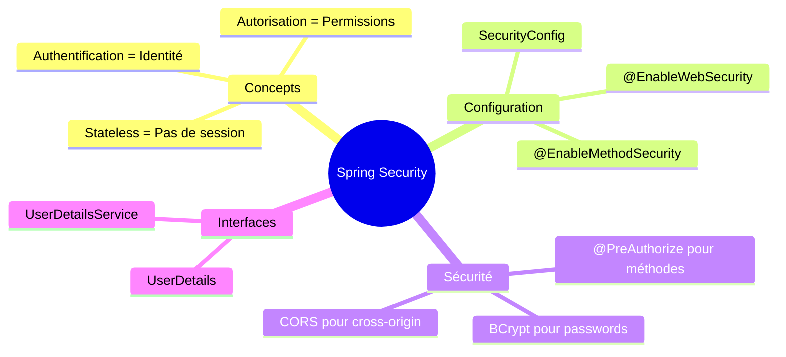

1. **Spring Security** protège tout par défaut (Secure by Default)
2. **Authentification** = vérifier l'identité (qui êtes-vous?)
3. **Autorisation** = vérifier les permissions (que pouvez-vous faire?)
4. **BCrypt** pour hasher les mots de passe (jamais en clair!)
5. **CORS** pour autoriser les requêtes cross-origin (frontend ↔ backend)

---

## QUIZ 5.1 - Introduction à Spring Security

**1. Quelle est la différence entre authentification et autorisation?**
- a) Aucune
- b) Authentification = identité, Autorisation = permissions
- c) Authentification = permissions, Autorisation = identité
- d) Deux termes pour la même chose

<details>
<summary>Voir la réponse</summary>

**Réponse : b) Authentification = identité, Autorisation = permissions**

L'authentification vérifie QUI vous êtes (identité). L'autorisation vérifie CE QUE vous pouvez faire (permissions/rôles).
</details>

---

**2. Que fait permitAll()?**
- a) Refuse l'accès
- b) Autorise tout le monde
- c) Autorise les admins
- d) Autorise les utilisateurs authentifiés

<details>
<summary>Voir la réponse</summary>

**Réponse : b) Autorise tout le monde**

permitAll() rend l'endpoint public, accessible sans authentification. Utilisé pour les pages publiques comme la page d'accueil ou le formulaire de contact.
</details>

---

**3. Quel est le comportement par défaut de Spring Security?**
- a) Tout est public
- b) Tout est protégé
- c) Seuls les admins ont accès
- d) Aucune sécurité

<details>
<summary>Voir la réponse</summary>

**Réponse : b) Tout est protégé**

Par défaut, Spring Security bloque TOUT et génère un utilisateur "user" avec un mot de passe aléatoire. C'est le principe "Secure by Default".
</details>

---

**4. Quelle annotation active la sécurité au niveau méthode?**
- a) @EnableSecurity
- b) @EnableMethodSecurity
- c) @SecureMethod
- d) @MethodProtection

<details>
<summary>Voir la réponse</summary>

**Réponse : b) @EnableMethodSecurity**

@EnableMethodSecurity active les annotations @PreAuthorize, @PostAuthorize, @Secured au niveau des méthodes.
</details>

---

**5. VRAI ou FAUX : Les mots de passe doivent être stockés en clair.**

<details>
<summary>Voir la réponse</summary>

**Réponse : FAUX (toujours hasher!)**

Les mots de passe doivent TOUJOURS être hashés avec un algorithme comme BCrypt. En cas de fuite de données, les hashs sont inutilisables directement.
</details>

---

**6. Quel algorithme est recommandé pour hasher les mots de passe?**
- a) MD5
- b) SHA-1
- c) BCrypt
- d) Base64

<details>
<summary>Voir la réponse</summary>

**Réponse : c) BCrypt**

BCrypt est recommandé car il est lent (résiste aux attaques brute-force), salé (chaque hash est unique), et adaptatif (le coût peut être augmenté). MD5 et SHA-1 sont trop rapides et obsolètes. Base64 n'est pas un algorithme de hachage mais d'encodage.
</details>

---

**7. Que fait hasRole("ADMIN")?**
- a) Vérifie que l'utilisateur est authentifié
- b) Vérifie que l'utilisateur a le rôle ADMIN
- c) Crée le rôle ADMIN
- d) Supprime le rôle ADMIN

<details>
<summary>Voir la réponse</summary>

**Réponse : b) Vérifie que l'utilisateur a le rôle ADMIN**

hasRole("ADMIN") vérifie que l'utilisateur authentifié possède l'autorité "ROLE_ADMIN" (le préfixe ROLE_ est ajouté automatiquement).
</details>

---

**8. Complétez : CORS signifie Cross-_______ Resource Sharing.**

<details>
<summary>Voir la réponse</summary>

**Réponse : Origin**

CORS = Cross-Origin Resource Sharing. Il permet à un frontend sur un domaine d'accéder à une API sur un autre domaine.
</details>

---

**9. Quelle interface représente un utilisateur authentifié?**
- a) User
- b) UserDetails
- c) AuthenticatedUser
- d) Principal

<details>
<summary>Voir la réponse</summary>

**Réponse : b) UserDetails**

UserDetails est l'interface Spring Security qui représente un utilisateur. Votre entité User doit l'implémenter pour être compatible avec Spring Security.
</details>

---

**10. Pourquoi désactiver CSRF pour une API REST?**
- a) Pour la performance
- b) Parce qu'une API stateless n'utilise pas de cookies de session
- c) Pour la sécurité
- d) Ce n'est pas recommandé

<details>
<summary>Voir la réponse</summary>

**Réponse : b) Parce qu'une API stateless n'utilise pas de cookies de session**

CSRF protège contre les attaques qui exploitent les cookies de session. Une API REST stateless utilise des tokens JWT dans les headers, pas de cookies, donc CSRF est inutile.
</details>

---

## Navigation

| Précédent | Suivant |
|-----------|---------|
| [16 - JPA et Hibernate](16-jpa-hibernate.md) | [28 - JWT Introduction](28-jwt-introduction.md) |
