# Chapitre 5.2 - Spring Security : Questions fréquentes et vulgarisation

## Objectifs du chapitre

- Répondre aux questions courantes des étudiants
- Vulgariser les concepts complexes avec des analogies
- Clarifier les confusions fréquentes (CORS vs CSRF, etc.)

---

## 1. Vulgarisation : Les deux gardiens de sécurité

### L'analogie des deux bâtiments

Imaginons que vous avez **deux bâtiments** :
- **Bâtiment A** : Votre frontend (React, Next.js, Vue...)
- **Bâtiment B** : Votre backend (Spring Boot API)

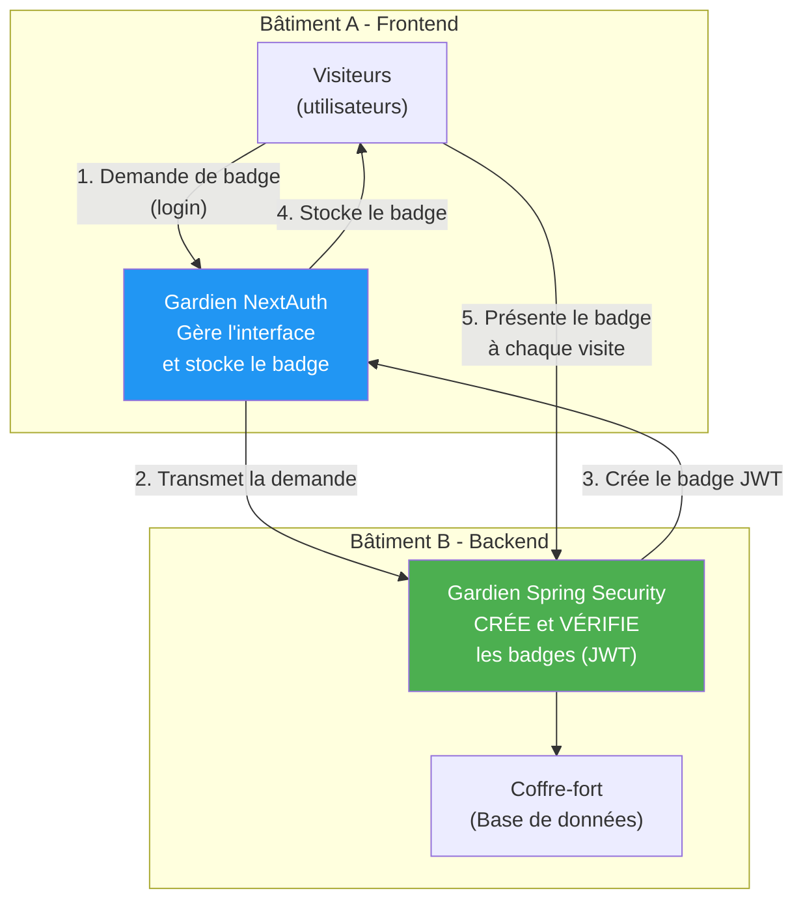

### Flux correct détaillé

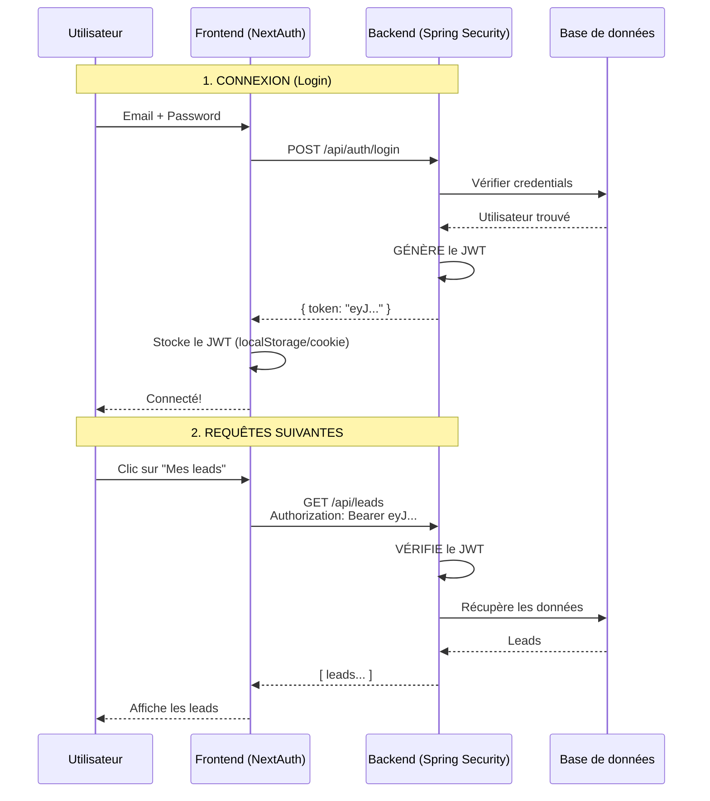

> **Point clé** : C'est le **BACKEND (Spring Security)** qui :
> - Crée le JWT lors du login
> - Vérifie le JWT à chaque requête
> 
> Le **FRONTEND (NextAuth)** ne fait que :
> - Transmettre les credentials au backend
> - Stocker le JWT reçu
> - Envoyer le JWT avec chaque requête

### NextAuth + Spring Security : Faut-il les deux?

**OUI, il faut les deux!** Mais ils ont des rôles différents :

| Gardien | Rôle | Ce qu'il fait |
|---------|------|---------------|
| **Spring Security** (Backend) | CRÉE et VÉRIFIE les JWT | Authentifie, autorise, protège l'API |
| **NextAuth** (Frontend) | STOCKE et ENVOIE les JWT | Gère l'état de session côté client |

**Pourquoi les deux?** 
- **Spring Security est OBLIGATOIRE** : C'est lui qui génère les tokens et protège vos données
- **NextAuth est PRATIQUE** : Il facilite la gestion de session côté frontend

Imaginez que quelqu'un contourne le gardien A (frontend) et va directement au bâtiment B (API). Sans le gardien B (Spring Security), il accède directement au coffre-fort!

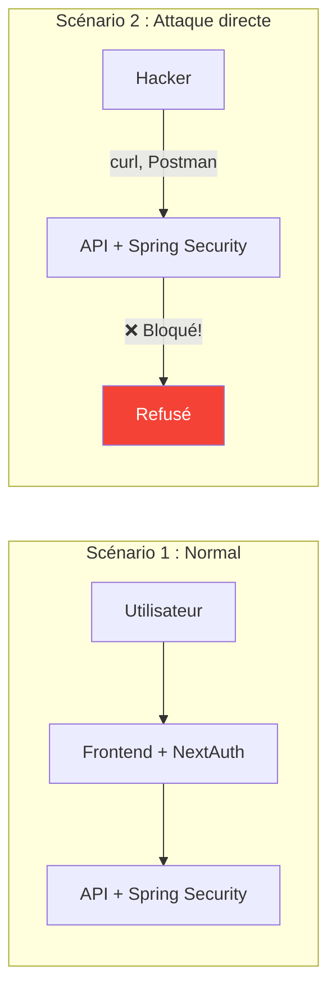

> **Règle d'or** : Le backend doit TOUJOURS se protéger lui-même, car on ne peut pas faire confiance au frontend.

---

## 2. CSRF : C'est quoi exactement?

### Explication en 5 lignes

**CSRF** (Cross-Site Request Forgery) est une attaque où un site malveillant fait exécuter des actions à votre insu sur un site où vous êtes connecté. Imaginez que vous êtes connecté à votre banque (onglet 1), puis vous visitez un site pirate (onglet 2). Ce site pirate peut envoyer une requête à votre banque en utilisant vos cookies de session, car le navigateur les envoie automatiquement. Résultat : un virement est effectué sans votre consentement. CSRF exploite la confiance du serveur envers les cookies du navigateur.

### Exemple concret d'attaque CSRF

```mermaid
sequenceDiagram
    participant U as Vous
    participant B as Banque (bank.com)
    participant M as Site Malveillant
    
    U->>B: 1. Login sur bank.com
    B-->>U: Cookie de session (JSESSIONID)
    Note over U: Vous êtes connecté à la banque
    
    U->>M: 2. Visite d'un site pirate
    M-->>U: Page avec formulaire caché
    
    Note over M: Le site contient:<br/><form action="bank.com/transfer"><br/><input name="to" value="hacker"><br/><input name="amount" value="10000">
    
    U->>B: 3. Formulaire soumis automatiquement<br/>+ Cookie envoyé automatiquement!
    B-->>U: ❌ Virement effectué!
```

### Code d'une page malveillante

```html
<!-- Site malveillant : hacker.com -->
<html>
<body>
  <h1>Félicitations! Vous avez gagné!</h1>
  
  <!-- Formulaire caché qui s'envoie automatiquement -->
  <form id="csrf-form" action="https://bank.com/api/transfer" method="POST" style="display:none">
    <input name="to" value="compte-du-hacker">
    <input name="amount" value="10000">
  </form>
  
  <script>
    // Soumission automatique dès que la page charge
    document.getElementById('csrf-form').submit();
  </script>
</body>
</html>
```

### Pourquoi CSRF ne concerne PAS les API REST?

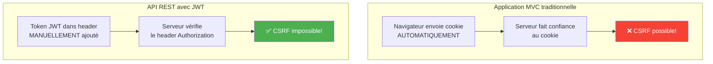

**Explication** : CSRF exploite les cookies envoyés automatiquement. Avec JWT :
1. Le token n'est PAS un cookie
2. Vous devez l'ajouter MANUELLEMENT dans le header `Authorization: Bearer xxx`
3. Un site malveillant ne peut PAS ajouter ce header à votre place
4. Donc CSRF est **impossible** → on le désactive

---

## 3. CORS vs CSRF : La confusion classique

### Ce sont deux choses COMPLÈTEMENT différentes!

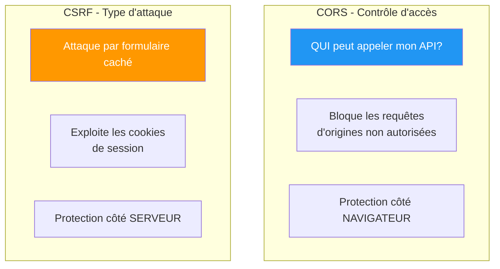

| Aspect | CORS | CSRF |
|--------|------|------|
| **C'est quoi?** | Mécanisme de contrôle d'accès | Type d'attaque |
| **Qui l'implémente?** | Navigateur | Attaquant |
| **Protection?** | Headers HTTP du serveur | Token anti-CSRF |
| **Concerne les API REST?** | OUI (pour les frontends web) | NON (pas de cookies) |

### Pourquoi CORS ne protège PAS contre CSRF?

CORS bloque les requêtes **JavaScript** cross-origin. Mais les **formulaires HTML** ne sont PAS soumis à CORS!

```html
<!-- Cette requête N'EST PAS bloquée par CORS! -->
<form action="https://autre-site.com/api" method="POST">
  <input name="data" value="malicious">
</form>
```

> **CORS** = contrôle les requêtes AJAX/fetch
> **CSRF** = exploite les formulaires HTML classiques

---

## 4. requestMatchers : Pourquoi POST pour certains?

### La question

```java
.requestMatchers(HttpMethod.POST, "/api/contact").permitAll()  // Avec POST
.requestMatchers("/api/auth/**").permitAll()                   // Sans méthode
.requestMatchers("/api/admin/**").hasRole("ADMIN")             // Sans méthode
```

**Pourquoi spécifier POST seulement pour `/api/contact`?**

### Explication

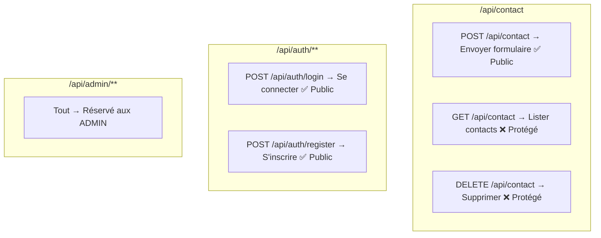

| Pattern | Signification |
|---------|---------------|
| `requestMatchers(HttpMethod.POST, "/api/contact")` | SEULEMENT POST sur /api/contact |
| `requestMatchers("/api/auth/**")` | TOUTES les méthodes sur /api/auth/* |
| `requestMatchers("/api/admin/**")` | TOUTES les méthodes sur /api/admin/* |

**Cas d'usage** :
- `/api/contact` : On veut que n'importe qui puisse ENVOYER un formulaire (POST), mais pas LISTER tous les contacts (GET)
- `/api/auth/**` : Login et register doivent être publics pour toutes les méthodes
- `/api/admin/**` : Tout est réservé aux admins

---

## 5. @PreAuthorize et le symbole #

### C'est quoi @PreAuthorize?

`@PreAuthorize` permet de sécuriser au niveau de la **méthode** (pas seulement l'URL). C'est comme un gardien personnel pour chaque fonction.

```java
@GetMapping("/{id}")
@PreAuthorize("hasRole('ADMIN')")  // Vérifie AVANT d'exécuter la méthode
public Lead getLead(@PathVariable Long id) {
    return service.findById(id);
}
```

### C'est quoi le # (dièse)?

Le `#` permet d'accéder aux **paramètres de la méthode** dans l'expression de sécurité.

```java
@DeleteMapping("/{id}")
@PreAuthorize("hasRole('ADMIN') and #id != 1")
public void delete(@PathVariable Long id) {
    //                              ↑
    //                    #id référence ce paramètre!
}
```

### Exemples avec #

```java
// #id = valeur du paramètre id (vient de l'URL : /leads/5 → id=5)
@PreAuthorize("#id != 1")
public void delete(@PathVariable Long id) { }

// #username = valeur du paramètre username (vient de ?username=jean)
@PreAuthorize("#username == authentication.principal.username")
public List<Lead> getMyLeads(@RequestParam String username) { }

// #request = l'objet request complet
@PreAuthorize("#request.email == authentication.principal.username")
public void update(@RequestBody UpdateRequest request) { }
```

### D'où vient la valeur?

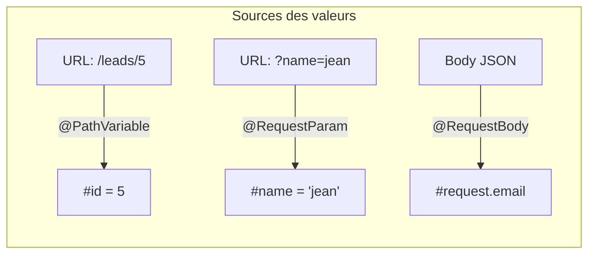

| Annotation | Source | Exemple |
|------------|--------|---------|
| `@PathVariable` | URL path | `/leads/{id}` → `#id` |
| `@RequestParam` | Query string | `?username=x` → `#username` |
| `@RequestBody` | Corps JSON | `{email: "x"}` → `#request.email` |

---

## 6. Protection à chaque couche?

### Faut-il sécuriser Controller ET Service?

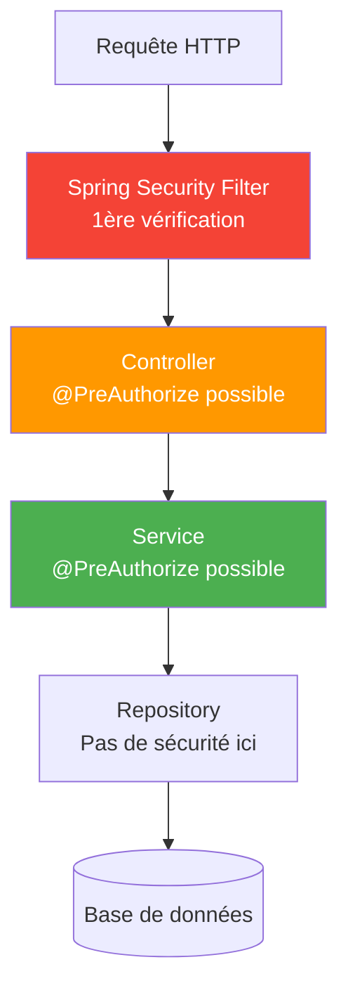

### Réponse courte : NON, pas à chaque couche!

| Couche | Sécurité? | Pourquoi? |
|--------|-----------|-----------|
| **Filter** | ✅ OUI | Point d'entrée - bloque les requêtes non autorisées |
| **Controller** | ⚠️ Parfois | Pour des règles spécifiques par endpoint |
| **Service** | ⚠️ Rarement | Si le service est appelé par plusieurs sources |
| **Repository** | ❌ NON | Pas de contexte utilisateur à ce niveau |

### Recommandation pratique

```java
// NIVEAU 1 : SecurityConfig (obligatoire)
.requestMatchers("/api/admin/**").hasRole("ADMIN")

// NIVEAU 2 : Controller (si besoin de règles fines)
@PreAuthorize("#id != 1")  // Empêcher suppression de l'admin principal
public void delete(@PathVariable Long id) { }

// NIVEAU 3 : Service (rarement nécessaire)
// Utile si le service est appelé par plusieurs controllers ou tâches planifiées
```

---

## 7. SimpleGrantedAuthority et getAuthorities()

### C'est quoi SimpleGrantedAuthority?

C'est une classe qui représente un **droit/permission** d'un utilisateur.

```java
// Un utilisateur peut avoir plusieurs autorités
List<GrantedAuthority> authorities = List.of(
    new SimpleGrantedAuthority("ROLE_ADMIN"),
    new SimpleGrantedAuthority("ROLE_USER"),
    new SimpleGrantedAuthority("READ_PRIVILEGE"),
    new SimpleGrantedAuthority("WRITE_PRIVILEGE")
);
```

### getAuthorities() : Qui l'appelle?

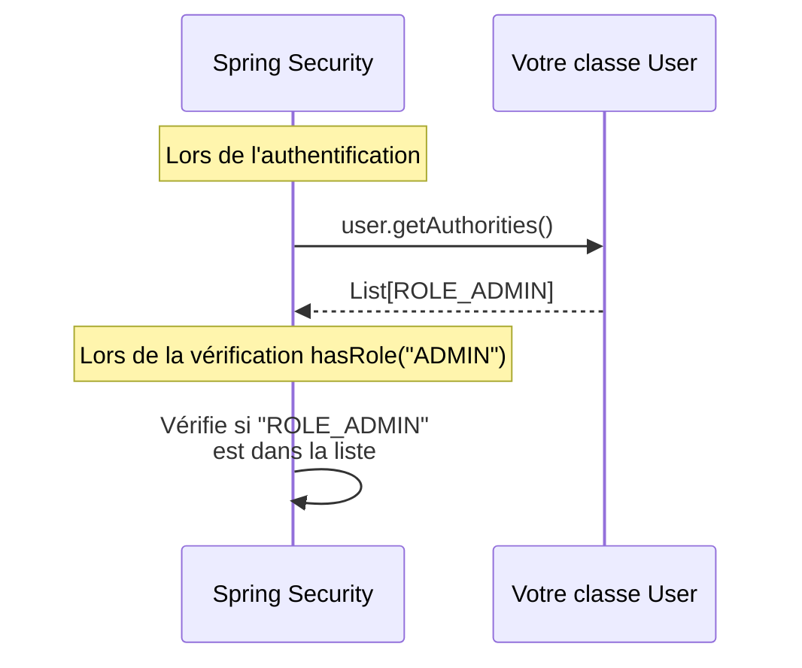

**Réponse** : C'est **Spring Security** qui appelle `getAuthorities()`, PAS vous!

```java
@Entity
public class User implements UserDetails {
    
    private Role role;  // ADMIN ou USER
    
    @Override  // Spring Security appelle cette méthode
    public Collection<? extends GrantedAuthority> getAuthorities() {
        // Vous définissez juste QUOI retourner
        return List.of(new SimpleGrantedAuthority("ROLE_" + role.name()));
    }
}
```

### Pourquoi implémenter une interface sur notre propre classe?

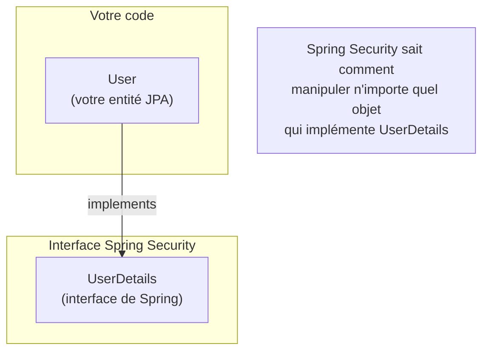

**Analogie** : C'est comme une prise électrique standardisée. Spring Security est l'appareil, UserDetails est la norme de la prise. Votre classe User doit respecter cette norme pour être "branchée" à Spring Security.

---

## 8. @Bean : C'est quoi?

### Explication en 5 phrases

1. **@Bean** dit à Spring : "Crée cet objet et garde-le en mémoire"
2. Spring gère ensuite cet objet (création, injection, destruction)
3. Quand une autre classe a besoin de cet objet, Spring le fournit automatiquement
4. Sans @Bean, vous devriez créer l'objet manuellement avec `new`
5. C'est le cœur de l'**Inversion de Contrôle** (IoC) : Spring contrôle les objets, pas vous

### Avec vs Sans @Bean

```java
// ❌ SANS @Bean : Vous gérez tout manuellement
public class MonService {
    private UserDetailsService userDetailsService;
    
    public MonService() {
        // Vous devez créer vous-même
        this.userDetailsService = new UserDetailsService() {
            @Override
            public UserDetails loadUserByUsername(String username) {
                // Et vous devez aussi créer le repository manuellement!
                UserRepository repo = new UserRepository();  // Comment???
                return repo.findByEmail(username).orElseThrow();
            }
        };
    }
}

// ✅ AVEC @Bean : Spring gère tout
@Configuration
public class SecurityConfig {
    
    @Bean  // Spring crée et gère cet objet
    public UserDetailsService userDetailsService(UserRepository repository) {
        //                                        ↑ Injecté automatiquement!
        return username -> repository.findByEmail(username)
            .orElseThrow(() -> new UsernameNotFoundException("Not found"));
    }
}

@Service
public class MonService {
    private final UserDetailsService userDetailsService;  // Injecté automatiquement!
    
    public MonService(UserDetailsService userDetailsService) {
        this.userDetailsService = userDetailsService;
    }
}
```

---

## 9. CORS : Explication en 5 phrases

1. **CORS** (Cross-Origin Resource Sharing) est un mécanisme de sécurité des navigateurs web
2. Par défaut, une page web ne peut faire des requêtes qu'à son propre domaine (même origine)
3. Si votre frontend est sur `localhost:3000` et l'API sur `localhost:8080`, le navigateur bloque les requêtes
4. CORS permet au serveur de dire "J'autorise les requêtes depuis localhost:3000"
5. C'est une **liste blanche** : seules les origines explicitement autorisées peuvent appeler l'API

```java
// Le serveur dit : "Ces origines sont autorisées"
config.setAllowedOrigins(List.of(
    "http://localhost:3000",     // Frontend dev
    "https://monsite.com"        // Frontend prod
));
```

---

## 10. Récapitulatif visuel

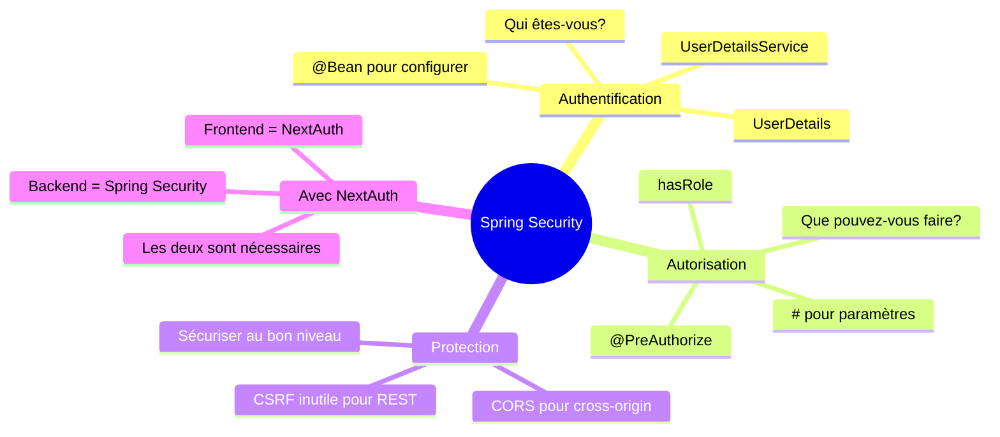

---

## QUIZ 5.2 - Clarifications Spring Security

**1. Si j'utilise NextAuth, dois-je aussi utiliser Spring Security?**
- a) Non, NextAuth suffit
- b) Oui, les deux sont nécessaires
- c) Seulement en production
- d) C'est optionnel

<details>
<summary>Voir la réponse</summary>

**Réponse : b) Oui, les deux sont nécessaires**

NextAuth protège le frontend, Spring Security protège le backend. Un attaquant peut contourner le frontend et appeler directement l'API.
</details>

---

**2. Pourquoi désactiver CSRF pour une API REST?**
- a) Pour la performance
- b) Parce que JWT n'utilise pas de cookies automatiques
- c) CSRF n'existe pas
- d) C'est obligatoire

<details>
<summary>Voir la réponse</summary>

**Réponse : b) Parce que JWT n'utilise pas de cookies automatiques**

CSRF exploite les cookies envoyés automatiquement. JWT est envoyé manuellement dans le header Authorization, donc CSRF est impossible.
</details>

---

**3. Que signifie `#id` dans `@PreAuthorize("#id != 1")`?**
- a) Un commentaire
- b) La valeur du paramètre `id` de la méthode
- c) L'ID de l'utilisateur connecté
- d) Un nombre fixe

<details>
<summary>Voir la réponse</summary>

**Réponse : b) La valeur du paramètre `id` de la méthode**

Le # permet d'accéder aux paramètres de la méthode annotée dans l'expression SpEL.
</details>

---

**4. Qui appelle la méthode getAuthorities()?**
- a) Vous, dans votre code
- b) Spring Security automatiquement
- c) Le frontend
- d) La base de données

<details>
<summary>Voir la réponse</summary>

**Réponse : b) Spring Security automatiquement**

Spring Security appelle getAuthorities() pour récupérer les rôles/permissions de l'utilisateur lors de l'authentification et des vérifications d'autorisation.
</details>

---

**5. CORS et CSRF sont-ils la même chose?**
- a) Oui
- b) Non, CORS contrôle l'accès, CSRF est une attaque
- c) Non, CSRF contrôle l'accès, CORS est une attaque
- d) Ce sont deux protections identiques

<details>
<summary>Voir la réponse</summary>

**Réponse : b) Non, CORS contrôle l'accès, CSRF est une attaque**

CORS est un mécanisme de contrôle d'accès implémenté par les navigateurs. CSRF est un type d'attaque qui exploite les cookies de session.
</details>

---

## Navigation

| Précédent | Suivant |
|-----------|---------|
| [22 - Spring Security Introduction](22-spring-security-intro.md) | [24 - Configuration avancée](24-security-config-avancee.md) |

