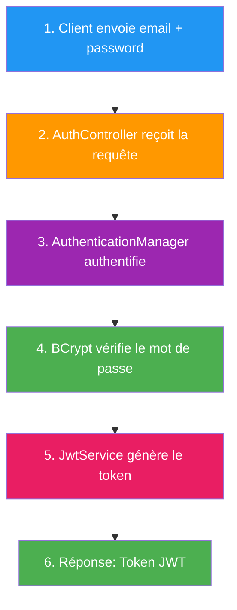
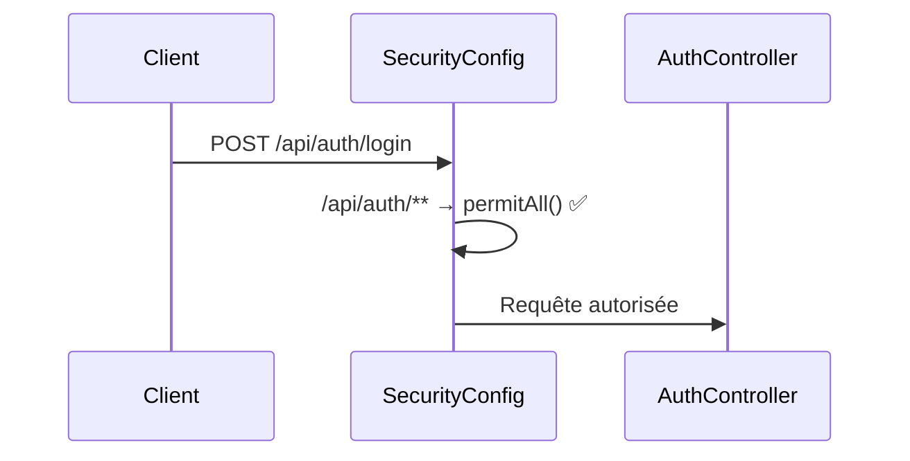

# Chapitre 5.3 - SecurityConfig.java : Explication ligne par ligne

## Objectifs du chapitre

- Comprendre chaque ligne du fichier `SecurityConfig.java`
- Maîtriser les annotations de configuration Spring Security
- Comprendre le rôle de chaque Bean
- Savoir personnaliser la configuration de sécurité

---

## Vue d'ensemble du fichier

Le fichier `SecurityConfig.java` est le **cerveau de la sécurité** de votre application. C'est ici que vous définissez :
- Quels endpoints sont publics ou protégés
- Comment authentifier les utilisateurs
- Comment gérer les sessions
- Comment configurer CORS


---

## 1. Les imports : Comprendre les dépendances

```java
package com.example.contact.config;

import com.example.contact.security.JwtAuthFilter;
import org.springframework.context.annotation.Bean;
import org.springframework.context.annotation.Configuration;
import org.springframework.http.HttpMethod;
import org.springframework.security.authentication.AuthenticationManager;
import org.springframework.security.authentication.AuthenticationProvider;
import org.springframework.security.authentication.dao.DaoAuthenticationProvider;
import org.springframework.security.config.annotation.authentication.configuration.AuthenticationConfiguration;
import org.springframework.security.config.annotation.method.configuration.EnableMethodSecurity;
import org.springframework.security.config.annotation.web.builders.HttpSecurity;
import org.springframework.security.config.annotation.web.configuration.EnableWebSecurity;
import org.springframework.security.config.annotation.web.configurers.AbstractHttpConfigurer;
import org.springframework.security.config.http.SessionCreationPolicy;
import org.springframework.security.core.userdetails.UserDetailsService;
import org.springframework.security.crypto.bcrypt.BCryptPasswordEncoder;
import org.springframework.security.crypto.password.PasswordEncoder;
import org.springframework.security.web.SecurityFilterChain;
import org.springframework.security.web.authentication.UsernamePasswordAuthenticationFilter;
import org.springframework.web.cors.CorsConfiguration;
import org.springframework.web.cors.CorsConfigurationSource;
import org.springframework.web.cors.UrlBasedCorsConfigurationSource;

import java.util.Arrays;
import java.util.List;
```

### Explication des imports par catégorie


| Import | Rôle |
|--------|------|
| `JwtAuthFilter` | Notre filtre personnalisé pour valider les JWT |
| `@Bean` | Déclare un objet géré par Spring |
| `@Configuration` | Marque la classe comme source de configuration |
| `HttpMethod` | Enum pour GET, POST, PUT, DELETE |
| `AuthenticationManager` | Interface centrale pour l'authentification |
| `AuthenticationProvider` | Fournit la logique d'authentification |
| `DaoAuthenticationProvider` | Implémentation qui utilise UserDetailsService |
| `HttpSecurity` | Builder pour configurer la sécurité HTTP |
| `SessionCreationPolicy` | Définit comment gérer les sessions |
| `SecurityFilterChain` | La chaîne de filtres de sécurité |
| `PasswordEncoder` | Interface pour encoder les mots de passe |
| `BCryptPasswordEncoder` | Implémentation BCrypt (recommandée) |
| `CorsConfiguration` | Configuration CORS |

---

## 2. Les annotations de classe

```java
@Configuration
@EnableWebSecurity
@EnableMethodSecurity
public class SecurityConfig {
```

### @Configuration

Cette annotation indique à Spring que cette classe contient des définitions de **Beans**. Spring va scanner cette classe au démarrage et créer tous les objets marqués `@Bean`.


**Sans @Configuration** : Spring ne saurait pas que cette classe contient des Beans à créer.

### @EnableWebSecurity

Cette annotation **active Spring Security** pour votre application web. Elle fait plusieurs choses :

1. Active le filtre de sécurité Spring
2. Configure l'infrastructure de base
3. Permet d'utiliser `HttpSecurity`


**Sans @EnableWebSecurity** : Aucune requête ne serait filtrée, votre API serait ouverte à tous!

### @EnableMethodSecurity

Cette annotation permet d'utiliser les annotations de sécurité **au niveau des méthodes** :
- `@PreAuthorize` - Vérifie AVANT l'exécution
- `@PostAuthorize` - Vérifie APRÈS l'exécution
- `@Secured` - Version simplifiée

```java
// Exemple d'utilisation grâce à @EnableMethodSecurity
@GetMapping("/{id}")
@PreAuthorize("hasRole('ADMIN') or #id == authentication.principal.id")
public User getUser(@PathVariable Long id) {
    return userService.findById(id);
}
```

**Sans @EnableMethodSecurity** : Les annotations `@PreAuthorize` seraient ignorées!

---

## 3. SecurityFilterChain : Le coeur de la configuration

```java
@Bean
public SecurityFilterChain securityFilterChain(
        HttpSecurity http,
        JwtAuthFilter jwtAuthFilter,
        AuthenticationProvider authenticationProvider) throws Exception {
```

### Qu'est-ce qu'un SecurityFilterChain?

C'est une **chaîne de filtres** qui traite chaque requête HTTP. Imaginez une série de gardiens, chacun vérifiant quelque chose de différent.


### Les paramètres injectés


| Paramètre | Source | Rôle |
|-----------|--------|------|
| `HttpSecurity http` | Spring Security | Builder pour configurer la sécurité |
| `JwtAuthFilter jwtAuthFilter` | Notre code (@Component) | Filtre pour valider les JWT |
| `AuthenticationProvider authenticationProvider` | Notre @Bean | Vérifie les credentials |

---

## 4. Configuration CSRF

```java
http
    .csrf(AbstractHttpConfigurer::disable)
```

### Qu'est-ce que ça fait?

Cette ligne **désactive la protection CSRF**. 

### Pourquoi désactiver CSRF?


### Syntaxe moderne vs ancienne

```java
// Spring Security 6+ (moderne) - Method Reference
.csrf(AbstractHttpConfigurer::disable)

// Équivalent avec lambda
.csrf(csrf -> csrf.disable())

// Ancienne syntaxe (dépréciée)
.csrf().disable()
```

---

## 5. Configuration CORS

```java
.cors(cors -> cors.configurationSource(corsConfigurationSource()))
```

### Qu'est-ce que ça fait?

Cette ligne active CORS et utilise notre configuration personnalisée définie dans la méthode `corsConfigurationSource()`.


---

## 6. Gestion des sessions

```java
.sessionManagement(session ->
        session.sessionCreationPolicy(SessionCreationPolicy.STATELESS))
```

### SessionCreationPolicy.STATELESS

Cette configuration indique à Spring de **ne jamais créer de session HTTP**. Chaque requête est indépendante.


| Policy | Description | Usage |
|--------|-------------|-------|
| `STATELESS` | Pas de session, chaque requête est indépendante | API REST avec JWT |
| `ALWAYS` | Toujours créer une session | Applications web classiques |
| `IF_REQUIRED` | Créer si nécessaire | Par défaut |
| `NEVER` | Ne pas créer, mais utiliser si existe | Cas spéciaux |

### Pourquoi STATELESS pour une API REST?

1. **Scalabilité** : Pas besoin de partager les sessions entre serveurs
2. **Performance** : Pas de stockage serveur
3. **Simplicité** : Le JWT contient toutes les infos nécessaires
4. **Mobile-friendly** : Les apps mobiles n'utilisent pas de cookies

---

## 7. Règles d'autorisation

```java
.authorizeHttpRequests(auth -> auth
        // Endpoints publics
        .requestMatchers(HttpMethod.POST, "/api/contact").permitAll()
        .requestMatchers("/api/auth/**").permitAll()
        .requestMatchers("/h2-console/**").permitAll()
        // Swagger UI
        .requestMatchers("/swagger-ui/**").permitAll()
        .requestMatchers("/swagger-ui.html").permitAll()
        .requestMatchers("/v3/api-docs/**").permitAll()
        // Endpoints admin
        .requestMatchers("/api/admin/**").hasRole("ADMIN")
        // Tout le reste requiert authentification
        .anyRequest().authenticated()
)
```

### Diagramme des règles


### Explication de chaque règle

| Règle | Signification |
|-------|---------------|
| `requestMatchers(HttpMethod.POST, "/api/contact").permitAll()` | SEULEMENT POST sur /api/contact est public |
| `requestMatchers("/api/auth/**").permitAll()` | Tout sous /api/auth/ est public (login, register) |
| `requestMatchers("/h2-console/**").permitAll()` | Console H2 accessible (développement) |
| `requestMatchers("/swagger-ui/**").permitAll()` | Documentation Swagger accessible |
| `requestMatchers("/api/admin/**").hasRole("ADMIN")` | Tout sous /api/admin/ requiert le rôle ADMIN |
| `anyRequest().authenticated()` | Tout le reste requiert une authentification |

### L'ordre est IMPORTANT!


**Mauvais ordre** :
```java
// ❌ ERREUR : anyRequest() en premier bloque tout!
.anyRequest().authenticated()
.requestMatchers("/api/auth/**").permitAll()  // Jamais atteint!
```

**Bon ordre** :
```java
// ✅ CORRECT : du plus spécifique au plus général
.requestMatchers("/api/auth/**").permitAll()
.anyRequest().authenticated()
```

---

## 8. Configuration des headers

```java
.headers(headers -> headers.frameOptions(frame -> frame.disable()))
```

### Qu'est-ce que ça fait?

Désactive la protection `X-Frame-Options` qui empêche l'affichage dans une iframe.

### Pourquoi?

La console H2 utilise des iframes pour son interface. Sans cette configuration, elle ne s'afficherait pas.


> ⚠️ **En production**, vous devriez réactiver cette protection et ne pas exposer la console H2.

---

## 9. Ajout du filtre JWT

```java
.authenticationProvider(authenticationProvider)
.addFilterBefore(jwtAuthFilter, UsernamePasswordAuthenticationFilter.class);
```

### authenticationProvider()

Définit comment Spring Security vérifie les credentials (email/mot de passe).

### addFilterBefore()

Ajoute notre `JwtAuthFilter` AVANT le filtre standard d'authentification.


### Pourquoi "before"?

Notre filtre JWT doit s'exécuter AVANT le filtre standard car :
1. Si le JWT est valide, l'utilisateur est déjà authentifié
2. Le filtre standard n'a plus besoin de s'exécuter
3. On évite une double vérification

---

## 10. CorsConfigurationSource

```java
@Bean
public CorsConfigurationSource corsConfigurationSource() {
    CorsConfiguration configuration = new CorsConfiguration();
    configuration.setAllowedOrigins(List.of("*"));
    configuration.setAllowedMethods(Arrays.asList("GET", "POST", "PUT", "DELETE", "OPTIONS"));
    configuration.setAllowedHeaders(List.of("*"));
    configuration.setExposedHeaders(List.of("Authorization"));

    UrlBasedCorsConfigurationSource source = new UrlBasedCorsConfigurationSource();
    source.registerCorsConfiguration("/**", configuration);
    return source;
}
```

### Explication ligne par ligne


| Méthode | Valeur | Signification |
|---------|--------|---------------|
| `setAllowedOrigins(List.of("*"))` | `*` | Tous les domaines peuvent appeler l'API |
| `setAllowedMethods(...)` | GET, POST, PUT, DELETE, OPTIONS | Méthodes HTTP autorisées |
| `setAllowedHeaders(List.of("*"))` | `*` | Tous les headers sont acceptés |
| `setExposedHeaders(List.of("Authorization"))` | Authorization | Le frontend peut lire ce header |
| `registerCorsConfiguration("/**", ...)` | `/**` | S'applique à toutes les URLs |

### En production

```java
// ⚠️ En production, spécifiez les origines exactes!
configuration.setAllowedOrigins(List.of(
    "https://monsite.com",
    "https://www.monsite.com"
));
```

---

## 11. AuthenticationProvider

```java
@Bean
public AuthenticationProvider authenticationProvider(UserDetailsService userDetailsService) {
    DaoAuthenticationProvider authProvider = new DaoAuthenticationProvider();
    authProvider.setUserDetailsService(userDetailsService);
    authProvider.setPasswordEncoder(passwordEncoder());
    return authProvider;
}
```

### Qu'est-ce que c'est?

L'`AuthenticationProvider` est responsable de **vérifier les credentials** (email + mot de passe).


### DaoAuthenticationProvider

C'est une implémentation qui :
1. Utilise `UserDetailsService` pour charger l'utilisateur
2. Utilise `PasswordEncoder` pour vérifier le mot de passe

```java
DaoAuthenticationProvider authProvider = new DaoAuthenticationProvider();
authProvider.setUserDetailsService(userDetailsService);  // Comment charger l'utilisateur
authProvider.setPasswordEncoder(passwordEncoder());       // Comment vérifier le mot de passe
```

---

## 12. AuthenticationManager

```java
@Bean
public AuthenticationManager authenticationManager(AuthenticationConfiguration config) throws Exception {
    return config.getAuthenticationManager();
}
```

### Qu'est-ce que c'est?

L'`AuthenticationManager` est le **point d'entrée** pour l'authentification. Il délègue le travail aux `AuthenticationProvider`.


### Pourquoi cette syntaxe?

```java
// Spring Security configure automatiquement un AuthenticationManager
// On récupère juste celui qui est configuré
return config.getAuthenticationManager();
```

### Utilisation dans le code

```java
@RestController
@RequestMapping("/api/auth")
public class AuthController {
    
    private final AuthenticationManager authenticationManager;
    
    @PostMapping("/login")
    public TokenResponse login(@RequestBody LoginRequest request) {
        // Utilise l'AuthenticationManager pour authentifier
        authenticationManager.authenticate(
            new UsernamePasswordAuthenticationToken(
                request.getEmail(),
                request.getPassword()
            )
        );
        // Si pas d'exception, l'authentification a réussi
        // Générer et retourner le JWT...
    }
}
```

---

## 13. PasswordEncoder

```java
@Bean
public PasswordEncoder passwordEncoder() {
    return new BCryptPasswordEncoder();
}
```

### Qu'est-ce que BCrypt?

BCrypt est un algorithme de **hachage** spécialement conçu pour les mots de passe. Il est :
- **Lent** (intentionnellement, pour résister aux attaques brute-force)
- **Salé** (chaque hash inclut un sel aléatoire)
- **Adaptatif** (le coût peut être augmenté avec le temps)


### Comparaison des algorithmes

| Algorithme | Sécurité | Vitesse | Usage |
|------------|----------|---------|-------|
| MD5 | ❌ Cassé | Très rapide | JAMAIS pour les mots de passe |
| SHA-256 | ⚠️ Trop rapide | Rapide | Checksums, pas mots de passe |
| BCrypt | ✅ Recommandé | Lent | Mots de passe |
| Argon2 | ✅ Très sécurisé | Configurable | Alternative moderne |

### Fonctionnement

```java
// Lors de l'inscription
String hash = passwordEncoder.encode("motdepasse123");
// hash = "$2a$10$N9qo8uLOickgx2ZMRZoMyeIjZAgcfl7p92ldGxad68LJZdL17lhWy"

// Lors du login
boolean match = passwordEncoder.matches("motdepasse123", hash);
// match = true
```

---

## 14. Schéma complet de la configuration


---

## QUIZ 5.3 - SecurityConfig en détail

**1. Que fait l'annotation @EnableWebSecurity?**
- a) Active la sécurité des méthodes
- b) Active Spring Security et le filtre de sécurité
- c) Désactive CSRF
- d) Configure CORS

<details>
<summary>Voir la réponse</summary>

**Réponse : b) Active Spring Security et le filtre de sécurité**

@EnableWebSecurity active le filtre Spring Security qui intercepte toutes les requêtes HTTP et applique les règles de sécurité configurées.
</details>

---

**2. Pourquoi utilise-t-on SessionCreationPolicy.STATELESS?**
- a) Pour améliorer les performances
- b) Parce qu'on utilise JWT qui contient toutes les infos nécessaires
- c) Pour économiser la mémoire
- d) Toutes ces réponses

<details>
<summary>Voir la réponse</summary>

**Réponse : d) Toutes ces réponses**

STATELESS signifie pas de session serveur. Avec JWT, chaque requête contient toutes les informations (dans le token), donc pas besoin de sessions. Cela améliore les performances, économise la mémoire, et facilite la scalabilité.
</details>

---

**3. Pourquoi l'ordre des requestMatchers est-il important?**
- a) Pour la lisibilité
- b) Spring évalue les règles dans l'ordre, la première qui matche gagne
- c) Pour les performances
- d) Ce n'est pas important

<details>
<summary>Voir la réponse</summary>

**Réponse : b) Spring évalue les règles dans l'ordre, la première qui matche gagne**

Si vous mettez `anyRequest().authenticated()` en premier, toutes les requêtes nécessiteront une authentification, même celles censées être publiques. Toujours aller du plus spécifique au plus général.
</details>

---

**4. Que fait addFilterBefore(jwtAuthFilter, UsernamePasswordAuthenticationFilter.class)?**
- a) Remplace le filtre standard
- b) Ajoute notre filtre APRÈS le filtre standard
- c) Ajoute notre filtre AVANT le filtre standard
- d) Désactive le filtre standard

<details>
<summary>Voir la réponse</summary>

**Réponse : c) Ajoute notre filtre AVANT le filtre standard**

Notre JwtAuthFilter s'exécute avant UsernamePasswordAuthenticationFilter. Si le JWT est valide, l'utilisateur est authentifié et le filtre standard n'a plus besoin de faire son travail.
</details>

---

**5. Pourquoi BCrypt est-il recommandé pour les mots de passe?**
- a) Il est rapide
- b) Il est simple à implémenter
- c) Il est lent, salé et résistant aux attaques brute-force
- d) Il est réversible

<details>
<summary>Voir la réponse</summary>

**Réponse : c) Il est lent, salé et résistant aux attaques brute-force**

BCrypt est intentionnellement lent pour rendre les attaques brute-force impraticables. Il inclut un sel aléatoire dans chaque hash, donc deux mots de passe identiques produisent des hashs différents.
</details>

---

**6. Que signifie `configuration.setAllowedOrigins(List.of("*"))`?**
- a) Aucune origine autorisée
- b) Seul localhost est autorisé
- c) Toutes les origines sont autorisées
- d) Seules les requêtes HTTPS sont autorisées

<details>
<summary>Voir la réponse</summary>

**Réponse : c) Toutes les origines sont autorisées**

Le `*` (wildcard) autorise tous les domaines à appeler l'API. En production, vous devriez spécifier les origines exactes pour plus de sécurité.
</details>

---

**7. Quel est le rôle de DaoAuthenticationProvider?**
- a) Générer des JWT
- b) Charger les utilisateurs et vérifier les mots de passe
- c) Configurer CORS
- d) Gérer les sessions

<details>
<summary>Voir la réponse</summary>

**Réponse : b) Charger les utilisateurs et vérifier les mots de passe**

DaoAuthenticationProvider utilise UserDetailsService pour charger l'utilisateur depuis la base de données et PasswordEncoder pour vérifier que le mot de passe fourni correspond au hash stocké.
</details>

---

---

## 15. SCÉNARIOS RÉELS : Qui appelle quoi dans NOTRE projet?

Voici exactement ce qui se passe dans notre projet `e-contact-backend` avec les vrais fichiers.

### SCÉNARIO 1 : L'administrateur se connecte (LOGIN)

**Requête** : `POST /api/auth/login` avec `{"email": "admin@test.com", "password": "admin123"}`

#### Vue d'ensemble simplifiée



#### Étape 1-3 : La requête arrive (endpoint public)



#### Étape 4-6 : Chargement de l'utilisateur

```mermaid
sequenceDiagram
    participant AC as AuthController
    participant AM as AuthenticationManager
    participant UDS as UserDetailsService
    participant DB as Database
    
    AC->>AM: authenticate("admin@test.com", "admin123")
    AM->>UDS: loadUserByUsername("admin@test.com")
    UDS->>DB: SELECT * FROM users WHERE email=?
    DB-->>UDS: User(password_hash, role=ADMIN)
    UDS-->>AM: User
```

#### Étape 7-8 : Vérification du mot de passe

```mermaid
sequenceDiagram
    participant AM as AuthenticationManager
    participant PE as PasswordEncoder (BCrypt)
    
    AM->>PE: matches("admin123", "$2a$10$hash...")
    PE-->>AM: true ✅
    AM-->>AM: Authentication SUCCESS
```

#### Étape 9-11 : Génération du JWT et réponse

```mermaid
sequenceDiagram
    participant AM as AuthenticationManager
    participant AC as AuthController
    participant JS as JwtService
    participant C as Client
    
    AM-->>AC: Authentication(user, [ROLE_ADMIN])
    AC->>JS: generateToken(user)
    JS-->>AC: "eyJhbGciOiJIUzI1NiJ9..."
    AC-->>C: 200 OK { token: "eyJ...", role: "ADMIN" }
```

#### Diagramme complet (toutes les étapes)

<details>
<summary>Cliquez pour voir le diagramme complet</summary>

```mermaid
sequenceDiagram
    participant Client as Client
    participant SC as SecurityConfig
    participant AC as AuthController
    participant AM as AuthenticationManager
    participant DAP as DaoAuthenticationProvider
    participant UDS as UserDetailsService
    participant UR as UserRepository
    participant PE as PasswordEncoder
    participant JS as JwtService
    participant DB as PostgreSQL
    
    Note over Client,SC: ÉTAPE 1-2 : La requête arrive
    Client->>SC: POST /api/auth/login
    SC->>SC: /api/auth/** → permitAll() ✅
    SC->>AC: Requête autorisée
    
    Note over AC,AM: ÉTAPE 3-4 : AuthController appelle authenticate
    AC->>AM: authenticationManager.authenticate(<br/>"admin@test.com", "admin123")
    AM->>DAP: authenticate()
    
    Note over DAP,UDS: ÉTAPE 5-6 : Chargement de l'utilisateur
    DAP->>UDS: loadUserByUsername("admin@test.com")
    UDS->>UR: findByEmail("admin@test.com")
    UR->>DB: SELECT * FROM users WHERE email='admin@test.com'
    DB-->>UR: User(password_hash, role=ADMIN)
    UR-->>UDS: User
    UDS-->>DAP: User (implements UserDetails)
    
    Note over DAP,PE: ÉTAPE 7-8 : Vérification du mot de passe
    DAP->>PE: matches("admin123", "$2a$10$hash...")
    PE-->>DAP: true ✅
    DAP-->>AM: Authentication SUCCESS
    AM-->>AC: Authentication(user, [ROLE_ADMIN])
    
    Note over AC,JS: ÉTAPE 9-10 : Génération du JWT
    AC->>JS: jwtService.generateToken(user)
    JS-->>AC: "eyJhbGciOiJIUzI1NiJ9..."
    
    Note over AC,Client: ÉTAPE 11 : Réponse au client
    AC-->>Client: 200 OK { token: "eyJ...", role: "ADMIN" }
```

</details>

### Code correspondant dans notre projet

**1. AuthController.java** (qui appelle `authenticationManager.authenticate`)

```java
// src/main/java/com/example/contact/controller/AuthController.java
@PostMapping("/login")
public ResponseEntity<AuthResponse> login(@Valid @RequestBody LoginRequest request) {
    // ← CETTE LIGNE déclenche toute la chaîne!
    Authentication authentication = authenticationManager.authenticate(
            new UsernamePasswordAuthenticationToken(
                    request.getEmail(),     // "admin@test.com"
                    request.getPassword()   // "admin123"
            )
    );
    
    User user = (User) authentication.getPrincipal();
    String token = jwtService.generateToken(user);  // Génère le JWT
    
    return ResponseEntity.ok(AuthResponse.builder()
            .token(token)
            .type("Bearer")
            .expiresIn(jwtService.getExpiration())
            .email(user.getEmail())
            .role(user.getRole().name())
            .build());
}
```

**2. SecurityConfig.java** (configure l'AuthenticationManager)

```java
// src/main/java/com/example/contact/config/SecurityConfig.java

// Ce Bean est injecté dans AuthController
@Bean
public AuthenticationManager authenticationManager(AuthenticationConfiguration config) throws Exception {
    return config.getAuthenticationManager();  // Utilise notre AuthenticationProvider
}

// Ce Bean définit COMMENT vérifier les credentials
@Bean
public AuthenticationProvider authenticationProvider(UserDetailsService userDetailsService) {
    DaoAuthenticationProvider authProvider = new DaoAuthenticationProvider();
    authProvider.setUserDetailsService(userDetailsService);  // Comment charger l'utilisateur
    authProvider.setPasswordEncoder(passwordEncoder());       // Comment vérifier le mot de passe
    return authProvider;
}

@Bean
public PasswordEncoder passwordEncoder() {
    return new BCryptPasswordEncoder();  // BCrypt pour vérifier les mots de passe
}
```

**3. UserDetailsConfig.java** (charge l'utilisateur depuis la DB)

```java
// src/main/java/com/example/contact/config/UserDetailsConfig.java
@Bean
public UserDetailsService userDetailsService() {
    // Cette lambda est appelée par DaoAuthenticationProvider
    return username -> userRepository.findByEmail(username)
            .orElseThrow(() -> new UsernameNotFoundException("Utilisateur non trouvé"));
}
```

**4. User.java** (implémente UserDetails)

```java
// src/main/java/com/example/contact/model/User.java
@Entity
public class User implements UserDetails {
    
    // Appelée par Spring Security pour récupérer les rôles
    @Override
    public Collection<? extends GrantedAuthority> getAuthorities() {
        return List.of(new SimpleGrantedAuthority("ROLE_" + role.name()));
        // Retourne: [ROLE_ADMIN] ou [ROLE_SUPER_ADMIN]
    }
    
    // Appelée pour récupérer l'identifiant
    @Override
    public String getUsername() {
        return email;  // On utilise l'email comme username
    }
    
    // Les autres méthodes retournent true (compte actif)
    @Override
    public boolean isAccountNonExpired() { return true; }
    @Override
    public boolean isAccountNonLocked() { return true; }
    @Override
    public boolean isCredentialsNonExpired() { return true; }
    @Override
    public boolean isEnabled() { return true; }
}
```

---

### SCÉNARIO 2 : Accès à un endpoint protégé (avec JWT)

**Requête** : `GET /api/admin/leads` avec header `Authorization: Bearer eyJ...`

#### Vue d'ensemble simplifiée

```mermaid
graph TB
    A["1. Client envoie GET + JWT"] 
    A --> B["2. JwtAuthFilter valide le token"]
    B --> C["3. SecurityConfig vérifie ROLE_ADMIN"]
    C --> D["4. LeadController exécute"]
    D --> E["5. 200 OK - Liste des leads"]
    
    style A fill:#2196F3,color:#fff
    style B fill:#FF9800,color:#fff
    style C fill:#4CAF50,color:#fff
    style D fill:#9C27B0,color:#fff
    style E fill:#4CAF50,color:#fff
```

#### Étape 1-3 : Extraction du JWT

```mermaid
sequenceDiagram
    participant C as Client
    participant JAF as JwtAuthFilter
    
    C->>JAF: GET /api/admin/leads<br/>Authorization: Bearer eyJ...
    JAF->>JAF: authHeader = "Bearer eyJ..."
    JAF->>JAF: jwt = authHeader.substring(7)<br/>→ "eyJ..."
```

#### Étape 4-5 : Extraction email et chargement user

```mermaid
sequenceDiagram
    participant JAF as JwtAuthFilter
    participant JS as JwtService
    participant DB as Database
    
    JAF->>JS: extractUsername(jwt)
    JS-->>JAF: "admin@test.com"
    JAF->>DB: findByEmail("admin@test.com")
    DB-->>JAF: User(role=ADMIN)
```

#### Étape 6-7 : Validation et authentification

```mermaid
sequenceDiagram
    participant JAF as JwtAuthFilter
    participant JS as JwtService
    participant CTX as SecurityContext
    
    JAF->>JS: isTokenValid(jwt, user)
    JS-->>JAF: true ✅
    JAF->>CTX: setAuthentication(user, [ROLE_ADMIN])
```

#### Étape 8-11 : Vérification règles et réponse

```mermaid
sequenceDiagram
    participant JAF as JwtAuthFilter
    participant SC as SecurityConfig
    participant LC as LeadController
    participant C as Client
    
    JAF->>SC: filterChain.doFilter()
    SC->>SC: hasRole('ADMIN')? ✅
    SC->>LC: Accès autorisé
    LC-->>C: 200 OK [leads...]
```

#### Diagramme complet (toutes les étapes)

<details>
<summary>Cliquez pour voir le diagramme complet</summary>

```mermaid
sequenceDiagram
    participant Client as Client
    participant SF as SecurityFilterChain
    participant JAF as JwtAuthFilter
    participant JS as JwtService
    participant UDS as UserDetailsService
    participant UR as UserRepository
    participant SC as SecurityConfig
    participant LC as LeadController
    participant DB as PostgreSQL
    
    Note over Client,SF: ÉTAPE 1 : Requête avec JWT
    Client->>SF: GET /api/admin/leads<br/>Authorization: Bearer eyJ...
    
    Note over SF,JAF: ÉTAPE 2 : JwtAuthFilter.doFilterInternal()
    SF->>JAF: doFilterInternal(request, response, filterChain)
    
    Note over JAF: ÉTAPE 3 : Extraction du token
    JAF->>JAF: authHeader = request.getHeader("Authorization")<br/>jwt = authHeader.substring(7)
    
    Note over JAF,JS: ÉTAPE 4 : Extraction de l'email
    JAF->>JS: jwtService.extractUsername(jwt)
    JS->>JS: Décode le JWT, extrait le "subject"
    JS-->>JAF: "admin@test.com"
    
    Note over JAF,UDS: ÉTAPE 5 : Chargement de l'utilisateur
    JAF->>UDS: userDetailsService.loadUserByUsername("admin@test.com")
    UDS->>UR: findByEmail("admin@test.com")
    UR->>DB: SELECT * FROM users WHERE email='admin@test.com'
    DB-->>UR: User
    UR-->>UDS: User
    UDS-->>JAF: UserDetails (notre User)
    
    Note over JAF,JS: ÉTAPE 6 : Validation du token
    JAF->>JS: jwtService.isTokenValid(jwt, userDetails)
    JS->>JS: Vérifie signature + expiration
    JS-->>JAF: true ✅
    
    Note over JAF: ÉTAPE 7 : Création de l'Authentication
    JAF->>JAF: UsernamePasswordAuthenticationToken authToken
    JAF->>JAF: SecurityContextHolder.setAuthentication(authToken)
    
    Note over JAF,SC: ÉTAPE 8 : Continue la chaîne
    JAF->>SC: filterChain.doFilter()
    
    Note over SC: ÉTAPE 9 : Vérification des règles
    SC->>SC: "/api/admin/**" → hasRole("ADMIN")<br/>User a ROLE_ADMIN? ✅
    
    Note over SC,LC: ÉTAPE 10 : Accès autorisé
    SC->>LC: Appel de la méthode du Controller
    LC->>DB: Récupère les leads
    DB-->>LC: Liste des leads
    
    Note over LC,Client: ÉTAPE 11 : Réponse
    LC-->>Client: 200 OK [{ lead1 }, { lead2 }, ...]
```

</details>

### Code correspondant

**1. JwtAuthFilter.java** (intercepte chaque requête)

```java
// src/main/java/com/example/contact/security/JwtAuthFilter.java
@Override
protected void doFilterInternal(HttpServletRequest request, ...) {
    
    // 1. Récupère le header Authorization
    final String authHeader = request.getHeader("Authorization");
    
    // 2. Si pas de token, passe au filtre suivant (sera bloqué plus tard si endpoint protégé)
    if (authHeader == null || !authHeader.startsWith("Bearer ")) {
        filterChain.doFilter(request, response);
        return;
    }
    
    // 3. Extrait le JWT (enlève "Bearer ")
    jwt = authHeader.substring(7);
    
    // 4. Extrait l'email du JWT
    userEmail = jwtService.extractUsername(jwt);
    
    // 5. Charge l'utilisateur depuis la DB
    if (userEmail != null && SecurityContextHolder.getContext().getAuthentication() == null) {
        UserDetails userDetails = this.userDetailsService.loadUserByUsername(userEmail);
        
        // 6. Vérifie que le token est valide
        if (jwtService.isTokenValid(jwt, userDetails)) {
            // 7. Crée l'objet Authentication
            UsernamePasswordAuthenticationToken authToken = new UsernamePasswordAuthenticationToken(
                    userDetails,
                    null,
                    userDetails.getAuthorities()  // ← Appelle User.getAuthorities()
            );
            
            // 8. Place l'utilisateur dans le SecurityContext
            SecurityContextHolder.getContext().setAuthentication(authToken);
        }
    }
    
    // 9. Continue vers le prochain filtre / controller
    filterChain.doFilter(request, response);
}
```

**2. JwtService.java** (valide le JWT)

```java
// src/main/java/com/example/contact/security/JwtService.java

// Extrait l'email du JWT
public String extractUsername(String token) {
    return extractClaim(token, Claims::getSubject);  // Le "subject" contient l'email
}

// Vérifie si le token est valide
public boolean isTokenValid(String token, UserDetails userDetails) {
    final String username = extractUsername(token);
    return (username.equals(userDetails.getUsername())) && !isTokenExpired(token);
}
```

---

### SCÉNARIO 3 : Accès refusé (pas de JWT)

**Requête** : `GET /api/admin/leads` (sans header Authorization)

```mermaid
sequenceDiagram
    participant Client as Client
    participant JAF as JwtAuthFilter
    participant SC as SecurityConfig
    
    Client->>JAF: GET /api/admin/leads<br/>(pas de header Authorization)
    
    JAF->>JAF: authHeader == null?<br/>OUI → filterChain.doFilter()
    
    Note over JAF: Pas d'authentification créée<br/>SecurityContext est VIDE
    
    JAF->>SC: Continue vers les règles
    SC->>SC: "/api/admin/**" → hasRole("ADMIN")<br/>Pas d'authentication → ❌
    
    SC-->>Client: 401 Unauthorized
```

---

### SCÉNARIO 4 : Accès public (formulaire de contact)

**Requête** : `POST /api/contact` avec le formulaire

```mermaid
sequenceDiagram
    participant Client as Client
    participant JAF as JwtAuthFilter
    participant SC as SecurityConfig
    participant CC as ContactController
    
    Client->>JAF: POST /api/contact<br/>(pas de header Authorization)
    
    JAF->>JAF: authHeader == null?<br/>OUI → filterChain.doFilter()
    
    JAF->>SC: Continue vers les règles
    SC->>SC: POST "/api/contact" → permitAll() ✅
    
    SC->>CC: Accès autorisé
    CC-->>Client: 201 Created
```

---

### Tableau récapitulatif : QUI APPELLE QUOI

| Méthode/Classe | Appelée par | Quand? |
|----------------|-------------|--------|
| `SecurityConfig.securityFilterChain()` | **Spring Boot** | Au démarrage de l'application |
| `SecurityConfig.passwordEncoder()` | **Spring Boot** | Au démarrage de l'application |
| `SecurityConfig.authenticationProvider()` | **Spring Boot** | Au démarrage de l'application |
| `SecurityConfig.authenticationManager()` | **Spring Boot** | Au démarrage de l'application |
| `UserDetailsConfig.userDetailsService()` | **Spring Boot** | Au démarrage de l'application |
| `JwtAuthFilter.doFilterInternal()` | **Spring Security** | À chaque requête HTTP |
| `UserDetailsService.loadUserByUsername()` | **DaoAuthenticationProvider** (login) ou **JwtAuthFilter** (JWT) | Lors du login OU validation JWT |
| `User.getAuthorities()` | **Spring Security** | Pour vérifier hasRole() |
| `User.getUsername()` | **Spring Security / JwtService** | Pour identifier l'utilisateur |
| `JwtService.extractUsername()` | **JwtAuthFilter** | Validation d'un JWT |
| `JwtService.isTokenValid()` | **JwtAuthFilter** | Validation d'un JWT |
| `JwtService.generateToken()` | **AuthController** | Lors du login réussi |
| `PasswordEncoder.matches()` | **DaoAuthenticationProvider** | Lors du login |
| `AuthenticationManager.authenticate()` | **AuthController** | Lors du login |

---

### Schéma complet des appels

#### A. Au démarrage de l'application

```mermaid
graph TB
    A["Spring Boot démarre"]
    A --> B["Crée SecurityConfig"]
    B --> C["@Bean SecurityFilterChain"]
    B --> D["@Bean PasswordEncoder"]
    B --> E["@Bean AuthenticationProvider"]
    B --> F["@Bean AuthenticationManager"]
    
    A --> G["Crée UserDetailsConfig"]
    G --> H["@Bean UserDetailsService"]
    
    E -.->|"injecte"| H
    E -.->|"injecte"| D
    
    style A fill:#4CAF50,color:#fff
    style B fill:#2196F3,color:#fff
    style G fill:#2196F3,color:#fff
```

#### B. À chaque requête avec JWT

```mermaid
graph TB
    A["Requête HTTP arrive"]
    A --> B["JwtAuthFilter.doFilterInternal()"]
    B --> C["JwtService.extractUsername(jwt)"]
    C --> D["UserDetailsService.loadUserByUsername()"]
    D --> E["UserRepository.findByEmail()"]
    E --> F["PostgreSQL"]
    D --> G["JwtService.isTokenValid()"]
    G --> H["SecurityContextHolder.setAuthentication()"]
    
    style A fill:#FF9800,color:#fff
    style B fill:#E91E63,color:#fff
    style H fill:#4CAF50,color:#fff
```

#### C. Lors du LOGIN

```mermaid
graph TB
    A["POST /api/auth/login"]
    A --> B["AuthController.login()"]
    B --> C["AuthenticationManager.authenticate()"]
    C --> D["DaoAuthenticationProvider"]
    D --> E["UserDetailsService.loadUserByUsername()"]
    D --> F["PasswordEncoder.matches()"]
    F --> G{Mot de passe OK?}
    G -->|Oui| H["JwtService.generateToken()"]
    H --> I["Retourne le JWT"]
    G -->|Non| J["401 Unauthorized"]
    
    style A fill:#2196F3,color:#fff
    style H fill:#4CAF50,color:#fff
    style I fill:#4CAF50,color:#fff
    style J fill:#f44336,color:#fff
```

---

## Navigation

| Précédent | Suivant |
|-----------|---------|
| [23 - Spring Security FAQ](23-spring-security-faq.md) | [25 - JwtAuthFilter en détail](25-jwt-auth-filter.md) |

