# Chapitre 5.5 - Architecture complète : Quelle classe appelle quelle classe?

## Objectifs du chapitre

- Comprendre l'architecture globale du projet
- Savoir quelle classe appelle quelle classe
- Visualiser les flux de données
- Maîtriser les relations entre les couches

---

## Vue d'ensemble du projet

### Structure des dossiers

```
src/main/java/com/example/contact/
│
├── ContactApplication.java      ← Point d'entrée (main)
│
├── config/                      ← CONFIGURATION
│   ├── DataInitializer.java
│   ├── OpenApiConfig.java
│   ├── SecurityConfig.java
│   └── UserDetailsConfig.java
│
├── controller/                  ← ENDPOINTS REST
│   ├── AuthController.java
│   ├── ContactController.java
│   └── LeadController.java
│
├── dto/                         ← OBJETS DE TRANSFERT
│   ├── request/
│   │   ├── ContactFormRequest.java
│   │   ├── LoginRequest.java
│   │   └── UpdateStatusRequest.java
│   └── response/
│       ├── AuthResponse.java
│       ├── LeadDto.java
│       ├── LeadStatsDto.java
│       └── MessageResponse.java
│
├── exception/                   ← GESTION DES ERREURS
│   ├── GlobalExceptionHandler.java
│   └── ResourceNotFoundException.java
│
├── model/                       ← ENTITÉS JPA
│   ├── Lead.java
│   └── User.java
│
├── repository/                  ← ACCÈS BASE DE DONNÉES
│   ├── LeadRepository.java
│   └── UserRepository.java
│
├── security/                    ← SÉCURITÉ JWT
│   ├── JwtAuthFilter.java
│   └── JwtService.java
│
└── service/                     ← LOGIQUE MÉTIER
    ├── EmailService.java
    └── LeadService.java
```

---

## Diagramme de l'architecture en couches

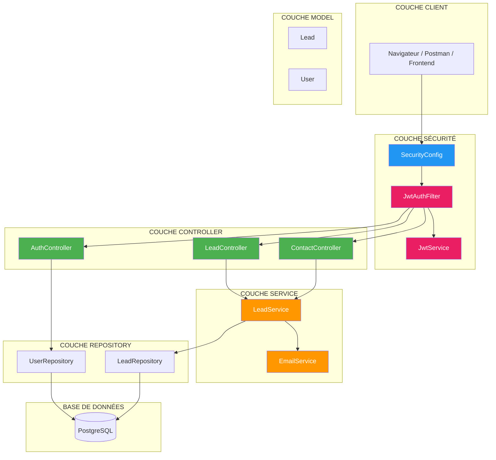

---

## Tableau complet : TOUTES les classes

### 1. CONFIGURATION (config/)

| Classe | Rôle | Appelle | Appelée par |
|--------|------|---------|-------------|
| `SecurityConfig` | Configure les règles de sécurité, CORS, CSRF | `JwtAuthFilter`, `PasswordEncoder` | Spring Boot (démarrage) |
| `UserDetailsConfig` | Fournit le bean UserDetailsService | `UserRepository` | Spring Boot (démarrage), `JwtAuthFilter` |
| `DataInitializer` | Crée l'admin au démarrage | `UserRepository`, `PasswordEncoder` | Spring Boot (démarrage) |
| `OpenApiConfig` | Configure Swagger/OpenAPI | Rien | Spring Boot (démarrage) |

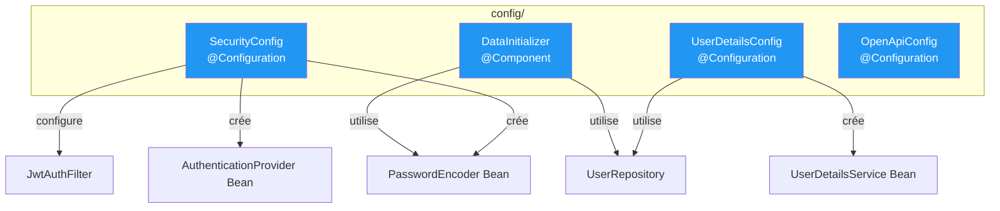

---

### 2. SÉCURITÉ (security/)

| Classe | Rôle | Appelle | Appelée par |
|--------|------|---------|-------------|
| `JwtAuthFilter` | Valide le JWT à chaque requête | `JwtService`, `UserDetailsService` | Spring Security (automatique) |
| `JwtService` | Génère et valide les tokens JWT | Rien (utilitaire) | `JwtAuthFilter`, `AuthController` |

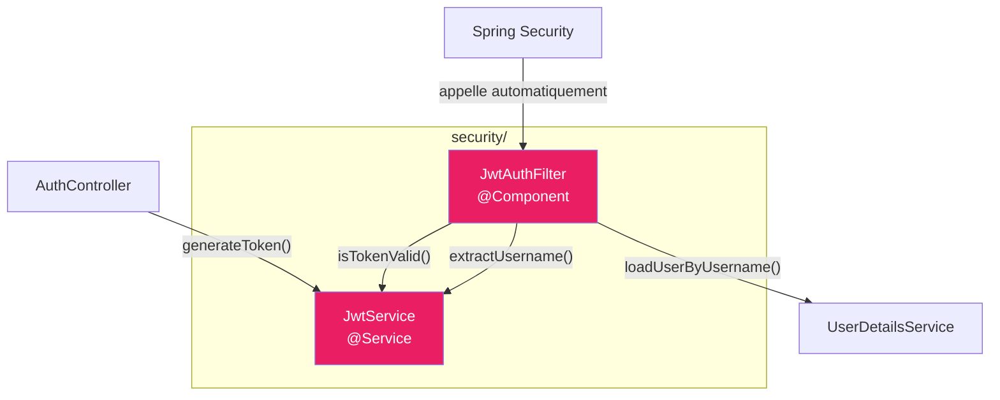

---

### 3. CONTROLLERS (controller/)

| Classe | Endpoints | Appelle | Appelée par |
|--------|-----------|---------|-------------|
| `AuthController` | `POST /api/auth/login` | `AuthenticationManager`, `JwtService`, `UserRepository` | Client HTTP |
| `ContactController` | `POST /api/contact` | `LeadService` | Client HTTP |
| `LeadController` | `GET/PUT/DELETE /api/admin/leads/**` | `LeadService` | Client HTTP (après auth) |

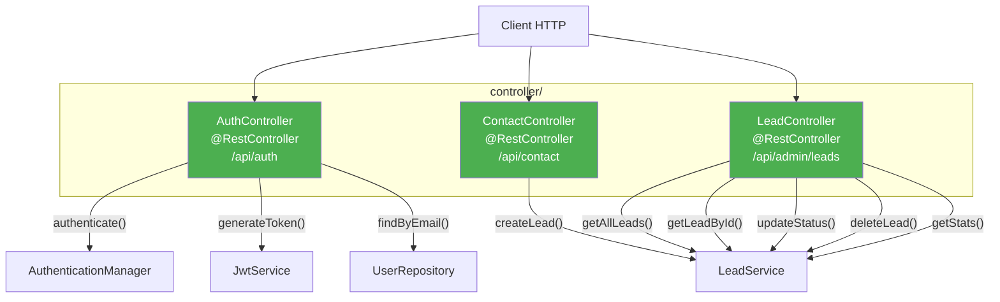

---

### 4. SERVICES (service/)

| Classe | Rôle | Appelle | Appelée par |
|--------|------|---------|-------------|
| `LeadService` | Logique métier des leads | `LeadRepository`, `EmailService` | `ContactController`, `LeadController` |
| `EmailService` | Envoi d'emails | `JavaMailSender` (Spring) | `LeadService` |

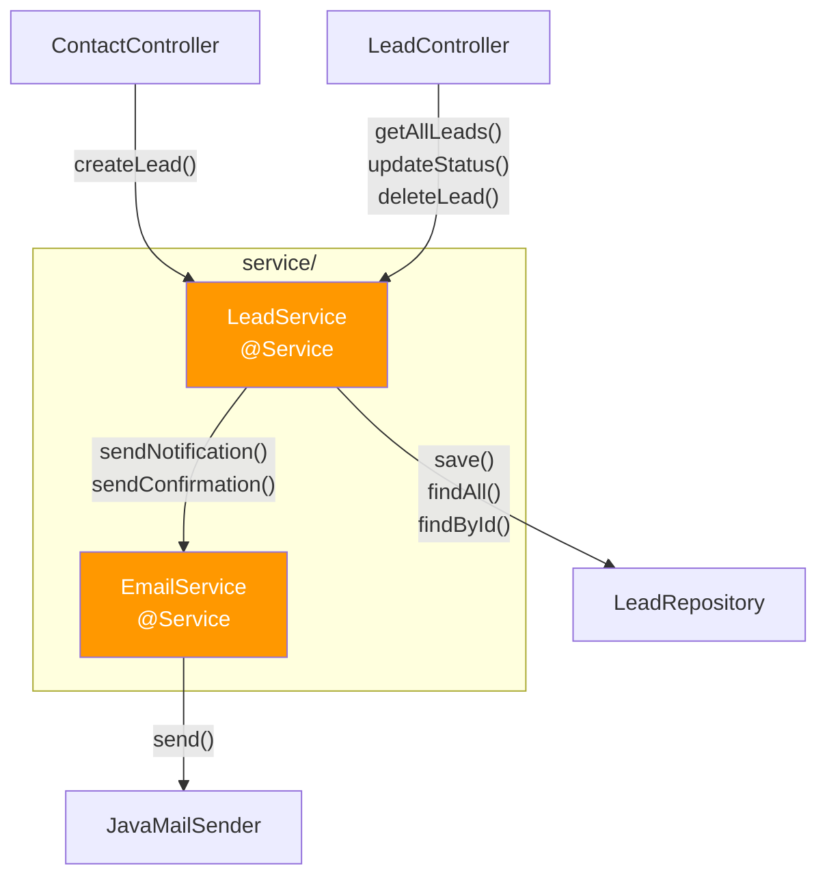

---

### 5. REPOSITORIES (repository/)

| Classe | Rôle | Appelle | Appelée par |
|--------|------|---------|-------------|
| `LeadRepository` | CRUD pour les leads | PostgreSQL (via JPA) | `LeadService` |
| `UserRepository` | CRUD pour les utilisateurs | PostgreSQL (via JPA) | `UserDetailsConfig`, `DataInitializer`, `AuthController` |

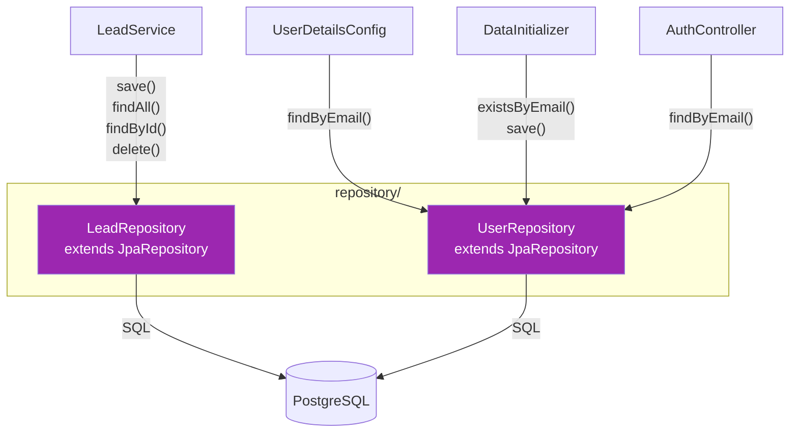

---

### 6. MODELS (model/)

| Classe | Rôle | Relations | Utilisée par |
|--------|------|-----------|--------------|
| `Lead` | Entité représentant un prospect | Aucune | `LeadRepository`, `LeadService`, `LeadController` |
| `User` | Entité représentant un utilisateur | Implémente `UserDetails` | `UserRepository`, `JwtAuthFilter`, `AuthController` |

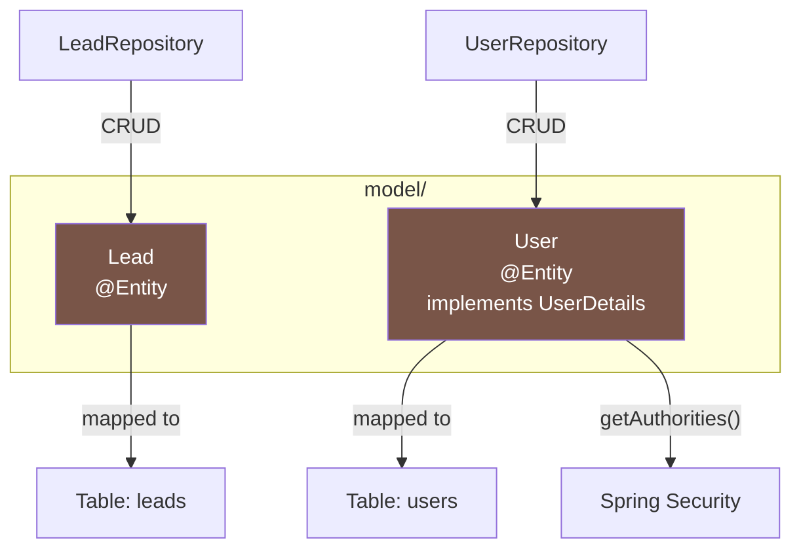

---

### 7. DTOs (dto/)

| Classe | Type | Utilisée pour | Utilisée par |
|--------|------|---------------|--------------|
| `ContactFormRequest` | Request | Données du formulaire de contact | `ContactController` |
| `LoginRequest` | Request | Email + mot de passe pour login | `AuthController` |
| `UpdateStatusRequest` | Request | Nouveau statut d'un lead | `LeadController` |
| `AuthResponse` | Response | Token JWT + infos utilisateur | `AuthController` |
| `LeadDto` | Response | Données d'un lead | `LeadController`, `LeadService` |
| `LeadStatsDto` | Response | Statistiques des leads | `LeadController`, `LeadService` |
| `MessageResponse` | Response | Message simple | `ContactController`, `LeadController` |

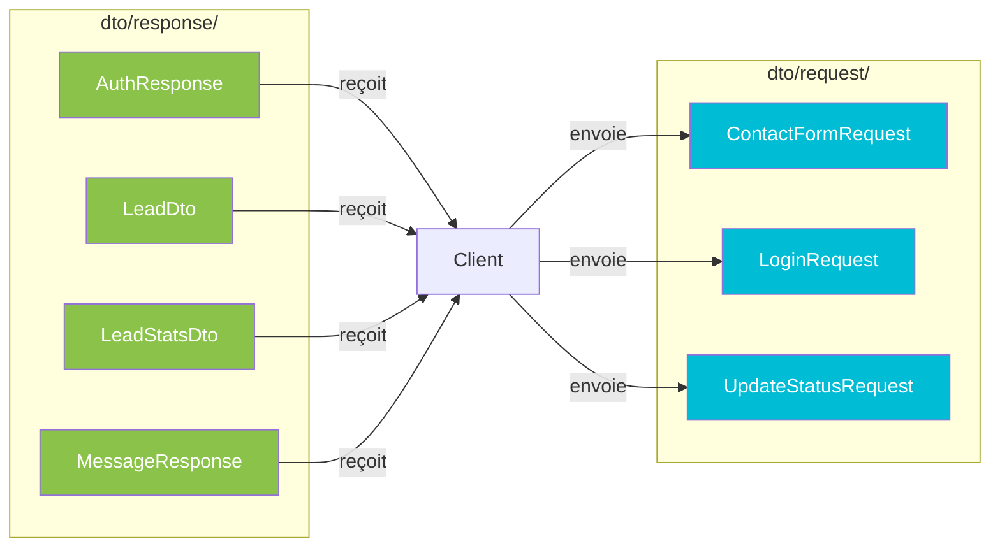

---

### 8. EXCEPTIONS (exception/)

| Classe | Rôle | Utilisée par |
|--------|------|--------------|
| `GlobalExceptionHandler` | Gère toutes les exceptions de l'application | Spring (automatique) |
| `ResourceNotFoundException` | Exception pour ressource non trouvée | `LeadService` |

---

## Tableau récapitulatif : QUI APPELLE QUI?

| # | Appelant | Méthode | Appelé | Quand? |
|---|----------|---------|--------|--------|
| 1 | **Spring Boot** | démarrage | `SecurityConfig` | Lancement de l'app |
| 2 | **Spring Boot** | démarrage | `UserDetailsConfig` | Lancement de l'app |
| 3 | **Spring Boot** | démarrage | `DataInitializer` | Lancement de l'app |
| 4 | **Spring Security** | filter chain | `JwtAuthFilter.doFilterInternal()` | Chaque requête HTTP |
| 5 | **JwtAuthFilter** | `extractUsername()` | `JwtService` | Validation JWT |
| 6 | **JwtAuthFilter** | `loadUserByUsername()` | `UserDetailsService` | Chargement user |
| 7 | **JwtAuthFilter** | `isTokenValid()` | `JwtService` | Validation JWT |
| 8 | **Client** | `POST /api/auth/login` | `AuthController.login()` | Login |
| 9 | **AuthController** | `authenticate()` | `AuthenticationManager` | Vérification credentials |
| 10 | **AuthController** | `generateToken()` | `JwtService` | Création JWT |
| 11 | **Client** | `POST /api/contact` | `ContactController.submitContactForm()` | Formulaire |
| 12 | **ContactController** | `createLead()` | `LeadService` | Création lead |
| 13 | **Client** | `GET /api/admin/leads` | `LeadController.getAllLeads()` | Liste leads |
| 14 | **LeadController** | `getAllLeads()` | `LeadService` | Récupération |
| 15 | **LeadService** | `save()` / `findAll()` | `LeadRepository` | Accès DB |
| 16 | **LeadService** | `sendNotification()` | `EmailService` | Envoi email |
| 17 | **LeadRepository** | JPA | `PostgreSQL` | Requête SQL |
| 18 | **UserRepository** | JPA | `PostgreSQL` | Requête SQL |

---

## Flux complet : Soumission d'un formulaire

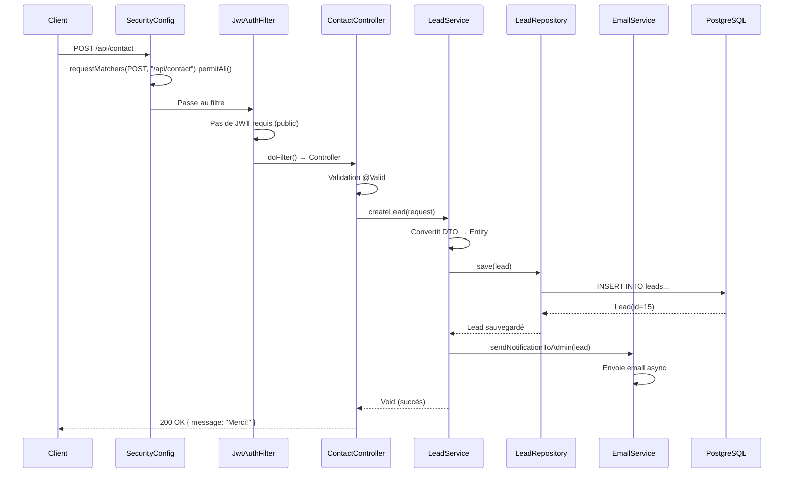

---

## Flux complet : Login administrateur

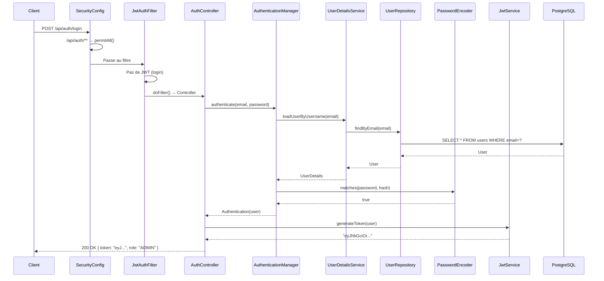

---

## Flux complet : Accès endpoint protégé

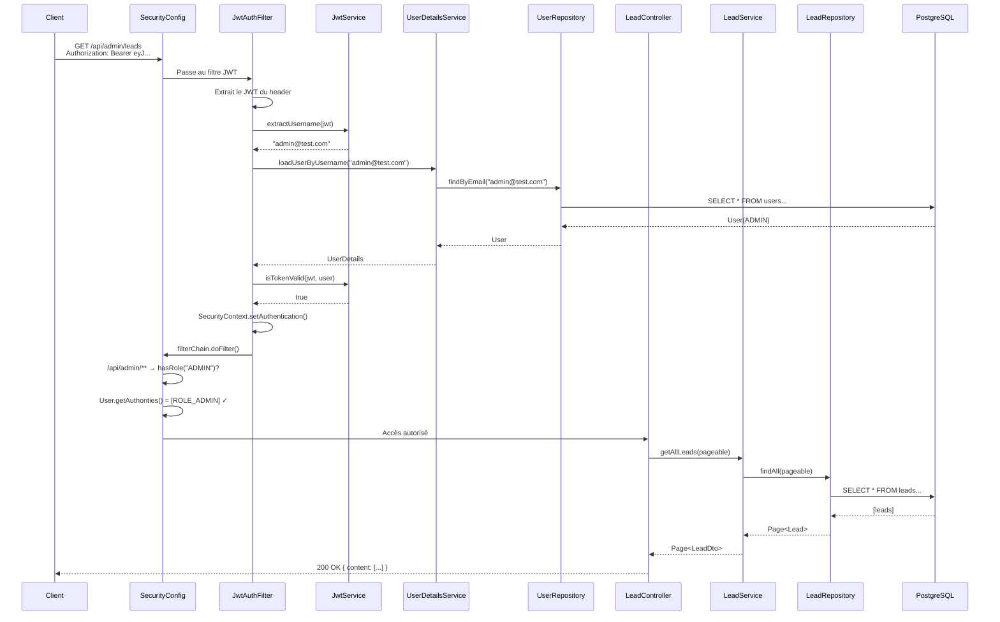

---

## Schéma final : Toutes les relations

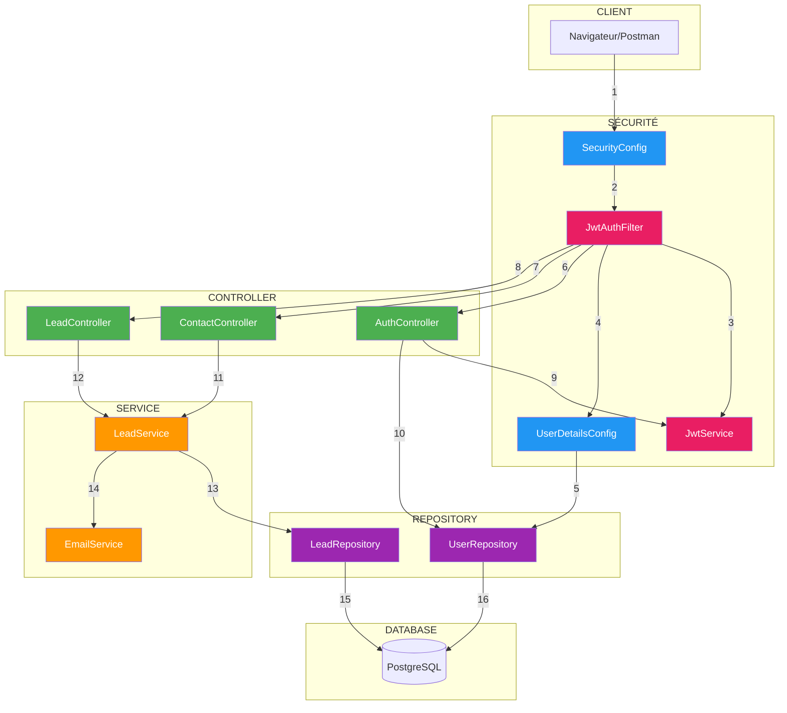

---

## QUIZ - Architecture

**1. Quelle classe appelle JwtAuthFilter.doFilterInternal()?**
- a) SecurityConfig
- b) AuthController
- c) Spring Security (automatiquement)
- d) JwtService

<details>
<summary>Voir la réponse</summary>

**Réponse : c) Spring Security (automatiquement)**

Spring Security appelle automatiquement tous les filtres de la chaîne à chaque requête HTTP. `JwtAuthFilter` est ajouté à cette chaîne par `SecurityConfig.addFilterBefore()`.
</details>

---

**2. LeadController appelle directement quelle classe?**
- a) LeadRepository
- b) LeadService
- c) PostgreSQL
- d) EmailService

<details>
<summary>Voir la réponse</summary>

**Réponse : b) LeadService**

Les Controllers appellent les Services, jamais les Repositories directement. C'est le principe de l'architecture en couches.
</details>

---

**3. Qui appelle UserRepository.findByEmail()?**
- a) Seulement AuthController
- b) Seulement UserDetailsConfig
- c) AuthController, UserDetailsConfig, et DataInitializer
- d) LeadService

<details>
<summary>Voir la réponse</summary>

**Réponse : c) AuthController, UserDetailsConfig, et DataInitializer**

`UserRepository` est utilisé par plusieurs classes pour différentes raisons : login, validation JWT, et création de l'admin initial.
</details>

---

**4. Dans quel ordre sont appelées les classes lors d'un GET /api/admin/leads?**
- a) Controller → Service → Repository → DB
- b) SecurityConfig → JwtAuthFilter → Controller → Service → Repository → DB
- c) JwtService → Controller → Service
- d) Repository → Service → Controller

<details>
<summary>Voir la réponse</summary>

**Réponse : b) SecurityConfig → JwtAuthFilter → Controller → Service → Repository → DB**

La requête passe d'abord par la couche sécurité (validation JWT), puis Controller → Service → Repository → DB.
</details>

---

## Navigation

| Précédent | Suivant |
|-----------|---------|
| [25 - Exercice JwtAuthFilter](25-exercice-jwtauthfilter.md) | [27 - Tests et validation](27-tests-validation.md) |

