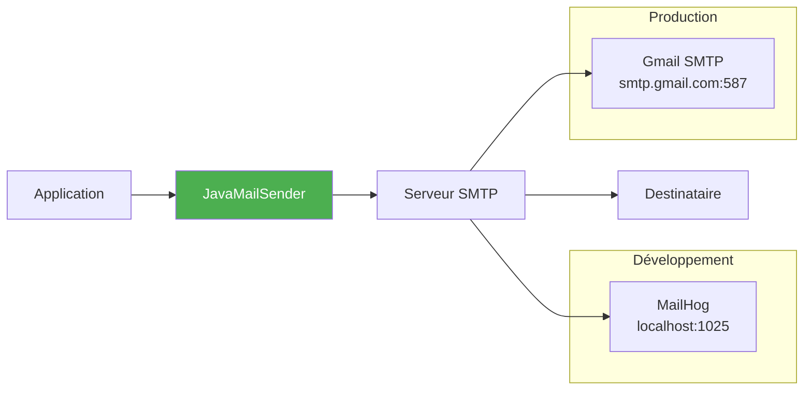
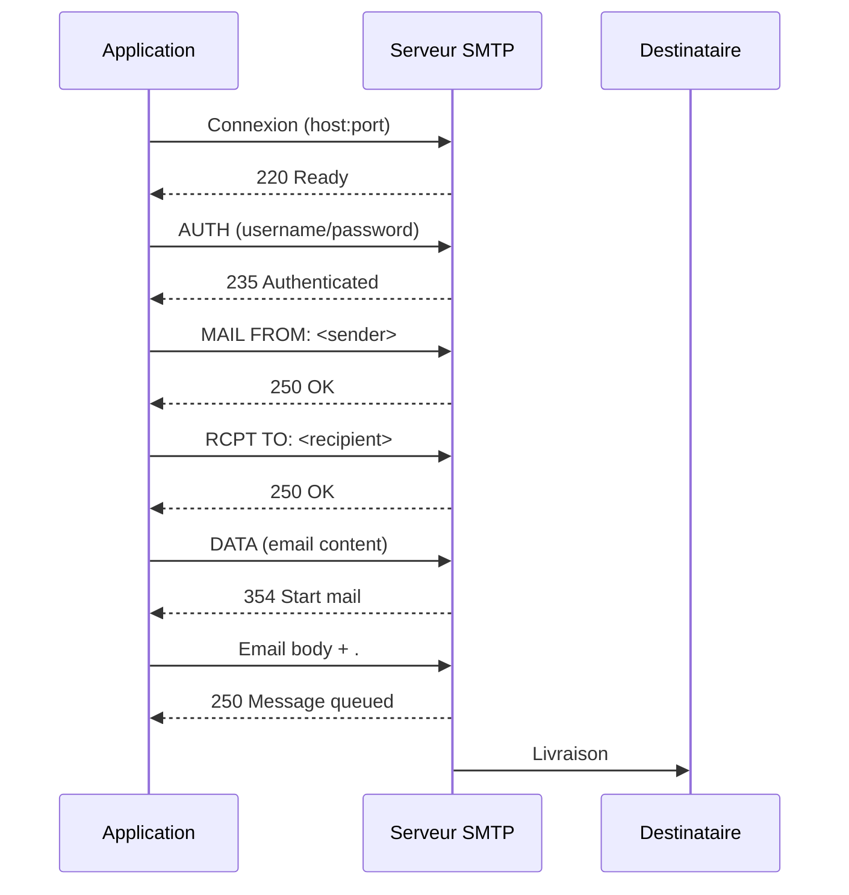
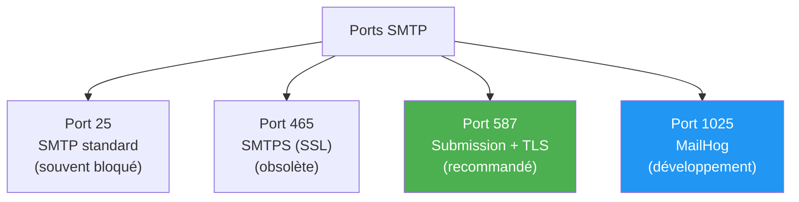
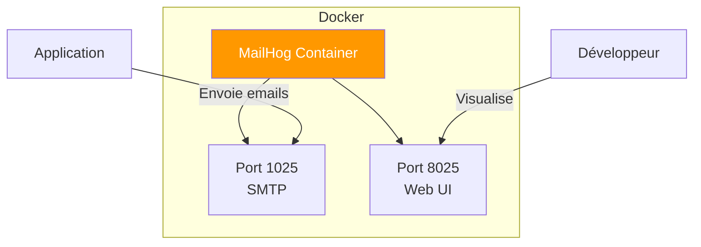
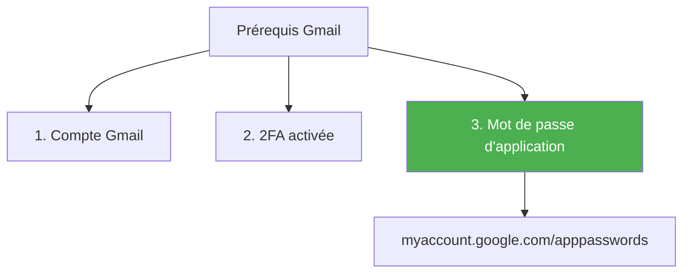
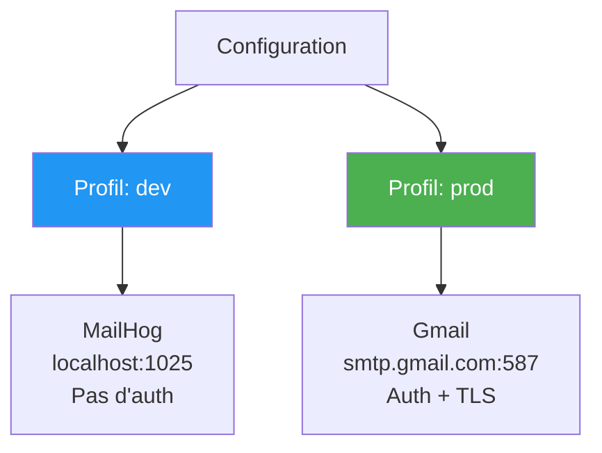
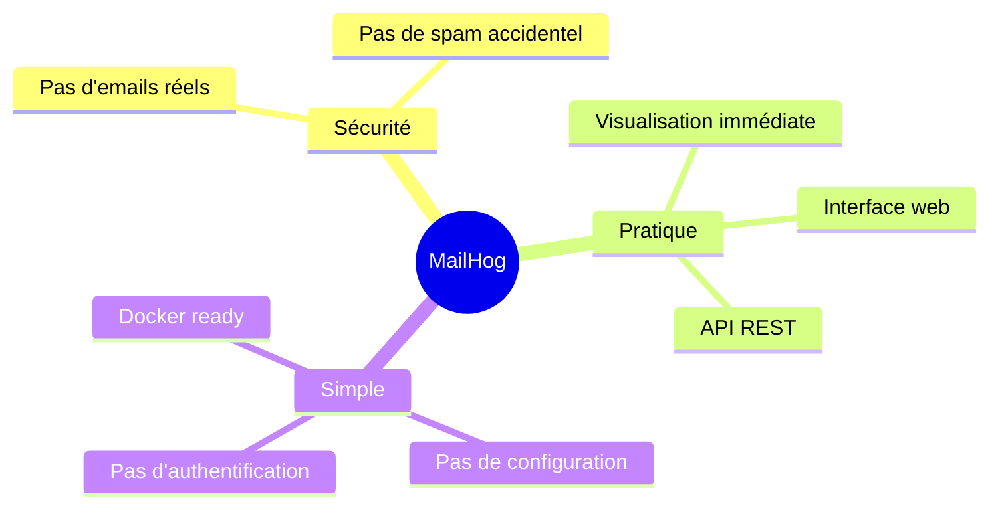
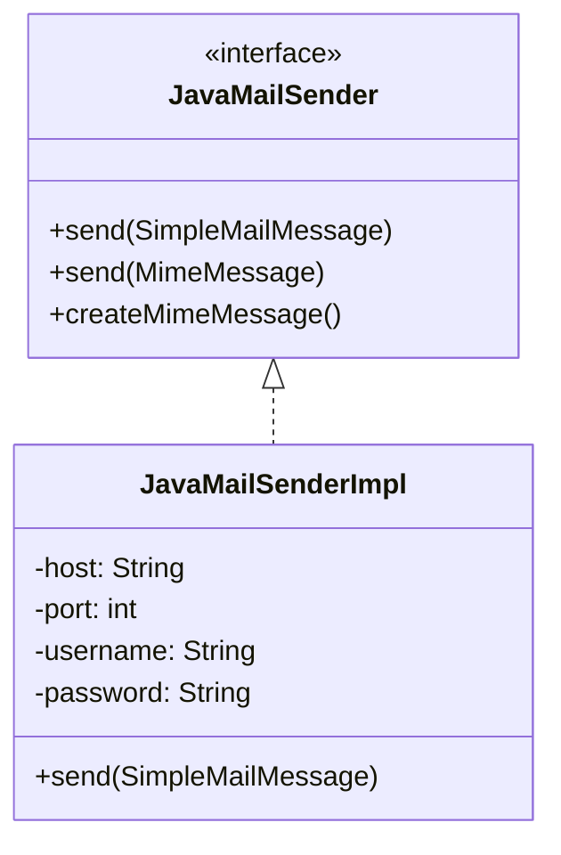
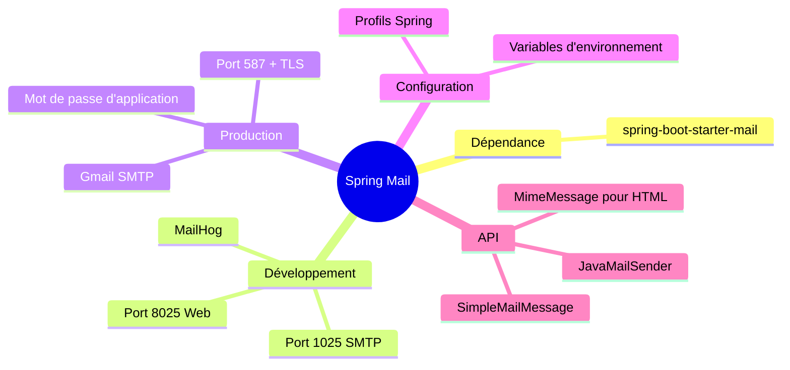

# Chapitre 7.1 - Spring Mail Configuration

## Objectifs du chapitre

- Configurer Spring Mail
- Comprendre les paramètres SMTP
- Tester avec MailHog
- Configurer Gmail pour la production

---

## 1. Introduction à Spring Mail

### Qu'est-ce que Spring Mail?

**Spring Mail** est un module qui simplifie l'envoi d'emails en Java. Il s'intègre avec JavaMail API et fournit une abstraction simple via `JavaMailSender`.

### Diagramme : Architecture email



### Dépendance Maven

```xml
<dependency>
    <groupId>org.springframework.boot</groupId>
    <artifactId>spring-boot-starter-mail</artifactId>
</dependency>
```

---

## 2. Configuration SMTP

### Diagramme : Protocole SMTP



### Paramètres de base

| Paramètre | Description | Exemple |
|-----------|-------------|---------|
| host | Serveur SMTP | smtp.gmail.com |
| port | Port SMTP | 25, 465, 587, 1025 |
| username | Nom d'utilisateur | user@gmail.com |
| password | Mot de passe | app-password |
| auth | Authentification requise | true/false |
| starttls | Chiffrement TLS | true/false |

### Ports SMTP courants



---

## 3. Configuration pour le développement (MailHog)

### application.yml - Profil dev

```yaml
spring:
  mail:
    host: localhost        # ou "mailhog" dans Docker
    port: 1025            # Port SMTP de MailHog
    username:             # Pas d'authentification
    password:
    properties:
      mail:
        smtp:
          auth: false
          starttls:
            enable: false
```

### Diagramme : Configuration MailHog



---

## 4. Configuration pour la production (Gmail)

### application.yml - Profil prod

```yaml
spring:
  mail:
    host: smtp.gmail.com
    port: 587
    username: ${MAIL_USER}
    password: ${MAIL_PASSWORD}  # Mot de passe d'application
    properties:
      mail:
        smtp:
          auth: true
          starttls:
            enable: true
            required: true
```

### Prérequis Gmail



### Générer un mot de passe d'application

1. Aller sur https://myaccount.google.com/apppasswords
2. Sélectionner "Autre (nom personnalisé)"
3. Nommer l'application (ex: "Contact API")
4. Copier le mot de passe généré (16 caractères)

---

## 5. Configuration par profils

### application.yml complet

```yaml
spring:
  profiles:
    active: dev

---
# Profil DEV
spring:
  config:
    activate:
      on-profile: dev
  mail:
    host: localhost
    port: 1025
    properties:
      mail:
        smtp:
          auth: false

---
# Profil PROD
spring:
  config:
    activate:
      on-profile: prod
  mail:
    host: smtp.gmail.com
    port: 587
    username: ${MAIL_USER}
    password: ${MAIL_PASSWORD}
    properties:
      mail:
        smtp:
          auth: true
          starttls:
            enable: true
```

### Diagramme : Profils



---

## 6. MailHog pour le développement

### Qu'est-ce que MailHog?

**MailHog** est un serveur SMTP de test qui capture tous les emails sans les envoyer vraiment. Il offre une interface web pour visualiser les emails.

### Avantages



### Docker Compose

```yaml
services:
  mailhog:
    image: mailhog/mailhog
    container_name: contact-mailhog
    ports:
      - "1025:1025"  # SMTP
      - "8025:8025"  # Interface web
```

### Accès

- **SMTP** : localhost:1025
- **Interface web** : http://localhost:8025

---

## 7. JavaMailSender

### Bean auto-configuré

Spring Boot configure automatiquement un `JavaMailSender` à partir des propriétés `spring.mail.*`.

### Diagramme : JavaMailSender



### Utilisation basique

```java
@Service
@RequiredArgsConstructor
public class EmailService {
    
    private final JavaMailSender mailSender;
    
    public void sendSimpleEmail(String to, String subject, String text) {
        SimpleMailMessage message = new SimpleMailMessage();
        message.setTo(to);
        message.setSubject(subject);
        message.setText(text);
        message.setFrom("noreply@example.com");
        
        mailSender.send(message);
    }
}
```

### Email HTML (MimeMessage)

```java
public void sendHtmlEmail(String to, String subject, String html) throws MessagingException {
    MimeMessage message = mailSender.createMimeMessage();
    MimeMessageHelper helper = new MimeMessageHelper(message, true, "UTF-8");
    
    helper.setTo(to);
    helper.setSubject(subject);
    helper.setText(html, true);  // true = HTML
    helper.setFrom("noreply@example.com");
    
    mailSender.send(message);
}
```

---

## 8. Propriétés personnalisées

### application.yml

```yaml
app:
  mail:
    from: noreply@example.com
    admin-email: admin@example.com
    company-name: Mon Entreprise
```

### Utilisation avec @Value

```java
@Service
public class EmailService {
    
    @Value("${app.mail.from}")
    private String fromEmail;
    
    @Value("${app.mail.admin-email}")
    private String adminEmail;
    
    @Value("${app.mail.company-name}")
    private String companyName;
}
```

---

## 9. Docker Compose complet

### docker-compose.yml

```yaml
version: '3.8'

services:
  db:
    image: postgres:15-alpine
    container_name: contact-db
    environment:
      POSTGRES_DB: contact_db
      POSTGRES_USER: postgres
      POSTGRES_PASSWORD: postgres
    ports:
      - "5432:5432"
    volumes:
      - postgres_data:/var/lib/postgresql/data
    healthcheck:
      test: ["CMD-SHELL", "pg_isready -U postgres"]
      interval: 5s
      timeout: 5s
      retries: 5

  mailhog:
    image: mailhog/mailhog
    container_name: contact-mailhog
    ports:
      - "1025:1025"
      - "8025:8025"

  api:
    build: .
    container_name: contact-api
    ports:
      - "8080:8080"
    environment:
      SPRING_PROFILES_ACTIVE: prod
      DB_HOST: db
      MAIL_HOST: mailhog
      MAIL_PORT: 1025
      MAIL_USER: noreply@example.com
      ADMIN_EMAIL: admin@example.com
    depends_on:
      db:
        condition: service_healthy
      mailhog:
        condition: service_started

volumes:
  postgres_data:
```

---

## 10. Points clés à retenir



1. **spring-boot-starter-mail** pour les emails
2. **MailHog** pour le développement (pas d'emails réels)
3. **Gmail** nécessite un mot de passe d'application
4. **Variables d'environnement** pour les credentials
5. **Profils** pour séparer dev et prod

---

## QUIZ 7.1 - Spring Mail Configuration

**1. Quelle dépendance ajouter pour Spring Mail?**
- a) spring-boot-starter-email
- b) spring-boot-starter-mail
- c) spring-boot-starter-smtp
- d) spring-mail

<details>
<summary>Voir la réponse</summary>

**Réponse : b) spring-boot-starter-mail**

C'est le starter officiel Spring Boot pour l'envoi d'emails.
</details>

---

**2. Quel est le port SMTP de MailHog?**
- a) 25
- b) 587
- c) 1025
- d) 8025

<details>
<summary>Voir la réponse</summary>

**Réponse : c) 1025**

MailHog utilise le port 1025 pour SMTP et 8025 pour l'interface web.
</details>

---

**3. Quel est le port de l'interface web de MailHog?**
- a) 25
- b) 587
- c) 1025
- d) 8025

<details>
<summary>Voir la réponse</summary>

**Réponse : d) 8025**

L'interface web de MailHog est accessible sur http://localhost:8025
</details>

---

**4. Quel port utiliser pour Gmail SMTP avec TLS?**
- a) 25
- b) 465
- c) 587
- d) 1025

<details>
<summary>Voir la réponse</summary>

**Réponse : c) 587**

Le port 587 est le port standard pour la soumission d'emails avec STARTTLS (chiffrement).
</details>

---

**5. VRAI ou FAUX : MailHog envoie réellement les emails.**

<details>
<summary>Voir la réponse</summary>

**Réponse : FAUX**

MailHog capture les emails sans les envoyer. C'est un outil de test qui permet de visualiser les emails sans risque d'envoyer des emails réels.
</details>

---

**6. Qu'est-ce qu'un mot de passe d'application Gmail?**
- a) Le mot de passe Gmail normal
- b) Un mot de passe généré pour les applications tierces
- c) Un mot de passe temporaire
- d) Le code de vérification 2FA

<details>
<summary>Voir la réponse</summary>

**Réponse : b) Un mot de passe généré pour les applications tierces**

C'est un mot de passe de 16 caractères généré par Google pour permettre aux applications d'accéder au compte sans le mot de passe principal.
</details>

---

**7. Quelle interface Spring Boot utilise pour envoyer des emails?**
- a) MailSender
- b) EmailSender
- c) JavaMailSender
- d) SmtpSender

<details>
<summary>Voir la réponse</summary>

**Réponse : c) JavaMailSender**

JavaMailSender est l'interface principale pour envoyer des emails dans Spring.
</details>

---

**8. Complétez : starttls active le chiffrement _______.**

<details>
<summary>Voir la réponse</summary>

**Réponse : TLS**

STARTTLS est une commande qui met à niveau une connexion non chiffrée vers une connexion chiffrée TLS.
</details>

---

**9. Pourquoi utiliser MailHog en développement?**
- a) C'est plus rapide
- b) Pour ne pas envoyer de vrais emails
- c) C'est gratuit
- d) b et c

<details>
<summary>Voir la réponse</summary>

**Réponse : d) b et c**

MailHog évite d'envoyer de vrais emails (pas de spam accidentel) et est gratuit et open source.
</details>

---

**10. Comment configurer le serveur SMTP dans Spring Boot?**
- a) spring.smtp.host
- b) spring.mail.host
- c) mail.server.host
- d) smtp.server.host

<details>
<summary>Voir la réponse</summary>

**Réponse : b) spring.mail.host**

Les propriétés mail sont sous le préfixe `spring.mail.*` dans Spring Boot.
</details>

---

## Navigation

| Précédent | Suivant |
|-----------|---------|
| [28 - JWT Introduction](28-jwt-introduction.md) | [35 - Envoi d'emails](35-envoi-emails.md) |
