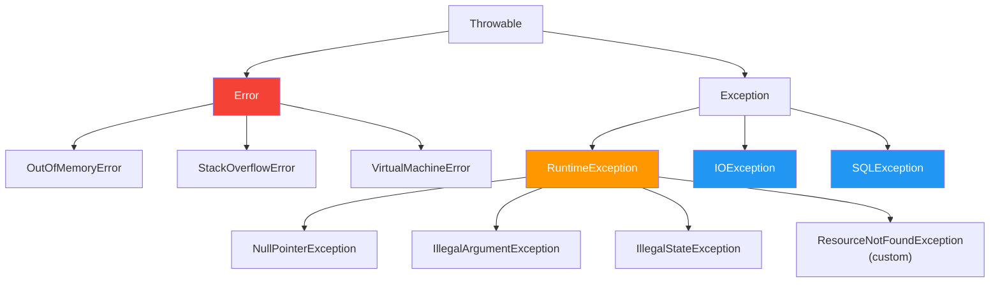
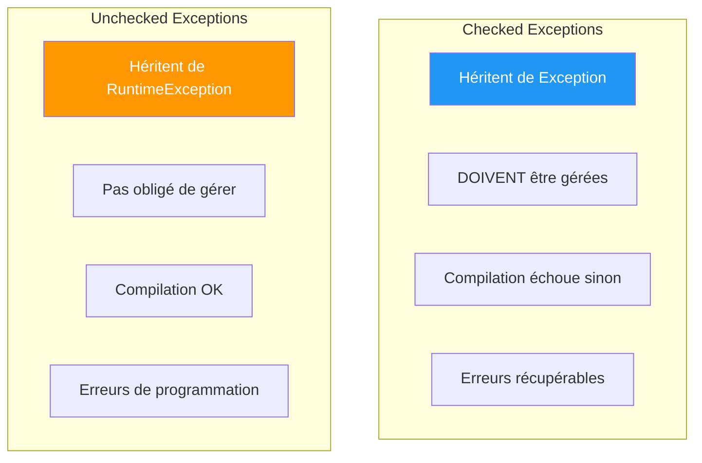
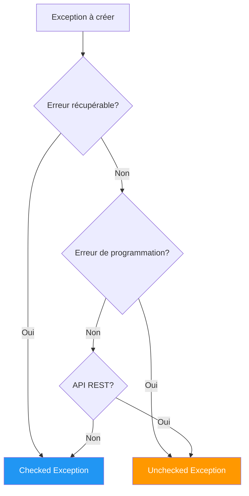
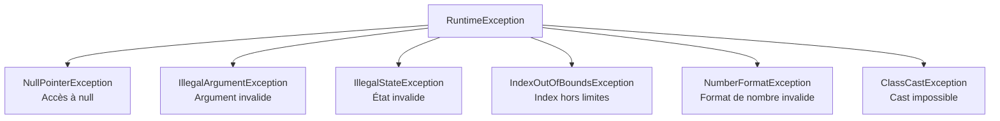
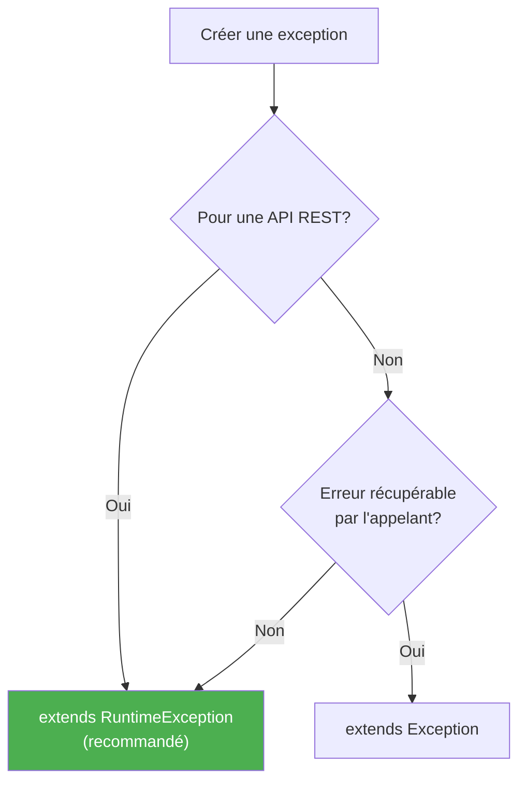
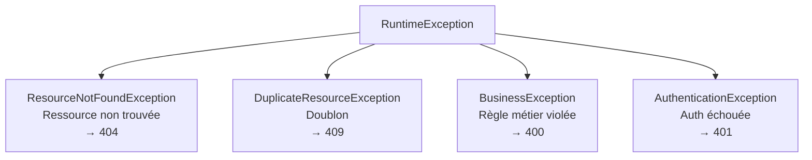
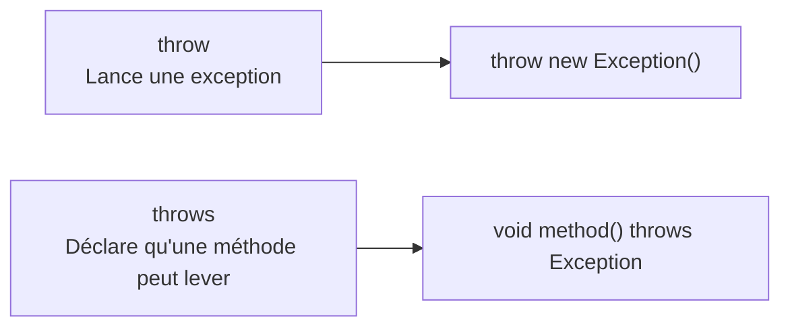
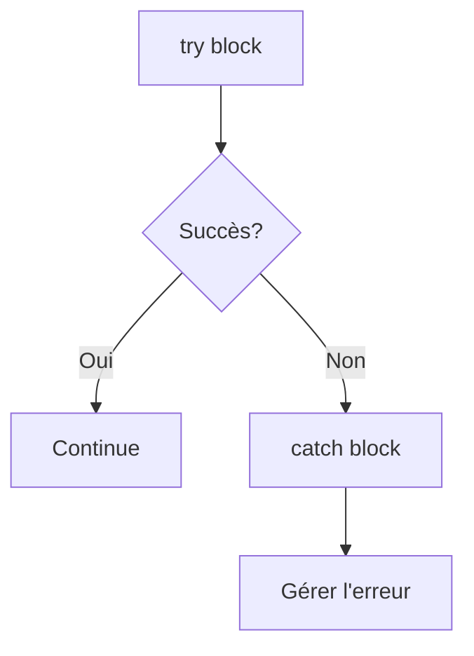
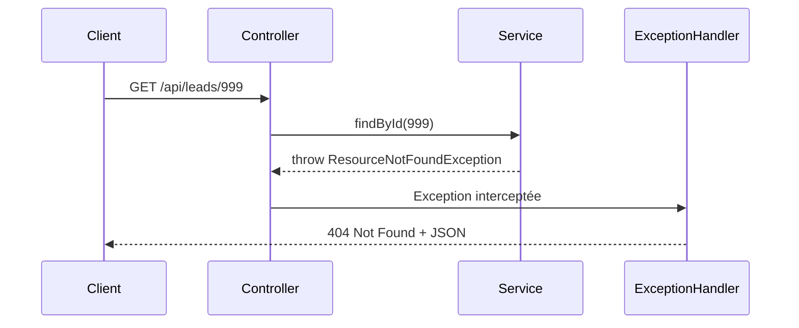
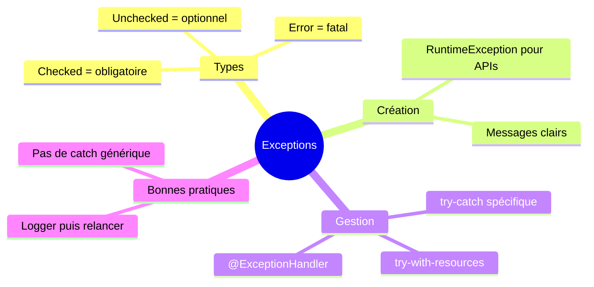

# Chapitre 8.1 - Types d'exceptions en Java

## Objectifs du chapitre

- Comprendre la hiérarchie des exceptions
- Distinguer checked et unchecked exceptions
- Créer des exceptions personnalisées
- Appliquer les bonnes pratiques

---

## 1. Hiérarchie des exceptions

### Diagramme : Arbre des exceptions



### Les deux familles

| Type | Classe parente | À gérer? | Exemple |
|------|---------------|----------|---------|
| Error | Error | Non (fatal) | OutOfMemoryError |
| Checked | Exception | Oui (obligatoire) | IOException |
| Unchecked | RuntimeException | Non (optionnel) | NullPointerException |

---

## 2. Checked vs Unchecked

### Diagramme comparatif



### Checked Exceptions

- Héritent de `Exception` (mais pas `RuntimeException`)
- **Doivent** être déclarées (`throws`) ou attrapées (`catch`)
- Utilisées pour des erreurs récupérables

```java
// DOIT être géré - sinon erreur de compilation!
public void readFile() throws IOException {
    FileReader reader = new FileReader("file.txt");
}

// OU
public void readFile() {
    try {
        FileReader reader = new FileReader("file.txt");
    } catch (IOException e) {
        // Gestion de l'erreur
    }
}
```

### Unchecked Exceptions (RuntimeException)

- Héritent de `RuntimeException`
- **N'ont pas besoin** d'être déclarées
- Utilisées pour des erreurs de programmation (bugs)

```java
// Pas besoin de try/catch ou throws
public void process(String data) {
    if (data == null) {
        throw new NullPointerException("Data cannot be null");
    }
}
```

### Quand utiliser quoi?



---

## 3. Exceptions courantes

### RuntimeException (Unchecked)



| Exception | Cause | Exemple |
|-----------|-------|---------|
| NullPointerException | Accès à un objet null | `null.toString()` |
| IllegalArgumentException | Argument invalide | `age = -5` |
| IllegalStateException | État invalide | `close()` appelé 2 fois |
| IndexOutOfBoundsException | Index hors limites | `list.get(100)` |
| NumberFormatException | Format invalide | `Integer.parseInt("abc")` |

### Checked Exceptions

| Exception | Cause | Doit être gérée |
|-----------|-------|-----------------|
| IOException | Erreur I/O | Oui |
| SQLException | Erreur SQL | Oui |
| FileNotFoundException | Fichier non trouvé | Oui |
| ParseException | Erreur de parsing | Oui |

---

## 4. Créer des exceptions personnalisées

### Diagramme : Décision



### Pour les APIs REST (recommandé)

```java
public class ResourceNotFoundException extends RuntimeException {
    
    public ResourceNotFoundException(String message) {
        super(message);
    }
    
    public ResourceNotFoundException(String resource, Long id) {
        super(String.format("%s non trouvé avec l'ID %d", resource, id));
    }
}
```

### Utilisation

```java
@Service
public class LeadService {
    
    public Lead findById(Long id) {
        return repository.findById(id)
            .orElseThrow(() -> new ResourceNotFoundException("Lead", id));
    }
}
```

---

## 5. Exceptions du projet

### Structure recommandée



### ResourceNotFoundException.java

```java
package com.example.contact.exception;

public class ResourceNotFoundException extends RuntimeException {
    
    public ResourceNotFoundException(String message) {
        super(message);
    }
}
```

### Autres exceptions utiles

```java
// Doublon (email déjà existant)
public class DuplicateResourceException extends RuntimeException {
    public DuplicateResourceException(String message) {
        super(message);
    }
}

// Validation métier
public class BusinessException extends RuntimeException {
    public BusinessException(String message) {
        super(message);
    }
}

// Authentification
public class AuthenticationException extends RuntimeException {
    public AuthenticationException(String message) {
        super(message);
    }
}
```

---

## 6. Lancer des exceptions

### throw vs throws



### throw - Lance une exception

```java
public void validate(String email) {
    if (email == null || email.isBlank()) {
        throw new IllegalArgumentException("Email cannot be null or empty");
    }
}
```

### throws - Déclare une exception possible (checked)

```java
public void sendEmail() throws MessagingException {
    // Code qui peut lever MessagingException
}
```

---

## 7. Attraper des exceptions

### try-catch



```java
try {
    Lead lead = service.findById(id);
} catch (ResourceNotFoundException e) {
    log.error("Lead non trouvé: {}", e.getMessage());
    // Gestion de l'erreur
}
```

### try-catch-finally

```java
Connection conn = null;
try {
    conn = dataSource.getConnection();
    // Utilisation
} catch (SQLException e) {
    log.error("Erreur SQL", e);
} finally {
    if (conn != null) {
        conn.close();  // TOUJOURS exécuté
    }
}
```

### try-with-resources (Java 7+)

```java
try (Connection conn = dataSource.getConnection()) {
    // conn est automatiquement fermé
} catch (SQLException e) {
    log.error("Erreur SQL", e);
}
```

### Multi-catch (Java 7+)

```java
try {
    // Code
} catch (IOException | SQLException e) {
    log.error("Erreur I/O ou SQL", e);
}
```

---

## 8. Bonnes pratiques

### 8.1 Préférer RuntimeException pour les APIs

```java
// ✅ BON pour une API REST
public class ResourceNotFoundException extends RuntimeException { }

// ❌ MOINS BON (oblige à gérer partout)
public class ResourceNotFoundException extends Exception { }
```

### 8.2 Messages clairs et contextuels

```java
// ❌ MAUVAIS
throw new RuntimeException("Error");

// ✅ BON
throw new ResourceNotFoundException("Lead non trouvé avec l'ID 123");
throw new DuplicateResourceException("Email 'test@example.com' déjà utilisé");
```

### 8.3 Ne pas attraper Exception générique

```java
// ❌ MAUVAIS - attrape TOUT, même les bugs
try {
    // Code
} catch (Exception e) {
    // Masque les vrais problèmes
}

// ✅ BON - spécifique
try {
    // Code
} catch (ResourceNotFoundException e) {
    // Gestion spécifique
}
```

### 8.4 Logger avant de relancer

```java
try {
    externalService.call();
} catch (ExternalServiceException e) {
    log.error("Erreur service externe: {}", e.getMessage());
    throw new ServiceUnavailableException("Service temporairement indisponible");
}
```

---

## 9. Exceptions et Spring

### Flux dans un controller



### Dans un controller

```java
@GetMapping("/{id}")
public ResponseEntity<LeadDto> getLead(@PathVariable Long id) {
    // Si ResourceNotFoundException est levée, 
    // elle sera gérée par GlobalExceptionHandler
    return ResponseEntity.ok(service.findById(id));
}
```

### Gestion globale

```java
@RestControllerAdvice
public class GlobalExceptionHandler {
    
    @ExceptionHandler(ResourceNotFoundException.class)
    public ResponseEntity<ErrorResponse> handleNotFound(ResourceNotFoundException e) {
        return ResponseEntity.status(HttpStatus.NOT_FOUND)
            .body(new ErrorResponse(e.getMessage()));
    }
}
```

---

## 10. Points clés à retenir



1. **RuntimeException** pour les APIs (unchecked)
2. **Messages clairs** dans les exceptions
3. **Exceptions personnalisées** pour chaque cas métier
4. **@RestControllerAdvice** pour gérer globalement
5. **Ne pas attraper Exception** générique

---

## QUIZ 8.1 - Types d'exceptions

**1. Quelle est la différence entre checked et unchecked?**
- a) Aucune
- b) Checked doit être déclarée, unchecked non
- c) Unchecked doit être déclarée, checked non
- d) Checked est plus grave

<details>
<summary>Voir la réponse</summary>

**Réponse : b) Checked doit être déclarée, unchecked non**

Les checked exceptions doivent être déclarées avec `throws` ou attrapées avec `catch`. Les unchecked (RuntimeException) sont optionnelles.
</details>

---

**2. De quoi hérite RuntimeException?**
- a) Throwable
- b) Error
- c) Exception
- d) Object

<details>
<summary>Voir la réponse</summary>

**Réponse : c) Exception**

RuntimeException hérite de Exception, qui hérite de Throwable.
</details>

---

**3. ResourceNotFoundException devrait hériter de quoi?**
- a) Exception
- b) RuntimeException
- c) Error
- d) Throwable

<details>
<summary>Voir la réponse</summary>

**Réponse : b) RuntimeException**

Pour une API REST, on préfère RuntimeException car elle n'oblige pas à gérer l'exception partout (unchecked).
</details>

---

**4. Quelle exception pour un objet null?**
- a) NullException
- b) NullPointerException
- c) ObjectNullException
- d) EmptyException

<details>
<summary>Voir la réponse</summary>

**Réponse : b) NullPointerException**

C'est l'exception standard Java pour l'accès à une référence null.
</details>

---

**5. VRAI ou FAUX : Les unchecked exceptions doivent être déclarées avec throws.**

<details>
<summary>Voir la réponse</summary>

**Réponse : FAUX**

Les unchecked exceptions (RuntimeException) n'ont pas besoin d'être déclarées. C'est optionnel.
</details>

---

**6. Quel mot-clé lance une exception?**
- a) raise
- b) throw
- c) throws
- d) exception

<details>
<summary>Voir la réponse</summary>

**Réponse : b) throw**

`throw` lance une exception. `throws` déclare qu'une méthode peut lever une exception.
</details>

---

**7. Quel mot-clé déclare qu'une méthode peut lever une exception?**
- a) raise
- b) throw
- c) throws
- d) exception

<details>
<summary>Voir la réponse</summary>

**Réponse : c) throws**

`throws` se place dans la signature de la méthode pour déclarer les exceptions possibles.
</details>

---

**8. Complétez : try-with-resources ferme automatiquement les _______.**

<details>
<summary>Voir la réponse</summary>

**Réponse : ressources (ou AutoCloseable)**

try-with-resources ferme automatiquement les objets qui implémentent AutoCloseable (comme Connection, InputStream, etc.).
</details>

---

**9. Pourquoi préférer RuntimeException pour les APIs?**
- a) Plus performant
- b) Pas besoin de try/catch partout
- c) Plus sécurisé
- d) Standard Java

<details>
<summary>Voir la réponse</summary>

**Réponse : b) Pas besoin de try/catch partout**

Les RuntimeException ne polluent pas le code avec des try/catch obligatoires. Le GlobalExceptionHandler gère tout centralement.
</details>

---

**10. Qu'est-ce qu'une checked exception?**
- a) Exception vérifiée à l'exécution
- b) Exception qui doit être déclarée ou attrapée
- c) Exception de sécurité
- d) Exception système

<details>
<summary>Voir la réponse</summary>

**Réponse : b) Exception qui doit être déclarée ou attrapée**

Le compilateur vérifie que les checked exceptions sont soit déclarées (throws), soit attrapées (catch).
</details>

---

## Navigation

| Précédent | Suivant |
|-----------|---------|
| [34 - Spring Mail Configuration](34-spring-mail-config.md) | [41 - GlobalExceptionHandler](41-global-exception-handler.md) |
