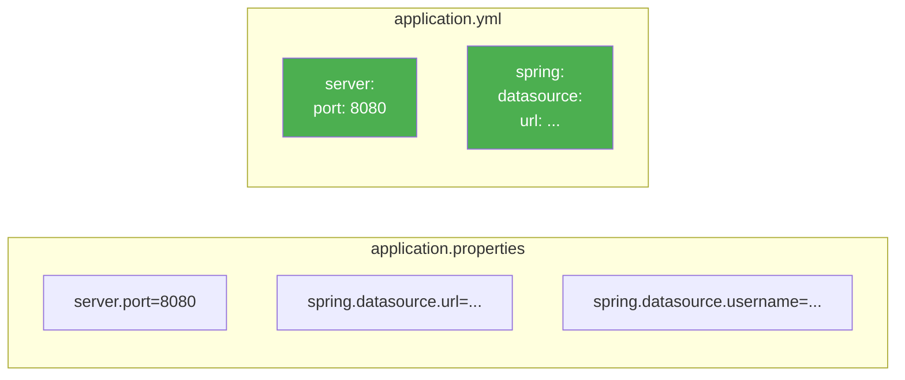
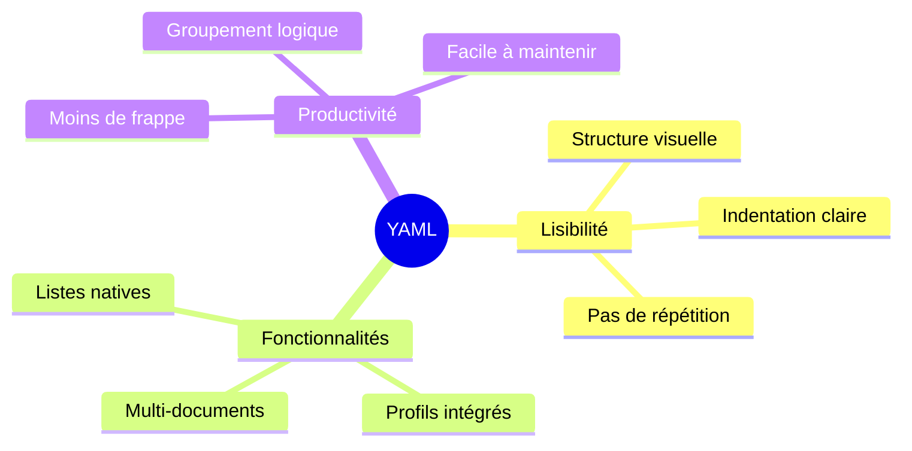
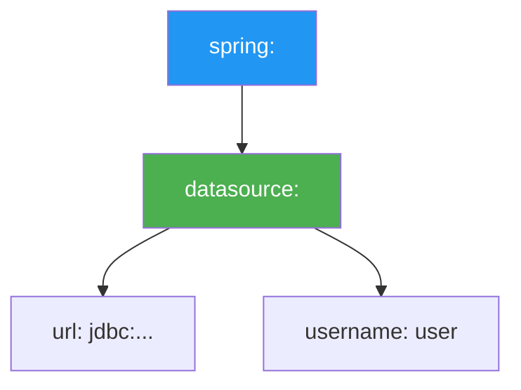
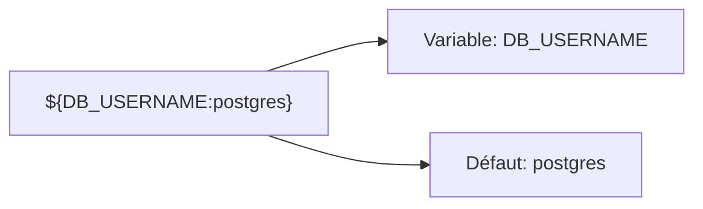
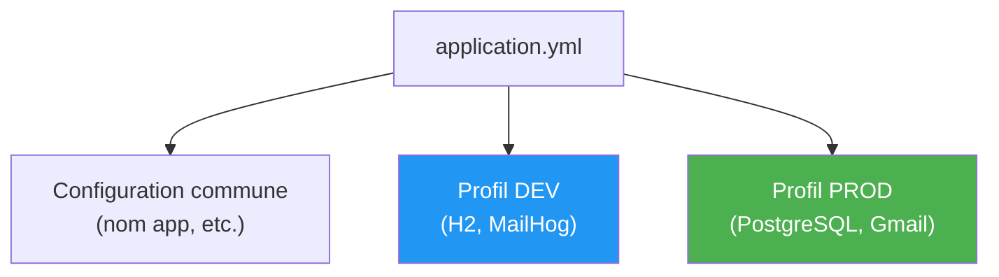
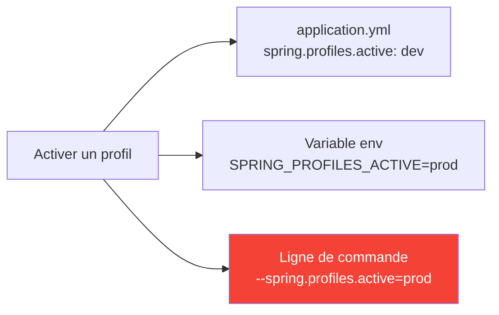
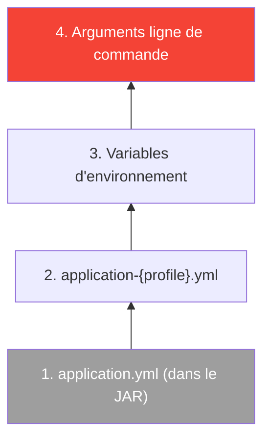
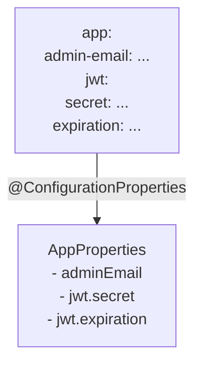
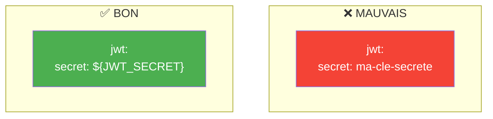

# Chapitre 9.1 - application.yml vs application.properties

## Objectifs du chapitre

- Connaître les formats de configuration
- Maîtriser la syntaxe YAML
- Organiser la configuration par profils
- Appliquer les bonnes pratiques de sécurité

---

## 1. Deux formats disponibles

### Diagramme : Comparaison visuelle



### application.properties

Format clé=valeur traditionnel (plat).

```properties
server.port=8080
spring.datasource.url=jdbc:postgresql://localhost:5432/db
spring.datasource.username=postgres
spring.jpa.hibernate.ddl-auto=update
```

### application.yml

Format YAML hiérarchique (recommandé).

```yaml
server:
  port: 8080

spring:
  datasource:
    url: jdbc:postgresql://localhost:5432/db
    username: postgres
  jpa:
    hibernate:
      ddl-auto: update
```

---

## 2. Comparaison détaillée

### Tableau comparatif

| Aspect | .properties | .yml |
|--------|-------------|------|
| Syntaxe | Plate | Hiérarchique |
| Lisibilité | Moyenne | Excellente |
| Répétition | Oui (préfixes) | Non |
| Listes | Difficile | Facile |
| Profils | Fichiers séparés | Dans le même fichier |
| Commentaires | # | # |

### Diagramme : Avantages YAML



---

## 3. Syntaxe YAML

### Hiérarchie (indentation)



```yaml
spring:
  datasource:          # 2 espaces
    url: jdbc:...      # 4 espaces
    username: user     # 4 espaces
```

> **Important** : Utilisez 2 espaces pour l'indentation, jamais de tabulations!

### Listes

```yaml
# Liste sur plusieurs lignes (recommandé)
cors:
  allowed-origins:
    - http://localhost:3000
    - https://monsite.com
    
# Liste inline (compact)
allowed-methods: [GET, POST, PUT, DELETE]
```

### Variables d'environnement



```yaml
spring:
  datasource:
    username: ${DB_USERNAME:postgres}    # Défaut: postgres
    password: ${DB_PASSWORD}             # Pas de défaut (obligatoire)
```

### Texte multilignes

```yaml
# Préserve les retours à la ligne
description: |
  Première ligne
  Deuxième ligne
  
# Une seule ligne (jointure)
message: >
  Ceci est une
  seule ligne
```

---

## 4. Configuration complète du projet

### Structure recommandée



### application.yml

```yaml
spring:
  application:
    name: contact-api
    
  profiles:
    active: dev

---
# ===================================
# Profil DEV (développement local)
# ===================================
spring:
  config:
    activate:
      on-profile: dev
      
  datasource:
    url: jdbc:h2:mem:testdb
    driver-class-name: org.h2.Driver
    username: sa
    password:
    
  h2:
    console:
      enabled: true
      path: /h2-console
      
  jpa:
    hibernate:
      ddl-auto: create-drop
    show-sql: true
    
  mail:
    host: localhost
    port: 1025

server:
  port: 8080

app:
  jwt:
    secret: dev-secret-key-for-testing-only
    expiration: 86400000
  admin-email: admin@example.com

---
# ===================================
# Profil PROD (production)
# ===================================
spring:
  config:
    activate:
      on-profile: prod
      
  datasource:
    url: jdbc:postgresql://${DB_HOST:localhost}:${DB_PORT:5432}/${DB_NAME:contact_db}
    driver-class-name: org.postgresql.Driver
    username: ${DB_USERNAME:postgres}
    password: ${DB_PASSWORD:postgres}
    
  jpa:
    hibernate:
      ddl-auto: validate
    show-sql: false
    
  mail:
    host: ${MAIL_HOST:smtp.gmail.com}
    port: ${MAIL_PORT:587}
    username: ${MAIL_USER:}
    password: ${MAIL_PASSWORD:}
    properties:
      mail:
        smtp:
          auth: ${MAIL_AUTH:true}
          starttls:
            enable: true

server:
  port: ${PORT:8080}

app:
  jwt:
    secret: ${JWT_SECRET}
    expiration: ${JWT_EXPIRATION:86400000}
  admin-email: ${ADMIN_EMAIL:admin@example.com}
```

---

## 5. Profils dans un seul fichier

### Séparateur de documents

```yaml
# Configuration commune
spring:
  application:
    name: my-app

---
# Profil dev
spring:
  config:
    activate:
      on-profile: dev
# ...

---
# Profil prod
spring:
  config:
    activate:
      on-profile: prod
# ...
```

Le `---` sépare les documents YAML dans le même fichier.

### Activer un profil



---

## 6. Priorité des sources

### Du moins prioritaire au plus prioritaire



```bash
# Les arguments CLI ont la priorité maximale
java -jar app.jar --server.port=9090

# Puis les variables d'environnement
export SERVER_PORT=9090
```

---

## 7. Lire la configuration

### @Value

```java
@Service
public class EmailService {
    
    @Value("${app.admin-email}")
    private String adminEmail;
    
    @Value("${app.jwt.expiration:3600000}")  // Avec défaut
    private long jwtExpiration;
}
```

### @ConfigurationProperties (recommandé pour les groupes)



```java
@Configuration
@ConfigurationProperties(prefix = "app")
@Data
public class AppProperties {
    private String adminEmail;
    private Jwt jwt;
    
    @Data
    public static class Jwt {
        private String secret;
        private long expiration;
    }
}
```

Utilisation :

```java
@Service
@RequiredArgsConstructor
public class JwtService {
    private final AppProperties props;
    
    public String getSecret() {
        return props.getJwt().getSecret();
    }
}
```

---

## 8. Bonnes pratiques

### 8.1 Valeurs par défaut pour le développement

```yaml
# Toujours avoir des défauts pour le dev
database:
  host: ${DB_HOST:localhost}
  port: ${DB_PORT:5432}
```

### 8.2 Pas de secrets en dur



### 8.3 Grouper par fonctionnalité

```yaml
# BON: groupé par domaine
app:
  jwt:
    secret: ...
    expiration: ...
  mail:
    from: ...
    admin: ...
```

### 8.4 Commenter la configuration

```yaml
server:
  port: 8080  # Port d'écoute de l'API

spring:
  jpa:
    hibernate:
      ddl-auto: update  # 'validate' en production!
```

---

## 9. Points clés à retenir

```mermaid
mindmap
  root((Configuration))
    Formats
      YAML recommandé
      Hiérarchique
      Lisible
    Profils
      dev / prod
      Séparateur ---
      spring.profiles.active
    Variables
      ${VAR:default}
      Secrets jamais en dur
      Env variables en prod
    Lecture
      @Value simple
      @ConfigurationProperties groupé
```

1. **YAML** est plus lisible que properties
2. **Profils** permettent des configs différentes
3. **Variables d'environnement** pour les secrets
4. **Valeurs par défaut** avec `${VAR:default}`
5. **@Value** ou **@ConfigurationProperties** pour lire

---

## QUIZ 9.1 - Fichiers de configuration

**1. Quel format est hiérarchique?**
- a) .properties
- b) .yml
- c) Les deux
- d) Aucun

<details>
<summary>Voir la réponse</summary>

**Réponse : b) .yml**

YAML utilise l'indentation pour créer une structure hiérarchique, évitant la répétition des préfixes.
</details>

---

**2. Quelle est la syntaxe pour une valeur par défaut?**
- a) ${VAR||default}
- b) ${VAR:-default}
- c) ${VAR:default}
- d) ${VAR?default}

<details>
<summary>Voir la réponse</summary>

**Réponse : c) ${VAR:default}**

La syntaxe `${VAR:default}` utilise "default" si VAR n'est pas définie.
</details>

---

**3. Quel caractère sépare les documents YAML?**
- a) ===
- b) ---
- c) ***
- d) +++

<details>
<summary>Voir la réponse</summary>

**Réponse : b) ---**

Trois tirets séparent les documents YAML, permettant d'avoir plusieurs profils dans un seul fichier.
</details>

---

**4. Quelle annotation lit une propriété?**
- a) @Property
- b) @Config
- c) @Value
- d) @Setting

<details>
<summary>Voir la réponse</summary>

**Réponse : c) @Value**

@Value("${property.name}") injecte la valeur d'une propriété dans un champ.
</details>

---

**5. VRAI ou FAUX : Les variables d'environnement ont priorité sur application.yml.**

<details>
<summary>Voir la réponse</summary>

**Réponse : VRAI**

Les variables d'environnement ont une priorité plus élevée que les fichiers de configuration, permettant de surcharger les valeurs.
</details>

---

**6. Combien d'espaces pour l'indentation YAML?**
- a) 1
- b) 2
- c) 4
- d) Tabulation

<details>
<summary>Voir la réponse</summary>

**Réponse : b) 2**

La convention standard est d'utiliser 2 espaces. Les tabulations ne sont pas autorisées en YAML.
</details>

---

**7. Comment activer un profil?**
- a) spring.profile=dev
- b) spring.profiles.active=dev
- c) profile.active=dev
- d) active.profile=dev

<details>
<summary>Voir la réponse</summary>

**Réponse : b) spring.profiles.active=dev**

C'est la propriété standard Spring Boot pour activer un ou plusieurs profils.
</details>

---

**8. Complétez : @ConfigurationProperties permet de mapper vers un _______.**

<details>
<summary>Voir la réponse</summary>

**Réponse : objet (ou POJO)**

@ConfigurationProperties mappe un groupe de propriétés vers un objet Java typé avec getters/setters.
</details>

---

**9. Où NE PAS mettre de secrets?**
- a) Variables d'environnement
- b) Fichiers de config commités
- c) Secrets managers
- d) .env (gitignored)

<details>
<summary>Voir la réponse</summary>

**Réponse : b) Fichiers de config commités**

Les fichiers commités dans Git sont visibles par tous. Les secrets doivent être dans des variables d'environnement ou des gestionnaires de secrets.
</details>

---

**10. Quel format supporte mieux les listes?**
- a) .properties
- b) .yml
- c) Pareil
- d) Ni l'un ni l'autre

<details>
<summary>Voir la réponse</summary>

**Réponse : b) .yml**

YAML a une syntaxe native pour les listes avec le tiret (`-`), plus lisible que les indices numériques en properties.
</details>

---

## Navigation

| Précédent | Suivant |
|-----------|---------|
| [40 - Types d'exceptions](40-types-exceptions.md) | [46 - Variables d'environnement](46-variables-environnement.md) |
