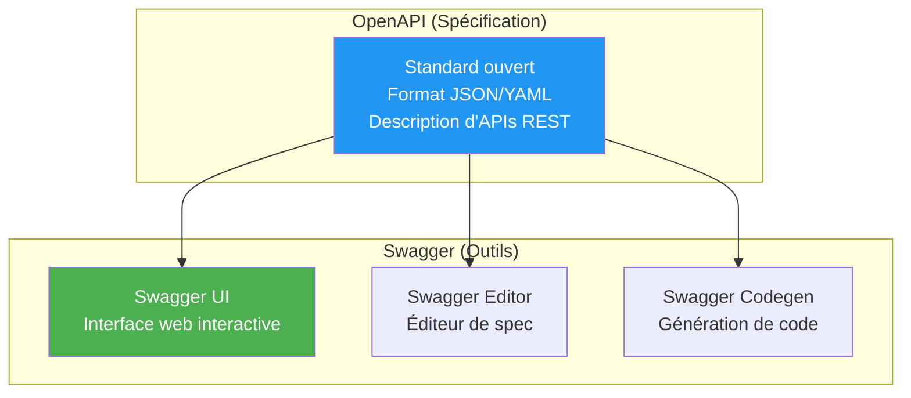
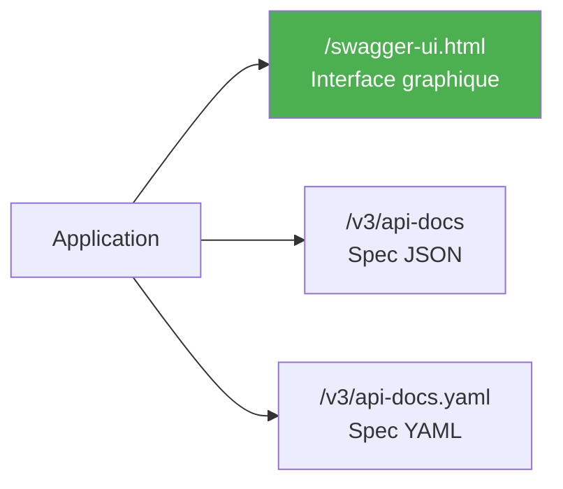
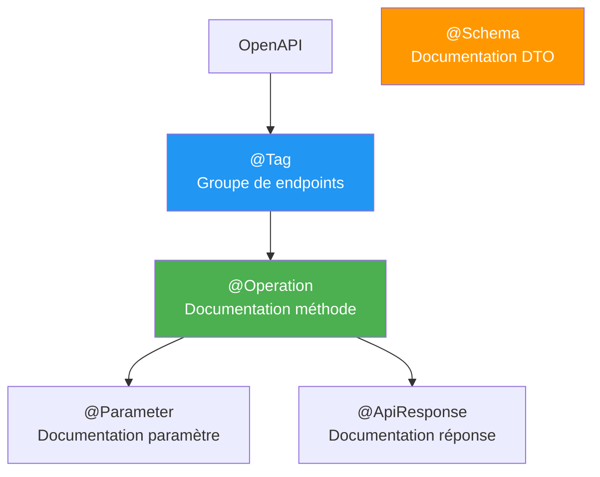
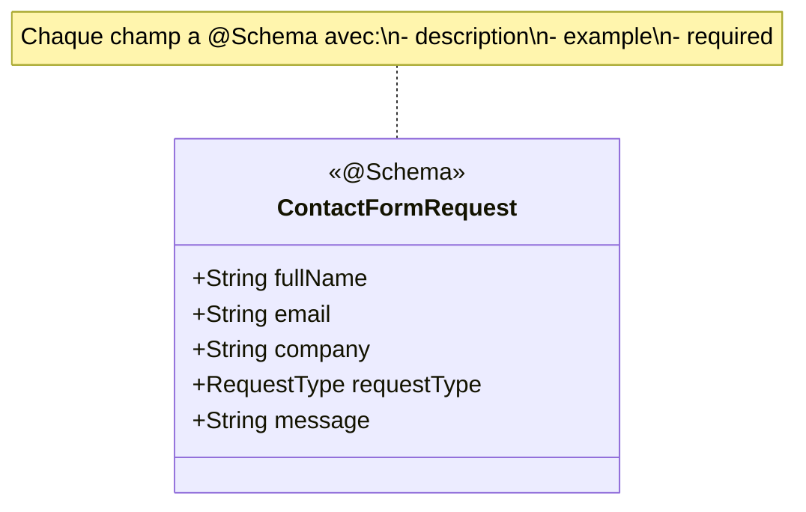
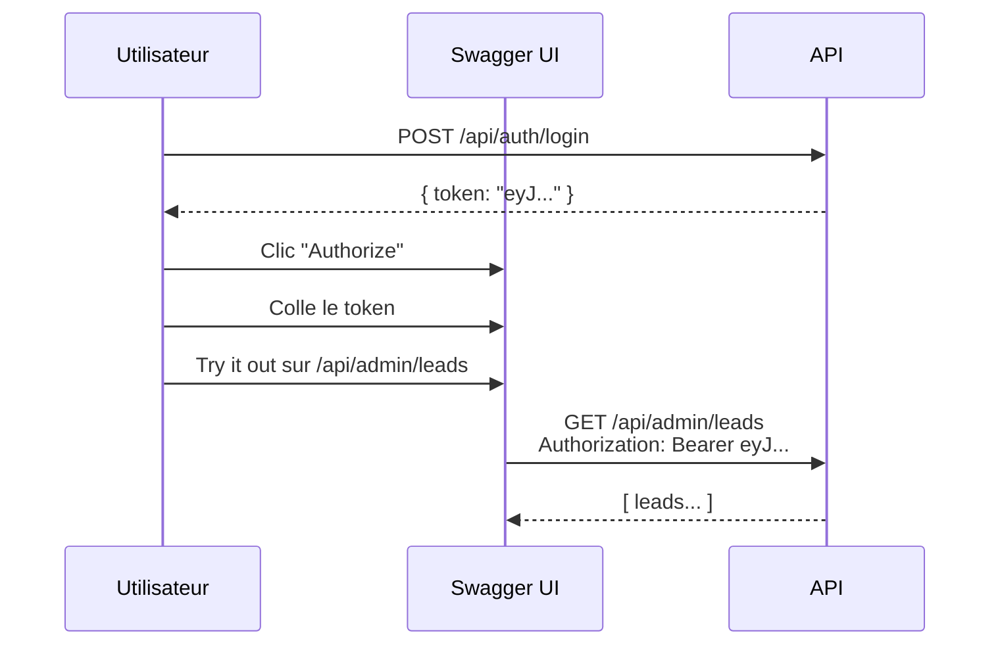
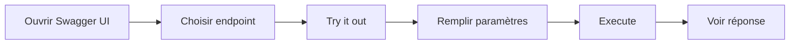
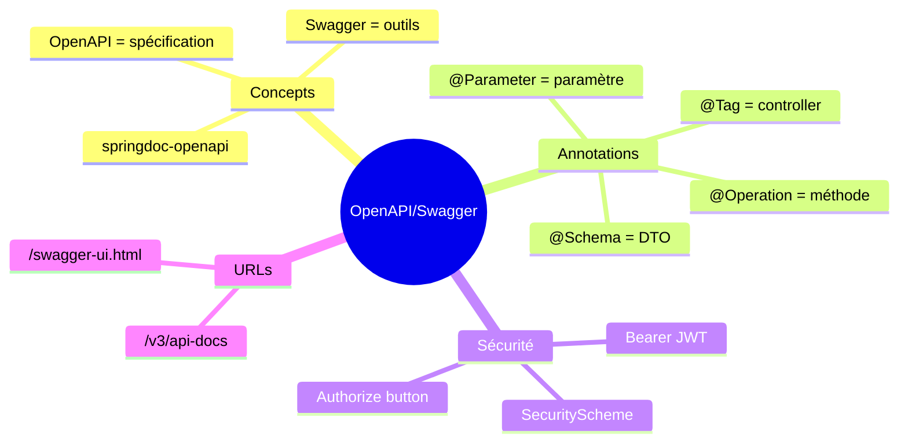

# Chapitre 10.1 - OpenAPI et Swagger

## Objectifs du chapitre

- Comprendre la différence entre OpenAPI et Swagger
- Configurer springdoc-openapi
- Documenter l'API automatiquement
- Tester l'API via Swagger UI

---

## 1. OpenAPI vs Swagger

### Diagramme : Relation



### OpenAPI

**OpenAPI** (anciennement Swagger Specification) est une spécification standard pour décrire les APIs REST de manière indépendante du langage.

### Swagger

**Swagger** est un ensemble d'outils qui implémentent OpenAPI :
- **Swagger UI** : Interface web interactive pour explorer et tester l'API
- **Swagger Editor** : Éditeur en ligne de spécifications
- **Swagger Codegen** : Génération de code client/serveur

---

## 2. springdoc-openapi

### Dépendance Maven

```xml
<dependency>
    <groupId>org.springdoc</groupId>
    <artifactId>springdoc-openapi-starter-webmvc-ui</artifactId>
    <version>2.3.0</version>
</dependency>
```

### URLs par défaut



| URL | Description |
|-----|-------------|
| /swagger-ui.html | Interface Swagger UI |
| /v3/api-docs | Spécification JSON |
| /v3/api-docs.yaml | Spécification YAML |

---

## 3. Configuration

### OpenApiConfig.java

```java
@Configuration
public class OpenApiConfig {
    
    @Bean
    public OpenAPI customOpenAPI() {
        return new OpenAPI()
            .info(new Info()
                .title("Contact Form API")
                .version("1.0.0")
                .description("API REST pour gérer les formulaires de contact et les leads")
                .contact(new Contact()
                    .name("Support")
                    .email("support@example.com")
                    .url("https://example.com"))
                .license(new License()
                    .name("MIT")
                    .url("https://opensource.org/licenses/MIT")))
            .addSecurityItem(new SecurityRequirement().addList("Bearer Authentication"))
            .components(new Components()
                .addSecuritySchemes("Bearer Authentication",
                    new SecurityScheme()
                        .type(SecurityScheme.Type.HTTP)
                        .scheme("bearer")
                        .bearerFormat("JWT")
                        .description("Entrez votre token JWT")));
    }
}
```

### application.yml

```yaml
springdoc:
  api-docs:
    path: /v3/api-docs
  swagger-ui:
    path: /swagger-ui.html
    operationsSorter: method
    tagsSorter: alpha
    tryItOutEnabled: true
```

---

## 4. Annotations de base

### Diagramme : Hiérarchie des annotations



### Sur le controller (@Tag)

```java
@RestController
@RequestMapping("/api/leads")
@Tag(name = "Leads", description = "Gestion des leads")
public class LeadController {
    // ...
}
```

### Sur les méthodes (@Operation, @ApiResponses)

```java
@GetMapping
@Operation(
    summary = "Liste des leads",
    description = "Retourne tous les leads avec pagination"
)
public Page<LeadDto> getAllLeads(Pageable pageable) {
    return service.findAll(pageable);
}

@GetMapping("/{id}")
@Operation(summary = "Récupérer un lead par ID")
@ApiResponses({
    @ApiResponse(responseCode = "200", description = "Lead trouvé"),
    @ApiResponse(responseCode = "404", description = "Lead non trouvé")
})
public LeadDto getById(@PathVariable Long id) {
    return service.findById(id);
}
```

### Sur les paramètres (@Parameter)

```java
@GetMapping
public Page<LeadDto> search(
    @Parameter(description = "Terme de recherche", example = "dupont")
    @RequestParam(required = false) String query,
    
    @Parameter(description = "Statut du lead")
    @RequestParam(required = false) LeadStatus status
) {
    return service.search(query, status);
}
```

---

## 5. Documentation des DTOs

### Diagramme : @Schema sur DTO



### Exemple complet

```java
@Data
@Schema(description = "Requête de formulaire de contact")
public class ContactFormRequest {
    
    @Schema(description = "Nom complet", example = "Jean Dupont", requiredMode = RequiredMode.REQUIRED)
    @NotBlank
    private String fullName;
    
    @Schema(description = "Adresse email", example = "jean@example.com", requiredMode = RequiredMode.REQUIRED)
    @Email
    private String email;
    
    @Schema(description = "Nom de l'entreprise", example = "ACME Corp")
    private String company;
    
    @Schema(description = "Type de demande", example = "INFO", requiredMode = RequiredMode.REQUIRED)
    @NotNull
    private RequestType requestType;
    
    @Schema(description = "Message", example = "Je souhaite des informations...", minLength = 10)
    @NotBlank
    private String message;
}
```

### DTO de réponse

```java
@Data
@Schema(description = "Lead retourné par l'API")
public class LeadDto {
    
    @Schema(description = "ID unique", example = "1")
    private Long id;
    
    @Schema(description = "Nom complet", example = "Jean Dupont")
    private String fullName;
    
    @Schema(description = "Statut du lead", example = "NEW")
    private LeadStatus status;
    
    @Schema(description = "Date de création", example = "2024-01-15T10:30:00")
    private LocalDateTime createdAt;
}
```

---

## 6. Sécurité dans Swagger

### Diagramme : Authentification JWT



### Afficher le bouton Authorize

```java
@Bean
public OpenAPI customOpenAPI() {
    return new OpenAPI()
        .addSecurityItem(new SecurityRequirement().addList("Bearer Authentication"))
        .components(new Components()
            .addSecuritySchemes("Bearer Authentication",
                new SecurityScheme()
                    .type(SecurityScheme.Type.HTTP)
                    .scheme("bearer")
                    .bearerFormat("JWT")));
}
```

### Marquer les endpoints protégés

```java
@GetMapping
@Operation(
    summary = "Liste des leads",
    security = @SecurityRequirement(name = "Bearer Authentication")
)
public Page<LeadDto> getAllLeads() {
    return service.findAll();
}
```

### Exclure les endpoints publics

```java
@PostMapping
@Operation(summary = "Soumettre formulaire", security = {})  // Pas de sécurité
public MessageResponse submit(@RequestBody ContactFormRequest request) {
    return service.create(request);
}
```

---

## 7. Personnalisation

### Grouper les endpoints

```java
@Bean
public GroupedOpenApi publicApi() {
    return GroupedOpenApi.builder()
        .group("public")
        .pathsToMatch("/api/contact/**", "/api/auth/**")
        .build();
}

@Bean
public GroupedOpenApi adminApi() {
    return GroupedOpenApi.builder()
        .group("admin")
        .pathsToMatch("/api/admin/**")
        .build();
}
```

### Cacher des endpoints

```java
@GetMapping("/internal")
@Hidden  // N'apparaît pas dans Swagger
public String internal() {
    return "hidden";
}
```

---

## 8. Utiliser Swagger UI

### Diagramme : Workflow de test



### Tester un endpoint

1. Ouvrir http://localhost:8080/swagger-ui.html
2. Cliquer sur un endpoint
3. Cliquer "Try it out"
4. Remplir les paramètres
5. Cliquer "Execute"

### Authentification JWT

1. Obtenir un token via POST /api/auth/login
2. Cliquer "Authorize" (cadenas)
3. Entrer le token (sans "Bearer ")
4. Cliquer "Authorize"
5. Tous les endpoints utiliseront le token

---

## 9. Bonnes pratiques

### 9.1 Descriptions claires

```java
@Operation(
    summary = "Titre court",           // Affiché dans la liste
    description = "Description détaillée avec exemples et cas d'utilisation"
)
```

### 9.2 Exemples réalistes

```java
// ❌ MAUVAIS
@Schema(example = "test@test.com")

// ✅ BON
@Schema(example = "jean.dupont@entreprise.com")
```

### 9.3 Documenter les erreurs

```java
@ApiResponses({
    @ApiResponse(responseCode = "200", description = "Succès"),
    @ApiResponse(responseCode = "400", description = "Données invalides"),
    @ApiResponse(responseCode = "401", description = "Non authentifié"),
    @ApiResponse(responseCode = "404", description = "Non trouvé")
})
```

---

## 10. Points clés à retenir



1. **springdoc-openapi** pour Spring Boot 3
2. **@Tag** pour grouper les controllers
3. **@Operation** pour documenter les méthodes
4. **@Schema** pour documenter les DTOs
5. **SecurityScheme** pour l'authentification JWT

---

## QUIZ 10.1 - OpenAPI et Swagger

**1. Quelle est la différence entre OpenAPI et Swagger?**
- a) Aucune
- b) OpenAPI = spécification, Swagger = outils
- c) Swagger = spécification, OpenAPI = outils
- d) Deux projets concurrents

<details>
<summary>Voir la réponse</summary>

**Réponse : b) OpenAPI = spécification, Swagger = outils**

OpenAPI est la spécification standard pour décrire les APIs REST. Swagger est un ensemble d'outils (UI, Editor, Codegen) qui utilisent cette spécification.
</details>

---

**2. Quelle URL pour Swagger UI par défaut?**
- a) /api-docs
- b) /swagger
- c) /swagger-ui.html
- d) /docs

<details>
<summary>Voir la réponse</summary>

**Réponse : c) /swagger-ui.html**

C'est l'URL par défaut de springdoc-openapi pour accéder à l'interface Swagger UI.
</details>

---

**3. Quelle annotation pour documenter un controller?**
- a) @Api
- b) @Tag
- c) @Controller
- d) @Documented

<details>
<summary>Voir la réponse</summary>

**Réponse : b) @Tag**

@Tag permet de grouper les endpoints d'un controller et de leur donner un nom et une description.
</details>

---

**4. Quelle annotation pour documenter une méthode?**
- a) @Api
- b) @ApiOperation
- c) @Operation
- d) @Method

<details>
<summary>Voir la réponse</summary>

**Réponse : c) @Operation**

@Operation permet de documenter une méthode avec un summary, une description, etc.
</details>

---

**5. VRAI ou FAUX : Swagger peut exécuter des requêtes directement.**

<details>
<summary>Voir la réponse</summary>

**Réponse : VRAI**

Le bouton "Try it out" de Swagger UI permet d'exécuter des requêtes HTTP directement depuis l'interface.
</details>

---

**6. Quelle annotation pour documenter un DTO?**
- a) @ApiModel
- b) @Schema
- c) @Model
- d) @Dto

<details>
<summary>Voir la réponse</summary>

**Réponse : b) @Schema**

@Schema permet de documenter les classes DTO et leurs champs avec des descriptions et exemples.
</details>

---

**7. Comment cacher un endpoint de Swagger?**
- a) @Ignore
- b) @Hidden
- c) @Private
- d) @NoDoc

<details>
<summary>Voir la réponse</summary>

**Réponse : b) @Hidden**

@Hidden empêche un endpoint d'apparaître dans la documentation Swagger.
</details>

---

**8. Complétez : springdoc-openapi génère la spécification au format _______.**

<details>
<summary>Voir la réponse</summary>

**Réponse : JSON (ou YAML)**

springdoc-openapi génère automatiquement la spécification OpenAPI en JSON (/v3/api-docs) ou YAML (/v3/api-docs.yaml).
</details>

---

**9. Quelle URL pour la spécification JSON?**
- a) /api-docs
- b) /v3/api-docs
- c) /openapi.json
- d) /swagger.json

<details>
<summary>Voir la réponse</summary>

**Réponse : b) /v3/api-docs**

C'est l'URL par défaut de springdoc-openapi pour la spécification OpenAPI 3 en JSON.
</details>

---

**10. Comment s'authentifier dans Swagger UI?**
- a) Login/password
- b) Bouton Authorize avec le token
- c) Cookie
- d) Header manuel

<details>
<summary>Voir la réponse</summary>

**Réponse : b) Bouton Authorize avec le token**

Le bouton "Authorize" (cadenas) permet de saisir le token JWT qui sera automatiquement ajouté aux requêtes.
</details>

---

## Navigation

| Précédent | Suivant |
|-----------|---------|
| [45 - Fichiers de configuration](45-fichiers-config.md) | [51 - Documentation des endpoints](51-documentation-endpoints.md) |
