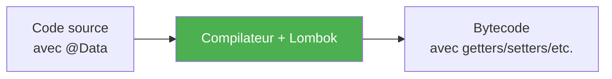
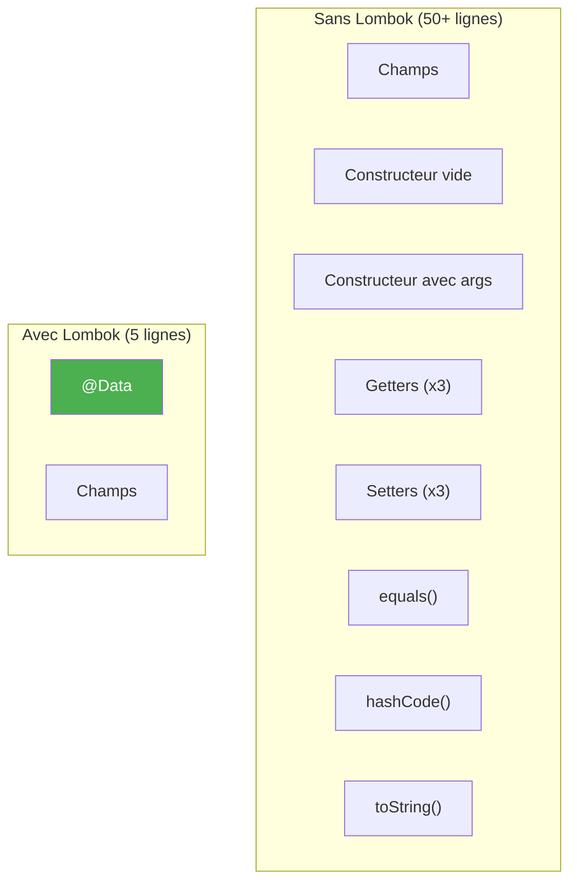
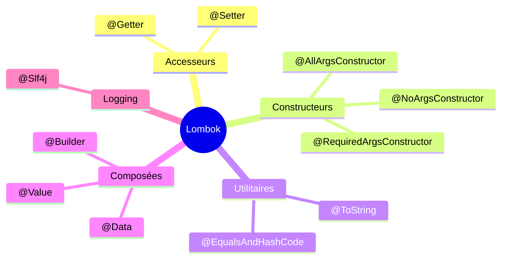
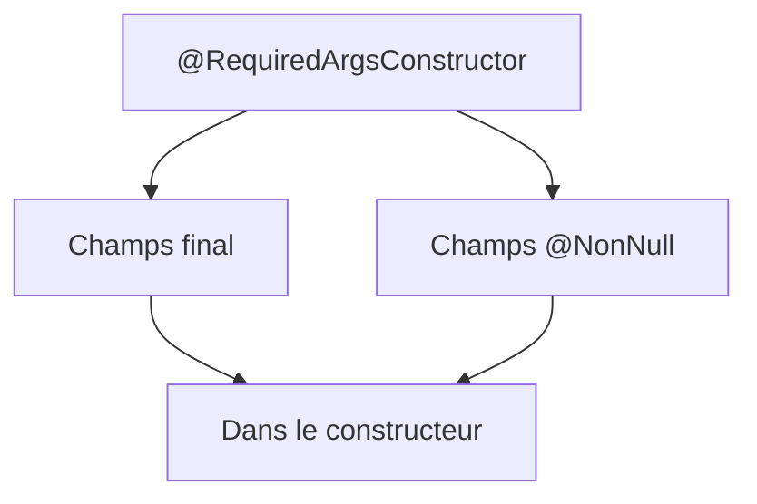
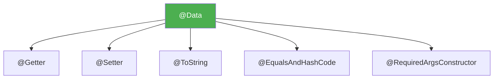
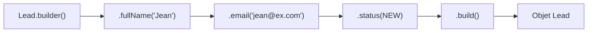
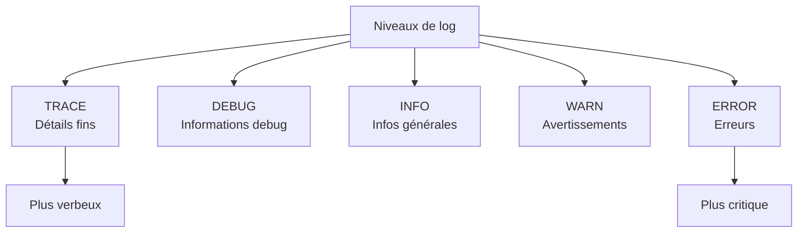
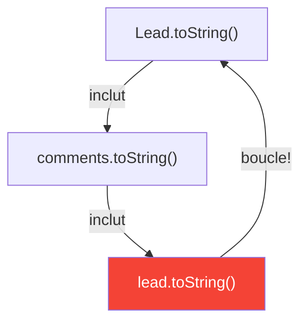
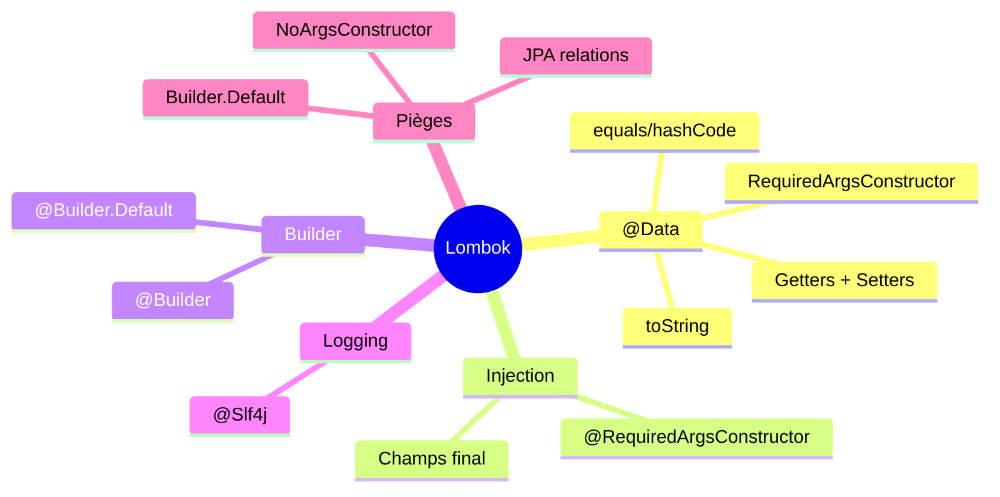

# Chapitre 11.1 - Lombok et réduction du boilerplate

## Objectifs du chapitre

- Comprendre le rôle de Lombok
- Maîtriser les annotations principales
- Éviter les pièges courants

---

## 1. Qu'est-ce que Lombok?

### Définition

**Lombok** est une bibliothèque Java qui génère automatiquement le code répétitif (boilerplate) à la compilation via des annotations.

### Diagramme : Lombok en action



### Problème résolu



### Exemple concret

```java
// Sans Lombok: 50+ lignes
public class Lead {
    private Long id;
    private String fullName;
    private String email;
    
    public Lead() {}
    
    public Lead(Long id, String fullName, String email) {
        this.id = id;
        this.fullName = fullName;
        this.email = email;
    }
    
    public Long getId() { return id; }
    public void setId(Long id) { this.id = id; }
    public String getFullName() { return fullName; }
    public void setFullName(String fullName) { this.fullName = fullName; }
    public String getEmail() { return email; }
    public void setEmail(String email) { this.email = email; }
    
    @Override
    public boolean equals(Object o) { /* ... */ }
    @Override
    public int hashCode() { /* ... */ }
    @Override
    public String toString() { /* ... */ }
}

// Avec Lombok: 5 lignes
@Data
public class Lead {
    private Long id;
    private String fullName;
    private String email;
}
```

---

## 2. Configuration

### Dépendance Maven

```xml
<dependency>
    <groupId>org.projectlombok</groupId>
    <artifactId>lombok</artifactId>
    <optional>true</optional>
</dependency>
```

### Plugin IDE

> **Important** : Le plugin Lombok est nécessaire pour que l'IDE comprenne le code généré!

- **IntelliJ** : Settings > Plugins > "Lombok"
- **VS Code** : Extension "Lombok Annotations Support"
- **Eclipse** : Installer via le JAR Lombok

---

## 3. Annotations principales

### Diagramme : Vue d'ensemble



### @Getter / @Setter

```java
@Getter @Setter
public class Lead {
    private Long id;
    private String name;
}

// Génère:
// public Long getId() { return id; }
// public void setId(Long id) { this.id = id; }
// public String getName() { return name; }
// public void setName(String name) { this.name = name; }
```

### @ToString

```java
@ToString
public class Lead {
    private Long id;
    private String name;
}

// Génère:
// public String toString() {
//     return "Lead(id=" + id + ", name=" + name + ")";
// }
```

### @EqualsAndHashCode

```java
@EqualsAndHashCode
public class Lead {
    private Long id;
    private String name;
}

// Génère equals() et hashCode() basés sur tous les champs
```

### @NoArgsConstructor

```java
@NoArgsConstructor
public class Lead {
    private Long id;
}

// Génère:
// public Lead() {}
```

### @AllArgsConstructor

```java
@AllArgsConstructor
public class Lead {
    private Long id;
    private String name;
}

// Génère:
// public Lead(Long id, String name) {
//     this.id = id;
//     this.name = name;
// }
```

### @RequiredArgsConstructor



```java
@RequiredArgsConstructor
public class LeadService {
    private final LeadRepository repository;  // final → dans constructeur
    private EmailService emailService;        // pas final → pas dans constructeur
}

// Génère:
// public LeadService(LeadRepository repository) {
//     this.repository = repository;
// }
```

---

## 4. Annotations composées

### @Data



```java
@Data
// Équivalent à:
@Getter
@Setter
@ToString
@EqualsAndHashCode
@RequiredArgsConstructor
```

### @Value

Pour les objets **immutables** :

```java
@Value
public class LeadId {
    Long id;
}

// Équivalent à:
// - @Getter (pas de @Setter!)
// - @ToString
// - @EqualsAndHashCode
// - @AllArgsConstructor
// - Tous les champs sont final et private
```

---

## 5. @Builder

### Pattern Builder



```java
@Builder
@Data
public class Lead {
    private Long id;
    private String fullName;
    private String email;
    private LeadStatus status;
}

// Utilisation:
Lead lead = Lead.builder()
    .fullName("Jean Dupont")
    .email("jean@example.com")
    .status(LeadStatus.NEW)
    .build();
```

### Avec valeurs par défaut

```java
@Builder
@Data
public class Lead {
    private Long id;
    private String fullName;
    
    @Builder.Default
    private LeadStatus status = LeadStatus.NEW;
    
    @Builder.Default
    private LocalDateTime createdAt = LocalDateTime.now();
}
```

> **Important** : Sans `@Builder.Default`, les valeurs par défaut sont ignorées par le builder!

---

## 6. @Slf4j (Logging)

### Annotation

```java
@Slf4j
@Service
public class LeadService {
    
    public void createLead(Lead lead) {
        log.info("Création du lead: {}", lead.getEmail());
        log.debug("Détails: {}", lead);
        log.error("Erreur!", exception);
    }
}

// Génère:
// private static final Logger log = LoggerFactory.getLogger(LeadService.class);
```

### Niveaux de log



| Niveau | Usage |
|--------|-------|
| trace | Détails fins (rarement utilisé) |
| debug | Informations de debug |
| info | Informations générales |
| warn | Avertissements |
| error | Erreurs |

---

## 7. Cas d'usage dans le projet

### Entité JPA

```java
@Entity
@Table(name = "leads")
@Data
@NoArgsConstructor
@AllArgsConstructor
@Builder
public class Lead {
    @Id
    @GeneratedValue(strategy = GenerationType.IDENTITY)
    private Long id;
    
    private String fullName;
    private String email;
    
    @Builder.Default
    private LeadStatus status = LeadStatus.NEW;
}
```

### Service

```java
@Service
@RequiredArgsConstructor  // Injection par constructeur
@Slf4j                    // Logger
public class LeadService {
    
    private final LeadRepository repository;
    private final EmailService emailService;
    
    public LeadDto createLead(ContactFormRequest request) {
        log.info("Nouveau lead: {}", request.getEmail());
        // ...
    }
}
```

### DTO

```java
@Data
@Builder
@NoArgsConstructor
@AllArgsConstructor
public class LeadDto {
    private Long id;
    private String fullName;
    private String email;
    private LeadStatus status;
    private LocalDateTime createdAt;
}
```

---

## 8. Pièges à éviter

### 8.1 @Data sur les entités JPA avec relations



```java
// ⚠️ ATTENTION avec les relations
@Entity
@Data
public class Lead {
    @OneToMany(mappedBy = "lead")
    private List<Comment> comments;  // toString/equals peut boucler!
}

// ✅ SOLUTION: Exclure les relations
@ToString(exclude = "comments")
@EqualsAndHashCode(exclude = "comments")
```

### 8.2 Oublier @NoArgsConstructor pour JPA

```java
// ❌ MAUVAIS: JPA a besoin d'un constructeur sans arg
@AllArgsConstructor
public class Lead { }

// ✅ BON
@NoArgsConstructor
@AllArgsConstructor
public class Lead { }
```

### 8.3 @Builder.Default oublié

```java
// ❌ MAUVAIS
@Builder
public class Lead {
    private LeadStatus status = LeadStatus.NEW;  // IGNORÉ par Builder!
}
// Le builder crée un lead avec status = null

// ✅ BON
@Builder
public class Lead {
    @Builder.Default
    private LeadStatus status = LeadStatus.NEW;
}
```

---

## 9. Points clés à retenir



1. **@Data** = @Getter + @Setter + @ToString + @EqualsAndHashCode + @RequiredArgsConstructor
2. **@RequiredArgsConstructor** pour l'injection de dépendances
3. **@Builder** pour créer des objets facilement
4. **@Slf4j** pour le logging
5. **Attention** aux relations JPA avec @Data

---

## QUIZ 11.1 - Lombok

**1. Que génère @Data?**
- a) Seulement getters/setters
- b) Getters, setters, toString, equals, hashCode
- c) Seulement toString
- d) Constructeurs

<details>
<summary>Voir la réponse</summary>

**Réponse : b) Getters, setters, toString, equals, hashCode**

@Data combine @Getter, @Setter, @ToString, @EqualsAndHashCode et @RequiredArgsConstructor.
</details>

---

**2. Quelle annotation pour l'injection par constructeur?**
- a) @AllArgsConstructor
- b) @NoArgsConstructor
- c) @RequiredArgsConstructor
- d) @Inject

<details>
<summary>Voir la réponse</summary>

**Réponse : c) @RequiredArgsConstructor**

Elle génère un constructeur avec les champs `final` et `@NonNull`, parfait pour l'injection de dépendances.
</details>

---

**3. Comment utiliser le pattern Builder?**
- a) @Build
- b) @Builder
- c) @Pattern(Builder)
- d) @BuilderPattern

<details>
<summary>Voir la réponse</summary>

**Réponse : b) @Builder**

@Builder génère une classe interne Builder avec des méthodes fluides pour construire l'objet.
</details>

---

**4. Quelle annotation pour le logging?**
- a) @Log
- b) @Logger
- c) @Slf4j
- d) @Logging

<details>
<summary>Voir la réponse</summary>

**Réponse : c) @Slf4j**

@Slf4j génère un logger SLF4J nommé `log` dans la classe.
</details>

---

**5. VRAI ou FAUX : Lombok génère le code à l'exécution.**

<details>
<summary>Voir la réponse</summary>

**Réponse : FAUX**

Lombok génère le code à la **compilation**, pas à l'exécution. Le bytecode contient le code complet.
</details>

---

**6. Pourquoi @NoArgsConstructor est nécessaire pour JPA?**
- a) Performance
- b) JPA crée les entités avec ce constructeur
- c) Obligatoire par Java
- d) Pour le logging

<details>
<summary>Voir la réponse</summary>

**Réponse : b) JPA crée les entités avec ce constructeur**

JPA/Hibernate a besoin d'un constructeur sans argument pour instancier les entités lors du chargement depuis la base.
</details>

---

**7. Que fait @Builder.Default?**
- a) Définit le builder par défaut
- b) Préserve les valeurs par défaut dans le builder
- c) Crée un builder vide
- d) Rien

<details>
<summary>Voir la réponse</summary>

**Réponse : b) Préserve les valeurs par défaut dans le builder**

Sans @Builder.Default, les valeurs par défaut des champs sont ignorées quand on utilise le builder.
</details>

---

**8. Complétez : @Value crée des objets _______.**

<details>
<summary>Voir la réponse</summary>

**Réponse : immutables**

@Value rend tous les champs final et private, sans setters, créant ainsi des objets immutables.
</details>

---

**9. Quel problème avec @Data et @OneToMany?**
- a) Erreur de compilation
- b) Boucle infinie dans toString/equals
- c) Pas de problème
- d) Erreur JPA

<details>
<summary>Voir la réponse</summary>

**Réponse : b) Boucle infinie dans toString/equals**

Les relations bidirectionnelles peuvent causer des boucles infinies. Utilisez @ToString(exclude) et @EqualsAndHashCode(exclude).
</details>

---

**10. Comment exclure un champ de toString?**
- a) @ToString.Exclude
- b) @Exclude
- c) @ToString(exclude = "champ")
- d) a ou c

<details>
<summary>Voir la réponse</summary>

**Réponse : d) a ou c**

Les deux syntaxes fonctionnent : @ToString.Exclude sur le champ ou @ToString(exclude = "champ") sur la classe.
</details>

---

## Navigation

| Précédent | Suivant |
|-----------|---------|
| [50 - OpenAPI et Swagger](50-openapi-swagger.md) | [55 - MapStruct](55-mapstruct.md) |
