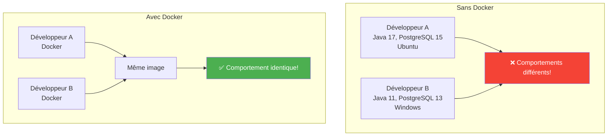
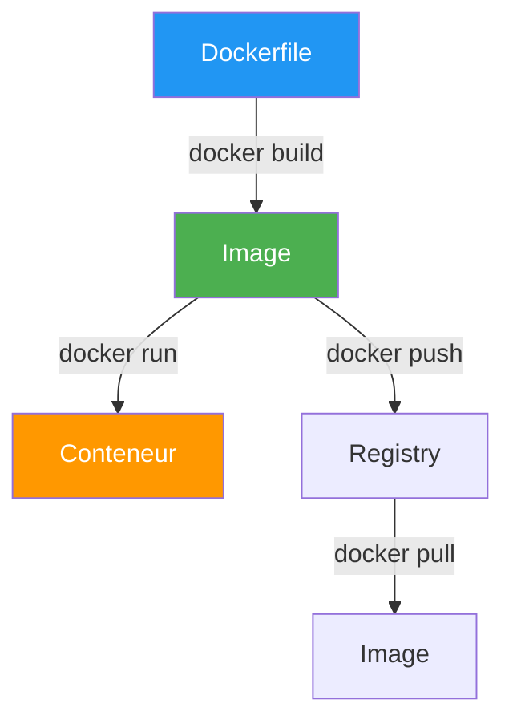
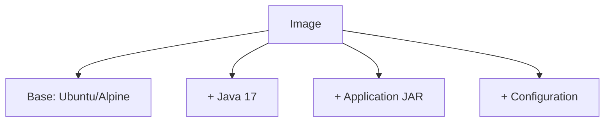
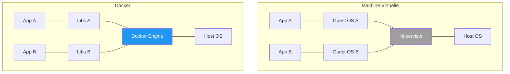
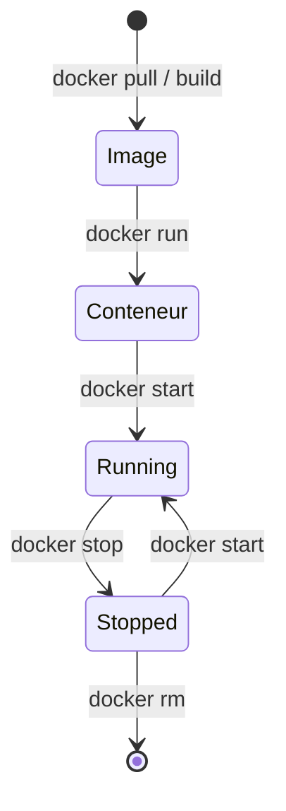
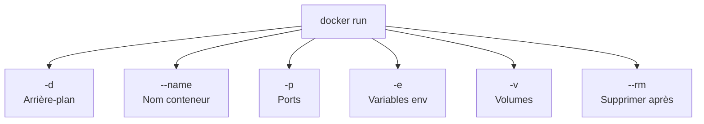
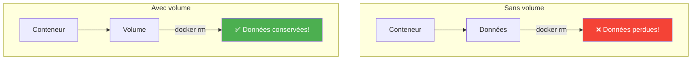
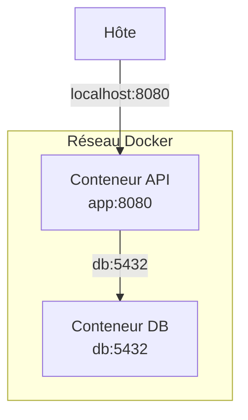
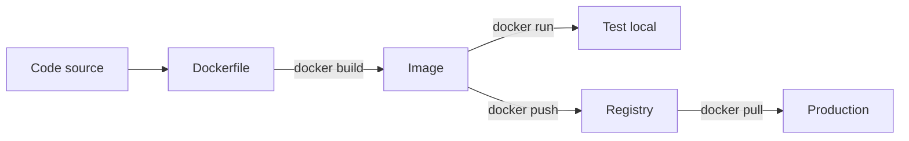
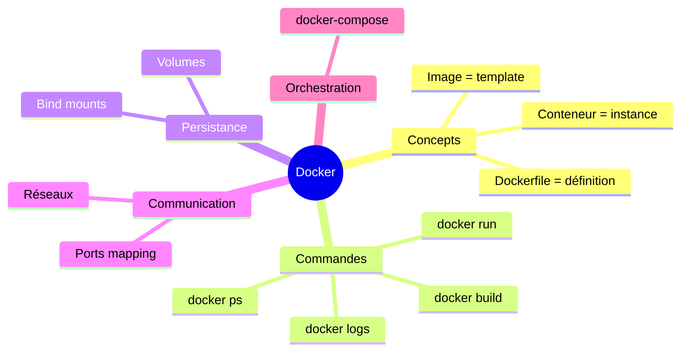

# Chapitre 12.1 - Introduction à Docker

## Objectifs du chapitre

- Comprendre Docker et la conteneurisation
- Connaître les concepts de base
- Maîtriser les commandes essentielles

---

## 1. Qu'est-ce que Docker?

### Définition

**Docker** est une plateforme de conteneurisation qui permet d'empaqueter une application avec toutes ses dépendances dans un conteneur isolé.

### Diagramme : Problème résolu



> **Le problème classique** : "Ça marche sur ma machine!" est résolu par Docker.

---

## 2. Concepts clés

### Diagramme : Relations



### Image

Un **template** en lecture seule contenant l'application et ses dépendances.



> **Analogie** : L'image est comme une recette de cuisine.

### Conteneur

Une **instance** en cours d'exécution d'une image.

> **Analogie** : Le conteneur est le plat cuisiné à partir de la recette.

### Dockerfile

Fichier de **définition** pour construire une image.

```dockerfile
FROM eclipse-temurin:17-jre
COPY app.jar /app/app.jar
CMD ["java", "-jar", "/app/app.jar"]
```

### Registry

**Dépôt** d'images (Docker Hub, GitHub Container Registry...).

```bash
docker pull postgres:15-alpine    # Télécharge depuis Docker Hub
docker push monrepo/monimage:1.0  # Pousse vers un registry
```

---

## 3. Docker vs Machine Virtuelle

### Diagramme comparatif



### Tableau comparatif

| Aspect | Machine Virtuelle | Docker |
|--------|-------------------|--------|
| Isolation | Complète (OS) | Processus |
| Démarrage | Minutes | Secondes |
| Taille | Go | Mo |
| Performance | Overhead | Native |
| Portabilité | Limitée | Excellente |

---

## 4. Installation

### Windows

1. Télécharger Docker Desktop : https://docker.com/products/docker-desktop
2. Installer
3. Redémarrer
4. Vérifier : `docker --version`

### Linux

```bash
# Ubuntu
curl -fsSL https://get.docker.com | sh
sudo usermod -aG docker $USER
# Déconnexion/reconnexion requise

docker --version
```

### Vérification

```bash
docker run hello-world
```

---

## 5. Commandes essentielles

### Diagramme : Cycle de vie



### Images

```bash
# Lister les images
docker images

# Télécharger une image
docker pull postgres:15-alpine

# Supprimer une image
docker rmi postgres:15-alpine

# Construire une image
docker build -t monapp:1.0 .
```

### Conteneurs

```bash
# Lister les conteneurs (en cours)
docker ps

# Lister tous les conteneurs
docker ps -a

# Démarrer un conteneur
docker run -d --name mondb postgres:15-alpine

# Arrêter un conteneur
docker stop mondb

# Démarrer un conteneur arrêté
docker start mondb

# Supprimer un conteneur
docker rm mondb

# Logs d'un conteneur
docker logs mondb
docker logs -f mondb  # Suivre en temps réel

# Exécuter une commande dans un conteneur
docker exec -it mondb bash
docker exec -it mondb psql -U postgres
```

### Nettoyage

```bash
# Supprimer les conteneurs arrêtés
docker container prune

# Supprimer les images non utilisées
docker image prune

# Tout nettoyer
docker system prune -a
```

---

## 6. Options docker run

### Diagramme : Options courantes



### Options courantes

```bash
docker run [OPTIONS] IMAGE [COMMAND]

# -d : Detached (arrière-plan)
docker run -d postgres

# --name : Nom du conteneur
docker run --name mondb postgres

# -p : Mapping de ports (hôte:conteneur)
docker run -p 5432:5432 postgres

# -e : Variable d'environnement
docker run -e POSTGRES_PASSWORD=secret postgres

# -v : Volume (persistance)
docker run -v pgdata:/var/lib/postgresql/data postgres

# --rm : Supprimer après arrêt
docker run --rm postgres

# -it : Interactive + TTY
docker run -it ubuntu bash
```

### Exemple complet

```bash
docker run -d \
  --name contact-db \
  -p 5432:5432 \
  -e POSTGRES_DB=contact_db \
  -e POSTGRES_USER=postgres \
  -e POSTGRES_PASSWORD=postgres \
  -v postgres_data:/var/lib/postgresql/data \
  postgres:15-alpine
```

---

## 7. Volumes

### Diagramme : Persistance



### Types de volumes

```bash
# Volume nommé (recommandé)
docker run -v monvolume:/data postgres

# Bind mount (dossier local)
docker run -v /chemin/local:/data postgres

# Volume anonyme
docker run -v /data postgres
```

### Gestion des volumes

```bash
# Lister les volumes
docker volume ls

# Créer un volume
docker volume create monvolume

# Supprimer un volume
docker volume rm monvolume

# Inspecter un volume
docker volume inspect monvolume
```

---

## 8. Réseaux

### Diagramme : Communication entre conteneurs



### Réseaux par défaut

```bash
# Lister les réseaux
docker network ls

# bridge : Réseau par défaut
# host : Partage le réseau de l'hôte
# none : Pas de réseau
```

### Créer un réseau

```bash
docker network create monreseau

docker run --network monreseau --name app1 myapp
docker run --network monreseau --name app2 myapp

# app1 peut atteindre app2 par son nom
```

---

## 9. Workflow typique

### Diagramme : Du code à la production



```bash
# 1. Écrire le Dockerfile
# 2. Construire l'image
docker build -t monapp:1.0 .

# 3. Tester localement
docker run -p 8080:8080 monapp:1.0

# 4. Pousser vers un registry
docker tag monapp:1.0 registry.example.com/monapp:1.0
docker push registry.example.com/monapp:1.0

# 5. Déployer en production
docker pull registry.example.com/monapp:1.0
docker run -d monapp:1.0
```

---

## 10. Points clés à retenir



1. **Image** = template, **Conteneur** = instance
2. **Dockerfile** définit comment construire l'image
3. **docker run** crée et démarre un conteneur
4. **Volumes** pour la persistance des données
5. **docker-compose** pour orchestrer plusieurs conteneurs

---

## QUIZ 12.1 - Introduction à Docker

**1. Quelle est la différence entre une image et un conteneur?**
- a) Aucune
- b) Image = template, Conteneur = instance en cours
- c) Conteneur = template, Image = instance
- d) Image est plus léger

<details>
<summary>Voir la réponse</summary>

**Réponse : b) Image = template, Conteneur = instance en cours**

L'image est un template en lecture seule. Le conteneur est une instance en cours d'exécution de cette image.
</details>

---

**2. Quel fichier définit comment construire une image?**
- a) docker.yml
- b) Containerfile
- c) Dockerfile
- d) image.config

<details>
<summary>Voir la réponse</summary>

**Réponse : c) Dockerfile**

Le Dockerfile contient les instructions pour construire une image Docker.
</details>

---

**3. Quelle commande liste les conteneurs en cours?**
- a) docker list
- b) docker ps
- c) docker containers
- d) docker running

<details>
<summary>Voir la réponse</summary>

**Réponse : b) docker ps**

`docker ps` liste les conteneurs en cours. Ajoutez `-a` pour voir tous les conteneurs.
</details>

---

**4. Comment mapper le port 8080 du conteneur vers 3000 de l'hôte?**
- a) -p 8080:3000
- b) -p 3000:8080
- c) --port 8080=3000
- d) -m 3000:8080

<details>
<summary>Voir la réponse</summary>

**Réponse : b) -p 3000:8080**

Le format est `-p hôte:conteneur`. Donc 3000 (hôte) vers 8080 (conteneur).
</details>

---

**5. VRAI ou FAUX : Les données dans un conteneur sont persistantes par défaut.**

<details>
<summary>Voir la réponse</summary>

**Réponse : FAUX**

Les données sont perdues quand le conteneur est supprimé. Utilisez des volumes pour persister les données.
</details>

---

**6. Quelle option pour exécuter en arrière-plan?**
- a) -b
- b) -d
- c) --background
- d) --daemon

<details>
<summary>Voir la réponse</summary>

**Réponse : b) -d**

`-d` (detached) exécute le conteneur en arrière-plan.
</details>

---

**7. Comment voir les logs d'un conteneur?**
- a) docker output monconteneur
- b) docker logs monconteneur
- c) docker print monconteneur
- d) docker show monconteneur

<details>
<summary>Voir la réponse</summary>

**Réponse : b) docker logs monconteneur**

Ajoutez `-f` pour suivre les logs en temps réel.
</details>

---

**8. Complétez : Un _______ permet de persister les données entre les redémarrages.**

<details>
<summary>Voir la réponse</summary>

**Réponse : volume**

Les volumes Docker persistent les données même après la suppression du conteneur.
</details>

---

**9. Quelle commande pour entrer dans un conteneur?**
- a) docker enter
- b) docker exec -it
- c) docker shell
- d) docker connect

<details>
<summary>Voir la réponse</summary>

**Réponse : b) docker exec -it**

`docker exec -it monconteneur bash` ouvre un shell interactif dans le conteneur.
</details>

---

**10. Que fait docker-compose?**
- a) Compose des images
- b) Orchestre plusieurs conteneurs
- c) Compile le code
- d) Crée des réseaux

<details>
<summary>Voir la réponse</summary>

**Réponse : b) Orchestre plusieurs conteneurs**

docker-compose permet de définir et gérer des applications multi-conteneurs avec un fichier YAML.
</details>

---

## Navigation

| Précédent | Suivant |
|-----------|---------|
| [54 - Lombok](54-lombok.md) | [59 - Dockerfile](59-dockerfile.md) |
