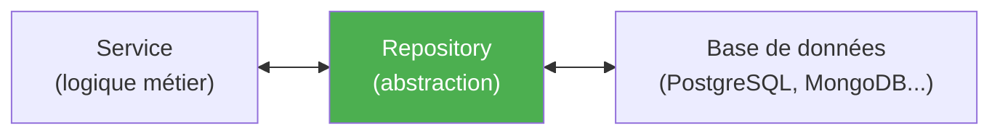
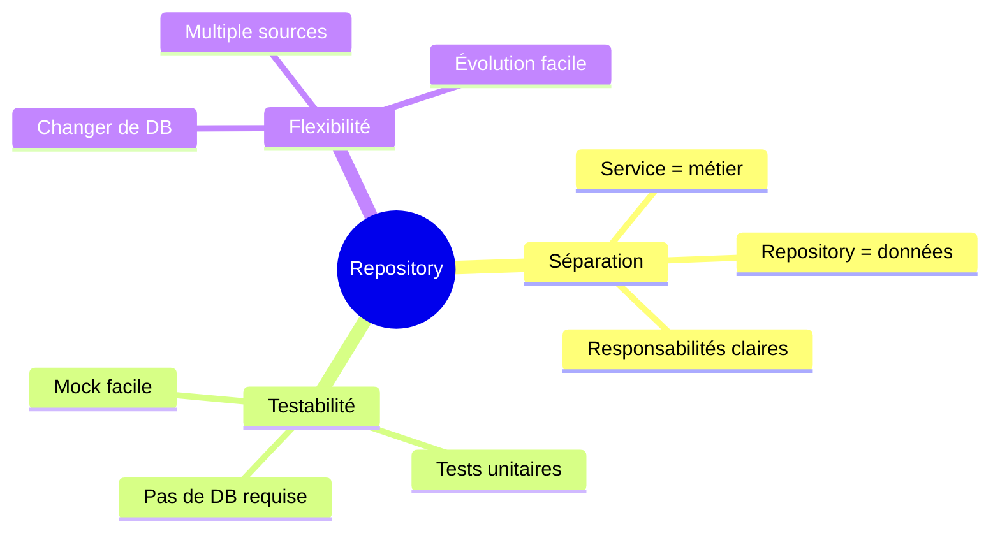
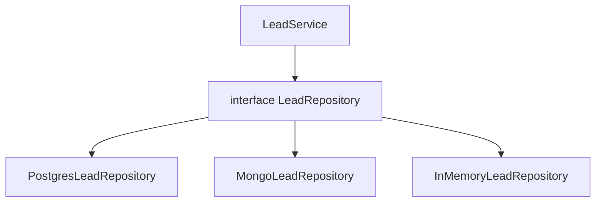
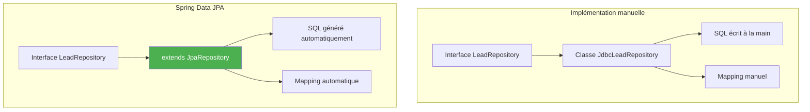
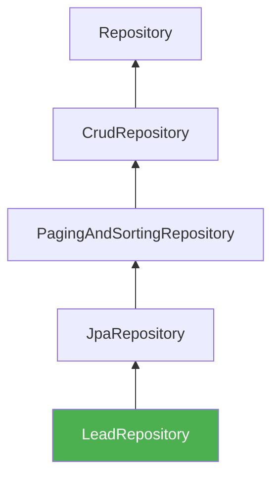
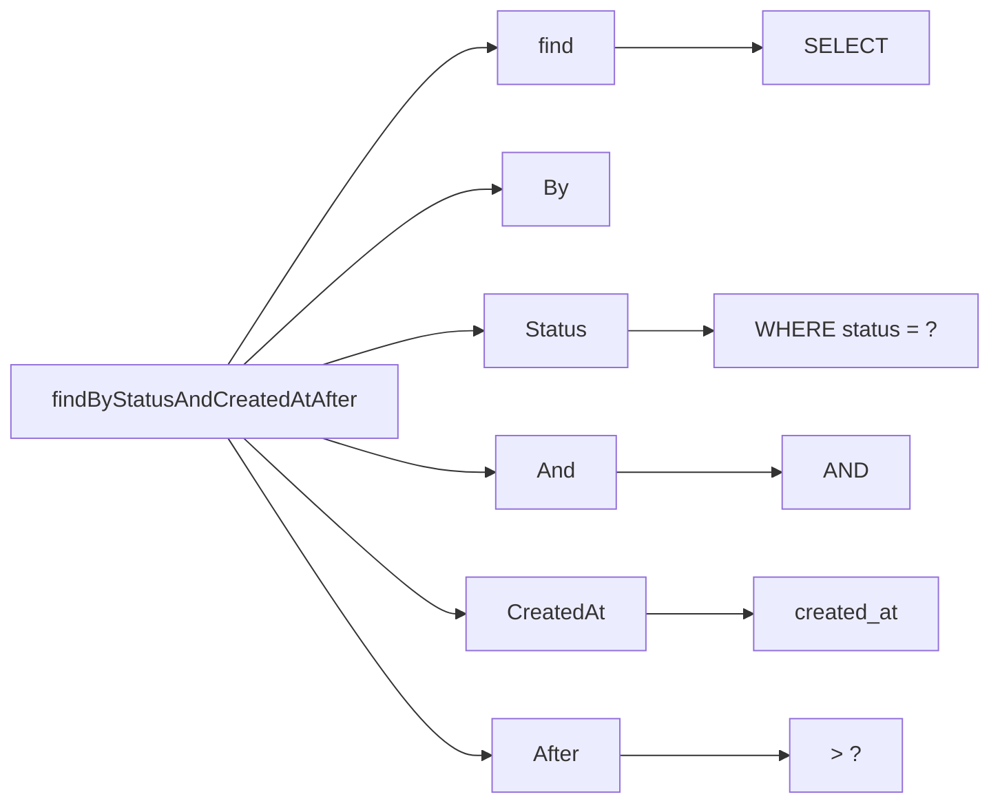
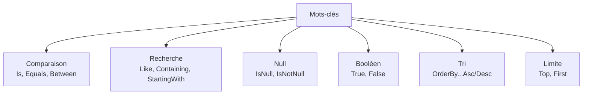
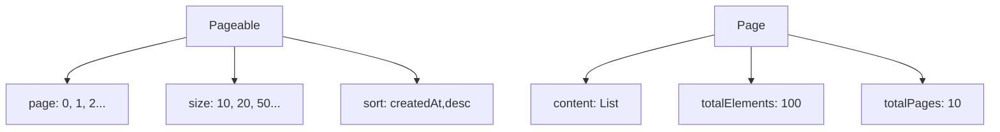
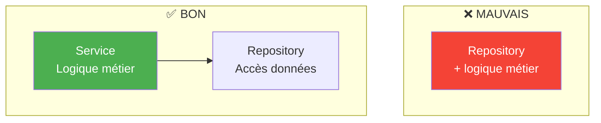
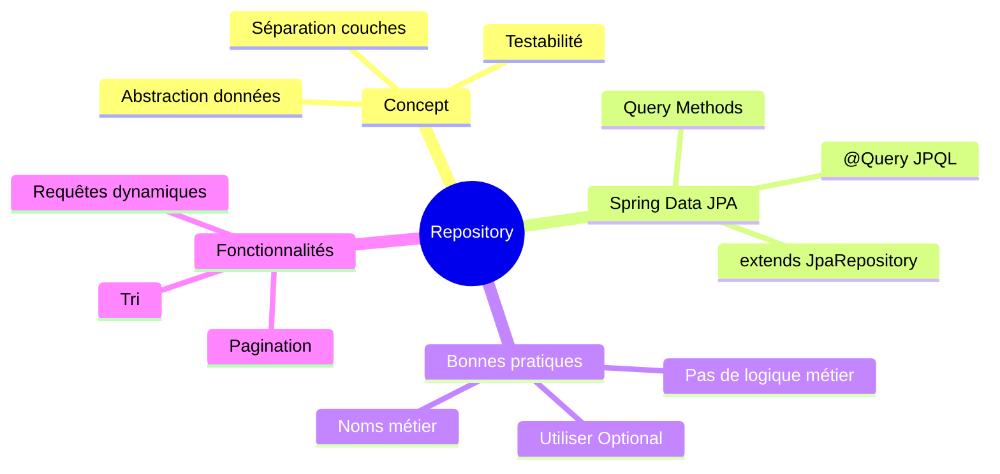

# Chapitre 13.1 - Pattern Repository

## Objectifs du chapitre

- Comprendre le pattern Repository
- Maîtriser son implémentation avec Spring Data JPA
- Appliquer les bonnes pratiques

---

## 1. Définition

### Qu'est-ce que le pattern Repository?

Le **Repository** est un pattern de conception qui abstrait l'accès aux données. Il fait le lien entre le domaine métier et la couche de persistance.

### Diagramme : Rôle du Repository



### Objectif principal

**Isoler la logique métier des détails techniques de stockage**.

Le service ne sait pas (et n'a pas besoin de savoir) :
- Quelle base de données est utilisée
- Comment les requêtes SQL sont construites
- Comment les données sont mappées

---

## 2. Avantages

### Diagramme : Bénéfices



### 2.1 Séparation des préoccupations

Le service ne connaît pas les détails de la base de données.

```java
// Le service ne sait pas si c'est SQL, MongoDB, ou un fichier
public class LeadService {
    private final LeadRepository repository;
    
    public List<Lead> getActiveLeads() {
        return repository.findByStatus(LeadStatus.NEW);
    }
}
```

### 2.2 Testabilité

Facile de mocker le repository pour les tests.

```java
@Test
void shouldReturnActiveLeads() {
    // Mock du repository
    when(repository.findByStatus(LeadStatus.NEW))
        .thenReturn(List.of(new Lead()));
    
    List<Lead> leads = service.getActiveLeads();
    
    assertEquals(1, leads.size());
}
```

### 2.3 Flexibilité

Changer de base de données sans modifier la logique métier.



---

## 3. Implémentation manuelle vs Spring Data

### Diagramme comparatif



### Implémentation manuelle (beaucoup de code!)

```java
@Repository
public class JdbcLeadRepository implements LeadRepository {
    
    private final JdbcTemplate jdbc;
    
    @Override
    public Lead save(Lead lead) {
        if (lead.getId() == null) {
            String sql = "INSERT INTO leads (full_name, email, status) VALUES (?, ?, ?)";
            jdbc.update(sql, lead.getFullName(), lead.getEmail(), lead.getStatus().name());
        } else {
            String sql = "UPDATE leads SET full_name = ?, email = ?, status = ? WHERE id = ?";
            jdbc.update(sql, lead.getFullName(), lead.getEmail(), lead.getStatus().name(), lead.getId());
        }
        return lead;
    }
    
    @Override
    public Optional<Lead> findById(Long id) {
        String sql = "SELECT * FROM leads WHERE id = ?";
        try {
            Lead lead = jdbc.queryForObject(sql, this::mapRow, id);
            return Optional.ofNullable(lead);
        } catch (EmptyResultDataAccessException e) {
            return Optional.empty();
        }
    }
    
    private Lead mapRow(ResultSet rs, int rowNum) throws SQLException {
        Lead lead = new Lead();
        lead.setId(rs.getLong("id"));
        lead.setFullName(rs.getString("full_name"));
        lead.setEmail(rs.getString("email"));
        lead.setStatus(LeadStatus.valueOf(rs.getString("status")));
        return lead;
    }
}
```

---

## 4. Spring Data JPA (recommandé)

### Interface simple

```java
@Repository
public interface LeadRepository extends JpaRepository<Lead, Long> {
    
    // Méthodes générées automatiquement:
    // - save(Lead)
    // - findById(Long)
    // - findAll()
    // - delete(Lead)
    // - count()
    // - existsById(Long)
    
    // Méthodes personnalisées (générées à partir du nom)
    List<Lead> findByStatus(LeadStatus status);
    
    Optional<Lead> findByEmail(String email);
    
    long countByStatus(LeadStatus status);
}
```

### Diagramme : Hiérarchie des interfaces



### Utilisation dans le service

```java
@Service
@RequiredArgsConstructor
public class LeadService {
    
    private final LeadRepository repository;
    
    public LeadDto createLead(ContactFormRequest request) {
        Lead lead = new Lead();
        lead.setFullName(request.getFullName());
        lead.setEmail(request.getEmail());
        
        Lead saved = repository.save(lead);  // JPA génère le SQL
        
        return mapToDto(saved);
    }
    
    public LeadDto findById(Long id) {
        return repository.findById(id)
            .map(this::mapToDto)
            .orElseThrow(() -> new ResourceNotFoundException("Lead not found"));
    }
}
```

---

## 5. Query Methods

### Principe

Spring Data génère les requêtes SQL à partir du **nom de la méthode**.

### Diagramme : Composition



### Exemples

| Méthode | SQL généré |
|---------|------------|
| `findByEmail(String)` | `WHERE email = ?` |
| `findByStatusAndRequestType(Status, Type)` | `WHERE status = ? AND request_type = ?` |
| `findByFullNameContaining(String)` | `WHERE full_name LIKE %?%` |
| `findByCreatedAtAfter(LocalDateTime)` | `WHERE created_at > ?` |
| `countByStatus(Status)` | `SELECT COUNT(*) WHERE status = ?` |
| `existsByEmail(String)` | `SELECT EXISTS(... WHERE email = ?)` |
| `deleteByStatus(Status)` | `DELETE FROM ... WHERE status = ?` |

### Mots-clés disponibles



---

## 6. Requêtes personnalisées

### @Query (JPQL)

```java
@Repository
public interface LeadRepository extends JpaRepository<Lead, Long> {
    
    @Query("SELECT l FROM Lead l WHERE l.status = :status ORDER BY l.createdAt DESC")
    List<Lead> findRecentByStatus(@Param("status") LeadStatus status);
    
    @Query("SELECT COUNT(l) FROM Lead l WHERE l.createdAt > :date")
    long countRecentLeads(@Param("date") LocalDateTime date);
}
```

### @Query (SQL natif)

```java
@Query(value = "SELECT * FROM leads WHERE created_at > NOW() - INTERVAL '7 days'", 
       nativeQuery = true)
List<Lead> findLeadsFromLastWeek();
```

### @Modifying (UPDATE/DELETE)

```java
@Modifying
@Query("UPDATE Lead l SET l.status = :status WHERE l.id = :id")
int updateStatus(@Param("id") Long id, @Param("status") LeadStatus status);
```

---

## 7. Pagination et tri

### Diagramme : Pageable



### Dans le Repository

```java
public interface LeadRepository extends JpaRepository<Lead, Long> {
    
    Page<Lead> findByStatus(LeadStatus status, Pageable pageable);
    
    List<Lead> findByStatus(LeadStatus status, Sort sort);
}
```

### Dans le Controller

```java
@GetMapping
public Page<LeadDto> getAllLeads(
        @RequestParam(defaultValue = "0") int page,
        @RequestParam(defaultValue = "10") int size,
        @RequestParam(defaultValue = "createdAt,desc") String sort) {
    
    Pageable pageable = PageRequest.of(page, size, Sort.by(sort.split(",")));
    return repository.findAll(pageable).map(this::mapToDto);
}
```

---

## 8. Bonnes pratiques

### 8.1 Noms de méthodes métier

```java
// ✅ BON: Interface métier
public interface LeadRepository extends JpaRepository<Lead, Long> {
    List<Lead> findActiveLeads();  // Nom métier clair
}

// ❌ MOINS BON: Exposition des détails techniques
public interface LeadRepository extends JpaRepository<Lead, Long> {
    List<Lead> findByStatusNotAndDeletedFalseOrderByCreatedAtDesc();
}
```

### 8.2 Pas de logique métier dans le repository



```java
// ❌ MAUVAIS
@Repository
public interface LeadRepository extends JpaRepository<Lead, Long> {
    default void processAndSave(Lead lead) {
        lead.setStatus(calculateStatus(lead));  // Logique métier!
        save(lead);
    }
}

// ✅ BON: La logique est dans le service
@Service
public class LeadService {
    public void processAndSave(Lead lead) {
        lead.setStatus(calculateStatus(lead));
        repository.save(lead);
    }
}
```

### 8.3 Utiliser Optional

```java
// ✅ BON
Optional<Lead> findByEmail(String email);

// ❌ MOINS BON (peut retourner null)
Lead findByEmail(String email);
```

---

## 9. Repositories du projet

### LeadRepository

```java
@Repository
public interface LeadRepository extends JpaRepository<Lead, Long> {
    
    long countByStatus(LeadStatus status);
    
    List<Lead> findByStatusOrderByCreatedAtDesc(LeadStatus status);
    
    Optional<Lead> findByEmail(String email);
    
    boolean existsByEmail(String email);
}
```

### UserRepository

```java
@Repository
public interface UserRepository extends JpaRepository<User, Long> {
    
    Optional<User> findByEmail(String email);
    
    boolean existsByEmail(String email);
}
```

---

## 10. Points clés à retenir



1. **Repository** abstrait l'accès aux données
2. **Spring Data JPA** génère l'implémentation automatiquement
3. **Query Methods** créent les requêtes à partir du nom
4. **@Query** pour les requêtes personnalisées
5. **Pas de logique métier** dans le repository

---

## QUIZ 13.1 - Pattern Repository

**1. Quel est le rôle du pattern Repository?**
- a) Gérer les transactions
- b) Abstraire l'accès aux données
- c) Valider les données
- d) Gérer la sécurité

<details>
<summary>Voir la réponse</summary>

**Réponse : b) Abstraire l'accès aux données**

Le Repository fait le lien entre la logique métier et la persistance, cachant les détails techniques.
</details>

---

**2. Quelle interface étendre pour Spring Data JPA?**
- a) Repository
- b) CrudRepository
- c) JpaRepository
- d) DataRepository

<details>
<summary>Voir la réponse</summary>

**Réponse : c) JpaRepository**

JpaRepository étend CrudRepository et PagingAndSortingRepository, offrant toutes les fonctionnalités JPA.
</details>

---

**3. Comment Spring Data génère-t-il les requêtes?**
- a) À partir des annotations
- b) À partir du nom de la méthode
- c) À partir du fichier XML
- d) Manuellement

<details>
<summary>Voir la réponse</summary>

**Réponse : b) À partir du nom de la méthode**

Les Query Methods analysent le nom de la méthode pour générer la requête SQL appropriée.
</details>

---

**4. Que retourne findById()?**
- a) L'entité ou null
- b) Optional<Entity>
- c) L'entité ou exception
- d) Liste d'entités

<details>
<summary>Voir la réponse</summary>

**Réponse : b) Optional<Entity>**

findById() retourne un Optional pour éviter les NullPointerException.
</details>

---

**5. VRAI ou FAUX : Le repository peut contenir de la logique métier.**

<details>
<summary>Voir la réponse</summary>

**Réponse : FAUX**

La logique métier appartient au Service. Le Repository ne fait que l'accès aux données.
</details>

---

**6. Quelle annotation pour une requête JPQL personnalisée?**
- a) @Sql
- b) @Query
- c) @Jpql
- d) @CustomQuery

<details>
<summary>Voir la réponse</summary>

**Réponse : b) @Query**

@Query permet d'écrire des requêtes JPQL ou SQL natives personnalisées.
</details>

---

**7. Que génère findByStatusAndRequestType()?**
- a) WHERE status = ? OR request_type = ?
- b) WHERE status = ? AND request_type = ?
- c) WHERE status LIKE ? AND request_type LIKE ?
- d) Erreur

<details>
<summary>Voir la réponse</summary>

**Réponse : b) WHERE status = ? AND request_type = ?**

Le mot-clé "And" dans le nom de méthode génère une clause AND dans la requête.
</details>

---

**8. Complétez : Spring Data JPA génère l'_______ du repository.**

<details>
<summary>Voir la réponse</summary>

**Réponse : implémentation**

À partir de l'interface, Spring Data JPA génère automatiquement une classe d'implémentation au runtime.
</details>

---

**9. Quel avantage pour les tests unitaires?**
- a) Plus rapide
- b) Facile à mocker
- c) Pas besoin de tests
- d) Tests automatiques

<details>
<summary>Voir la réponse</summary>

**Réponse : b) Facile à mocker**

L'interface Repository permet de créer facilement des mocks pour tester le Service sans base de données.
</details>

---

**10. Quelle méthode vérifie l'existence sans charger l'entité?**
- a) exists()
- b) existsById()
- c) hasId()
- d) contains()

<details>
<summary>Voir la réponse</summary>

**Réponse : b) existsById()**

existsById() exécute un SELECT EXISTS efficace sans charger l'entité complète.
</details>

---

## Navigation

| Précédent | Suivant |
|-----------|---------|
| [58 - Introduction à Docker](58-docker-introduction.md) | [64 - Pattern Service](64-pattern-service.md) |
