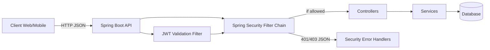
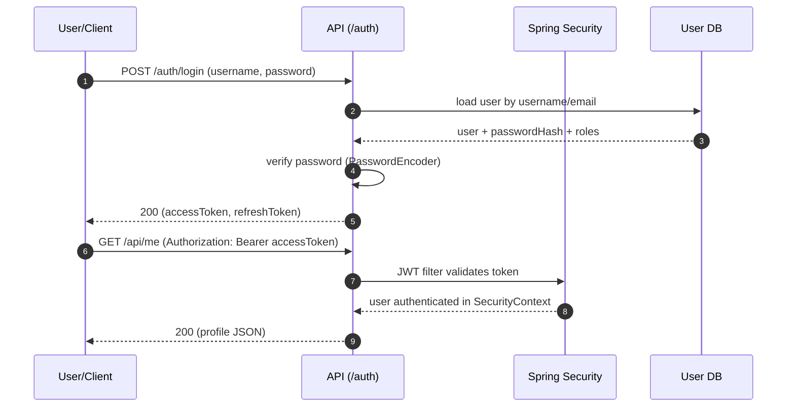
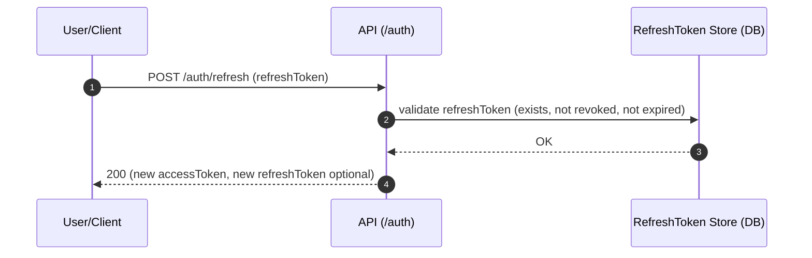
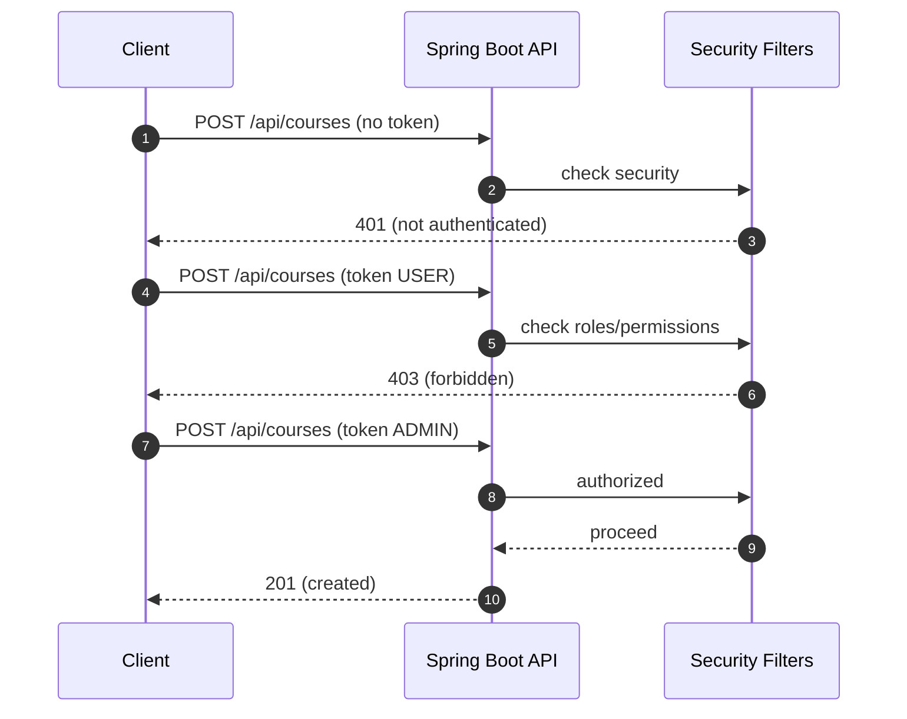
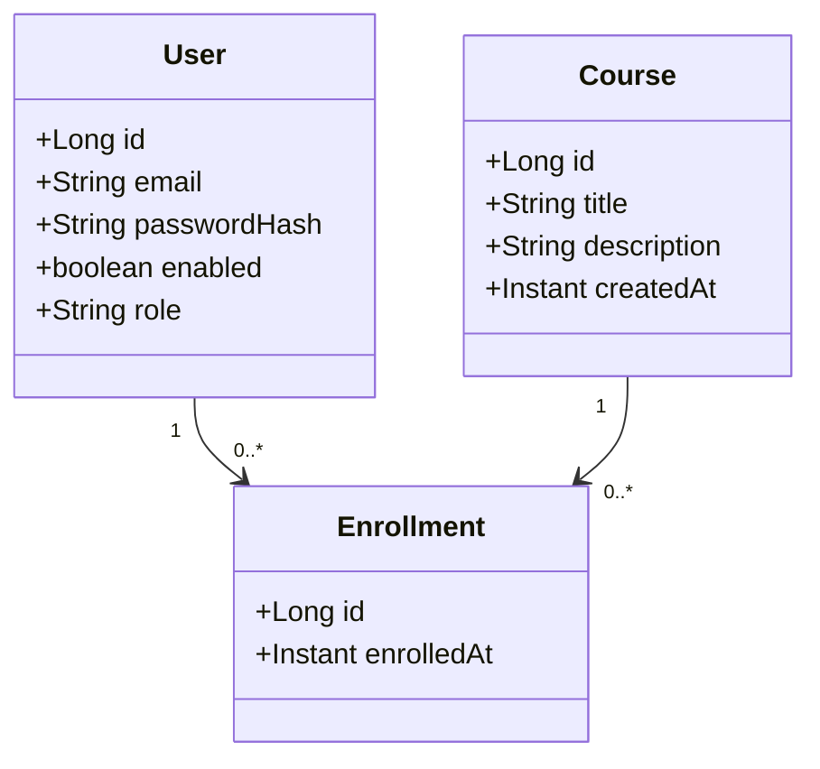

### Module 10 — Mini-projet final : API “Gestion de cours” (version longue + diagrammes Mermaid)

Objectif du module
Construire une API REST complète et réaliste, sécurisée avec Spring Security, avec une séparation propre (auth / user / security), des rôles/permissions, JWT (access + refresh), des règles d’accès cohérentes, et une validation par scénarios (401/403). Le projet est conçu pour être documenté sur GitHub.

---

1. Cahier des charges (fonctionnel)

1) Types d’utilisateurs

* VISITOR : non connecté (pas un rôle, juste “public”)
* USER : utilisateur standard
* ADMIN : administrateur

2. Fonctionnalités principales

* Consultation publique des cours
* Inscription d’un utilisateur à un cours
* Gestion des cours (CRUD) réservée à ADMIN (et éventuellement MANAGER si extension)
* Authentification JWT avec refresh token

3. Contraintes importantes

* API uniquement (JSON), pas de pages HTML
* Stateless pour les routes API (pas de session serveur)
* Erreurs 401/403 standardisées en JSON
* CORS configuré pour un front séparé

---

2. Modèle d’accès (règles)

Règles simples (version de base) :

* Public :

  * GET /api/courses
  * GET /api/courses/{id}
  * POST /api/auth/login
  * POST /api/auth/refresh
  * POST /api/auth/register (optionnel)

* Authentifié (USER ou ADMIN) :

  * POST /api/enrollments/{courseId}
  * GET /api/me
  * GET /api/me/enrollments

* ADMIN seulement :

  * POST /api/courses
  * PUT /api/courses/{id}
  * DELETE /api/courses/{id}
  * GET /api/admin/** (optionnel)

---

3. Diagramme d’architecture (Mermaid)

Idée à retenir
Toutes les requêtes passent d’abord par la sécurité, puis seulement ensuite par tes controllers.

---

4. Flux Auth : login → access token + refresh token

---

5. Flux Refresh : access token expiré → refresh → nouveau access token

Note pédagogique
Le refresh token est l’endroit où tu peux gérer la révocation de manière “entreprise”.

---

6. Flux d’autorisation : 401 vs 403 (à tester)

---

7. Modèle de données (conceptuel)

Entités minimales :

* users

  * id
  * email (ou username)
  * password_hash
  * role (USER/ADMIN) ou authorities
  * enabled

* courses

  * id
  * title
  * description
  * createdAt

* enrollments

  * id
  * user_id
  * course_id
  * enrolledAt

Option refresh tokens (si tu veux refresh “propre”)

* refresh_tokens

  * id
  * user_id
  * token_hash (on évite de stocker le token en clair)
  * expiresAt
  * revoked

---

8. Diagramme de classes (Mermaid)

---

9. Organisation des packages (structure GitHub)

Structure recommandée (lisible) :

* security

  * config
  * jwt
  * exception
  * permissions

* auth

  * controller
  * service
  * dto

* user

  * entity
  * repository
  * service
  * controller (me endpoints)

* course

  * entity
  * repository
  * service
  * controller

* enrollment

  * entity
  * repository
  * service
  * controller

But :

* éviter un monolithe de classes
* permettre une lecture rapide par domaine

---

10. Scénarios de test obligatoires (liste GitHub)

Auth

* login OK (200)
* login mauvais mot de passe (401)
* refresh OK (200)
* refresh token invalide (401)

Courses

* GET /courses public (200)
* POST /courses sans token (401)
* POST /courses avec USER (403)
* POST /courses avec ADMIN (201)

Enrollments

* POST /enrollments/{courseId} sans token (401)
* POST /enrollments/{courseId} USER (201)
* POST /enrollments/{courseId} ADMIN (201 ou règle à définir)

Me

* GET /me sans token (401)
* GET /me USER (200)

---

11. Livrables (ce que tu mets sur GitHub)

* README.md

  * description du projet
  * endpoints + règles d’accès
  * diagrammes Mermaid (ceux ci-dessus)
  * comment lancer
  * comment tester (Postman/curl)
* collection Postman (optionnel)
* tests d’intégration security
* scripts de seed (users/courses)
* exemples de réponses JSON (success + errors)

---

12. Extension “bonus” (si tu veux pousser niveau entreprise)

* Ajouter permissions fines (course:create, course:update, course:delete)
* Mettre rôles comme bundle de permissions
* Rotation refresh token
* Stocker refresh token hashé en base
* Ajouter audit log minimal (login success/fail, forbidden attempts)
* Protéger swagger en dev seulement ou role ADMIN
* Ajouter OAuth2 login (Google/Microsoft) + mapping user interne

