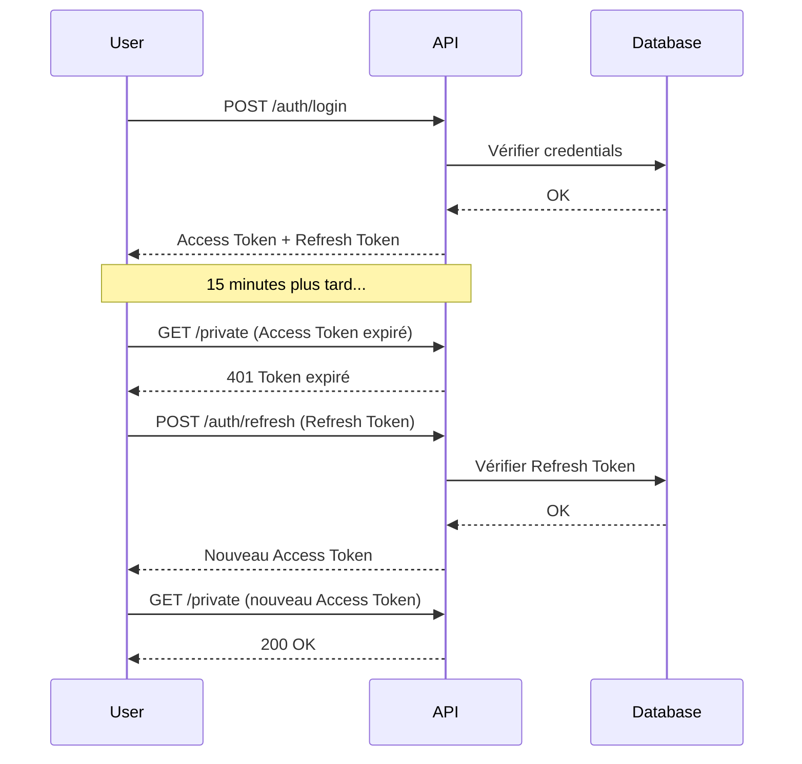

# Module 14 — Refresh Token

## Prérequis

Tu as terminé le Module 13 (projet avec base de données).

---

## Pourquoi un Refresh Token ?

### Le problème

| Situation | Problème |
|-----------|----------|
| Token expire après 1h | L'utilisateur doit se reconnecter |
| Token longue durée (24h) | Si volé, le hacker a 24h d'accès |

### La solution : 2 tokens

| Token | Durée | Usage |
|-------|-------|-------|
| Access Token | 15 min | Accéder aux endpoints |
| Refresh Token | 7 jours | Obtenir un nouveau Access Token |

### Comment ça marche

```
1. Login → Access Token (15min) + Refresh Token (7j)
2. Access Token expire
3. Appel /auth/refresh avec Refresh Token
4. Nouveau Access Token (15min)
5. Continuer à utiliser l'API
```

---

## Schéma du flux



---

## Étape 1 : Modifier JwtService

### 1.1 Remplacer le contenu de JwtService.java

```java
package com.demo.securitydemo;

import io.jsonwebtoken.Claims;
import io.jsonwebtoken.Jwts;
import io.jsonwebtoken.SignatureAlgorithm;
import org.springframework.beans.factory.annotation.Value;
import org.springframework.stereotype.Service;

import javax.crypto.spec.SecretKeySpec;
import java.security.Key;
import java.util.Date;

@Service
public class JwtService {

    @Value("${jwt.secret}")
    private String secret;

    // Durées en millisecondes
    private static final long ACCESS_TOKEN_VALIDITY = 15 * 60 * 1000;      // 15 minutes
    private static final long REFRESH_TOKEN_VALIDITY = 7 * 24 * 60 * 60 * 1000; // 7 jours

    // Générer Access Token (15 min)
    public String generateAccessToken(String username) {
        return generateToken(username, ACCESS_TOKEN_VALIDITY, "ACCESS");
    }

    // Générer Refresh Token (7 jours)
    public String generateRefreshToken(String username) {
        return generateToken(username, REFRESH_TOKEN_VALIDITY, "REFRESH");
    }

    // Méthode générique pour créer un token
    private String generateToken(String username, long validity, String type) {
        return Jwts.builder()
                .setSubject(username)
                .claim("type", type)
                .setIssuedAt(new Date())
                .setExpiration(new Date(System.currentTimeMillis() + validity))
                .signWith(getKey(), SignatureAlgorithm.HS256)
                .compact();
    }

    // Extraire le username
    public String extractUsername(String token) {
        return extractClaims(token).getSubject();
    }

    // Extraire le type (ACCESS ou REFRESH)
    public String extractType(String token) {
        return extractClaims(token).get("type", String.class);
    }

    // Vérifier si le token est valide
    public boolean isValid(String token) {
        try {
            extractClaims(token);
            return true;
        } catch (Exception e) {
            return false;
        }
    }

    // Vérifier si c'est un Access Token valide
    public boolean isValidAccessToken(String token) {
        return isValid(token) && "ACCESS".equals(extractType(token));
    }

    // Vérifier si c'est un Refresh Token valide
    public boolean isValidRefreshToken(String token) {
        return isValid(token) && "REFRESH".equals(extractType(token));
    }

    // Extraire tous les claims
    private Claims extractClaims(String token) {
        return Jwts.parserBuilder()
                .setSigningKey(getKey())
                .build()
                .parseClaimsJws(token)
                .getBody();
    }

    // Obtenir la clé de signature
    private Key getKey() {
        return new SecretKeySpec(secret.getBytes(), SignatureAlgorithm.HS256.getJcaName());
    }
}
```

### 1.2 Ce qui a changé

| Avant | Après |
|-------|-------|
| `generateToken()` | `generateAccessToken()` + `generateRefreshToken()` |
| Pas de type | Claim "type" : ACCESS ou REFRESH |
| 1 heure | 15 min (access) / 7 jours (refresh) |

### 1.3 Tableau des méthodes

| Méthode | Retourne | Usage |
|---------|----------|-------|
| `generateAccessToken(username)` | String | Créer un access token |
| `generateRefreshToken(username)` | String | Créer un refresh token |
| `extractUsername(token)` | String | Lire le username du token |
| `extractType(token)` | String | Lire le type (ACCESS/REFRESH) |
| `isValidAccessToken(token)` | boolean | Vérifier si access token valide |
| `isValidRefreshToken(token)` | boolean | Vérifier si refresh token valide |

---

## Étape 2 : Modifier AuthController

### 2.1 Remplacer le contenu de AuthController.java

```java
package com.demo.securitydemo;

import org.springframework.http.ResponseEntity;
import org.springframework.security.crypto.password.PasswordEncoder;
import org.springframework.web.bind.annotation.*;

import java.util.Map;

@RestController
@RequestMapping("/auth")
public class AuthController {

    private final JwtService jwtService;
    private final PasswordEncoder passwordEncoder;
    private final UserRepository userRepository;

    public AuthController(JwtService jwtService,
                          PasswordEncoder passwordEncoder,
                          UserRepository userRepository) {
        this.jwtService = jwtService;
        this.passwordEncoder = passwordEncoder;
        this.userRepository = userRepository;
    }

    @PostMapping("/register")
    public ResponseEntity<?> register(@RequestBody Map<String, String> request) {
        String username = request.get("username");
        String password = request.get("password");

        if (userRepository.existsByUsername(username)) {
            return ResponseEntity.badRequest()
                    .body(Map.of("error", "Username déjà utilisé"));
        }

        User user = new User();
        user.setUsername(username);
        user.setPassword(passwordEncoder.encode(password));
        user.setRole("USER");

        userRepository.save(user);

        return ResponseEntity.ok(Map.of("message", "User créé avec succès"));
    }

    @PostMapping("/login")
    public ResponseEntity<?> login(@RequestBody Map<String, String> request) {
        String username = request.get("username");
        String password = request.get("password");

        User user = userRepository.findByUsername(username).orElse(null);

        if (user == null) {
            return ResponseEntity.status(401)
                    .body(Map.of("error", "User non trouvé"));
        }

        if (!passwordEncoder.matches(password, user.getPassword())) {
            return ResponseEntity.status(401)
                    .body(Map.of("error", "Mot de passe incorrect"));
        }

        // Générer les 2 tokens
        String accessToken = jwtService.generateAccessToken(username);
        String refreshToken = jwtService.generateRefreshToken(username);

        return ResponseEntity.ok(Map.of(
                "accessToken", accessToken,
                "refreshToken", refreshToken,
                "username", username,
                "role", user.getRole()
        ));
    }

    @PostMapping("/refresh")
    public ResponseEntity<?> refresh(@RequestBody Map<String, String> request) {
        String refreshToken = request.get("refreshToken");

        // Vérifier que c'est un refresh token valide
        if (!jwtService.isValidRefreshToken(refreshToken)) {
            return ResponseEntity.status(401)
                    .body(Map.of("error", "Refresh token invalide ou expiré"));
        }

        // Extraire le username
        String username = jwtService.extractUsername(refreshToken);

        // Vérifier que le user existe toujours
        if (!userRepository.existsByUsername(username)) {
            return ResponseEntity.status(401)
                    .body(Map.of("error", "User n'existe plus"));
        }

        // Générer un nouveau access token
        String newAccessToken = jwtService.generateAccessToken(username);

        return ResponseEntity.ok(Map.of(
                "accessToken", newAccessToken
        ));
    }
}
```

### 2.2 Ce qui a changé

| Avant | Après |
|-------|-------|
| `"token"` | `"accessToken"` + `"refreshToken"` |
| Pas de /refresh | Endpoint `/auth/refresh` |

### 2.3 Les 3 endpoints

| Endpoint | Input | Output |
|----------|-------|--------|
| POST /auth/register | username, password | message |
| POST /auth/login | username, password | accessToken, refreshToken, username, role |
| POST /auth/refresh | refreshToken | accessToken |

---

## Étape 3 : Modifier JwtFilter

### 3.1 Remplacer le contenu de JwtFilter.java

```java
package com.demo.securitydemo;

import jakarta.servlet.FilterChain;
import jakarta.servlet.ServletException;
import jakarta.servlet.http.HttpServletRequest;
import jakarta.servlet.http.HttpServletResponse;
import org.springframework.security.authentication.UsernamePasswordAuthenticationToken;
import org.springframework.security.core.authority.SimpleGrantedAuthority;
import org.springframework.security.core.context.SecurityContextHolder;
import org.springframework.stereotype.Component;
import org.springframework.web.filter.OncePerRequestFilter;

import java.io.IOException;
import java.util.List;

@Component
public class JwtFilter extends OncePerRequestFilter {

    private final JwtService jwtService;
    private final UserRepository userRepository;

    public JwtFilter(JwtService jwtService, UserRepository userRepository) {
        this.jwtService = jwtService;
        this.userRepository = userRepository;
    }

    @Override
    protected void doFilterInternal(HttpServletRequest request,
                                    HttpServletResponse response,
                                    FilterChain filterChain)
            throws ServletException, IOException {

        String authHeader = request.getHeader("Authorization");

        if (authHeader == null || !authHeader.startsWith("Bearer ")) {
            filterChain.doFilter(request, response);
            return;
        }

        String token = authHeader.substring(7);

        // Vérifier que c'est un ACCESS token (pas un refresh token)
        if (jwtService.isValidAccessToken(token)) {
            String username = jwtService.extractUsername(token);

            User user = userRepository.findByUsername(username).orElse(null);

            if (user != null) {
                String role = "ROLE_" + user.getRole();

                var auth = new UsernamePasswordAuthenticationToken(
                        username,
                        null,
                        List.of(new SimpleGrantedAuthority(role))
                );

                SecurityContextHolder.getContext().setAuthentication(auth);
            }
        }

        filterChain.doFilter(request, response);
    }
}
```

### 3.2 Ce qui a changé

| Avant | Après |
|-------|-------|
| `jwtService.isValid(token)` | `jwtService.isValidAccessToken(token)` |

Le JwtFilter n'accepte que les Access Tokens, pas les Refresh Tokens.

---

## Étape 4 : Tester

### 4.1 Relancer l'application

```bash
mvn spring-boot:run
```

### 4.2 Login

```bash
curl -X POST http://localhost:8080/auth/login \
  -H "Content-Type: application/json" \
  -d '{"username":"admin","password":"admin123"}'
```

Résultat :
```json
{
  "accessToken": "eyJhbG...",
  "refreshToken": "eyJhbG...",
  "username": "admin",
  "role": "ADMIN"
}
```

### 4.3 Accéder à /private avec Access Token

```bash
curl http://localhost:8080/private \
  -H "Authorization: Bearer <ACCESS_TOKEN>"
```

Résultat : `200 OK`

### 4.4 Accéder à /private avec Refresh Token (doit échouer)

```bash
curl http://localhost:8080/private \
  -H "Authorization: Bearer <REFRESH_TOKEN>"
```

Résultat : `403 Forbidden` (le refresh token n'est pas accepté)

### 4.5 Rafraîchir le token

```bash
curl -X POST http://localhost:8080/auth/refresh \
  -H "Content-Type: application/json" \
  -d '{"refreshToken":"<REFRESH_TOKEN>"}'
```

Résultat :
```json
{
  "accessToken": "eyJhbG..."
}
```

---

## Tableau des tests

| # | Action | Endpoint | Token | Résultat |
|---|--------|----------|-------|----------|
| 1 | Login | POST /auth/login | - | accessToken + refreshToken |
| 2 | /private | GET /private | Access Token | 200 OK |
| 3 | /private | GET /private | Refresh Token | 403 Forbidden |
| 4 | /private | GET /private | Pas de token | 403 Forbidden |
| 5 | Refresh | POST /auth/refresh | Refresh Token | Nouveau accessToken |
| 6 | Refresh | POST /auth/refresh | Access Token | 401 (invalide) |

---

## Simulation : Token expiré

Pour tester l'expiration, tu peux temporairement réduire la durée :

```java
// Dans JwtService.java
private static final long ACCESS_TOKEN_VALIDITY = 30 * 1000; // 30 secondes
```

Puis :
1. Login → Obtenir les tokens
2. Attendre 30 secondes
3. Appeler /private → 403 (token expiré)
4. Appeler /auth/refresh → Nouveau access token
5. Appeler /private → 200 OK

---

## Problèmes courants

<details>
<summary>Le refresh token est accepté par /private</summary>

**Cause :** JwtFilter utilise `isValid()` au lieu de `isValidAccessToken()`

**Solution :**
```java
// Remplacer
if (jwtService.isValid(token)) {

// Par
if (jwtService.isValidAccessToken(token)) {
```

</details>

<details>
<summary>401 sur /auth/refresh avec un bon refresh token</summary>

**Cause :** Le token envoyé est un access token, pas un refresh token

**Solution :**
Utilise le `refreshToken` retourné par /auth/login, pas le `accessToken`.

</details>

<details>
<summary>Le type est null</summary>

**Cause :** Les anciens tokens n'ont pas de claim "type"

**Solution :**
Refais un login pour obtenir de nouveaux tokens avec le claim "type".

</details>

---

## Annexe 1 : Structure du projet

<details>
<summary>Voir la structure</summary>

```
security-demo/
├── pom.xml
├── src/main/java/com/demo/securitydemo/
│   ├── SecurityDemoApplication.java
│   ├── HelloController.java
│   ├── AuthController.java      ← Modifié (ajout /refresh)
│   ├── SecurityConfig.java
│   ├── JwtService.java          ← Modifié (2 types de tokens)
│   ├── JwtFilter.java           ← Modifié (vérifie ACCESS seulement)
│   ├── User.java
│   ├── UserRepository.java
│   └── DataInit.java
└── src/main/resources/
    └── application.properties
```

</details>

---

## Annexe 2 : Fichier test-refresh.http

<details>
<summary>Voir le fichier de test</summary>

```http
### =============================================
### Module 14 - Tests Refresh Token
### =============================================

### -----------------------------------------
### Test 1 : Login pour obtenir les 2 tokens
### Résultat attendu : accessToken + refreshToken
### -----------------------------------------
POST http://localhost:8080/auth/login
Content-Type: application/json

{
    "username": "admin",
    "password": "admin123"
}

### -----------------------------------------
### Test 2 : Accéder à /private avec Access Token
### Résultat attendu : 200 OK
### REMPLACER <ACCESS_TOKEN> par le accessToken du Test 1
### -----------------------------------------
GET http://localhost:8080/private
Authorization: Bearer <ACCESS_TOKEN>

### -----------------------------------------
### Test 3 : Accéder à /private avec Refresh Token
### Résultat attendu : 403 Forbidden
### REMPLACER <REFRESH_TOKEN> par le refreshToken du Test 1
### -----------------------------------------
GET http://localhost:8080/private
Authorization: Bearer <REFRESH_TOKEN>

### -----------------------------------------
### Test 4 : Rafraîchir le token
### Résultat attendu : 200 OK + nouveau accessToken
### REMPLACER <REFRESH_TOKEN> par le refreshToken du Test 1
### -----------------------------------------
POST http://localhost:8080/auth/refresh
Content-Type: application/json

{
    "refreshToken": "<REFRESH_TOKEN>"
}

### -----------------------------------------
### Test 5 : Utiliser /refresh avec un Access Token
### Résultat attendu : 401 Unauthorized
### REMPLACER <ACCESS_TOKEN> par le accessToken du Test 1
### -----------------------------------------
POST http://localhost:8080/auth/refresh
Content-Type: application/json

{
    "refreshToken": "<ACCESS_TOKEN>"
}

### -----------------------------------------
### Test 6 : Utiliser /refresh avec token invalide
### Résultat attendu : 401 Unauthorized
### -----------------------------------------
POST http://localhost:8080/auth/refresh
Content-Type: application/json

{
    "refreshToken": "token.invalide.ici"
}

### -----------------------------------------
### Test 7 : Accéder à /admin avec Access Token admin
### Résultat attendu : 200 OK
### REMPLACER <ACCESS_TOKEN> par le accessToken du Test 1
### -----------------------------------------
GET http://localhost:8080/admin
Authorization: Bearer <ACCESS_TOKEN>
```

</details>

---

## Annexe 3 : Comparaison Module 13 vs Module 14

| Aspect | Module 13 | Module 14 |
|--------|-----------|-----------|
| Tokens | 1 token | 2 tokens |
| Durée | Non définie | 15min + 7j |
| /auth/refresh | Non | Oui |
| Claim "type" | Non | ACCESS / REFRESH |
| JwtFilter | `isValid()` | `isValidAccessToken()` |

---

## Résumé

| Étape | Ce qu'on a fait |
|-------|-----------------|
| 1 | Modifié JwtService (2 types de tokens) |
| 2 | Modifié AuthController (ajout /refresh) |
| 3 | Modifié JwtFilter (vérifie ACCESS seulement) |
| 4 | Testé les différents scénarios |

---

## Flux complet

```
┌─────────────────────────────────────────────────────────┐
│                    FLUX REFRESH TOKEN                    │
├─────────────────────────────────────────────────────────┤
│                                                          │
│  1. LOGIN                                                │
│     POST /auth/login                                     │
│     ↓                                                    │
│     accessToken (15min) + refreshToken (7j)              │
│                                                          │
│  2. UTILISATION                                          │
│     GET /private                                         │
│     Header: Authorization: Bearer <accessToken>          │
│     ↓                                                    │
│     200 OK                                               │
│                                                          │
│  3. EXPIRATION (après 15min)                             │
│     GET /private                                         │
│     Header: Authorization: Bearer <accessToken>          │
│     ↓                                                    │
│     403 Forbidden (token expiré)                         │
│                                                          │
│  4. REFRESH                                              │
│     POST /auth/refresh                                   │
│     Body: { "refreshToken": "<refreshToken>" }           │
│     ↓                                                    │
│     Nouveau accessToken (15min)                          │
│                                                          │
│  5. CONTINUER                                            │
│     GET /private                                         │
│     Header: Authorization: Bearer <nouveau accessToken>  │
│     ↓                                                    │
│     200 OK                                               │
│                                                          │
└─────────────────────────────────────────────────────────┘
```

---

## Prochaine étape

- Module 15 : Validation des données (@Valid, @NotBlank, etc.)

