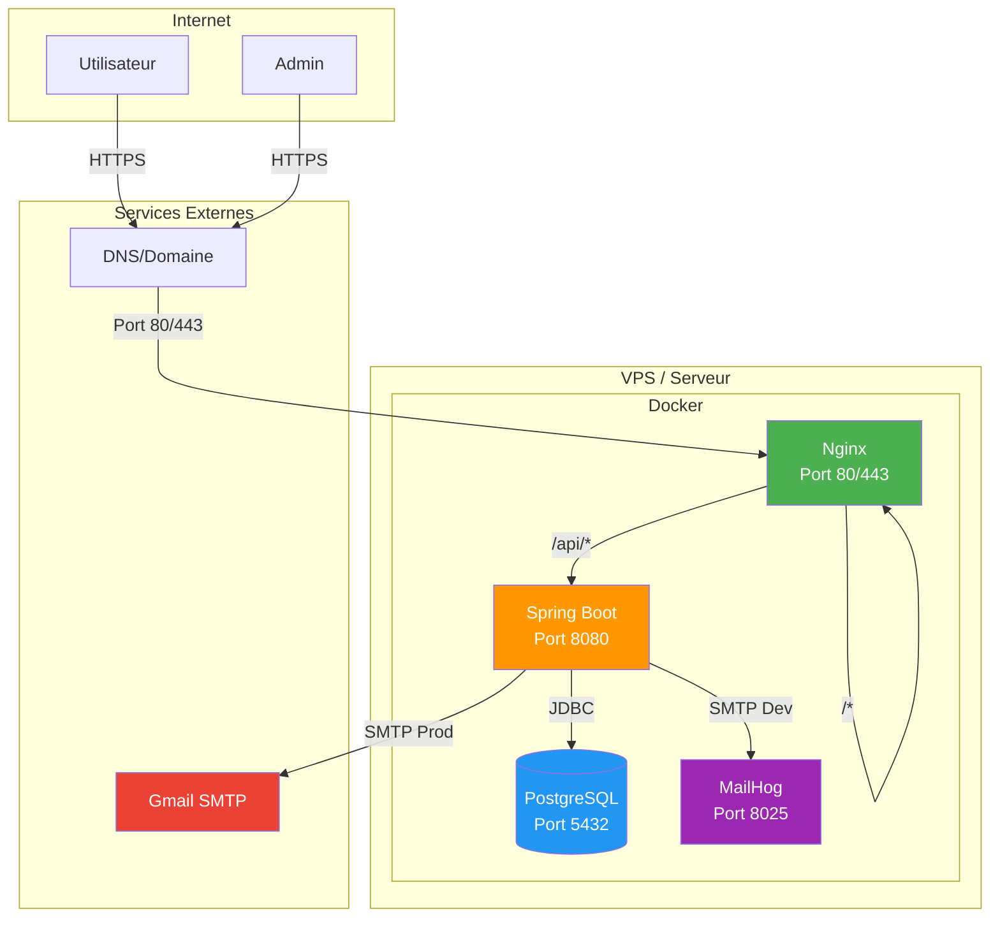
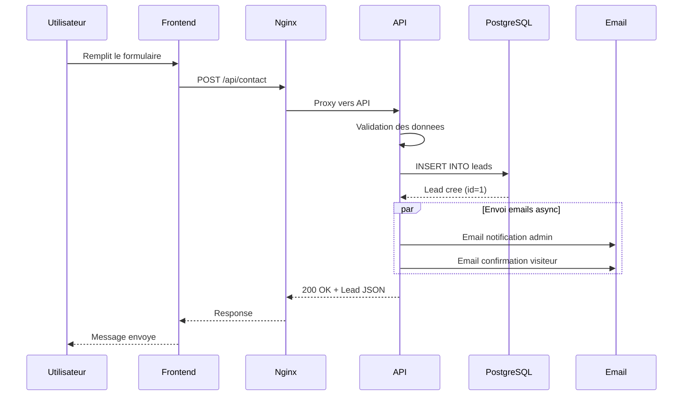
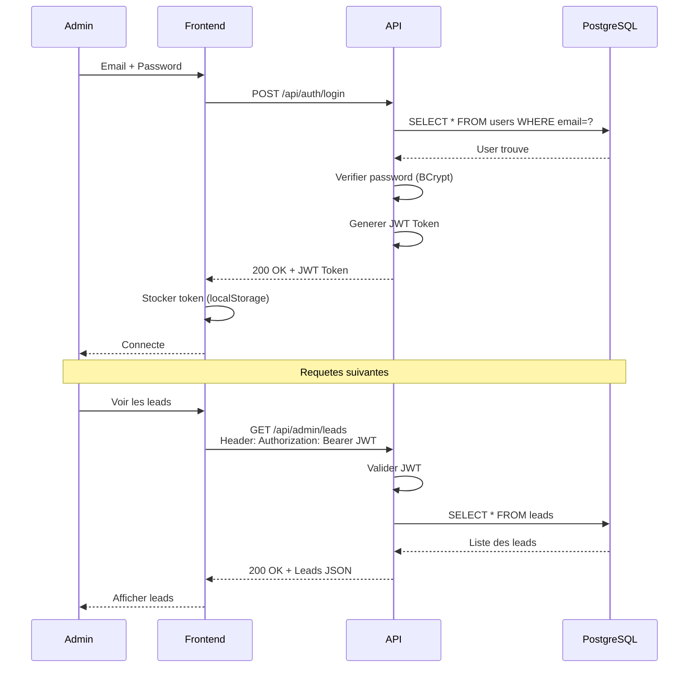
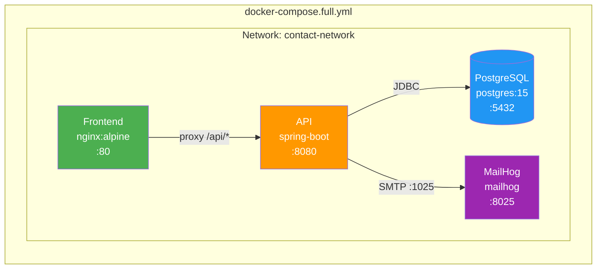
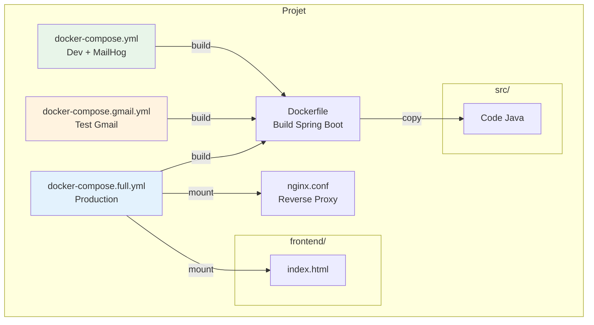
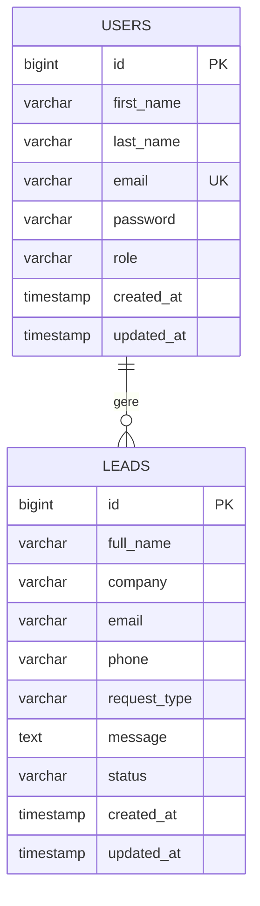
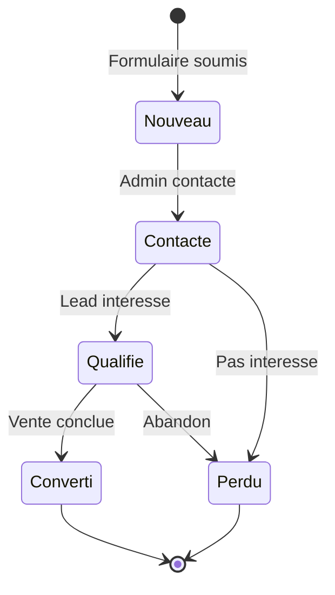
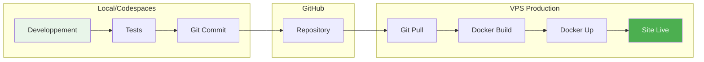
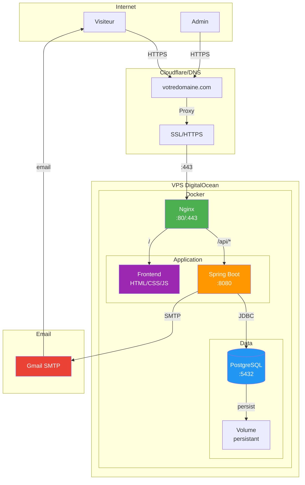

# 20 - Deploiement Final + Diagrammes Architecture (Mermaid)

## Etat du projet

### Ce qui est FAIT

| Composant | Status | Description |
|-----------|--------|-------------|
| Backend Spring Boot | OK | API REST complete |
| Authentication JWT | OK | Login/Register securise |
| Base de donnees | OK | PostgreSQL + H2 dev |
| Emails | OK | MailHog (dev) + Gmail (prod) |
| Swagger UI | OK | Documentation API |
| Frontend HTML | OK | Formulaire de contact |
| Docker Compose Dev | OK | `docker-compose.yml` |
| Docker Compose Gmail | OK | `docker-compose.gmail.yml` |
| Docker Compose Full | OK | `docker-compose.full.yml` |
| Nginx Config | OK | Reverse proxy |
| Documentation | OK | 20 guides troubleshooting |

### Ce qu'il RESTE pour production

| Tache | Priorite | Difficulte |
|-------|----------|------------|
| Acheter un VPS | Haute | Facile |
| Configurer domaine | Haute | Facile |
| Ajouter HTTPS (SSL) | Haute | Moyen |
| Variables d'environnement prod | Haute | Facile |
| Backup base de donnees | Moyenne | Moyen |
| Monitoring/Logs | Basse | Moyen |

---

# DIAGRAMMES MERMAID

## 1. Architecture Globale



---

## 2. Flux de Soumission de Contact



---

## 3. Flux d'Authentification Admin



---

## 4. Architecture Docker Compose



---

## 5. Structure des Fichiers Docker



---

## 6. Modele de Donnees



---

## 7. Etats d'un Lead



---

## 8. Pipeline de Deploiement



---

# GUIDE DE DEPLOIEMENT FINAL

## Etape 1 : Choisir un VPS

### Options recommandees

| Fournisseur | Prix/mois | RAM | CPU | Region |
|-------------|-----------|-----|-----|--------|
| **DigitalOcean** | 6$ | 1GB | 1 | Toronto/NYC |
| **Vultr** | 6$ | 1GB | 1 | Toronto |
| **Linode** | 5$ | 1GB | 1 | Toronto |
| **Hetzner** | 4€ | 2GB | 2 | Europe |
| **OVH** | 3.50€ | 2GB | 1 | Montreal |

### Recommandation : **DigitalOcean** ou **Hetzner**

---

## Etape 2 : Configurer le VPS

### 2.1 Se connecter au VPS

```bash
ssh root@VOTRE_IP_VPS
```

### 2.2 Mettre a jour le systeme

```bash
apt update && apt upgrade -y
```

### 2.3 Installer Docker

```bash
# Installation Docker
curl -fsSL https://get.docker.com -o get-docker.sh
sh get-docker.sh

# Installation Docker Compose
apt install docker-compose-plugin -y

# Verifier
docker --version
docker compose version
```

### 2.4 Installer Git

```bash
apt install git -y
```

---

## Etape 3 : Cloner le projet

```bash
# Creer un dossier
mkdir -p /opt/apps
cd /opt/apps

# Cloner le repo
git clone https://github.com/VOTRE_USERNAME/projet-e-contact-backend.git
cd projet-e-contact-backend
```

---

## Etape 4 : Configurer les variables d'environnement

### 4.1 Creer le fichier .env

```bash
nano .env
```

### 4.2 Contenu du fichier .env

```env
# Base de donnees
DB_HOST=postgres
DB_PORT=5432
DB_NAME=contactdb
DB_USER=postgres
DB_PASSWORD=VOTRE_MOT_DE_PASSE_SECURISE

# Gmail SMTP (production)
MAIL_HOST=smtp.gmail.com
MAIL_PORT=587
MAIL_USER=votre-email@gmail.com
MAIL_PASSWORD=votre-mot-de-passe-app
MAIL_AUTH=true

# Admin
ADMIN_EMAIL=votre-email@gmail.com

# JWT (generez une cle unique !)
JWT_SECRET=VOTRE_CLE_SECRETE_TRES_LONGUE_ET_UNIQUE_BASE64
JWT_EXPIRATION=86400000
```

### 4.3 Generer une cle JWT securisee

```bash
openssl rand -base64 64 | tr -d '\n'
```

---

## Etape 5 : Creer docker-compose.prod.yml

```bash
nano docker-compose.prod.yml
```

```yaml
version: '3.8'

services:
  frontend:
    image: nginx:alpine
    container_name: contact-frontend
    ports:
      - "80:80"
      - "443:443"
    volumes:
      - ./frontend:/usr/share/nginx/html:ro
      - ./nginx.conf:/etc/nginx/conf.d/default.conf:ro
      # Pour HTTPS (plus tard)
      # - ./certbot/conf:/etc/letsencrypt:ro
    depends_on:
      - api
    restart: always

  api:
    build: .
    container_name: contact-api
    expose:
      - "8080"
    env_file:
      - .env
    environment:
      SPRING_PROFILES_ACTIVE: prod
    depends_on:
      postgres:
        condition: service_healthy
    restart: always

  postgres:
    image: postgres:15-alpine
    container_name: contact-db
    env_file:
      - .env
    environment:
      POSTGRES_DB: ${DB_NAME}
      POSTGRES_USER: ${DB_USER}
      POSTGRES_PASSWORD: ${DB_PASSWORD}
    volumes:
      - postgres_data:/var/lib/postgresql/data
    healthcheck:
      test: ["CMD-SHELL", "pg_isready -U ${DB_USER}"]
      interval: 10s
      timeout: 5s
      retries: 5
    restart: always

volumes:
  postgres_data:
```

---

## Etape 6 : Lancer en production

```bash
# Build et lancement
docker compose -f docker-compose.prod.yml up --build -d

# Verifier les logs
docker compose -f docker-compose.prod.yml logs -f

# Verifier les containers
docker ps
```

---

## Etape 7 : Configurer un domaine (optionnel)

### 7.1 Acheter un domaine

- **Namecheap** : ~10$/an
- **Cloudflare** : ~8$/an
- **Google Domains** : ~12$/an

### 7.2 Configurer le DNS

| Type | Nom | Valeur | TTL |
|------|-----|--------|-----|
| A | @ | VOTRE_IP_VPS | 300 |
| A | www | VOTRE_IP_VPS | 300 |

---

## Etape 8 : Ajouter HTTPS avec Let's Encrypt

### 8.1 Installer Certbot

```bash
apt install certbot python3-certbot-nginx -y
```

### 8.2 Obtenir le certificat

```bash
certbot --nginx -d votredomaine.com -d www.votredomaine.com
```

### 8.3 Renouvellement automatique

```bash
# Test du renouvellement
certbot renew --dry-run

# Cron automatique (deja configure par Certbot)
```

---

## Etape 9 : Commandes de maintenance

### Mise a jour du code

```bash
cd /opt/apps/projet-e-contact-backend
git pull
docker compose -f docker-compose.prod.yml up --build -d
```

### Voir les logs

```bash
# Tous les services
docker compose -f docker-compose.prod.yml logs -f

# Un service specifique
docker compose -f docker-compose.prod.yml logs -f api
```

### Backup de la base de donnees

```bash
# Creer un backup
docker exec contact-db pg_dump -U postgres contactdb > backup_$(date +%Y%m%d).sql

# Restaurer un backup
docker exec -i contact-db psql -U postgres contactdb < backup_20260120.sql
```

### Redemarrer les services

```bash
docker compose -f docker-compose.prod.yml restart
```

---

# DIAGRAMME FINAL : ARCHITECTURE PRODUCTION



---

## CHECKLIST FINALE

### Avant deploiement
- [ ] Code teste sur Codespaces
- [ ] Emails fonctionnent (MailHog ou Gmail)
- [ ] Frontend teste
- [ ] Variables d'environnement definies

### Deploiement
- [ ] VPS achete et configure
- [ ] Docker installe
- [ ] Projet clone
- [ ] `.env` cree avec vraies valeurs
- [ ] `docker compose up` fonctionne
- [ ] Site accessible via IP

### Production (optionnel)
- [ ] Domaine achete
- [ ] DNS configure
- [ ] HTTPS active (Let's Encrypt)
- [ ] Backups automatises
- [ ] Monitoring configure

---

## Resume

Votre application est maintenant :
- **Developpee** (Spring Boot + Frontend)
- **Testee** (Codespaces + MailHog)
- **Documentee** (20 guides)
- **Prete pour la production** (Docker Compose)

Il ne reste qu'a **deployer sur un VPS** quand vous etes pret.
