# 20 - Déploiement Final + Diagrammes Architecture (Mermaid)

## 🎯 État du projet

### ✅ Ce qui est FAIT

| Composant | Status | Description |
|-----------|--------|-------------|
| Backend Spring Boot | ✅ | API REST complète |
| Authentication JWT | ✅ | Login/Register sécurisé |
| Base de données | ✅ | PostgreSQL + H2 dev |
| Emails | ✅ | MailHog (dev) + Gmail (prod) |
| Swagger UI | ✅ | Documentation API |
| Frontend HTML | ✅ | Formulaire de contact |
| Docker Compose Dev | ✅ | `docker-compose.yml` |
| Docker Compose Gmail | ✅ | `docker-compose.gmail.yml` |
| Docker Compose Full | ✅ | `docker-compose.full.yml` |
| Nginx Config | ✅ | Reverse proxy |
| Documentation | ✅ | 20 guides troubleshooting |

### 📋 Ce qu'il RESTE pour production

| Tâche | Priorité | Difficulté |
|-------|----------|------------|
| Acheter un VPS | 🔴 Haute | Facile |
| Configurer domaine | 🔴 Haute | Facile |
| Ajouter HTTPS (SSL) | 🔴 Haute | Moyen |
| Variables d'environnement prod | 🔴 Haute | Facile |
| Backup base de données | 🟡 Moyenne | Moyen |
| Monitoring/Logs | 🟢 Basse | Moyen |

---

# DIAGRAMMES MERMAID

## 📊 1. Architecture Globale

```mermaid
graph TB
    subgraph "🌐 Internet"
        USER[👤 Utilisateur]
        ADMIN[👨‍💼 Admin]
    end

    subgraph "🖥️ VPS / Serveur"
        subgraph "🐳 Docker"
            NGINX[🔀 Nginx<br/>Port 80/443]
            API[☕ Spring Boot<br/>Port 8080]
            DB[(🐘 PostgreSQL<br/>Port 5432)]
            MAIL[📧 MailHog<br/>Port 8025]
        end
    end

    subgraph "🌍 Services Externes"
        GMAIL[📬 Gmail SMTP]
        DNS[🔗 DNS/Domaine]
    end

    USER -->|HTTPS| DNS
    ADMIN -->|HTTPS| DNS
    DNS -->|Port 80/443| NGINX
    NGINX -->|/api/*| API
    NGINX -->|/*| NGINX
    API -->|JDBC| DB
    API -->|SMTP Dev| MAIL
    API -->|SMTP Prod| GMAIL

    style NGINX fill:#4CAF50,color:#fff
    style API fill:#FF9800,color:#fff
    style DB fill:#2196F3,color:#fff
    style MAIL fill:#9C27B0,color:#fff
    style GMAIL fill:#EA4335,color:#fff
```



---

## 📊 2. Flux de Soumission de Contact

```mermaid
sequenceDiagram
    participant U as 👤 Utilisateur
    participant F as 🖥️ Frontend
    participant N as 🔀 Nginx
    participant A as ☕ API
    participant D as 🐘 PostgreSQL
    participant M as 📧 Email

    U->>F: Remplit le formulaire
    F->>N: POST /api/contact
    N->>A: Proxy vers API
    A->>A: Validation des données
    A->>D: INSERT INTO leads
    D-->>A: Lead créé (id=1)
    
    par Envoi emails async
        A->>M: Email notification admin
        A->>M: Email confirmation visiteur
    end
    
    A-->>N: 200 OK + Lead JSON
    N-->>F: Response
    F-->>U: ✅ Message envoyé !
```



---

## 📊 3. Flux d'Authentification Admin

```mermaid
sequenceDiagram
    participant A as 👨‍💼 Admin
    participant F as 🖥️ Frontend
    participant API as ☕ API
    participant DB as 🐘 PostgreSQL

    A->>F: Email + Password
    F->>API: POST /api/auth/login
    API->>DB: SELECT * FROM users WHERE email=?
    DB-->>API: User trouvé
    API->>API: Vérifier password (BCrypt)
    API->>API: Générer JWT Token
    API-->>F: 200 OK + JWT Token
    F->>F: Stocker token (localStorage)
    F-->>A: ✅ Connecté !

    Note over A,DB: Requêtes suivantes

    A->>F: Voir les leads
    F->>API: GET /api/admin/leads<br/>Header: Authorization: Bearer JWT
    API->>API: Valider JWT
    API->>DB: SELECT * FROM leads
    DB-->>API: Liste des leads
    API-->>F: 200 OK + Leads JSON
    F-->>A: 📋 Afficher leads
```



---

## 📊 4. Architecture Docker Compose

```mermaid
graph LR
    subgraph "docker-compose.full.yml"
        subgraph "Network: contact-network"
            F[📄 Frontend<br/>nginx:alpine<br/>:80]
            A[☕ API<br/>spring-boot<br/>:8080]
            D[(🐘 PostgreSQL<br/>postgres:15<br/>:5432)]
            M[📧 MailHog<br/>mailhog<br/>:8025]
        end
    end

    F -->|proxy /api/*| A
    A -->|JDBC| D
    A -->|SMTP :1025| M

    style F fill:#4CAF50,color:#fff
    style A fill:#FF9800,color:#fff
    style D fill:#2196F3,color:#fff
    style M fill:#9C27B0,color:#fff
```



---

## 📊 5. Structure des Fichiers Docker


---

## 📊 6. Modèle de Données

```mermaid
erDiagram
    USERS {
        bigint id PK
        varchar first_name
        varchar last_name
        varchar email UK
        varchar password
        varchar role
        timestamp created_at
        timestamp updated_at
    }

    LEADS {
        bigint id PK
        varchar full_name
        varchar company
        varchar email
        varchar phone
        varchar request_type
        text message
        varchar status
        timestamp created_at
        timestamp updated_at
    }

    USERS ||--o{ LEADS : "gère"
```



---

## 📊 7. États d'un Lead

```mermaid
stateDiagram-v2
    [*] --> NEW: Formulaire soumis
    NEW --> CONTACTED: Admin contacte
    CONTACTED --> QUALIFIED: Lead intéressé
    CONTACTED --> LOST: Pas intéressé
    QUALIFIED --> CONVERTED: Vente conclue
    QUALIFIED --> LOST: Abandon
    CONVERTED --> [*]
    LOST --> [*]

    NEW: 🆕 Nouveau
    CONTACTED: 📞 Contacté
    QUALIFIED: ✅ Qualifié
    CONVERTED: 🎉 Converti
    LOST: ❌ Perdu
```



---

## 📊 8. Pipeline de Déploiement

```mermaid
graph LR
    subgraph "💻 Local/Codespaces"
        DEV[👨‍💻 Développement]
        TEST[🧪 Tests]
        COMMIT[📝 Git Commit]
    end

    subgraph "☁️ GitHub"
        REPO[📦 Repository]
    end

    subgraph "🖥️ VPS Production"
        PULL[📥 Git Pull]
        BUILD[🔨 Docker Build]
        DEPLOY[🚀 Docker Up]
        LIVE[🌐 Site Live !]
    end

    DEV --> TEST
    TEST --> COMMIT
    COMMIT --> REPO
    REPO --> PULL
    PULL --> BUILD
    BUILD --> DEPLOY
    DEPLOY --> LIVE

    style DEV fill:#E8F5E9
    style LIVE fill:#4CAF50,color:#fff
```



---

# GUIDE DE DÉPLOIEMENT FINAL

## 📋 Étape 1 : Choisir un VPS

### Options recommandées

| Fournisseur | Prix/mois | RAM | CPU | Région |
|-------------|-----------|-----|-----|--------|
| **DigitalOcean** | 6$ | 1GB | 1 | Toronto/NYC |
| **Vultr** | 6$ | 1GB | 1 | Toronto |
| **Linode** | 5$ | 1GB | 1 | Toronto |
| **Hetzner** | 4€ | 2GB | 2 | Europe |
| **OVH** | 3.50€ | 2GB | 1 | Montréal |

### Recommandation : **DigitalOcean** ou **Hetzner**

---

## 📋 Étape 2 : Configurer le VPS

### 2.1 Se connecter au VPS

```bash
ssh root@VOTRE_IP_VPS
```

### 2.2 Mettre à jour le système

```bash
apt update && apt upgrade -y
```

### 2.3 Installer Docker

```bash
# Installation Docker
curl -fsSL https://get.docker.com -o get-docker.sh
sh get-docker.sh

# Installation Docker Compose
apt install docker-compose-plugin -y

# Vérifier
docker --version
docker compose version
```

### 2.4 Installer Git

```bash
apt install git -y
```

---

## 📋 Étape 3 : Cloner le projet

```bash
# Créer un dossier
mkdir -p /opt/apps
cd /opt/apps

# Cloner le repo
git clone https://github.com/VOTRE_USERNAME/projet-e-contact-backend.git
cd projet-e-contact-backend
```

---

## 📋 Étape 4 : Configurer les variables d'environnement

### 4.1 Créer le fichier .env

```bash
nano .env
```

### 4.2 Contenu du fichier .env

```env
# Base de données
DB_HOST=postgres
DB_PORT=5432
DB_NAME=contactdb
DB_USER=postgres
DB_PASSWORD=VOTRE_MOT_DE_PASSE_SECURISE

# Gmail SMTP (production)
MAIL_HOST=smtp.gmail.com
MAIL_PORT=587
MAIL_USER=votre-email@gmail.com
MAIL_PASSWORD=votre-mot-de-passe-app
MAIL_AUTH=true

# Admin
ADMIN_EMAIL=votre-email@gmail.com

# JWT (générez une clé unique !)
JWT_SECRET=VOTRE_CLE_SECRETE_TRES_LONGUE_ET_UNIQUE_BASE64
JWT_EXPIRATION=86400000
```

### 4.3 Générer une clé JWT sécurisée

```bash
openssl rand -base64 64 | tr -d '\n'
```

---

## 📋 Étape 5 : Créer docker-compose.prod.yml

```bash
nano docker-compose.prod.yml
```

```yaml
version: '3.8'

services:
  frontend:
    image: nginx:alpine
    container_name: contact-frontend
    ports:
      - "80:80"
      - "443:443"
    volumes:
      - ./frontend:/usr/share/nginx/html:ro
      - ./nginx.conf:/etc/nginx/conf.d/default.conf:ro
      # Pour HTTPS (plus tard)
      # - ./certbot/conf:/etc/letsencrypt:ro
    depends_on:
      - api
    restart: always

  api:
    build: .
    container_name: contact-api
    expose:
      - "8080"
    env_file:
      - .env
    environment:
      SPRING_PROFILES_ACTIVE: prod
    depends_on:
      postgres:
        condition: service_healthy
    restart: always

  postgres:
    image: postgres:15-alpine
    container_name: contact-db
    env_file:
      - .env
    environment:
      POSTGRES_DB: ${DB_NAME}
      POSTGRES_USER: ${DB_USER}
      POSTGRES_PASSWORD: ${DB_PASSWORD}
    volumes:
      - postgres_data:/var/lib/postgresql/data
    healthcheck:
      test: ["CMD-SHELL", "pg_isready -U ${DB_USER}"]
      interval: 10s
      timeout: 5s
      retries: 5
    restart: always

volumes:
  postgres_data:
```

---

## 📋 Étape 6 : Lancer en production

```bash
# Build et lancement
docker compose -f docker-compose.prod.yml up --build -d

# Vérifier les logs
docker compose -f docker-compose.prod.yml logs -f

# Vérifier les containers
docker ps
```

---

## 📋 Étape 7 : Configurer un domaine (optionnel)

### 7.1 Acheter un domaine

- **Namecheap** : ~10$/an
- **Cloudflare** : ~8$/an
- **Google Domains** : ~12$/an

### 7.2 Configurer le DNS

| Type | Nom | Valeur | TTL |
|------|-----|--------|-----|
| A | @ | VOTRE_IP_VPS | 300 |
| A | www | VOTRE_IP_VPS | 300 |

---

## 📋 Étape 8 : Ajouter HTTPS avec Let's Encrypt

### 8.1 Installer Certbot

```bash
apt install certbot python3-certbot-nginx -y
```

### 8.2 Obtenir le certificat

```bash
certbot --nginx -d votredomaine.com -d www.votredomaine.com
```

### 8.3 Renouvellement automatique

```bash
# Test du renouvellement
certbot renew --dry-run

# Cron automatique (déjà configuré par Certbot)
```

---

## 📋 Étape 9 : Commandes de maintenance

### Mise à jour du code

```bash
cd /opt/apps/projet-e-contact-backend
git pull
docker compose -f docker-compose.prod.yml up --build -d
```

### Voir les logs

```bash
# Tous les services
docker compose -f docker-compose.prod.yml logs -f

# Un service spécifique
docker compose -f docker-compose.prod.yml logs -f api
```

### Backup de la base de données

```bash
# Créer un backup
docker exec contact-db pg_dump -U postgres contactdb > backup_$(date +%Y%m%d).sql

# Restaurer un backup
docker exec -i contact-db psql -U postgres contactdb < backup_20260120.sql
```

### Redémarrer les services

```bash
docker compose -f docker-compose.prod.yml restart
```

---

# DIAGRAMME FINAL : ARCHITECTURE PRODUCTION

```mermaid
graph TB
    subgraph "🌐 Internet"
        U1[👤 Visiteur]
        U2[👨‍💼 Admin]
    end

    subgraph "☁️ Cloudflare/DNS"
        DNS[🔗 votredomaine.com]
        SSL[🔒 SSL/HTTPS]
    end

    subgraph "🖥️ VPS DigitalOcean"
        subgraph "🐳 Docker"
            NG[🔀 Nginx<br/>:80/:443]
            
            subgraph "Application"
                FE[📄 Frontend<br/>HTML/CSS/JS]
                API[☕ Spring Boot<br/>:8080]
            end
            
            subgraph "Data"
                DB[(🐘 PostgreSQL<br/>:5432)]
                VOL[💾 Volume<br/>persistant]
            end
        end
    end

    subgraph "📬 Email"
        GMAIL[📧 Gmail SMTP]
    end

    U1 & U2 -->|HTTPS| DNS
    DNS -->|Proxy| SSL
    SSL -->|:443| NG
    NG -->|/| FE
    NG -->|/api/*| API
    API -->|JDBC| DB
    DB -->|persist| VOL
    API -->|SMTP| GMAIL
    GMAIL -->|📨| U1

    style NG fill:#4CAF50,color:#fff
    style API fill:#FF9800,color:#fff
    style DB fill:#2196F3,color:#fff
    style FE fill:#9C27B0,color:#fff
    style GMAIL fill:#EA4335,color:#fff
```



---

## ✅ CHECKLIST FINALE

### Avant déploiement
- [ ] Code testé sur Codespaces
- [ ] Emails fonctionnent (MailHog ou Gmail)
- [ ] Frontend testé
- [ ] Variables d'environnement définies

### Déploiement
- [ ] VPS acheté et configuré
- [ ] Docker installé
- [ ] Projet cloné
- [ ] `.env` créé avec vraies valeurs
- [ ] `docker compose up` fonctionne
- [ ] Site accessible via IP

### Production (optionnel)
- [ ] Domaine acheté
- [ ] DNS configuré
- [ ] HTTPS activé (Let's Encrypt)
- [ ] Backups automatisés
- [ ] Monitoring configuré

---

## 🎉 Félicitations !

Votre application est maintenant :
- ✅ **Développée** (Spring Boot + Frontend)
- ✅ **Testée** (Codespaces + MailHog)
- ✅ **Documentée** (20 guides)
- ✅ **Prête pour la production** (Docker Compose)

Il ne reste qu'à **déployer sur un VPS** quand vous êtes prêt ! 🚀

